# BÁO CÁO ĐỒ ÁN MÔN HỌC CÔNG NGHỆ PHẦN MỀM

**Đề tài:** Hệ thống Quản trị Nhân sự & Trả lương tự động tích hợp AI (HRM - Payroll Management System)

---

## PHẦN MỞ ĐẦU

### Lời mở đầu

Trong bối cảnh chuyển đổi số đang diễn ra mạnh mẽ tại Việt Nam, việc tự động hóa các quy trình quản trị doanh nghiệp không chỉ là xu hướng mà còn là yếu tố sống còn để tối ưu hóa chi phí và nâng cao hiệu suất vận hành. Đặc biệt, lĩnh vực Quản trị Nhân sự và Tiền lương (C&B — Compensation & Benefits) đang đối mặt với những thách thức ngày càng phức tạp: quy định pháp luật thay đổi liên tục (Luật BHXH 2024 có hiệu lực từ 01/01/2026, Luật Lao động 2019), khối lượng dữ liệu gia tăng, và yêu cầu minh bạch trong quy trình chi trả ngày càng cao.

Thực tế khảo sát cho thấy, phần lớn các doanh nghiệp vừa và nhỏ (SME) tại Việt Nam hiện vẫn đang vận hành quy trình tính lương bằng Microsoft Excel — một công cụ mạnh nhưng không được thiết kế cho nghiệp vụ phức tạp đòi hỏi tính toàn vẹn dữ liệu, phân quyền chặt chẽ và khả năng truy vết. Hệ quả là sai sót trong tính toán, rủi ro pháp lý khi quyết toán thuế, và thời gian xử lý kéo dài vào mỗi kỳ lương.

Nhằm giải quyết triệt để những bất cập trên, nhóm chúng em đã quyết định nghiên cứu và phát triển **"Hệ thống Quản trị Nhân sự & Trả lương tự động tích hợp AI (HRM - Payroll Management System)"**. Hệ thống hướng đến việc tự động hóa toàn bộ quy trình tính lương — từ quản lý hồ sơ nhân sự, chấm công, tính toán bảo hiểm và thuế thu nhập cá nhân, đến phê duyệt và chi trả lương — đồng thời tích hợp trí tuệ nhân tạo để phân tích dữ liệu làm thêm giờ và hỗ trợ ra quyết định tuyển dụng.

Dự án được thực hiện theo phương pháp luận Agile/Scrum với 4 Sprint (mỗi Sprint 2 tuần), nhằm đảm bảo sản phẩm đáp ứng đúng nhu cầu thực tế của hai nhóm người dùng chính: Trưởng phòng Nhân sự (HR Manager) và Kế toán trưởng (Accountant). Báo cáo này trình bày toàn bộ quá trình phân tích yêu cầu, thiết kế kiến trúc, tổ chức phát triển, kiểm thử và triển khai hệ thống.

---

### Danh mục từ viết tắt

| Từ viết tắt | Tiếng Anh | Tiếng Việt |
|-------------|-----------|-----------|
| **HRM** | Human Resource Management | Quản trị Nhân sự |
| **C&B** | Compensation & Benefits | Lương thưởng & Phúc lợi |
| **OT** | Overtime | Làm thêm giờ |
| **BHXH** | — | Bảo hiểm Xã hội (8% phía NLĐ — Luật BHXH 2024) |
| **BHYT** | — | Bảo hiểm Y tế (1.5% phía NLĐ) |
| **BHTN** | — | Bảo hiểm Thất nghiệp (1% phía NLĐ) |
| **TNCN** | — | Thuế Thu nhập Cá nhân |
| **Gross Salary** | — | Tổng lương trước khấu trừ (BH + Thuế) |
| **Net Salary** | — | Lương thực nhận sau khấu trừ |
| **JWT** | JSON Web Token | Token xác thực người dùng |
| **RBAC** | Role-Based Access Control | Phân quyền theo vai trò |
| **ACID** | Atomicity, Consistency, Isolation, Durability | Tính chất đảm bảo toàn vẹn giao dịch DB |
| **SPA** | Single Page Application | Ứng dụng web đơn trang |
| **API** | Application Programming Interface | Giao diện lập trình ứng dụng |
| **REST** | Representational State Transfer | Kiến trúc API theo tài nguyên |
| **ORM** | Object-Relational Mapping | Ánh xạ đối tượng – quan hệ |
| **CI/CD** | Continuous Integration / Continuous Deployment | Tích hợp / Triển khai liên tục |
| **SP** | Story Points | Điểm ước lượng (Agile) |
| **DoR** | Definition of Ready | Tiêu chuẩn sẵn sàng (User Story) |
| **DoD** | Definition of Done | Tiêu chuẩn hoàn thành |
| **PO** | Product Owner | Chủ sản phẩm |
| **SM** | Scrum Master | Điều phối Scrum |
| **BA** | Business Analyst | Phân tích nghiệp vụ |
| **QC** | Quality Control | Kiểm soát chất lượng |
| **BE** | Backend | Phần xử lý phía máy chủ |
| **FE** | Frontend | Phần giao diện người dùng |
| **LLM** | Large Language Model | Mô hình ngôn ngữ lớn (AI) |
| **LLMOps** | LLM Operations | Vận hành mô hình ngôn ngữ lớn |
| **TCO** | Total Cost of Ownership | Tổng chi phí sở hữu |
| **ROI** | Return on Investment | Lợi tức đầu tư |
| **ERD** | Entity-Relationship Diagram | Sơ đồ thực thể liên kết |
| **DD** | Data Dictionary / Detailed Design | Từ điển dữ liệu / Thiết kế chi tiết |
| **HLD** | High-Level Design | Thiết kế cấp cao |
| **URD** | User Requirements Document | Tài liệu yêu cầu người dùng |
| **UC** | Use Case | Ca sử dụng |
| **US** | User Story | Câu chuyện người dùng |
| **NFR** | Non-Functional Requirement | Yêu cầu phi chức năng |
| **UAT** | User Acceptance Test | Kiểm thử chấp nhận người dùng |

---

### Danh mục Phụ lục

| Phụ lục | Tên | Mô tả |
|---------|-----|-------|
| **Phụ lục A** | Sprint Backlog chi tiết | Bảng phân bổ 212 tasks cho toàn bộ 4 Sprint + Sprint 0 (xem cuối báo cáo) |
| **Phụ lục B** | Template Excel Import Chấm công | File mẫu `template_chamcong.xlsx` để HR import dữ liệu |
| **Phụ lục C** | Danh sách API (Swagger/OpenAPI) | Export đầy đủ 45 API endpoints với request/response schema |
| **Phụ lục D** | Hướng dẫn cài đặt hệ thống | File `docker-compose.yml` + hướng dẫn triển khai |
| **Phụ lục E** | Nhật ký Sprint (Daily Standup Log) | Ghi chép ceremony và hoạt động hàng ngày từng Sprint |

---

## CHƯƠNG 1: TỔNG QUAN ĐỀ TÀI VÀ CƠ SỞ LÝ THUYẾT

### 1.1. Bối cảnh chung về quản trị doanh nghiệp và Bài toán đặt ra

#### 1.1.1. Thực trạng quy trình quản lý hiện tại

Dựa trên kết quả khảo sát thực tế tại các doanh nghiệp vừa và nhỏ, quy trình C&B (Compensation & Benefits) hiện tại đang được vận hành chủ yếu bằng Excel và lưu trữ phân tán. Nhóm đã tiến hành bóc tách và phân loại các "nỗi đau" (Pain Points) cốt lõi thành 5 nhóm vấn đề chính:

**Nhóm 1 — Quản lý Master Data phân tán:**

Thông tin phòng ban, vị trí công việc, hệ số lương và danh sách người phụ thuộc được lưu trữ rời rạc trên nhiều file Excel khác nhau, không có kho lưu trữ tập trung (Single Source of Truth). Khi có thay đổi từ quy định pháp luật — chẳng hạn Luật BHXH 2024 điều chỉnh tỷ lệ đóng bảo hiểm, hay Nghị định mới thay đổi mức giảm trừ gia cảnh — nhân sự phải rà soát và cập nhật thủ công trên tất cả các file liên quan. Điều này dẫn đến nguy cơ cao bị lệch chuẩn giữa các bộ dữ liệu, đặc biệt khi nhiều người cùng chỉnh sửa song song mà không có cơ chế kiểm soát phiên bản.

**Nhóm 2 — Thiếu đồng bộ về Hợp đồng và Phụ cấp:**

Hợp đồng lao động trong hệ thống Excel hiện tại không phân tách rạch ròi giữa mức lương Offer Salary (lương thỏa thuận ban đầu) và Base Salary (lương cơ bản để tính bảo hiểm). Các khoản phụ cấp (Allowance) không được gắn liền với thời hạn hiệu lực (`EFFECTIVE_FROM` / `EFFECTIVE_TO`) của hợp đồng, dẫn đến tình trạng: hợp đồng đã kết thúc nhưng phụ cấp vẫn tiếp tục được tính vào lương. Hệ thống cũng không ràng buộc quy tắc "tại mỗi thời điểm, một nhân viên chỉ có duy nhất một hợp đồng Active", gây ra lỗi tính trùng lương.

**Nhóm 3 — Quy trình Chấm công và OT thủ công:**

Dữ liệu chấm công được nhập tay từ máy chấm công vật lý hoặc bảng Excel. Hệ thống cũ không có khả năng tự động phân biệt ngày làm việc bình thường, Thứ 7, Chủ nhật hay ngày Lễ (dựa vào ISO week và danh mục ngày lễ quốc gia). Nhân sự bắt buộc phải tự tra cứu lịch và tính toán OT rate thủ công:

| Loại ngày | Hệ số OT | Cách xác định hiện tại |
|-----------|----------|------------------------|
| Ngày thường (Thứ 2 – Thứ 6) | 1.5x | Nhân sự tự đếm |
| Thứ 7 | 1.5x | Nhân sự tra lịch |
| Chủ nhật | 2.0x | Nhân sự tra lịch |
| Ngày Lễ, Tết | 3.0x | Nhân sự tra lịch + Nghị định |

Việc áp hệ số sai cho dù chỉ 1 nhân viên trong 1 tháng cũng dẫn tới sai lệch dây chuyền khi quyết toán cuối năm.

**Nhóm 4 — Tính toán Bảo hiểm và Thuế TNCN thiếu chính xác:**

Hệ thống Excel hiện tại chưa tự động phân biệt loại hợp đồng để xác định nghĩa vụ đóng bảo hiểm (chỉ hợp đồng chính thức từ 3 tháng trở lên mới phải đóng đầy đủ BHXH/BHYT/BHTN). Thuế Thu nhập Cá nhân (TNCN) thường được tính theo mức cố định hoặc tỷ lệ phẳng, thay vì áp dụng đúng biểu thuế lũy tiến từng phần 7 bậc theo quy định. Cụ thể, biểu thuế TNCN hiện hành quy định:

| Bậc | Thu nhập chịu thuế/tháng (VNĐ) | Thuế suất |
|-----|-------------------------------|-----------|
| 1 | Đến 5 triệu | 5% |
| 2 | Trên 5 triệu đến 10 triệu | 10% |
| 3 | Trên 10 triệu đến 18 triệu | 15% |
| 4 | Trên 18 triệu đến 32 triệu | 20% |
| 5 | Trên 32 triệu đến 52 triệu | 25% |
| 6 | Trên 52 triệu đến 80 triệu | 30% |
| 7 | Trên 80 triệu | 35% |

Với giảm trừ bản thân 15.500.000 VNĐ/tháng và giảm trừ người phụ thuộc 6.200.000 VNĐ/người/tháng (theo Nghị quyết 110/2025/UBTVQH15, có hiệu lực từ 01/01/2026), việc tính sai bậc thuế dù chỉ 1 bậc cũng dẫn đến chênh lệch đáng kể khi quyết toán thuế cuối năm, tiềm ẩn rủi ro pháp lý cho doanh nghiệp.

**Nhóm 5 — Hạn chế trong đối soát và Phê duyệt:**

Khi phát hiện sai sót hoặc cần điều chỉnh số liệu, nhân sự phải xóa bỏ toàn bộ kết quả và tính lại từ đầu trên file Excel. Không có cơ chế "tính lại" (recalculate) tự động. Kế toán chi lương không có công cụ tracking trạng thái bảng lương (đã tính / chờ duyệt / đã chi), dẫn đến quy trình phê duyệt thiếu minh bạch, không có dấu vết kiểm toán (audit trail) và không thể truy vết ai đã duyệt chi ở thời điểm nào.

#### 1.1.2. Mục tiêu dự án

Xuất phát từ 5 nhóm Pain Points trên, dự án đặt ra các mục tiêu cụ thể, đo lường được:

| STT | Mục tiêu | Chỉ số đo lường (KPI) | Ngưỡng thành công |
|-----|----------|----------------------|-------------------|
| 1 | **Tự động hóa quy trình tính lương** | Thời gian tính lương cho 100 NV | < 30 phút (giảm 70% so với Excel) |
| 2 | **Đảm bảo chính xác** | Tỷ lệ sai sót trong tính toán | < 1% |
| 3 | **Minh bạch hóa phê duyệt** | Trạng thái bảng lương có tracking | 100% bảng lương có audit trail |
| 4 | **Tuân thủ pháp luật** | Công thức tính BH/Thuế theo luật VN | 100% tuân thủ |
| 5 | **Báo cáo & Dashboard** | Thời gian xuất báo cáo | < 5 giây |
| 6 | **Tích hợp AI Insight** | Phân tích xu hướng OT, đề xuất tuyển dụng | Hoạt động với dữ liệu thực |

Ngoài ra, dự án còn hướng đến mục tiêu giáo dục: minh chứng khả năng áp dụng phương pháp luận Agile/Scrum trong quản lý dự án phần mềm thực tế, từ việc lên kế hoạch Sprint, tổ chức Ceremony, đến việc sử dụng Jira để theo dõi tiến độ.

### 1.2. Phạm vi và Quy mô của dự án

#### 1.2.1. Giới hạn In-Scope

Hệ thống được thiết kế phục vụ khối Back-office nội bộ (HR Manager và Accountant), bao gồm 9 Epic nghiệp vụ được phân bổ qua 4 Sprint:

| Epic | Tên module | Mô tả chức năng | Sprint |
|------|-----------|-----------------|--------|
| EP-01 | Authentication & Authorization | Đăng nhập JWT, phân quyền Role-Based (HR/Accountant) | Sprint 1 |
| EP-02 | Organization Management | Quản lý cơ cấu tổ chức: Phòng ban (cây phân cấp), Vị trí (gắn hệ số lương) | Sprint 1 |
| EP-03 | Employee Management | Quản lý hồ sơ nhân viên: thông tin cá nhân, thông tin công việc, tài khoản hệ thống | Sprint 2 |
| EP-04 | Contract Management | Quản lý hợp đồng lao động: Thử việc/Chính thức/Thời vụ, lương Base/Offer, upload PDF | Sprint 2 |
| EP-05 | Salary Configuration | Cấu hình hệ số lương, phụ cấp theo hợp đồng, thưởng/phạt phát sinh theo tháng | Sprint 2 |
| EP-06 | Attendance Management | Import chấm công từ Excel (bulk), xem/sửa inline, phân loại ngày làm việc/OT | Sprint 3 |
| EP-07 | Payroll Processing | **Core Engine** tính lương 3 giai đoạn, phê duyệt (Accountant), tạo phiếu chi, xuất file (4 định dạng) | Sprint 3 |
| EP-08 | Reporting & Dashboard | Dashboard tổng quan, báo cáo lương theo phòng ban, báo cáo tình hình OT | Sprint 4 |
| EP-09 | AI Integration | Phân tích OT bằng Dify LLM Agent (GPT-4o-mini), đề xuất tuyển dụng tự động | *Backlog (v2.0)* |

Tổng cộng: **64 Story Points** phân bổ cho **22 User Stories** thuộc 8 Epic trong 4 Sprint. EP-09 (AI Integration, 6 SP) nằm trong Product Backlog cho phiên bản tiếp theo.

**Trạng thái dự án tại thời điểm viết báo cáo (27/03/2026):** Sprint 1-2 đã hoàn thành (30 SP), Sprint 3 đang thực hiện (25 SP), Sprint 4 là kế hoạch (9 SP).

#### 1.2.2. Giới hạn Out-of-Scope

Vì tài nguyên và thời gian giới hạn trong phạm vi đồ án môn học, hệ thống MVP hiện tại sẽ **KHÔNG** hỗ trợ các tính năng sau:

| STT | Tính năng loại trừ | Lý do |
|-----|--------------------|----|
| 1 | Employee self-service portal (Portal cá nhân cho nhân viên) | Scope MVP chỉ phục vụ HR và Accountant nội bộ |
| 2 | Tích hợp trực tiếp máy chấm công vật lý (vân tay/FaceID) | Sử dụng cơ chế Import Excel thay thế |
| 3 | Tích hợp cổng thanh toán / Core Banking | Xuất file chuyển khoản, chuyển thủ công qua ngân hàng |
| 4 | Quản lý đào tạo & tuyển dụng chuyên sâu | Ngoài phạm vi nghiệp vụ C&B |
| 5 | Mobile App | Chỉ phát triển Web Application |
| 6 | Multi-company / Multi-branch | Scope MVP cho một công ty duy nhất |
| 7 | Tính lương theo dự án/task | Chỉ tính theo ngày công và OT |

#### 1.2.3. Đối tượng người dùng mục tiêu

Hệ thống phục vụ 2 nhóm người dùng trực tiếp (Primary Users) và 2 nhóm liên quan gián tiếp:

| Vai trò | Loại | Tần suất sử dụng | Mối quan tâm chính |
|---------|------|-------------------|-------------------|
| **HR Manager** | Primary User | Hàng ngày | Tự động hóa, giao diện thuận tiện, chính xác |
| **Accountant** | Primary User | Hàng tháng (kỳ lương) | Dữ liệu chính xác, xuất báo cáo, kiểm soát chi |
| Nhân viên | Stakeholder gián tiếp | Không sử dụng hệ thống | Nhận lương đúng và đúng hạn |
| Ban Giám đốc | Stakeholder gián tiếp | Không sử dụng hệ thống | Kiểm soát chi phí nhân sự qua Dashboard |

### 1.3. Cơ sở lý thuyết nền tảng

#### 1.3.1. Phương pháp luận phát triển phần mềm Agile và Khung làm việc Scrum

Dự án áp dụng phương pháp luận **Agile** (Phát triển linh hoạt) với khung làm việc **Scrum** — một trong những framework phổ biến nhất trong ngành công nghiệp phần mềm hiện nay. Scrum chia quá trình phát triển thành các vòng lặp ngắn gọi là **Sprint** (thường 2-4 tuần), mỗi Sprint tạo ra một phần sản phẩm có thể demo và nhận phản hồi.

**Các vai trò trong Scrum được áp dụng trong dự án:**

| Vai trò Scrum | Thành viên | Trách nhiệm |
|---------------|-----------|-------------|
| Product Owner (PO) / Scrum Master (SM) | Nguyễn Nhật Linh | Quản lý Product Backlog, điều phối Sprint, đảm bảo giá trị sản phẩm. Đồng thời R&D tính năng AI (EP-09) |
| Business Analyst / QC | Lê Công Huy | Phân tích yêu cầu, viết tài liệu (URD, UC, US, HLD), thiết kế Test Case và thực hiện QA thủ công |
| Backend Developer (BE 1) | Tạ Duy Khánh | Thiết kế Database, viết API, business logic và Unit Tests |
| Fullstack Developer (Dev 2) | Nguyễn Văn Khu | Viết API, business logic, Unit Tests, Workflow xử lý, Export File. Đồng thời hỗ trợ Frontend: xây dựng giao diện và tích hợp API |
| Frontend Developer (FE) | Nguyễn Ngọc Anh | Thiết kế giao diện chính (UI), kết nối API, xử lý trải nghiệm người dùng (UX) |

**Các nghi thức Scrum (Ceremonies) được thực thi nghiêm ngặt:**

| Ceremony | Tần suất | Thời lượng | Mục đích |
|----------|---------|------------|---------|
| Sprint Planning | Đầu mỗi Sprint | 2 giờ | Lên kế hoạch, chọn User Story từ Backlog, phân công task |
| Daily Standup | Hàng ngày | 15 phút | Đồng bộ tiến độ, phát hiện Blocker sớm |
| Grooming | Giữa Sprint | 2 giờ | Làm rõ đề bài US: thảo luận nghiệp vụ, giải đáp edge case, bổ sung AC/EC → US đạt DoR |
| Backlog Refinement | Cuối Sprint | 1 giờ | Re-prioritize Backlog, estimate SP (Planning Poker), tách story lớn, xác định dependencies cho Sprint tới |
| Sprint Review | Cuối Sprint | 2 giờ | Demo sản phẩm, nghiệm thu kết quả |
| Sprint Retrospective | Sau Review | 1 giờ | Rút kinh nghiệm, cải tiến quy trình |

**Quy trình quản lý công việc trên Jira:**

Mỗi User Story (trừ các Story dạng R&D như AI) được phân rã thành **8 Sub-task cố định** trong Jira, đảm bảo tính đồng nhất và khả năng theo dõi:

1. `[BA]` | Write documentation (US, AC, EC)
2. `[BE]` | Design APIs Spec
3. `[BE]` | Implement validation and logic
4. `[BE]` | Write unit tests
5. `[FE]` | Build interface and handle logic
6. `[FE]` | Integrate APIs
7. `[QC]` | Design Testcase
8. `[QC]` | Perform testing

**Workflow trạng thái Story trong Jira** (chi tiết tại §3.1.2):

```
BACKLOG → TO DO → IN PROGRESS → DEV DONE → READY FOR TEST → TESTING → TEST DONE
                                                               ↓ (bug)
                                                          BUG REOPEN → BUG FIXED → CLOSED
```

**Capacity Planning:** Mỗi Sprint 2 tuần = ~80 giờ/người. Trong đó phân bổ thời gian cho Ceremonies (họp Agile, Standup) và buffer cho Fix bugs (~20 giờ/Sprint). Số Story Points thực tế còn lại cho Dev: ~30-40 SP/Sprint.

#### 1.3.2. Cơ sở lý luận về Kiến trúc Hệ thống

Trong thiết kế kiến trúc phần mềm hiện đại, hai mô hình được thảo luận nhiều nhất là **Monolithic** (Nguyên khối) và **Microservices** (Vi dịch vụ). Để đưa ra quyết định thiết kế có cơ sở, nhóm đã nghiên cứu đặc điểm của từng mô hình và đánh giá mức độ phù hợp với bối cảnh dự án.

**A. Kiến trúc Monolithic (Nguyên khối)**

Kiến trúc Monolithic là mô hình truyền thống, trong đó toàn bộ ứng dụng được đóng gói thành **một khối duy nhất** (single deployable unit). Tất cả các module nghiệp vụ — từ Authentication, Employee Management, đến Payroll Processing — đều nằm chung trong một codebase, chia sẻ chung một database và được triển khai dưới dạng một file artifact duy nhất (ví dụ: `spring-boot.jar`).

*Đặc điểm nổi bật:*

*   **Đơn giản trong phát triển và triển khai:** Chỉ cần một repository, một pipeline CI/CD, một server. Developer có thể chạy toàn bộ hệ thống trên máy local bằng một lệnh `mvn spring-boot:run`.
*   **Giao tiếp nội bộ nhanh:** Các module gọi nhau trực tiếp qua method call trong cùng một JVM process, không phát sinh latency mạng. Ví dụ: `PayrollService` gọi `ContractService.getActiveContract(empId)` — đây là in-process call, thời gian tính bằng nanosecond.
*   **Tính nhất quán dữ liệu cao (ACID):** Vì tất cả module chia sẻ chung một PostgreSQL database, các thao tác phức tạp (tính lương cho 100 nhân viên, tạo phiếu chi + update trạng thái) có thể được gói trong **một database transaction duy nhất**, đảm bảo tính nguyên tử (Atomicity), nhất quán (Consistency), cô lập (Isolation) và bền vững (Durability).
*   **Dễ debug và test:** Toàn bộ flow từ Controller → Service → Repository → Database có thể được trace trong một stack trace duy nhất, không cần theo dõi distributed logs.

*Hạn chế:*

*   **Khó scale độc lập:** Nếu chỉ module Payroll chịu tải nặng, vẫn phải scale toàn bộ ứng dụng.
*   **Rủi ro "Big Ball of Mud":** Khi codebase lớn lên theo thời gian (hàng trăm nghìn dòng code), ranh giới giữa các module dễ bị mờ, dẫn đến code coupling cao nếu không có kỷ luật thiết kế tốt.
*   **Downtime khi deploy:** Mỗi lần triển khai phiên bản mới phải restart toàn bộ ứng dụng (tuy nhiên, với Spring Boot 3 + Docker, thời gian restart chỉ vài giây).

**B. Kiến trúc Microservices (Vi dịch vụ)**

Kiến trúc Microservices chia ứng dụng thành **nhiều service nhỏ độc lập**, mỗi service chịu trách nhiệm cho một nghiệp vụ cụ thể (ví dụ: Auth Service, Employee Service, Payroll Service, AI Service). Mỗi service có codebase riêng, database riêng, được triển khai và scale độc lập.

*Đặc điểm nổi bật:*

*   **Scale độc lập:** Có thể scale riêng Payroll Service mà không ảnh hưởng Employee Service. Phù hợp với hệ thống có hàng triệu request/ngày và các module có tải không đều.
*   **Tách biệt công nghệ:** Mỗi service có thể dùng ngôn ngữ/framework riêng (Java cho Payroll, Python cho AI). Tuy nhiên trong thực tế, đa số team vẫn thống nhất một tech stack để giảm complexity.
*   **Fault Isolation:** Nếu AI Service gặp sự cố, các service khác (Employee, Payroll) vẫn hoạt động bình thường.
*   **Team autonomy:** Nhiều team có thể phát triển song song trên các service khác nhau mà không conflict code.

*Hạn chế:*

*   **Độ phức tạp vận hành rất cao:** Cần thêm hạ tầng: API Gateway (Kong/Zuul), Service Discovery (Eureka/Consul), Distributed Tracing (Zipkin/Jaeger), Centralized Logging (ELK Stack), Container Orchestration (Kubernetes). Mỗi service cần pipeline CI/CD riêng.
*   **Giao tiếp qua mạng:** Thay vì method call (nanosecond), các service giao tiếp qua HTTP/gRPC (millisecond). Khi một request cần gọi 5 service liên tiếp (ví dụ: tính lương cần gọi Employee Service → Contract Service → Attendance Service → Config Service → Tax Service), tổng latency cộng dồn đáng kể.
*   **Tính nhất quán dữ liệu khó đảm bảo:** Mỗi service có database riêng → không thể dùng ACID transaction xuyên service. Phải dùng **Saga Pattern** (choreography hoặc orchestration) hoặc **Event Sourcing** để đảm bảo eventual consistency — phức tạp hơn rất nhiều so với một transaction đơn giản.
*   **Data Duplication:** Dữ liệu Employee có thể phải replicate sang Payroll Service, dẫn đến vấn đề đồng bộ.

**C. Bảng so sánh trong bối cảnh dự án HRM-Payroll**

| Tiêu chí | Monolithic | Microservices | Đánh giá cho dự án |
|----------|-----------|--------------|-------------------|
| Độ phức tạp triển khai | Thấp — 1 JAR + 1 DB | Cao hơn — N services + Gateway | Monolithic đơn giản hơn, nhưng Docker Compose giải quyết được |
| Giao tiếp giữa modules | In-process (nanosecond) | Qua mạng (millisecond) | Chấp nhận được — hệ thống < 200 NV, latency không đáng kể |
| Tính nhất quán dữ liệu | ACID transaction — chung 1 DB | Cần Saga Pattern hoặc shared DB | Giải quyết bằng **Shared Database pattern** (xem phần D) |
| **Scale độc lập** | Không hỗ trợ | **Hỗ trợ** — scale từng service | **Microservices thắng** — AI Service và Payroll Service có tải rất khác nhau |
| **Fault Isolation** | Một lỗi crash cả hệ thống | **Tốt** — lỗi AI không ảnh hưởng Payroll | **Microservices thắng** — AI gọi API bên thứ 3, cần cách ly |
| **Triển khai độc lập** | Phải deploy lại toàn bộ khi sửa 1 module | **Deploy riêng từng service** | **Microservices thắng** — sửa bug Report không cần restart Payroll |
| **Tách biệt domain** | Ranh giới module dễ bị mờ theo thời gian | **Ranh giới rõ ràng** (Bounded Context) | **Microservices thắng** — HRM, Payroll, AI là 3 domain rõ rệt |
| **Khả năng mở rộng tương lai** | Cần refactor nặng nề | **Sẵn sàng scale** từ đầu | **Microservices thắng** — tránh nợ kỹ thuật (technical debt) |
| Phù hợp team 5 người | Rất phù hợp | Cần phân chia rõ ownership | Microservices khả thi nếu **phân service hợp lý** (3-4 services, không quá nhỏ) |
| Giá trị học thuật (đồ án) | Kiến trúc truyền thống | **Kiến trúc hiện đại**, thể hiện năng lực thiết kế hệ thống phân tán | **Microservices thắng** — nâng tầm đồ án |

**D. Kết luận lựa chọn — Microservices**

Sau khi phân tích kỹ lưỡng, nhóm quyết định lựa chọn kiến trúc **Microservices** với những lý do cốt lõi sau:

*   **Tách biệt domain tự nhiên:** Hệ thống HRM-Payroll có 3 domain nghiệp vụ rõ ràng với mức độ coupling thấp: (1) **HRM Core** — quản lý tổ chức, nhân sự, hợp đồng, cấu hình; (2) **Payroll Engine** — chấm công, tính lương, phê duyệt, xuất file; (3) **AI Analytics** — phân tích OT, đề xuất tuyển dụng. Đây chính là 3 **Bounded Context** lý tưởng để tách service.
*   **Fault Isolation cho AI:** Module AI gọi API bên thứ 3 (Dify/OpenAI) — nếu API timeout hoặc hết quota, chỉ AI Service bị ảnh hưởng, các chức năng cốt lõi (tính lương, phê duyệt) vẫn hoạt động bình thường. Với Monolithic, một timeout từ AI có thể block thread pool và ảnh hưởng toàn bộ hệ thống.
*   **Triển khai độc lập:** Khi phát hiện bug trong Report Service, chỉ cần deploy lại service đó mà không phải restart Payroll Engine — giảm thiểu downtime cho tính năng quan trọng nhất.
*   **Khả năng mở rộng dài hạn:** Thiết kế Microservices từ đầu giúp tránh **nợ kỹ thuật** (technical debt). Khi doanh nghiệp mở rộng (multi-branch, hàng nghìn NV), hệ thống sẵn sàng scale mà không cần refactor kiến trúc.
*   **Giá trị học thuật:** Kiến trúc Microservices thể hiện năng lực thiết kế hệ thống phân tán — một kỹ năng quan trọng trong ngành công nghiệp phần mềm hiện đại.

**Giải quyết thách thức của Microservices:**

Nhóm nhận thức rõ các thách thức và đã có giải pháp cụ thể:

| Thách thức | Giải pháp áp dụng |
|-----------|-------------------|
| Tính nhất quán dữ liệu (ACID) | Sử dụng **Shared Database pattern** — các service cùng kết nối đến 1 PostgreSQL instance, tận dụng Stored Functions cho transaction phức tạp. Đây là trade-off chấp nhận được cho MVP, có thể tách DB sau khi hệ thống trưởng thành |
| Phức tạp triển khai | Sử dụng **Docker Compose** để orchestrate tất cả services trong 1 file YAML duy nhất — đơn giản như Monolithic khi deploy |
| Giao tiếp giữa services | Sử dụng **REST API đồng bộ** (synchronous) cho các luồng chính + **Event-driven** (bất đồng bộ) cho thông báo/cập nhật không khẩn cấp |
| Service Discovery | Sử dụng **Docker network** nội bộ với tên container cố định (ví dụ: `http://payroll-service:8082`) — đủ dùng cho MVP, không cần Eureka/Consul |
| API Gateway | Sử dụng **Nginx** làm reverse proxy kiêm API Gateway đơn giản, route request theo URL prefix (`/api/v1/hrm/*` → HRM Service, `/api/v1/payroll/*` → Payroll Service) |
| Team nhỏ (5 người) | Phân chia **ownership rõ ràng**: BE1 (Khánh) → HRM Service, Fullstack (Khu) → Payroll Service (BE+FE), PO (Linh) → AI Service. Mỗi người own 1 service, giảm conflict |

**Phân tách Service:**

```
┌─────────────────────────────────────────────────────────────────┐
│                        NGINX (API Gateway)                       │
│            Route: /hrm/* → :8081, /payroll/* → :8082,            │
│                    /ai/* → :8083, /report/* → :8084               │
└─────────┬──────────────┬──────────────┬──────────────┬───────────┘
          │              │              │              │
   ┌──────▼──────┐ ┌─────▼──────┐ ┌─────▼──────┐ ┌────▼───────┐
   │ HRM Service │ │  Payroll   │ │ AI Service │ │  Report    │
   │  (Port 8081)│ │  Service   │ │ (Port 8083)│ │  Service   │
   │             │ │ (Port 8082)│ │            │ │ (Port 8084)│
   │ • Auth      │ │ • Attendance│ │ • Dify API │ │ • Dashboard│
   │ • Dept/Pos  │ │ • Payroll  │ │ • OT Anal. │ │ • BC Lương │
   │ • Employee  │ │ • Payment  │ │ • Hiring   │ │ • BC OT    │
   │ • Contract  │ │ • Export   │ │   Plan     │ │ • Export   │
   │ • Config    │ │            │ │            │ │            │
   └──────┬──────┘ └─────┬──────┘ └─────┬──────┘ └────┬───────┘
          │              │              │              │
          └──────────────┴──────┬───────┴──────────────┘
                                │
                     ┌──────────▼──────────┐
                     │  PostgreSQL (Shared) │
                     │  23 Tables           │
                     │  5 Stored Functions  │
                     └─────────────────────┘
```

Kiến trúc này kết hợp ưu điểm của cả hai mô hình: **tách biệt service** để có fault isolation, independent deployment và clear ownership, đồng thời **chia sẻ database** để giữ tính nhất quán ACID cho logic tính lương phức tạp — một cách tiếp cận pragmatic phù hợp với giai đoạn MVP.

#### 1.3.3. Ứng dụng Trí tuệ Nhân tạo (LLM) trong phân tích nhân sự

Dự án tích hợp AI không chỉ để "có AI" mà giải quyết bài toán thực tế: **phân tích xu hướng làm thêm giờ (Overtime) để hỗ trợ quyết định tuyển dụng**. Ý tưởng cốt lõi: nếu một phòng ban liên tục có tổng giờ OT vượt ngưỡng trong nhiều tháng, đó là tín hiệu cho thấy phòng ban đó đang thiếu nhân lực và cần tuyển thêm.

**Mô hình triển khai AI — LLMOps với Dify:**

| Thành phần | Công nghệ | Vai trò |
|------------|----------|---------|
| AI Framework | **Dify** (nền tảng LLMOps mã nguồn mở) | Quản lý Prompt, Workflow, Agent |
| Language Model | **GPT-4o-mini** (OpenAI) | Xử lý ngôn ngữ tự nhiên, sinh phân tích và đề xuất |
| Data Source | PostgreSQL (bảng `ATTENDANCE`, `PAYROLL`, `OT_ANALYSIS`) | Cung cấp dữ liệu OT thực tế |
| Integration | REST API (Backend → Dify API) | Gọi AI Agent từ Spring Boot Backend |

**Luồng xử lý AI:**

1. Backend tổng hợp dữ liệu OT từ PostgreSQL (tổng giờ OT, chi phí OT, trung bình OT/nhân viên, phân bổ theo phòng ban).
2. Backend gửi dữ liệu đã cấu trúc dưới dạng JSON Payload đến Dify API.
3. Dify Agent nhận dữ liệu, kết hợp với Prompt đã thiết kế sẵn, gọi GPT-4o-mini để phân tích.
4. AI trả về kết quả dạng văn bản có cấu trúc: đánh giá xu hướng OT, xác định phòng ban cần tuyển thêm, đề xuất số lượng và vị trí cần tuyển.
5. Backend lưu kết quả vào bảng `OT_ANALYSIS` và `HIRING_PLAN`, hiển thị trên Dashboard.

Điểm khác biệt so với cách tiếp cận truyền thống (hardcode ngưỡng): AI có khả năng nhận diện các pattern phức tạp hơn (OT tập trung vào cuối tháng, OT tăng đột biến theo mùa vụ) và đưa ra recommendation dưới dạng ngôn ngữ tự nhiên, dễ hiểu cho người ra quyết định.

---

## CHƯƠNG 2: ĐẶC TẢ YÊU CẦU PHẦN MỀM (REQUIREMENTS)

Từ 5 nhóm Pain Points đã phân tích ở Chương 1 (Master Data phân tán, thiếu đồng bộ HĐ/Phụ cấp, chấm công thủ công, tính BH/Thuế thiếu chính xác, phê duyệt kém minh bạch), chương này đặc tả chính xác các yêu cầu phần mềm cần giải quyết. Mỗi Pain Point được chuyển hóa thành Functional Requirements, Business Rules và User Stories cụ thể, đảm bảo mọi "nỗi đau" đều có giải pháp tương ứng trong hệ thống. Đây là cầu nối giữa bài toán nghiệp vụ (Chương 1) và quy trình phát triển (Chương 3) cùng thiết kế kỹ thuật (Chương 4).

### 2.1. Người dùng và Vai trò (Stakeholders & Personas)

Quy trình xây dựng phần mềm được dẫn dắt bởi hai "chân dung người dùng" (User Personas) cốt lõi, được xây dựng dựa trên phương pháp Design Thinking — đặt người dùng vào trung tâm của mọi quyết định thiết kế.

#### Persona 1: Trưởng phòng Nhân sự — Nguyễn Thị Mai (HR Manager)

| Thuộc tính | Chi tiết |
|-----------|---------|
| **Tuổi** | 35 |
| **Vị trí** | HR Manager |
| **Kinh nghiệm** | 8 năm trong lĩnh vực Nhân sự |
| **Kỹ năng công nghệ** | Thành thạo Excel, biết sử dụng phần mềm HR cơ bản |
| **Quy mô quản lý** | 200+ nhân viên |

**Mục tiêu (Goals):**
*   Quản lý hiệu quả toàn bộ hồ sơ nhân sự, hợp đồng, chấm công.
*   Tính lương chính xác và đúng hạn mỗi kỳ lương.
*   Tạo báo cáo nhanh chóng cho Ban Giám đốc.
*   Tuân thủ 100% quy định pháp luật về lao động, bảo hiểm, thuế.

**Nỗi đau (Pain Points):**
*   Mất 2-3 ngày cuối tháng xử lý file Excel tính lương, thường xuyên phải làm thêm giờ.
*   Dữ liệu từ các phòng ban bàn giao thiếu tính ràng buộc, thường phải xác minh lại.
*   Khó kiểm soát sai sót khi tính lương thủ công cho hàng trăm nhân viên.
*   Không có báo cáo real-time; mỗi khi Ban Giám đốc yêu cầu số liệu, phải tổng hợp lại từ đầu.
*   Khó tra cứu lịch sử thay đổi hợp đồng, hệ số lương.

**Nhu cầu tương tác với hệ thống:**
*   Toàn quyền thêm/sửa/xóa hồ sơ nhân viên, hợp đồng lao động.
*   Import danh sách chấm công hàng tháng từ file Excel lên hệ thống (bulk import).
*   Cấu hình hệ số lương, phụ cấp, thưởng/phạt một cách linh hoạt.
*   Nhấn "Tính Lương" và nhận kết quả breakdown chi tiết từng đồng.
*   Xem Dashboard, báo cáo tổng quan và phân tích OT bằng AI.

#### Persona 2: Kế toán trưởng — Trần Văn Hùng (Accountant)

| Thuộc tính | Chi tiết |
|-----------|---------|
| **Tuổi** | 40 |
| **Vị trí** | Kế toán trưởng |
| **Kinh nghiệm** | 15 năm |
| **Kỹ năng công nghệ** | Excel chuyên sâu, phần mềm kế toán (MISA, SAP) |

**Mục tiêu (Goals):**
*   Nhận dữ liệu lương chính xác từ HR để đối chiếu.
*   Kiểm soát chi phí nhân sự, phê duyệt bảng lương.
*   Xuất báo cáo thuế TNCN, bảo hiểm theo format chuẩn.
*   Đảm bảo audit trail đầy đủ cho mọi giao dịch chi lương.

**Nỗi đau (Pain Points):**
*   Dữ liệu từ HR bàn giao thường chậm, có sai sót, phải đối chiếu lại nhiều lần.
*   Khó truy vết ai đã duyệt chi lương, vào thời điểm nào, với số liệu gì.
*   Thiếu báo cáo chi tiết theo nhiều chiều phân tích (theo phòng ban, theo loại chi phí).
*   Không có công cụ export dữ liệu sang format ngân hàng yêu cầu.

**Nhu cầu tương tác với hệ thống:**
*   **Chỉ xem (Read-only)** đối với toàn bộ dữ liệu nhân sự (hồ sơ, hợp đồng, chấm công, cấu hình lương).
*   **Quyền chốt duyệt (Approval):** Xem xét bảng lương đã tính (status = `UNPAID`), tạo phiếu chi lương → chuyển trạng thái sang `PAID` và khóa bảng lương hoàn toàn.
*   Xuất báo cáo thống kê: bảng lương chi tiết, bảng chuyển khoản ngân hàng, phiếu lương cá nhân.
*   Xem Dashboard tổng quan chi phí nhân sự.

#### Phân quyền hệ thống (Permission Matrix)

Hệ thống áp dụng mô hình **Role-Based Access Control (RBAC)** với 2 vai trò cố định. Ma trận phân quyền chi tiết:

| Chức năng | HR Manager | Accountant |
| :--- | :--- | :--- |
| Quản lý Phòng ban (CRUD) | Toàn quyền | Chỉ xem (Read-only) |
| Quản lý Vị trí công việc (CRUD) | Toàn quyền | Chỉ xem |
| Quản lý Nhân viên (CRUD) | Toàn quyền | Chỉ xem |
| Quản lý Hợp đồng lao động | Toàn quyền | Chỉ xem |
| Cấu hình Hệ số lương, Phụ cấp | Toàn quyền | Chỉ xem |
| Quản lý Thưởng/Phạt | Toàn quyền | Chỉ xem |
| Import & Quản lý Chấm công | Toàn quyền | Chỉ xem |
| Khởi chạy Engine tính lương | **Thực hiện tính toán** | Không có quyền |
| Phê duyệt & Tạo phiếu chi lương | Không có quyền | **Chốt phê duyệt (UNPAID → PAID)** |
| Xuất bảng lương (Excel/PDF) | Toàn quyền | Toàn quyền |
| Xem Dashboard & Báo cáo | Toàn quyền | Toàn quyền |
| Phân tích OT bằng AI | Toàn quyền | Chỉ xem kết quả |

**Quy trình phê duyệt lương (Approval Workflow):**

```
HR Manager tính lương → Bảng lương (UNPAID) → Accountant xem xét đối soát
    → Accountant tạo phiếu chi → Bảng lương (PAID) → Khóa hoàn toàn (immutable)
```

Quy trình này đảm bảo nguyên tắc **check & balance**: người tính lương (HR) khác với người duyệt chi (Accountant), tránh tình trạng một người vừa tính vừa duyệt.

### 2.2. Danh sách Yêu cầu Chức năng (Functional Requirements)

Hệ thống được phân tách thành 8 module chức năng chính (không tính module AI), mỗi module đáp ứng một nhóm yêu cầu nghiệp vụ:

| Module | Mã FR | Tên | Mô tả | Độ ưu tiên |
|--------|-------|-----|-------|-------------|
| **Auth** | FR-AUTH-001 | Đăng nhập | Xác thực bằng Username/Password, cấp JWT token | High |
| | FR-AUTH-002 | Phân quyền | RBAC với 2 role: HR_MANAGER, ACCOUNTANT | High |
| **Tổ chức** | FR-ORG-001 | Quản lý Phòng ban | CRUD phòng ban, hỗ trợ cấu trúc cây phân cấp (parent-child) | High |
| | FR-ORG-002 | Quản lý Vị trí | CRUD vị trí công việc, gán hệ số lương cơ bản | High |
| **Nhân sự** | FR-EMP-001 | Quản lý Nhân viên | CRUD hồ sơ nhân viên, auto-generate mã NV, soft-delete | High |
| | FR-EMP-002 | Quản lý Tài khoản | Tạo tài khoản hệ thống cho nhân viên, gán vai trò | High |
| **Hợp đồng** | FR-CON-001 | Quản lý Hợp đồng | Tạo HĐ (Thử việc/Chính thức/Thời vụ), upload PDF, theo dõi lịch sử | Medium |
| **Cấu hình** | FR-SAL-001 | Cấu hình Hệ số lương | Quản lý hệ số lương theo vị trí, thời gian hiệu lực | High |
| | FR-SAL-002 | Quản lý Phụ cấp | Cấu hình phụ cấp gắn với hợp đồng, có thời hạn hiệu lực | High |
| | FR-SAL-003 | Quản lý Thưởng/Phạt | Ghi nhận thưởng/phạt phát sinh theo tháng, ràng buộc hạn mức | Medium |
| **Chấm công** | FR-ATT-001 | Import Chấm công | Upload Excel theo template, validate, preview, bulk import | High |
| | FR-ATT-002 | Quản lý Chấm công | Xem danh sách, sửa inline, export, audit log | Medium |
| **Tính lương** | FR-PAY-001 | Tính lương | Engine 3 giai đoạn (Stored Function), breakdown chi tiết | High |
| | FR-PAY-002 | Phê duyệt & Chi lương | Accountant tạo phiếu chi, chuyển UNPAID → PAID | High |
| | FR-PAY-003 | Xuất bảng lương | Export 4 định dạng: bảng tổng hợp, chuyển khoản NH, phiếu lương, báo cáo thuế | High |
| **Báo cáo** | FR-RPT-001 | Báo cáo Lương | Thống kê lương theo phòng ban, thời gian, biểu đồ | Medium |
| | FR-RPT-002 | Báo cáo OT | Phân tích giờ OT, chi phí OT, xu hướng | Medium |
| | FR-DSH-001 | Dashboard | Tổng quan: tổng nhân viên, quỹ lương, biểu đồ phân bổ | Medium |

### 2.3. Danh sách Quy tắc Nghiệp vụ (Business Rules)

Hệ thống tuân thủ Luật Lao động VN 2019, Luật BHXH 2024 (số 41/2024/QH15), Nghị định 145/2020/NĐ-CP và Nghị quyết 110/2025/UBTVQH15 (điều chỉnh mức giảm trừ gia cảnh từ 01/01/2026). Dưới đây là tổng hợp các Business Rules bắt buộc thiết kế trong code, phân loại theo module:

#### Nhóm BR-01 đến BR-04: Authentication

| BR | Quy tắc | Căn cứ |
|----|---------|--------|
| BR-01 | Password phải được hash với BCrypt (strength 12) | Tiêu chuẩn bảo mật |
| BR-02 | JWT Access Token có thời hạn 8 giờ | NFR-SEC |
| BR-03 | Sau 5 lần đăng nhập sai liên tiếp, tài khoản bị khóa 30 phút | NFR-SEC |
| BR-04 | Session timeout sau 8 giờ không hoạt động | NFR-SEC |

#### Nhóm BR-05 đến BR-12: Tổ chức & Vị trí

| BR | Quy tắc | Căn cứ |
|----|---------|--------|
| BR-05 | Mã phòng ban phải unique trong toàn hệ thống | Toàn vẹn dữ liệu |
| BR-06 | Không được xóa phòng ban đang có nhân viên | Ràng buộc FK |
| BR-07 | Phòng ban có thể có phòng ban cha (cấu trúc cây phân cấp) | Nghiệp vụ |
| BR-08 | Không được set phòng ban cha là chính nó (tránh circular reference) | Toàn vẹn dữ liệu |
| BR-09 | Mã vị trí phải unique | Toàn vẹn dữ liệu |
| BR-10 | Hệ số lương cơ bản của vị trí phải > 0 | Nghiệp vụ |
| BR-11 | Một vị trí có thể thuộc nhiều phòng ban (many-to-many) | Nghiệp vụ |
| BR-12 | Không được xóa vị trí đang có nhân viên | Ràng buộc FK |

#### Nhóm BR-13 đến BR-19: Quản lý Nhân viên

| BR | Quy tắc | Căn cứ |
|----|---------|--------|
| BR-13 | Mã nhân viên auto-generated, format `NVYYMMDD###` (unique) | Nghiệp vụ |
| BR-14 | Email nhân viên phải unique | Toàn vẹn dữ liệu |
| BR-15 | CMND/CCCD phải unique (9-12 chữ số) | Toàn vẹn dữ liệu |
| BR-16 | Tuổi nhân viên >= 18 | Luật Lao động VN 2019 |
| BR-17 | Username hệ thống phải unique | Toàn vẹn dữ liệu |
| BR-18 | Password lưu trữ phải hash BCrypt (strength 12) | Bảo mật |
| BR-19 | Không xóa vật lý nhân viên; chỉ đánh dấu `INACTIVE` (soft-delete) | Truy vết / Audit |

#### Nhóm BR-20 đến BR-24: Hợp đồng Lao động

| BR | Quy tắc | Căn cứ |
|----|---------|--------|
| BR-20 | Hợp đồng thử việc (Probation) tối đa **2 tháng** | Điều 25, Luật LĐ 2019 |
| BR-21 | Tại mỗi thời điểm, một nhân viên chỉ có **1 hợp đồng Active** duy nhất | Nghiệp vụ |
| BR-22 | Lương trong hợp đồng mới **nên >= lương cũ** (có thể override với lý do ghi chú) | Điều 33, Luật LĐ 2019 |
| BR-23 | File upload hợp đồng chỉ chấp nhận PDF, max 10MB | Kỹ thuật |
| BR-24 | Một nhân viên có thể có nhiều hợp đồng theo lịch sử (history tracking) | Nghiệp vụ |

#### Nhóm BR-25 đến BR-28: Cấu hình Lương, Phụ cấp, Thưởng/Phạt

| BR | Quy tắc | Căn cứ |
|----|---------|--------|
| BR-25 | Hệ số lương phải > 0 | Nghiệp vụ |
| BR-26 | Phụ cấp, thưởng, phạt tính bằng giá trị VNĐ tuyệt đối | Nghiệp vụ |
| BR-26b | Tổng khấu trừ xử lý kỷ luật không vượt quá **30% mức lương thực nhận** (theo Điều 127 Luật LĐ 2019). Quy chế nội bộ có thể giới hạn thấp hơn | Điều 127, Khoản 3, Luật LĐ 2019 |
| BR-27 | Phải có lý do (reason) khi thay đổi giá trị hệ số hoặc cấu hình | Truy vết |
| BR-28 | Lưu lịch sử mọi thay đổi cấu hình (audit log: giá trị cũ → mới, người sửa, thời điểm) | Truy vết |

#### Nhóm BR-29 đến BR-36: Chấm công

| BR | Quy tắc | Căn cứ |
|----|---------|--------|
| BR-29 | Một nhân viên chỉ có **1 bản ghi chấm công/ngày** (UNIQUE: emp_id + attendance_date). Khi import từ Excel, mỗi dòng tương ứng 1 ngày công | Nghiệp vụ |
| BR-30 | Số ngày công hợp lệ: 0–31 | Validation |
| BR-31 | Số giờ OT >= 0 | Validation |
| BR-32 | Số ngày công chuẩn mặc định: **26 ngày/tháng** (configurable) | Nghiệp vụ |
| BR-33 | Nếu tháng đã có dữ liệu chấm công, phải confirm trước khi overwrite | UX |
| BR-34 | Chỉ HR Manager có quyền sửa chấm công | Phân quyền |
| BR-35 | Sau khi bảng lương đã PAID, không được sửa chấm công tháng tương ứng | Toàn vẹn dữ liệu |
| BR-36 | Mọi thay đổi chấm công phải ghi audit log (người sửa, giá trị cũ/mới, thời điểm) | Truy vết |

#### Nhóm BR-37 đến BR-44: Tính Lương & Phê duyệt

| BR | Quy tắc | Căn cứ |
|----|---------|--------|
| BR-37 | Chỉ tính lương cho nhân viên `ACTIVE` | Nghiệp vụ |
| BR-38 | Phải có đủ dữ liệu: Hợp đồng Active + Dữ liệu chấm công. Thiếu → skip và ghi warning log | Nghiệp vụ |
| BR-39 | Công thức tính lương hardcoded trong PostgreSQL Stored Functions, tuân thủ Luật LĐ VN 2019 | Pháp luật |
| BR-40 | Sau khi tính xong, bảng lương ở trạng thái `UNPAID` (chờ Accountant duyệt) | Workflow |
| BR-41 | Có thể tính lại nhiều lần khi còn `UNPAID` (procedure sẽ UPDATE existing record) | Nghiệp vụ |
| BR-42 | Thưởng/phạt/phụ cấp được aggregate từ bảng REWARD/PENALTY/EMPLOYEE_ALLOWANCE, không nhập trực tiếp vào PAYROLL | Thiết kế |
| BR-43 | Chỉ **Accountant** mới có quyền tạo phiếu chi (finalize), chuyển UNPAID → PAID | Phân quyền |
| BR-44 | Sau khi `PAID`, bảng lương bị **khóa hoàn toàn** (immutable), không thể tính lại hay chỉnh sửa | Toàn vẹn / Audit |

### 2.4. Đặc tả Use Case (Use Case Analysis)

#### 2.4.1. Biểu đồ Use Case tổng quát

Hệ thống bao gồm **14 Use Case** (13 chức năng + 1 AI) với **2 Actors** chính:

```
┌──────────────────────────────────────────────────────────────────────────┐
│                    HRM - Payroll Management System                       │
│                                                                          │
│                     ┌─────────────────────────────┐                      │
│   ┌────────────┐    │                             │    ┌────────────┐    │
│   │ HR Manager │    │  UC-01: Đăng nhập hệ thống  │    │ Accountant │    │
│   │            │───→│  UC-02: Quản lý Phòng ban   │←───│            │    │
│   │  (Primary) │    │  UC-03: Quản lý Vị trí      │    │  (Primary) │    │
│   └────────────┘    │  UC-04: Quản lý Nhân viên   │    └────────────┘    │
│         │           │  UC-05: Quản lý Hợp đồng    │          │           │
│         │           │  UC-06: Cấu hình Lương       │          │           │
│         │           │  UC-07: Import Chấm công     │          │           │
│         │           │  UC-08: Quản lý Chấm công   │          │           │
│         │           │  UC-09: Tính lương     ◄─────│──────────│           │
│         │           │  UC-10: Phê duyệt Chi lương  │◄─────────┘           │
│         │           │  UC-11: Xuất bảng lương      │  (Accountant Only)   │
│         │           │  UC-12: Xem báo cáo          │                      │
│         │           │  UC-13: Xem Dashboard        │                      │
│         │           │  UC-14: Phân tích OT (AI)    │                      │
│         │           └─────────────────────────────┘                      │
│         │                                                                │
└──────────────────────────────────────────────────────────────────────────┘
```

#### 2.4.2. Danh mục Use Case

| ID | Tên Use Case | Primary Actor | Priority | Sprint |
|----|-------------|---------------|----------|--------|
| UC-01 | Đăng nhập hệ thống | HR Manager, Accountant | High | Sprint 1 |
| UC-02 | Quản lý Phòng ban | HR Manager | High | Sprint 1 |
| UC-03 | Quản lý Vị trí | HR Manager | High | Sprint 1 |
| UC-04 | Quản lý Nhân viên | HR Manager | High | Sprint 2 |
| UC-05 | Quản lý Hợp đồng | HR Manager | Medium | Sprint 2 |
| UC-06 | Cấu hình Lương (Hệ số, Phụ cấp, Thưởng/Phạt) | HR Manager | High | Sprint 2 |
| UC-07 | Import Chấm công | HR Manager | High | Sprint 3 |
| UC-08 | Quản lý Chấm công | HR Manager | Medium | Sprint 3 |
| UC-09 | **Tính lương** | HR Manager | **High** | Sprint 3 |
| UC-10 | **Phê duyệt và Chi lương** | **Accountant** | **High** | Sprint 3 |
| UC-11 | Xuất bảng lương | HR Manager, Accountant | High | Sprint 3 |
| UC-12 | Xem báo cáo (Lương & OT) | HR Manager, Accountant | Medium | Sprint 4 |
| UC-13 | Xem Dashboard | HR Manager, Accountant | Medium | Sprint 4 |
| UC-14 | Phân tích OT bằng AI | HR Manager | Low | Sprint 4 |

#### 2.4.3. Đặc tả UC-09: Tính Lương (Calculate Payroll) — Use Case lõi

Đây là Use Case phức tạp nhất, thuộc Epic EP-07 (Payroll Processing) với tổng cộng **18 Story Points** phân bổ cho 6 User Stories (US-07.1 đến US-07.6) — cao nhất trong toàn bộ Product Backlog, đòi hỏi xử lý logic nghiệp vụ nặng với PostgreSQL Stored Functions.

**Primary Actor:** HR Manager

**Pre-conditions:**
*   HR Manager đã đăng nhập thành công vào hệ thống.
*   Đã có đầy đủ danh sách Nhân viên Active (`EMPLOYEE.STATUS = 'ACTIVE'`).
*   Mỗi nhân viên active có ít nhất 1 Hợp đồng Active (`CONTRACT.STATUS = 'ACTIVE'`).
*   Bảng chấm công tổng hợp của tháng tương ứng đã được import (`ATTENDANCE` table có dữ liệu).
*   Cấu hình hệ số lương, phụ cấp, thưởng/phạt (nếu có) đã được thiết lập.

**Post-conditions:**
*   Bảng lương (`PAYROLL` table) được tạo/cập nhật với trạng thái `UNPAID`.
*   Mỗi record PAYROLL chứa đầy đủ breakdown: `BASIC_SALARY`, `OFFER_SALARY`, `WORKING_DAYS`, `STANDARD_DAYS`, `WORKING_SALARY`, `ALLOWANCE`, `REWARD_AMOUNT`, `PENALTY_AMOUNT`, `OT_HOURS`, `OT_SALARY`, `BHXH_AMOUNT`, `BHTN_AMOUNT`, `BHYT_AMOUNT`, `TAX_AMOUNT`, `TOTAL_SALARY`.

**Main Flow (Luồng chính):**

1. HR Manager truy cập module **"Lương" → "Tính lương"**.
2. System hiển thị form chọn tháng cần tính (dropdown, format `YYYY-MM`).
3. HR Manager lựa chọn tháng và nhấn nút **`CALCULATE PAYROLL`**.
4. System kiểm tra tháng đã có bảng lương UNPAID chưa:
    *   Nếu đã có → hiển thị dialog xác nhận: "Tháng này đã có bảng lương. Tính lại?" (Luồng thay thế A3).
    *   Nếu chưa → tiếp tục.
5. System gọi API Backend: `POST /api/v1/payroll/calculate` với payload `{monthYear}`.
6. Backend lọc tập nhân viên đủ điều kiện: `EMPLOYEE.STATUS = 'ACTIVE'` AND có `CONTRACT.STATUS = 'ACTIVE'` AND có `ATTENDANCE` data cho tháng yêu cầu.
7. Với mỗi nhân viên đủ điều kiện, Backend gọi PostgreSQL Stored Function: `CALCULATE_PAYROLL(employee_code, 'YYYY-MM')`.
8. **Stored Function thực hiện 3 Phase tính toán tuần tự:**

    **Phase 1 — CALCULATE_WORKING_SALARY (Lương đi làm cơ bản):**
    ```
    standard_work_days = 26 (ngày công chuẩn, configurable theo BR-32)
    actual_work_days   = COUNT(bản ghi ATTENDANCE có IS_WORKING_DAY = true)
    working_salary     = offer_salary × (actual_work_days / standard_work_days)
    allowance          = SUM(EMPLOYEE_ALLOWANCE trong thời hạn hiệu lực)
    reward             = SUM(REWARD WHERE month/year = tháng tính)
    penalty            = SUM(PENALTY WHERE month/year = tháng tính)
    ```

    **Phase 2 — CALCULATE_OT_SALARY (Lương làm thêm giờ):**
    ```
    ot_rate_per_hour = offer_salary / standard_work_days / 8
    ot_salary = Σ (ot_hours × ot_rate_per_hour × rate_factor)

    Trong đó rate_factor theo Luật Lao động VN 2019:
      • Ngày thường (Thứ 2 – Thứ 7): 1.5x
      • Chủ nhật:                      2.0x
      • Ngày Lễ, Tết (tra bảng HOLIDAY): 3.0x
    ```

    **Phase 3 — CALCULATE_INSURANCE_TAX (Bảo hiểm & Thuế TNCN):**
    ```
    // Bảo hiểm (chỉ áp dụng cho HĐ chính thức, theo Luật BHXH 2024):
    bhxh = base_salary × 8%    (Điều 32, Luật BHXH 2024 số 41/2024/QH15)
    bhyt = base_salary × 1.5%  (Điều 7, Luật BHYT 2008 sửa đổi 2014)
    bhtn = base_salary × 1%    (Điều 57, Luật Việc làm 2013 số 38/2013/QH13)
    → Tổng khấu trừ BH phía người lao động: 10.5%

    // Thuế TNCN (biểu thuế lũy tiến từng phần 7 bậc):
    gross_income     = working_salary + ot_salary + allowance + reward - penalty
    taxable_income   = gross_income
                     - (bhxh + bhyt + bhtn)            // trừ BH
                     - 15.500.000                       // giảm trừ bản thân (NQ 110/2025)
                     - (6.200.000 × số_người_phụ_thuộc) // giảm trừ gia cảnh (NQ 110/2025)
    tax              = calculate_progressive_tax(taxable_income)  // 7 bậc

    // Lương thực nhận:
    total_salary = gross_income - bhxh - bhyt - bhtn - tax
    ```

9. Stored Function INSERT hoặc UPDATE bản ghi vào bảng `PAYROLL` với `STATUS = 'UNPAID'`.
10. Backend trả về danh sách kết quả cho Frontend.
11. Frontend hiển thị bảng lương tổng hợp với các cột: Mã NV, Tên, Lương Gross, OT, Khấu trừ BH, Thuế, Thực lãnh, Action.
12. HR Manager click vào từng nhân viên để xem **popup breakdown chi tiết** từng khoản.
13. Use case kết thúc (bảng lương ở trạng thái UNPAID, chờ Accountant phê duyệt).

**Alternative Flows (Luồng thay thế):**

*   **A1 — Điều chỉnh thủ công (Manual Adjustment):** HR Manager có thể thêm/sửa Thưởng, Phạt hoặc Phụ cấp cho một nhân viên cụ thể (dữ liệu được lưu vào bảng master REWARD/PENALTY/EMPLOYEE_ALLOWANCE, không sửa trực tiếp PAYROLL), sau đó nhấn "Tính lại" để Stored Function recalculate và aggregate dữ liệu mới.
*   **A2 — Tính lại toàn bộ (Re-calculate):** HR Manager sửa chấm công hoặc hệ số lương, sau đó nhấn "Tính lại" → System xóa bản ghi PAYROLL cũ (UNPAID) và tính lại từ đầu.
*   **A3 — Tháng đã tính rồi:** System phát hiện tháng đã có bảng lương UNPAID → hiển thị dialog xác nhận. Nếu Yes → xóa bản cũ và tính lại. Nếu No → load bảng lương đã tính để xem.

**Exception Flows (Luồng ngoại lệ):**

*   **E1 — Thiếu dữ liệu:** Nhân viên không có hợp đồng Active hoặc không có bản ghi chấm công → System skip nhân viên đó và ghi warning log. Sau khi tính xong, hiển thị thông báo: "*X nhân viên bị bỏ qua do thiếu dữ liệu (xem chi tiết trong log)*".
*   **E2 — Bảng lương đã PAID:** Tháng đã có bảng lương ở trạng thái PAID → System từ chối tính lại, hiển thị thông báo: "*Bảng lương tháng này đã được chốt và không thể tính lại*".

#### 2.4.4. Đặc tả UC-10: Phê duyệt và Chi lương (Approve & Create Payment)

**Primary Actor:** Accountant

**Pre-conditions:**
*   Accountant đã đăng nhập thành công.
*   HR Manager đã hoàn tất tính lương, bảng lương ở trạng thái `UNPAID`.

**Post-conditions:**
*   Phiếu chi lương (`SALARY_PAYMENT`) được tạo.
*   Bảng lương chuyển sang `PAID` — immutable, không thể chỉnh sửa.
*   Audit trail ghi nhận: người duyệt, thời điểm duyệt, ghi chú.

**Main Flow:**

1. Accountant truy cập **"Lương" → "Phiếu chi lương"** (tab: Chờ phê duyệt).
2. System hiển thị danh sách bảng lương có `STATUS = 'UNPAID'`.
3. Accountant click vào bảng lương cần xem xét.
4. System hiển thị chi tiết: tổng quỹ lương, số nhân viên, breakdown theo phòng ban, và chi tiết từng nhân viên (tất cả các khoản: `BASIC_SALARY`, `OFFER_SALARY`, `ALLOWANCE`, `REWARD`, `PENALTY`, `OT`, `BHXH/BHTN/BHYT`, `TAX`, `TOTAL_SALARY`).
5. Accountant review chi tiết, có thể xuất Excel để đối chiếu offline.
6. Sau khi xác nhận dữ liệu chính xác, Accountant nhấn **"Tạo phiếu chi lương"**.
7. System hiển thị form: Ngày thanh toán (default: hôm nay), Người duyệt (default: tài khoản hiện tại), Ghi chú.
8. Accountant nhập thông tin và confirm.
9. System gọi Stored Function: `CREATE_SALARY_PAYMENT(payment_date, approved_by, note)`.
10. Stored Function thực hiện trong transaction:
    *   Kiểm tra PAYROLL chưa có SALARY_PAYMENT.
    *   INSERT bản ghi vào bảng `SALARY_PAYMENT`.
    *   UPDATE `PAYROLL.STATUS = 'PAID'`.
    *   COMMIT.
11. System hiển thị thông báo thành công: "*Đã tạo phiếu chi lương. Bảng lương đã được chốt.*"

**Alternative Flow:**
*   **A1 — Cần chỉnh sửa:** Accountant phát hiện sai sót → liên hệ HR Manager sửa lại bảng lương (UNPAID cho phép tính lại) → HR Manager tính lại → Accountant review lại từ đầu.

### 2.5. Phân rã yêu cầu bằng User Stories (Dưới lăng kính Agile)

#### 2.5.1. Tổng quan Product Backlog

Toàn bộ yêu cầu được phân rã thành **23 User Stories** thuộc 9 Epic, tổng cộng **70 Story Points**. Trong đó 22 US (64 SP) được phân bổ qua 4 Sprint, US-09.1 (6 SP, AI) nằm ở Backlog v2.0:

| Sprint | Focus | Tổng SP | Mục tiêu |
|--------|-------|---------|----------|
| Sprint 1 | Foundation & Org | 11 SP | Nền tảng Auth, quản lý cơ cấu tổ chức |
| Sprint 2 | Core HRM | 19 SP | Quản lý nhân viên, hợp đồng, cấu hình lương |
| Sprint 3 | **Payroll Core** | **25 SP** | Chấm công, tính lương, phê duyệt, phiếu chi, xuất file |
| Sprint 4 | Reports & Dashboard | 9 SP | Dashboard, báo cáo lương/OT *(kế hoạch)* |

#### 2.5.2. Story Map tổng quan

```
                    EP-01              EP-02
                    Auth               Org Mgmt
Sprint 1  ┌──────────────────────────────────────────────┐
(11 SP)   │  US-01.1  Đăng nhập    US-02.1  Phòng ban  │
          │  US-01.2  Phân quyền   US-02.2  Vị trí     │
          └──────────────────────────────────────────────┘

                    EP-03              EP-04              EP-05
                    Employee           Contract           Salary Config
Sprint 2  ┌──────────────────────────────────────────────────────────────┐
(19 SP)   │  US-03.1  Thêm NV      US-04.1  Tạo HĐ    US-05.1  Hệ số │
          │  US-03.2  DS + Quản lý  US-04.2  DS + Alert US-05.2  Phụ cấp│
          │                                             US-05.3  T/P    │
          └──────────────────────────────────────────────────────────────┘

                    EP-06              EP-07
                    Attendance         Payroll
Sprint 3  ┌──────────────────────────────────────────────────────────────┐
(25 SP)   │  US-06.1  Import Excel  US-07.1  Tính lương               │
          │  US-06.2  Xem + Sửa    US-07.2  Xem bảng lương           │
          │                         US-07.3  Phê duyệt                 │
          │                         US-07.4  Tạo phiếu chi             │
          │                         US-07.5  Xem phiếu chi             │
          │                         US-07.6  Xuất file (4 loại)        │
          └──────────────────────────────────────────────────────────────┘

                    EP-08
                    Reports & Dashboard
Sprint 4  ┌──────────────────────────────────────────────────────────────┐
(9 SP)    │  US-08.1  Dashboard     (Kế hoạch — bắt đầu 06/04/2026)   │
          │  US-08.2  BC Lương/PB   + Bug fix US-07.6                  │
          │  US-08.3  BC OT                                            │
          └──────────────────────────────────────────────────────────────┘

                    EP-09 (Backlog v2.0)
          ┌──────────────────────────────────────────────────────────────┐
          │  US-09.1  AI OT Analysis (6 SP) — chưa triển khai          │
          └──────────────────────────────────────────────────────────────┘
```

#### 2.5.3. Definition of Ready (DoR) và Definition of Done (DoD)

Nhóm thống nhất 2 tiêu chuẩn chất lượng áp dụng cho mọi User Story:

**Definition of Ready (DoR)** — Story đủ điều kiện kéo vào Sprint:
- [ ] Có format chuẩn: *"As a [role], I want [action], So that [benefit]"*
- [ ] Acceptance Criteria rõ ràng, testable (có thể viết Test Case)
- [ ] Business Rules và chỉ số nghiệp vụ đã xác định
- [ ] Wireframe/mockup có sẵn (nếu cần)
- [ ] Dependencies đã xác định
- [ ] Story Points đã estimate (Planning Poker)

**Definition of Done (DoD)** — Story được coi là hoàn thành:
- [ ] Code hoàn thành, pass code review
- [ ] Unit test coverage >= 70%
- [ ] Tất cả Acceptance Criteria đều PASS
- [ ] Không có bug Blocker/Critical
- [ ] Deploy thành công lên môi trường staging

#### 2.5.4. Chi tiết nội dung từng User Story

Dưới đây là đặc tả đầy đủ 23 User Stories theo chuẩn 10 trường thông tin: User Story (As a… I want… So that…), UI Description, Acceptance Criteria, Exception Criteria, Business Rules, Execution Flow và Meta/Metrics.

---

#### EP-01: Authentication & Authorization (Sprint 1)

##### US-01.1: Đăng nhập hệ thống (3 SP)

| Trường thông tin | Nội dung chi tiết |
| :--- | :--- |
| **User Story** | **As a** người dùng (HR Manager / Accountant), **I want to** đăng nhập vào hệ thống bằng username và password, **so that** tôi có thể truy cập các chức năng được phân quyền theo vai trò của mình. |
| **Context & Actor** | **Epic:** EP-01 · **Sprint:** 1 · **Priority:** P0 · **Actor:** HR Manager, Accountant |
| **UI Description** | 1. **Màn hình Đăng nhập:** Trung tâm màn hình gồm logo hệ thống, ô nhập Username, ô nhập Password (có nút ẩn/hiện) và nút "Đăng nhập" nổi bật.<br>2. **Thông báo:** Các lỗi đăng nhập hiển thị bằng chữ màu đỏ ngay phía dưới nút bấm.<br>3. **Trạng thái sau đăng nhập:** Chuyển đến Dashboard, Header hiển thị Tên và Vai trò cùng nút Đăng xuất. |
| **Acceptance Criteria** | **AC-01 (Đăng nhập thành công):** Nhập đúng Username/Password → chuyển hướng vào Dashboard, hiển thị đúng thông tin định danh trên Header.<br>**AC-02 (Đăng xuất):** Nhấn "Đăng xuất" → hủy phiên làm việc, quay về trang Đăng nhập.<br>**AC-03 (Tự động đăng xuất):** JWT hết hạn sau 8 giờ (BR-02 §2.3) → tự động đẩy ra trang Đăng nhập. |
| **Exception Criteria** | **EC-01 (Sai thông tin):** Nhập sai → "Sai tên đăng nhập hoặc mật khẩu" (không chỉ rõ trường nào — chống enumerate).<br>**EC-02 (Khóa tài khoản):** Sai 5 lần → khóa 30 phút, chống Brute-force.<br>**EC-03 (Tài khoản Inactive):** → "Tài khoản đã bị vô hiệu hóa. Liên hệ quản trị viên." |
| **Business Rules** | BR-01: Mật khẩu tối thiểu 8 ký tự (hoa, thường, số). BR-02: JWT Access Token hết hạn sau 8 giờ (theo BR-02 §2.3). BR-03: Khóa tài khoản 30 phút sau 5 lần sai (theo BR-03 §2.3). |
| **Execution Flow** | Frontend gửi credentials → API `/api/v1/auth/login` → Backend xác thực bảng `USERS` → Trả JWT + role. |

##### US-01.2: Phân quyền theo vai trò (2 SP)

| Trường thông tin | Nội dung chi tiết |
| :--- | :--- |
| **User Story** | **As a** hệ thống, **I want to** kiểm soát quyền truy cập theo vai trò HR Manager và Accountant, **so that** mỗi người dùng chỉ thấy và thao tác được trong phạm vi quyền hạn của mình. |
| **Context & Actor** | **Epic:** EP-01 · **Sprint:** 1 · **Priority:** P1 · **Actor:** HR Manager, Accountant |
| **UI Description** | 1. **HR Manager:** Menu đầy đủ + nút Thêm/Sửa/Xóa.<br>2. **Accountant:** Cùng menu nhưng ẩn nút CUD trong trang Hồ sơ, Chấm công. Thêm nút "Tạo phiếu chi" riêng. |
| **Acceptance Criteria** | **AC-01:** Accountant đăng nhập → chỉ thấy menu xem và tạo phiếu chi, ẩn menu cấu hình tổ chức.<br>**AC-02:** Accountant xem danh sách NV → ẩn hoàn toàn nút "Thêm", "Sửa", "Xóa".<br>**AC-03:** Accountant trang Payroll → nút "Tạo phiếu chi" hiển thị cho bản ghi UNPAID. |
| **Exception Criteria** | **EC-01:** Accountant nhập URL trực tiếp → 403 Forbidden.<br>**EC-02:** Gửi POST/PUT qua Postman không có quyền → 403 + ghi log bảo mật. |
| **Business Rules** | BR-01: Mọi thao tác ghi phải kiểm tra quyền phía Backend (`@PreAuthorize`). BR-02: CCCD có thể masking đối với Accountant. |
| **Execution Flow** | Frontend giải mã JWT → ẩn/hiện component theo role → Backend dùng Spring Security kiểm duyệt mỗi API. |

---

#### EP-02: Organization Management (Sprint 1)

##### US-02.1: Quản lý Phòng ban (3 SP)

| Trường thông tin | Nội dung chi tiết |
| :--- | :--- |
| **User Story** | **As a** HR Manager, **I want to** quản lý danh sách phòng ban (thêm, sửa, xóa, tìm kiếm), **so that** cơ cấu tổ chức công ty luôn được cập nhật chính xác, phục vụ phân công nhân viên và tính lương theo bộ phận. |
| **Context & Actor** | **Epic:** EP-02 · **Sprint:** 1 · **Priority:** P1 · **Actor:** HR Manager |
| **UI Description** | Bảng: Mã PB, Tên, PB cha, Số NV, Trạng thái, Action (Sửa/Xóa). Thanh tìm kiếm real-time + nút "Thêm phòng ban". Form Modal: Mã (khóa sau tạo), Tên, Dropdown PB cha, Mô tả, Trạng thái. |
| **Acceptance Criteria** | **AC-01:** Thêm PB → xuất hiện trên danh sách + Toast thành công.<br>**AC-02:** Xóa PB có 0 NV → xác nhận → xóa vĩnh viễn.<br>**AC-03:** Tìm kiếm theo mã/tên → lọc real-time. |
| **Exception Criteria** | **EC-01:** Xóa PB có NV → "Không thể xóa phòng ban đang có nhân viên".<br>**EC-02:** Trùng mã → "Mã phòng ban đã tồn tại".<br>**EC-03:** Set PB cha = chính nó → "Không thể đặt cấu trúc phân cấp vòng lặp". |
| **Business Rules** | BR-01: Mã PB chữ hoa + số, max 20 ký tự, cố định sau tạo. BR-02: Không xóa đơn vị còn NV hoặc đơn vị con. |
| **Execution Flow** | Frontend → POST/PUT `/api/v1/departments` → Backend validate mã trùng, quan hệ cha-con → DB cập nhật `DEPARTMENT`. |

##### US-02.2: Quản lý Vị trí công việc (3 SP)

| Trường thông tin | Nội dung chi tiết |
| :--- | :--- |
| **User Story** | **As a** HR Manager, **I want to** quản lý danh sách vị trí công việc (thêm, sửa, xóa), **so that** mỗi nhân viên được gán đúng chức danh, phục vụ tuyển dụng, phân loại và báo cáo. |
| **Context & Actor** | **Epic:** EP-02 · **Sprint:** 1 · **Priority:** P1 · **Actor:** HR Manager |
| **UI Description** | Bảng: Mã, Tên, Level (Junior/Middle/Senior), Số NV. Form: Mã, Tên, Dropdown Level, Mô tả. Tìm kiếm + lọc theo Level. |
| **Acceptance Criteria** | **AC-01:** Thêm vị trí → tạo thành công + hiện danh sách.<br>**AC-02:** Sửa vị trí chưa gán NV → lưu không cảnh báo.<br>**AC-03:** Tìm kiếm theo mã/tên → lọc real-time. |
| **Exception Criteria** | **EC-01:** Xóa vị trí có NV → "Không thể xóa vị trí đang có nhân viên".<br>**EC-02:** Trùng mã → "Mã vị trí đã tồn tại".<br>**EC-03:** Sửa vị trí có NV → popup xác nhận ảnh hưởng. |
| **Business Rules** | BR-01: Mã max 20 ký tự, không ký tự đặc biệt, cố định. BR-02: Level theo danh mục (Junior/Mid/Senior/Lead). |
| **Execution Flow** | Frontend → `/api/v1/positions` → Backend kiểm tra mã trùng + FK EMPLOYEE → DB cập nhật `POSITION`. |

---

#### EP-03: Employee Management (Sprint 2)

##### US-03.1: Thêm nhân viên mới (5 SP)

| Trường thông tin | Nội dung chi tiết |
| :--- | :--- |
| **User Story** | **As a** HR Manager, **I want to** thêm nhân viên mới với đầy đủ thông tin cá nhân, công việc và tài khoản, **so that** nhân viên được quản lý ngay từ ngày đầu, sẵn sàng cho chấm công và tính lương. |
| **Context & Actor** | **Epic:** EP-03 · **Sprint:** 2 · **Priority:** P0 · **Actor:** HR Manager |
| **UI Description** | Modal 3 phân vùng: Thông tin cá nhân (Tên, Giới tính, DOB, CCCD, Email, Phone, Address), Thông tin công việc (Mã NV auto, PB dropdown, Vị trí dropdown, Ngày vào), Tài khoản (Username, Password, Role). Nút "Lưu", "Lưu và thêm tiếp", "Hủy". |
| **Acceptance Criteria** | **AC-01:** Điền đầy đủ + Lưu → tạo bản ghi ACTIVE, auto-gen mã NV, Toast thành công.<br>**AC-02:** "Lưu và thêm tiếp" → lưu xong, form xóa trắng cho nhập tiếp.<br>**AC-03:** Tạo NV kèm Username/Password → auto tạo bản ghi USERS liên kết Employee ID. |
| **Exception Criteria** | **EC-01:** Tuổi < 18 → "Nhân viên phải từ 18 tuổi trở lên".<br>**EC-02:** Trùng Email/CCCD/Username → "Thông tin này đã tồn tại".<br>**EC-03:** Thiếu trường bắt buộc → highlight đỏ, chặn submit. |
| **Business Rules** | BR-01: Mã NV format `NVYYMMDD###`. BR-02: Email RFC 5322, Phone 10 chữ số. BR-03: Mặc định ACTIVE. |
| **Execution Flow** | Frontend validate → POST `/api/v1/employees` → Backend check BR → DB INSERT `EMPLOYEE` + `USERS` trong 1 transaction. |

##### US-03.2: Danh sách và Quản lý nhân viên (3 SP)

| Trường thông tin | Nội dung chi tiết |
| :--- | :--- |
| **User Story** | **As a** HR Manager, **I want to** xem danh sách NV, tìm kiếm, lọc và cập nhật thông tin, **so that** tôi tra cứu hồ sơ trong vài giây và dữ liệu luôn chính xác. |
| **Context & Actor** | **Epic:** EP-03 · **Sprint:** 2 · **Priority:** P1 · **Actor:** HR Manager, Accountant |
| **UI Description** | Grid: Mã, Tên, Giới tính, DOB, PB, Vị trí, Ngày vào, Trạng thái, Action (Xem/Sửa/Vô hiệu hóa). Filter: PB, Vị trí, Trạng thái. Search nhanh. Pagination 20 dòng. |
| **Acceptance Criteria** | **AC-01:** Search theo tên/mã → lọc real-time.<br>**AC-02:** Sửa PB → lưu DB + cập nhật grid + Toast.<br>**AC-03:** Accountant → CCCD masking, ẩn nút Sửa/Vô hiệu hóa. |
| **Exception Criteria** | **EC-01:** Vô hiệu hóa NV → dialog xác nhận → set INACTIVE.<br>**EC-02:** > 1000 bản ghi → pagination + lazy loading.<br>**EC-03:** Xuất Excel lỗi → "Không thể xuất file, thử lại". |
| **Business Rules** | BR-01: Không xóa vật lý (soft-delete). BR-02: Sắp xếp mặc định theo Mã NV giảm dần. |
| **Execution Flow** | Frontend → POST `/api/v1/employees/search` → Backend Specification (Criteria API) → Pageable response. |

---

#### EP-04: Contract Management (Sprint 2)

##### US-04.1: Tạo hợp đồng lao động (3 SP)

| Trường thông tin | Nội dung chi tiết |
| :--- | :--- |
| **User Story** | **As a** HR Manager, **I want to** tạo hợp đồng lao động cho nhân viên, ghi nhận loại HĐ, mức lương và file đính kèm, **so that** quan hệ lao động được ghi nhận chính thức, làm cơ sở pháp lý và tính lương. |
| **Context & Actor** | **Epic:** EP-04 · **Sprint:** 2 · **Priority:** P1 · **Actor:** HR Manager |
| **UI Description** | Thông tin NV (readonly). Thông tin HĐ: Số HĐ, Loại (Thử việc/Chính thức/Thời vụ), Ngày bắt đầu/kết thúc, Checkbox "Không thời hạn". Lương: Base salary, Offer salary, Radio Gross/Net. Upload PDF (max 10MB). |
| **Acceptance Criteria** | **AC-01:** Tạo HĐ + upload PDF → lưu ACTIVE, tính ngày hết hạn.<br>**AC-02:** HĐ mới → tự động chuyển HĐ cũ sang EXPIRED (chỉ 1 ACTIVE/thời điểm).<br>**AC-03:** Upload PDF → lưu trữ an toàn, tải về bất cứ lúc nào. |
| **Exception Criteria** | **EC-01:** Thử việc > 60 ngày → "HĐ thử việc tối đa 60 ngày theo Luật LĐ".<br>**EC-02:** File không phải PDF hoặc > 10MB → "Chỉ chấp nhận file PDF dưới 10MB".<br>**EC-03:** Ngày kết thúc <= ngày bắt đầu → "Ngày kết thúc phải sau ngày bắt đầu". |
| **Business Rules** | BR-01: Chỉ 1 HĐ ACTIVE/thời điểm. BR-02: HĐ thử việc không đóng BH bắt buộc. BR-03: HĐ EXPIRED/CANCELLED không cho sửa. |
| **Execution Flow** | Frontend → Multipart POST `/api/v1/contracts` → Backend validate overlap, loại HĐ → Transaction: INSERT mới + UPDATE cũ + lưu file. |

##### US-04.2: Danh sách hợp đồng và cảnh báo (2 SP)

| Trường thông tin | Nội dung chi tiết |
| :--- | :--- |
| **User Story** | **As a** HR Manager, **I want to** xem danh sách HĐ, lọc và nhận cảnh báo sắp hết hạn, **so that** tôi chủ động gia hạn hoặc ký mới kịp thời. |
| **Context & Actor** | **Epic:** EP-04 · **Sprint:** 2 · **Priority:** P1 · **Actor:** HR Manager |
| **UI Description** | Bảng: NV (Mã+Tên), Số HĐ, Loại (Badge màu), Thời gian, Trạng thái. Filter: Active/Expired/Expiring soon. Badge vàng "Sắp hết hạn" cho HĐ còn < 30 ngày. Action: Tải file, Xem chi tiết, Gia hạn nhanh. |
| **Acceptance Criteria** | **AC-01:** Lọc "Thử việc" + "ACTIVE" → chỉ hiện NV đang thử việc.<br>**AC-02:** Click icon tải → download PDF bản quét HĐ.<br>**AC-03:** Tab "Hợp đồng" trong hồ sơ NV → timeline toàn bộ HĐ giảm dần. |
| **Exception Criteria** | **EC-01:** HĐ còn < 30 ngày → auto badge "Sắp hết hạn".<br>**EC-02:** > 1000 HĐ → pagination 20/trang.<br>**EC-03:** File PDF bị xóa vật lý → "File không tồn tại, liên hệ IT". |
| **Business Rules** | BR-01: Mặc định sắp xếp HĐ sắp hết hạn lên đầu. BR-02: Chỉ HR xem/tải file PDF. |

---

#### EP-05: Salary Configuration (Sprint 2)

##### US-05.1: Cấu hình hệ số lương, bảo hiểm, thuế (2 SP)

| Trường thông tin | Nội dung chi tiết |
| :--- | :--- |
| **User Story** | **As a** HR Manager, **I want to** cấu hình tham số tính lương: hệ số OT, tỷ lệ bảo hiểm và bậc thuế TNCN, **so that** hệ thống tính lương chính xác theo chính sách công ty và quy định pháp luật. |
| **Context & Actor** | **Epic:** EP-05 · **Sprint:** 2 · **Priority:** P1 · **Actor:** HR Manager |
| **UI Description** | 3 Tab: (1) Hệ số OT (Weekday/Sunday/Holiday + giá trị + ngày hiệu lực), (2) Bảo hiểm (BHXH/BHYT/BHTN theo loại HĐ), (3) Thuế TNCN (7 bậc + giảm trừ gia cảnh). Vùng lịch sử thay đổi. |
| **Acceptance Criteria** | **AC-01:** Cập nhật OT_SUNDAY từ 2.0 → 2.1 → lưu, áp dụng từ ngày hiệu lực.<br>**AC-02:** Tab BH → hiển thị đúng 8%/1.5%/1% theo luật.<br>**AC-03:** Xem lịch sử → Người sửa, Nội dung, Timestamp. |
| **Exception Criteria** | **EC-01:** Giá trị âm hoặc > 100% → "Giá trị không hợp lệ".<br>**EC-02:** Không có quyền → 403.<br>**EC-03:** Ngày hiệu lực trùng kỳ đã trả → cảnh báo ảnh hưởng. |
| **Business Rules** | BR-01: Chỉ tỷ lệ/hệ số cấu hình trên UI, công thức fix trong DB. BR-02: Mọi thay đổi ghi audit log. |

##### US-05.2: Quản lý Phụ cấp (2 SP)

| Trường thông tin | Nội dung chi tiết |
| :--- | :--- |
| **User Story** | **As a** HR Manager, **I want to** cấu hình loại phụ cấp chung và gán phụ cấp riêng theo hợp đồng, **so that** phụ cấp được tính chính xác vào lương hàng tháng. |
| **Context & Actor** | **Epic:** EP-05 · **Sprint:** 2 · **Priority:** P1 · **Actor:** HR Manager |
| **UI Description** | Danh mục phụ cấp: Mã, Tên, Số tiền mặc định. Form gán phụ cấp (trong HĐ): Loại, Số tiền thực tế, Ngày áp dụng/kết thúc. Badge Active xanh lá. |
| **Acceptance Criteria** | **AC-01:** Tạo phụ cấp "Ăn trưa" 500K → sẵn sàng gán.<br>**AC-02:** Gán phụ cấp vào HĐ với 600K → override mặc định 500K.<br>**AC-03:** Tính lương → tổng phụ cấp Active cộng vào `allowance`. |
| **Exception Criteria** | **EC-01:** Gán 2 phụ cấp cùng loại cùng thời gian → "Đã có loại phụ cấp này".<br>**EC-02:** HĐ EXPIRED → phụ cấp tự chuyển INACTIVE.<br>**EC-03:** Số tiền = 0 hoặc âm → "Phải lớn hơn 0". |
| **Business Rules** | BR-01: Phụ cấp HĐ override danh mục. BR-02: Chỉ phụ cấp ACTIVE tại thời điểm tính lương mới vào bảng lương. |

##### US-05.3: Quản lý Thưởng / Phạt (2 SP)

| Trường thông tin | Nội dung chi tiết |
| :--- | :--- |
| **User Story** | **As a** HR Manager, **I want to** ghi nhận thưởng/phạt phát sinh đột xuất theo tháng, **so that** chúng được tính tự động vào bảng lương tháng tương ứng. |
| **Context & Actor** | **Epic:** EP-05 · **Sprint:** 2 · **Priority:** P1 · **Actor:** HR Manager |
| **UI Description** | Bảng: Tên NV, Loại (Thưởng/Phạt), Số tiền, Lý do, Kỳ áp dụng. Form Thưởng/Phạt: Chọn NV, Số tiền, Lý do, Tháng/Năm. Icon "Xóa" cho bản ghi chưa PAID. |
| **Acceptance Criteria** | **AC-01:** Thêm thưởng 2M cho NV A tháng 03 → sẵn sàng tổng hợp vào kỳ lương.<br>**AC-02:** Tính lương → Thưởng cộng `reward_amount`, Phạt trừ `penalty_amount`.<br>**AC-03:** Xóa bản ghi chưa tính lương → xóa thành công, không vào bảng lương. |
| **Exception Criteria** | **EC-01:** Phạt > 30% lương thực nhận → "Mức phạt vượt 30% lương (Điều 127, Luật LĐ 2019)".<br>**EC-02:** Kỳ đã PAID → khóa sửa/xóa.<br>**EC-03:** Số tiền âm → chặn, yêu cầu nhập số dương. |
| **Business Rules** | BR-01: Phạt không vượt 30% lương thực nhận theo Điều 127 Luật LĐ 2019. BR-02: Thưởng/Phạt chỉ cho 1 kỳ, không tự lặp lại. |

---

#### EP-06: Attendance Management (Sprint 3)

##### US-06.1: Import chấm công từ Excel (5 SP)

| Trường thông tin | Nội dung chi tiết |
| :--- | :--- |
| **User Story** | **As a** HR Manager, **I want to** import bảng tổng hợp chấm công hàng tháng từ file Excel theo quy trình 3 bước (Tải lên → Xem trước → Kết quả), **so that** dữ liệu công và OT được cập nhật nhanh chóng phục vụ tính lương. |
| **Context & Actor** | **Epic:** EP-06 · **Sprint:** 3 · **Priority:** P0 · **Actor:** HR Manager |
| **UI Description** | Wizard 3 bước: (1) Kéo thả file + nút "Tải template mẫu", (2) Preview: dòng hợp lệ xanh / dòng lỗi đỏ + mô tả lỗi, (3) Kết quả. Nút "Xác nhận Import" + "Hủy". |
| **Acceptance Criteria** | **AC-01:** Tải template → file `template_chamcong.xlsx` với cột: Mã NV, Họ tên, Tháng, Ngày công, Giờ OT (thường/CN/lễ), Nghỉ phép, Nghỉ KL.<br>**AC-02:** Import tháng đã có → "Ghi đè toàn bộ dữ liệu cũ?".<br>**AC-03:** File có dòng lỗi + dòng hợp lệ → chỉ import hợp lệ, báo cáo chi tiết lỗi. |
| **Exception Criteria** | **EC-01:** Tháng đã PAID → disable import, banner "Dữ liệu chấm công đã bị khóa".<br>**EC-02:** Ngày công > 31, OT âm, Mã NV không tồn tại → dòng đỏ + lý do.<br>**EC-03:** File không phải .xlsx hoặc > 20MB → "Định dạng không hỗ trợ hoặc file quá lớn". |
| **Business Rules** | BR-01: Template không thay đổi tên/thứ tự cột. BR-02: 1 NV chỉ 1 bản ghi tổng hợp/tháng. |
| **Execution Flow** | Upload multipart → Backend Apache POI đọc + validate → Preview → Confirm → Batch INSERT/UPDATE `ATTENDANCE`. |

##### US-06.2: Xem và chỉnh sửa chấm công inline (2 SP)

| Trường thông tin | Nội dung chi tiết |
| :--- | :--- |
| **User Story** | **As a** HR Manager, **I want to** xem danh sách chấm công theo tháng và chỉnh sửa trực tiếp trên bảng, **so that** sửa nhanh sai sót mà không cần re-import. |
| **Context & Actor** | **Epic:** EP-06 · **Sprint:** 3 · **Priority:** P1 · **Actor:** HR Manager, Accountant |
| **UI Description** | Bảng: NV, Ngày công, Tổng OT, Nghỉ phép, Nghỉ KL. 4 thẻ KPI trên đầu. Inline edit: click Bút chì → input → Check để lưu. Nút "Xuất Excel". |
| **Acceptance Criteria** | **AC-01:** Sửa ngày công 22 → 24 + Lưu → cập nhật grid + KPI tự recalculate.<br>**AC-02:** Cột "Tỷ lệ công" hiển thị vòng tròn %: Xanh >90%, Cam >70%, Đỏ <70%.<br>**AC-03:** Accountant → Read-only, ẩn nút Sửa/Import. |
| **Exception Criteria** | **EC-01:** Ngày công > 31 → "Số ngày công không hợp lệ".<br>**EC-02:** Tháng đã PAID → disable sửa.<br>**EC-03:** Lỗi DB khi lưu → "Không thể lưu, thử lại" + giữ input. |
| **Business Rules** | BR-01: Mọi inline edit ghi audit log. BR-02: Ngày công chuẩn mặc định 26. |

---

#### EP-07: Payroll Processing (Sprint 3)

##### US-07.1: Tính lương nhân viên (5 SP)

| Trường thông tin | Nội dung chi tiết |
| :--- | :--- |
| **User Story** | **As a** HR Manager, **I want to** tính lương tự động cho toàn bộ NV đủ điều kiện theo tháng và xem breakdown 3 giai đoạn, **so that** lương được tính chính xác 100% theo công thức pháp luật và chính sách công ty. |
| **Context & Actor** | **Epic:** EP-07 · **Sprint:** 3 · **Priority:** P0 · **Actor:** HR Manager |
| **UI Description** | Ô chọn kỳ lương (MM/YYYY) + nút "Tính lương". 4 thẻ KPI (Số NV, Quỹ lương, Tổng OT, Trạng thái). Bảng: Mã NV, Lương CB, Ngày công, Lương công, OT, Phụ cấp+Thưởng, Khấu trừ, Thực lĩnh. Popup Breakdown 3 Phase. |
| **Acceptance Criteria** | **AC-01:** Chọn tháng + "Tính lương" → tạo hàng loạt PAYROLL UNPAID.<br>**AC-02:** Click "Xem" → Popup breakdown 3 giai đoạn với công thức tường minh.<br>**AC-03:** NV thử việc → Phase 3 BH = 0 (không thuộc diện đóng BH). |
| **Exception Criteria** | **EC-01:** NV thiếu HĐ/chấm công → skip + badge "X NV bị bỏ qua".<br>**EC-02:** Tháng đã PAID → disable nút, Toast "Không thể tính lại kỳ đã thanh toán".<br>**EC-03:** Lỗi Stored Function → "Lỗi hệ thống, liên hệ IT". |
| **Business Rules** | BR-01: `Thực lĩnh = Lương công + OT + Phụ cấp + Thưởng - Phạt - BH - Thuế`. BR-02: Ngày công chuẩn mặc định 26. |
| **Execution Flow** | Frontend → POST `/api/v1/payroll/calculate` → Backend gọi SP `CALCULATE_PAYROLL` → Loop NV → 3 Phase → INSERT/UPDATE `PAYROLL` → Response. |

##### US-07.2: Xem bảng lương tháng (2 SP)

| Trường thông tin | Nội dung chi tiết |
| :--- | :--- |
| **User Story** | **As a** HR Manager / Accountant, **I want to** xem bảng lương tháng với filter theo PB và trạng thái, **so that** tôi review trước khi phê duyệt hoặc thanh toán. |
| **Context & Actor** | **Epic:** EP-07 · **Sprint:** 3 · **Priority:** P1 · **Actor:** HR Manager, Accountant |
| **UI Description** | Bảng: Mã, Tên, PB, Lương CB, Lương công, OT, Phụ cấp, Khấu trừ, Thực lĩnh, Trạng thái (Badge). Filter: PB, Vị trí, UNPAID/PAID. Footer: 3 KPI tổng hợp. Popup Breakdown. |
| **Acceptance Criteria** | **AC-01:** Lọc PB "IT" tháng 03 → danh sách + footer KPI chỉ cho IT.<br>**AC-02:** Click "Xem" → Popup breakdown 3 Phase.<br>**AC-03:** Badge Xám (UNPAID) / Xanh lá (PAID). |
| **Exception Criteria** | **EC-01:** Tháng chưa tính → bảng trống + "Kỳ lương chưa được khởi tạo".<br>**EC-02:** > 1000 NV → pagination + scroll ngang.<br>**EC-03:** Thực lĩnh âm → hiển thị đỏ đậm cảnh báo. |
| **Business Rules** | BR-01: Accountant chỉ xem, không có nút "Tính lương". BR-02: Sắp xếp mặc định theo Thực lĩnh giảm dần. |

##### US-07.3: Phê duyệt bảng lương (3 SP)

| Trường thông tin | Nội dung chi tiết |
| :--- | :--- |
| **User Story** | **As a** Accountant, **I want to** review bảng lương và đối chiếu theo PB trước khi phê duyệt, **so that** kiểm soát tài chính được đảm bảo tuyệt đối trước khi chi trả. |
| **Context & Actor** | **Epic:** EP-07 · **Sprint:** 3 · **Priority:** P1 · **Actor:** Accountant |
| **UI Description** | Badge alert "Chờ phê duyệt". 3 thẻ KPI (Số NV, Quỹ lương, Trạng thái). Bar chart chi phí theo PB (so sánh tháng trước). Nút "Xuất Excel đối soát" + "Phê duyệt". |
| **Acceptance Criteria** | **AC-01:** Biểu đồ PB → đúng tổng lương từng đơn vị.<br>**AC-02:** "Xuất Excel đối soát" → file Excel chi tiết UNPAID.<br>**AC-03:** HR Manager vào trang → read-only, nút "Phê duyệt" disabled. |
| **Exception Criteria** | **EC-01:** Sai sót → HR sửa + tính lại → UNPAID auto cập nhật.<br>**EC-02:** Chưa tính lương → "Chưa có kỳ lương, liên hệ HR".<br>**EC-03:** Thực lĩnh âm → cảnh báo đỏ trước khi duyệt. |
| **Business Rules** | BR-01: Chỉ ACCOUNTANT ký duyệt cuối. BR-02: Phê duyệt có ý nghĩa khi toàn bộ NV active đã được tính. |

##### US-07.4: Tạo phiếu chi lương (3 SP)

| Trường thông tin | Nội dung chi tiết |
| :--- | :--- |
| **User Story** | **As a** Accountant, **I want to** tạo phiếu chi lương và chuyển bảng lương sang PAID, **so that** bảng lương và chấm công được khóa vĩnh viễn, không ai sửa đổi sau khi thực chi. |
| **Context & Actor** | **Epic:** EP-07 · **Sprint:** 3 · **Priority:** P0 · **Actor:** Accountant |
| **UI Description** | Popup từ trang Phê duyệt. Form: Ngày thanh toán, Người phê duyệt, Ghi chú. Dòng cảnh báo đỏ: "Sau khi xác nhận, bảng lương và chấm công sẽ bị khóa vĩnh viễn." Nút "Xác nhận" (xanh) + "Hủy". |
| **Acceptance Criteria** | **AC-01:** Xác nhận → PAYROLL UNPAID → PAID, INSERT `SALARY_PAYMENT`.<br>**AC-02:** Sau PAID → toàn bộ "Sửa/Xóa/Tính lại" disabled cho tháng đó.<br>**AC-03:** HR Manager truy cập → 403. |
| **Exception Criteria** | **EC-01:** 2 Accountant cùng nhấn → người sau nhận lỗi "Phiếu chi đã được tạo".<br>**EC-02:** Thiếu Ngày/Người phê duyệt → highlight đỏ, chặn submit.<br>**EC-03:** Lỗi UPDATE STATUS → rollback toàn bộ transaction. |
| **Business Rules** | BR-01: 1 tháng chỉ 1 phiếu chi. BR-02: Ngày thanh toán >= ngày hiện tại. |

##### US-07.5: Xem phiếu chi lương (2 SP)

| Trường thông tin | Nội dung chi tiết |
| :--- | :--- |
| **User Story** | **As a** HR Manager / Accountant, **I want to** xem phiếu chi lương đã PAID, **so that** tôi tra cứu lịch sử chuyển khoản và chi tiết bảng lương bất kỳ lúc nào. |
| **Context & Actor** | **Epic:** EP-07 · **Sprint:** 3 · **Priority:** P1 · **Actor:** HR Manager, Accountant |
| **UI Description** | Header: Mã phiếu + Badge PAID. 2 cột: Ngày TT, Người duyệt, Người lập, Timestamp, Ghi chú. 4 thẻ: Số NV, Tổng thực chi, Tổng BH, Tổng thuế. Nút tải Excel chuyển khoản + In phiếu lương PDF. |
| **Acceptance Criteria** | **AC-01:** Phiếu PAID → hiển thị đầy đủ mốc thời gian + số tiền + danh sách chi tiết.<br>**AC-02:** Tháng UNPAID → redirect về trang Phê duyệt + Toast "Chưa tạo phiếu chi".<br>**AC-03:** Tab "Lịch sử thanh toán" → danh sách phiếu chi mới nhất trên. |
| **Exception Criteria** | **EC-01:** URL ID không tồn tại → 404 + nút "Quay lại".<br>**EC-02:** Dữ liệu PAYROLL lỗi truy vấn → "Dữ liệu đang gặp sự cố, thử lại".<br>**EC-03:** Role khác truy cập → chặn redirect Login. |
| **Business Rules** | BR-01: Phiếu PAID = Read-only tuyệt đối. BR-02: Chỉ HR + Accountant xem. |

##### US-07.6: Xuất bảng lương (Excel / PDF) (3 SP)

| Trường thông tin | Nội dung chi tiết |
| :--- | :--- |
| **User Story** | **As a** HR Manager / Accountant, **I want to** xuất bảng lương ra 4 loại file (Excel ngân hàng, Excel chi tiết, PDF tổng hợp, PDF phiếu lương), **so that** tôi chuyển khoản, lưu hồ sơ và gửi thông báo lương. |
| **Context & Actor** | **Epic:** EP-07 · **Sprint:** 3 · **Priority:** P1 · **Actor:** HR Manager, Accountant |
| **UI Description** | 4 nút Export tại màn hình Phiếu chi: "Excel Chuyển khoản" (STT, Mã, Tên, STK, Thực lĩnh), "Excel Chi tiết" (full breakdown), "PDF Tổng hợp" (A4 có logo), "In Phiếu lương" (1 trang/NV). |
| **Acceptance Criteria** | **AC-01:** "Excel Chuyển khoản" → file `Payroll_2026-02_BankTransfer.xlsx` format ngân hàng.<br>**AC-02:** "In Phiếu lương" 50 NV → 1 PDF 50 trang, mỗi trang breakdown 3 Phase.<br>**AC-03:** "Excel Chi tiết" → full columns bảng lương. |
| **Exception Criteria** | **EC-01:** Trạng thái UNPAID → 4 nút ẩn/disabled.<br>**EC-02:** PDF tiếng Việt → đảm bảo Unicode, không vỡ layout.<br>**EC-03:** 1000+ NV → spinner "Đang tạo file" + cho tải sau khi xong. |
| **Business Rules** | BR-01: Tên file format `Payroll_[YYYY-MM]_[Type].[xlsx/pdf]`. BR-02: Chỉ HR + Accountant export. |

---

#### EP-08: Reporting & Dashboard (Sprint 4)

##### US-08.1: Dashboard tổng quan (3 SP)

| Trường thông tin | Nội dung chi tiết |
| :--- | :--- |
| **User Story** | **As a** HR Manager / Accountant, **I want to** thấy Dashboard ngay sau khi đăng nhập với cảnh báo, KPI và biểu đồ xu hướng, **so that** tôi nắm bắt tình hình nhân sự và lương trong vài giây. |
| **Context & Actor** | **Epic:** EP-08 · **Sprint:** 4 · **Priority:** P1 · **Actor:** HR Manager, Accountant |
| **UI Description** | Alert Center (banner màu: Vàng HĐ sắp hết, Cam thiếu CC, Xanh chờ duyệt). 4 thẻ KPI (NV Active, Quỹ lương, Tổng OT, NV chờ duyệt). Charts: Line (xu hướng 6 tháng), Donut (phân bổ PB), Bar (OT theo PB). Bảng trạng thái nhanh PB. Quick Links theo role. |
| **Acceptance Criteria** | **AC-01:** HĐ hết hạn < 30 ngày → banner vàng "X HĐ sắp hết hạn" + click dẫn tới danh sách.<br>**AC-02:** Kỳ lương đã tính → thẻ "Quỹ lương" hiện số; chưa tính → "—" đỏ "Chưa tính lương".<br>**AC-03:** Accountant → ẩn chấm công chi tiết, nổi bật banner "Cần phê duyệt". |
| **Exception Criteria** | **EC-01:** 1 chart lỗi → chỉ chart đó loading/error, phần còn lại bình thường.<br>**EC-02:** Hệ thống mới (chưa có data) → zero states sạch, không vỡ layout.<br>**EC-03:** Xem tháng quá khứ → KPI + chart chuyển đúng mốc thời gian. |
| **Business Rules** | BR-01: Dashboard mặc định tháng/năm hiện tại. BR-02: Trend line bắt buộc 6 tháng gần nhất. |

##### US-08.2: Báo cáo lương theo phòng ban (3 SP)

| Trường thông tin | Nội dung chi tiết |
| :--- | :--- |
| **User Story** | **As a** HR Manager / Accountant, **I want to** xem báo cáo lương theo PB và tháng với biểu đồ và xuất file, **so that** tôi phân tích chi phí nhân sự và có dữ liệu cho Ban GĐ. |
| **Context & Actor** | **Epic:** EP-08 · **Sprint:** 4 · **Priority:** P1 · **Actor:** HR Manager, Accountant |
| **UI Description** | Filter: Tháng/Năm + PB multi-select. 4 thẻ: Quỹ lương, Lương TB, Lương Max, Lương Min. Bar chart (quỹ lương giữa PB) + Line chart (xu hướng 6 tháng). Bảng: Mã, Tên, Lương CB, Thực lĩnh, % biến động. Nút Xuất Excel/PDF. |
| **Acceptance Criteria** | **AC-01:** Chọn "IT" tháng 03 → KPI TB/Max/Min khớp 100% bảng lương.<br>**AC-02:** Line chart 6 tháng PB "Kế toán" → 6 mốc + số liệu chi tiết.<br>**AC-03:** "Xuất PDF" → file có Logo, tóm tắt + bảng chi tiết theo filter. |
| **Exception Criteria** | **EC-01:** Tháng chưa tính → "Kỳ lương chưa tính, không có dữ liệu".<br>**EC-02:** PB mới chưa có NV → hiện 0 + "Không tìm thấy dữ liệu".<br>**EC-03:** Tháng đầu tiên → cột % biến động = "N/A". |
| **Business Rules** | BR-01: Số liệu chỉ từ PAYROLL PAID. BR-02: Chỉ người có quyền xem lương toàn diện. |

##### US-08.3: Báo cáo OT (3 SP)

| Trường thông tin | Nội dung chi tiết |
| :--- | :--- |
| **User Story** | **As a** HR Manager, **I want to** xem báo cáo OT theo PB và NV để phát hiện quá tải, **so that** tôi điều chỉnh nhân sự kịp thời và tránh chi phí OT tăng không kiểm soát. |
| **Context & Actor** | **Epic:** EP-08 · **Sprint:** 4 · **Priority:** P1 · **Actor:** HR Manager |
| **UI Description** | 3 thẻ: Tổng giờ OT, Tổng chi phí OT, OT TB/NV. Bar chart OT theo PB (> 20h → ĐỎ). Bảng Top 10 NV OT nhiều nhất. Line chart xu hướng 6 tháng. |
| **Acceptance Criteria** | **AC-01:** Tháng 03 toàn công ty → đúng tổng giờ (Weekday+Sunday+Holiday) + tổng tiền OT.<br>**AC-02:** PB "IT" OT TB 25h → cột bar đỏ cảnh báo.<br>**AC-03:** Top 10 → 10 NV OT cao nhất + PB + chi phí. |
| **Exception Criteria** | **EC-01:** Chưa import CC → "Chưa có dữ liệu chấm công".<br>**EC-02:** Không có OT → thẻ = 0, bar chart "Không có dữ liệu OT".<br>**EC-03:** Có giờ OT nhưng chưa tính lương → chi phí hiện "Chờ tính lương". |
| **Business Rules** | BR-01: Phân loại OT đúng 3 mức (1.5x/2.0x/3.0x). BR-02: Ngưỡng cảnh báo > 20h OT/NV/tháng. |

---

#### EP-09: AI Integration (Sprint 4)

##### US-09.1: Phân tích OT và đề xuất tuyển dụng (6 SP)

| Trường thông tin | Nội dung chi tiết |
| :--- | :--- |
| **User Story** | **As a** HR Manager, **I want to** hệ thống sử dụng AI để phân tích xu hướng OT trong 3 tháng và đề xuất phương án tuyển dụng bù đắp nhân lực, **so that** tôi có cơ sở dữ liệu để tối ưu quỹ lương, giảm tải và tiết kiệm chi phí dài hạn. |
| **Context & Actor** | **Epic:** EP-09 · **Sprint:** 4 · **Priority:** P2 (Nice-to-have) · **Actor:** HR Manager |
| **UI Description** | Nút "Bắt đầu Phân tích OT" (gradient AI tím/xanh). Vùng kết quả: tóm tắt 3 tháng (Tổng OT, Chi phí, OT TB). Bảng đề xuất AI: PB quá tải, Headcount cần tuyển, Level, ROI, Mức ưu tiên. Action: "Chấp nhận" (xanh) / "Từ chối" (đỏ) từng đề xuất. |
| **Acceptance Criteria** | **AC-01:** Nhấn "Phân tích" khi có 3 tháng data → gửi dữ liệu tới Dify/GPT → hiển thị phân tích sau vài giây.<br>**AC-02:** PB "IT" OT TB > 20h liên tục 3 tháng → AI đề xuất tuyển thêm (Headcount = Tổng giờ thừa / 160h) + ROI.<br>**AC-03:** HR nhấn "Chấp nhận"/"Từ chối" → ghi audit log + cập nhật Dashboard AI. |
| **Exception Criteria** | **EC-01:** Chưa đủ 3 tháng data → "AI cần ít nhất 3 tháng dữ liệu lịch sử".<br>**EC-02:** Dify/OpenAI lỗi kết nối → "Dịch vụ AI đang bảo trì, thử lại sau".<br>**EC-03:** Dữ liệu OT ngoại lai (1000h/người) → AI tự loại outliers. |
| **Business Rules** | BR-01: AI chỉ tham khảo, không tự tạo yêu cầu tuyển dụng. BR-02: Ngưỡng cảnh báo > 20h OT/NV/tháng. |
| **Execution Flow** | Frontend → GET `/api/v1/ai/analyze-ot` → Backend aggregate OT 3 tháng → Gửi JSON tới Dify Workflow → Nhận response → Lưu `OT_ANALYSIS` + `HIRING_PLAN` → Trả Frontend. |

---

### 2.6. Yêu cầu Phi Chức năng (Non-Functional Requirements)

Hệ thống tuân thủ toàn diện các Yêu cầu Phi Chức Năng (NFR) sau:

#### NFR-PERF: Hiệu năng (Performance)

| Tiêu chí | Chỉ số | Ngưỡng |
|----------|--------|--------|
| Tính lương | Thời gian xử lý cho 100 NV | < 30 giây |
| Import chấm công | Bulk import 1000 bản ghi | < 30 giây |
| Dashboard/Report | Thời gian load | < 5 giây |
| API Response | Thời gian phản hồi thông thường | < 2 giây |

#### NFR-SEC: Bảo mật (Security)

| Tiêu chí | Giải pháp |
|----------|----------|
| Authentication | JSON Web Token (JWT), access token hết hạn sau 8 giờ |
| Authorization | Phân quyền 100% Endpoint bằng Role-Based (Spring Security) |
| Password Storage | Hash BCrypt với strength 12 |
| Brute Force Protection | Khóa tài khoản 30 phút sau 5 lần đăng nhập sai |
| Data Protection | HTTPS cho toàn bộ giao tiếp Client-Server |

#### NFR-COMP: Tuân thủ pháp luật (Compliance)

| Tiêu chí | Giải pháp |
|----------|----------|
| Tính toàn vẹn dữ liệu | Sử dụng Database Transaction khi tính lương batch, đảm bảo ACID |
| Audit Trail | Ghi log vĩnh viễn: người phê duyệt (Accountant), thời điểm duyệt, thao tác |
| Tuân thủ luật BH | Tỷ lệ đóng BH theo Luật BHXH 2024 (8% + 1.5% + 1%) |
| Tuân thủ luật Thuế | Biểu thuế TNCN lũy tiến 7 bậc, giảm trừ bản thân 15.5M, người phụ thuộc 6.2M (NQ 110/2025) |

#### NFR-USAB: Khả dụng (Usability)

| Tiêu chí | Giải pháp |
|----------|----------|
| Responsive | Hỗ trợ Desktop (1366×768 trở lên) |
| Browser Support | Chrome, Firefox, Edge (phiên bản mới nhất) |
| Language | Giao diện tiếng Việt |
| Feedback | Mọi thao tác đều có thông báo thành công/lỗi rõ ràng |

#### NFR-REL: Độ tin cậy (Reliability)

| Tiêu chí | Giải pháp |
|----------|----------|
| Exception Handling | Global Exception Handler (`@ControllerAdvice`) bắt tất cả lỗi, trả response chuẩn hóa `{status, error, message, timestamp}` — không bao giờ trả stacktrace cho client |
| Transaction Management | `@Transactional` với rollback tự động khi exception. Đặc biệt: `CREATE_SALARY_PAYMENT` chạy trong 1 transaction — nếu UPDATE PAYROLL.STATUS thất bại → rollback cả INSERT SALARY_PAYMENT |
| Database Connection | HikariCP connection pool với auto-reconnect. Max connections: 20, idle timeout: 30s, connection timeout: 30s |
| Structured Logging | SLF4J + Logback, mỗi request có correlation ID để trace xuyên suốt các service. Log level: ERROR cho production, DEBUG cho staging |
| Service Isolation | Microservices architecture — lỗi AI Service (Dify timeout) không ảnh hưởng HRM/Payroll Service |
| Graceful Degradation | Khi AI Service không khả dụng, Dashboard vẫn hiển thị dữ liệu cơ bản (từ DB), chỉ ẩn phần AI insight |

#### NFR-MAINT: Khả năng bảo trì (Maintainability)

| Tiêu chí | Giải pháp |
|----------|----------|
| Code Quality | Unit test coverage >= 70% |
| Architecture | Kiến trúc phân lớp rõ ràng (Controller → Service → Repository) trong mỗi microservice |
| Documentation | API documentation với Swagger/OpenAPI |
| Version Control | GitFlow workflow, code review bắt buộc |

### 2.7. Ma trận Truy vết Yêu cầu (Traceability Matrix)

Để đảm bảo mọi yêu cầu đều được triển khai và kiểm thử, nhóm xây dựng ma trận truy vết liên kết giữa User Story, chức năng, yêu cầu URD và thiết kế HLD:

| User Story | Chức năng | URD (FR) | UC | HLD |
|------------|-----------|----------|-----|-----|
| US-01.1 | Đăng nhập | FR-AUTH-001 | UC-01 | §1.4 Actors |
| US-01.2 | Phân quyền | FR-AUTH-002 | UC-01 | §1.4 Actors |
| US-02.1 | Quản lý Phòng ban | FR-ORG-001 | UC-02 | §3.1 DEPARTMENT |
| US-02.2 | Quản lý Vị trí | FR-ORG-002 | UC-03 | §3.1 POSITION |
| US-03.1 | Thêm nhân viên | FR-EMP-001 | UC-04 | §3.1 EMPLOYEE |
| US-03.2 | Danh sách + Quản lý NV | FR-EMP-001 | UC-04 | §3.1 EMPLOYEE |
| US-04.1 | Tạo hợp đồng | FR-CON-001 | UC-05 | §3.1 CONTRACT |
| US-04.2 | Danh sách HĐ + Alert | FR-CON-001 | UC-05 | §3.1 CONTRACT |
| US-05.1 | Cấu hình hệ số lương | FR-SAL-001 | UC-06 | §3.1 SALARY_FACTOR_CONFIG |
| US-05.2 | Phụ cấp | FR-SAL-002 | UC-06 | §3.1 ALLOWANCE_CONFIG |
| US-05.3 | Thưởng/Phạt | FR-SAL-003 | UC-06 | §3.1 REWARD/PENALTY |
| US-06.1 | Import chấm công | FR-ATT-001 | UC-07 | §3.1 ATTENDANCE |
| US-06.2 | Xem + sửa chấm công | FR-ATT-002 | UC-08 | §3.1 ATTENDANCE |
| US-07.1 | Tính lương | FR-PAY-001 | UC-09 | §4.1.1 Sequence |
| US-07.2 | Xem bảng lương | FR-PAY-001 | UC-09 | §3.1 PAYROLL |
| US-07.3 | Phê duyệt | FR-PAY-002 | UC-10 | §4.1.2 Sequence |
| US-07.4 | Tạo phiếu chi | FR-PAY-002 | UC-10 | §4.1.2 Sequence |
| US-07.5 | Xem phiếu chi | FR-PAY-002 | UC-10 | §3.1 SALARY_PAYMENT |
| US-07.6 | Xuất file (4 loại) | FR-PAY-003 | UC-11 | — |
| US-08.1 | Dashboard | FR-DSH-001 | UC-13 | — |
| US-08.2 | BC Lương theo PB | FR-RPT-001 | UC-12 | — |
| US-08.3 | BC OT | FR-RPT-002 | UC-12 | — |
| US-09.1 | AI OT Analysis | — | UC-14 | §2 Dify AI |

---

## CHƯƠNG 3: TỔ CHỨC QUẢN LÝ VÀ THỰC THI QUY TRÌNH PHÁT TRIỂN PHẦN MỀM (AGILE/SCRUM)

Từ 23 User Stories và 18 Functional Requirements đã đặc tả ở Chương 2, câu hỏi tiếp theo là: tổ chức phát triển như thế nào để 5 thành viên hoàn thành 64 Story Points trong 8 tuần mà vẫn đảm bảo chất lượng? Chương này trình bày toàn bộ quy trình Agile/Scrum thực tế — từ thiết lập Jira, phân bổ capacity, đến minh chứng thực thi các ceremony (Sprint Planning, Daily Standup, Grooming, Refinement, Review, Retrospective) với data cụ thể: Velocity Chart, Burndown Chart, Impediment Log và Cumulative Flow Diagram. Kết quả của quá trình phát triển này — kiến trúc hệ thống, thiết kế database, API specs — sẽ được trình bày chi tiết ở Chương 4.

### 3.1. Thiết lập Môi trường Quản lý Dự án

#### 3.1.1. Tổ chức đội ngũ và Định nghĩa vai trò

Đội ngũ phát triển gồm **5 thành viên**, được phân công vai trò Scrum rõ ràng:

| Vai trò Scrum | Thành viên | Trách nhiệm chính |
|---------------|-----------|-------------------|
| **PO / SM / AI R&D** | Nguyễn Nhật Linh | Quản lý Product Backlog, ưu tiên hóa tính năng, điều phối Sprint. R&D tính năng AI (Dify + GPT-4o-mini) |
| **BA / QC** | Lê Công Huy | Phân tích yêu cầu, viết tài liệu (URD, UC, US, HLD). Thiết kế Test Case và thực hiện QA manual |
| **Backend Dev (BE 1)** | Tạ Duy Khánh | Thiết kế Database (ERD, Schema), viết API, business logic và Unit Tests |
| **Fullstack Dev (Dev 2)** | Nguyễn Văn Khu | Viết API, business logic, Unit Tests, Workflow, Export File. Hỗ trợ FE: xây dựng UI và tích hợp API |
| **Frontend Dev (FE)** | Nguyễn Ngọc Anh | Thiết kế và xây dựng giao diện chính (UI), kết nối API, xử lý UX |

#### 3.1.2. Khởi tạo không gian số trên Jira Software

Dự án được quản lý trên **Jira Software** với cấu hình sau:

| Cấu hình | Giá trị |
|----------|---------|
| **Project Name** | HRM Payroll Management System |
| **Project Key** | HRMPAY |
| **Project Type** | Scrum |
| **Issue Types** | Epic, Task (User Story), Sub-task, Bug |
| **Workflow** | Story Workflow 8 trạng thái (xem sơ đồ bên dưới) |
| **Board** | Scrum Board với các cột tương ứng workflow |

**Story Workflow — Sơ đồ trạng thái:**

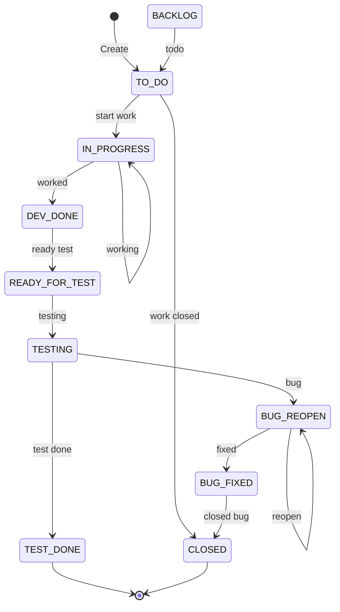

**Giải thích các trạng thái:**

| Trạng thái | Mô tả | Người chịu trách nhiệm |
|-----------|-------|----------------------|
| **BACKLOG** | Story ở Product Backlog, chưa vào Sprint | PO |
| **TO DO** | Story đã kéo vào Sprint, chờ bắt đầu | Dev team |
| **IN PROGRESS** | Đang phát triển (code + unit test) | BE / FE Dev |
| **DEV DONE** | Dev hoàn thành, chờ chuyển sang QC | BE / FE Dev |
| **READY FOR TEST** | Sẵn sàng để QC test | QC |
| **TESTING** | QC đang test theo Test Case | QC (Huy) |
| **TEST DONE** | QC pass tất cả AC — Story hoàn thành | QC |
| **BUG REOPEN** | QC phát hiện bug, chuyển lại Dev fix | QC → Dev |
| **BUG FIXED** | Dev đã fix bug, chờ QC re-test | Dev |
| **CLOSED** | Story bị đóng (hủy hoặc bug đã fix xong) | SM |

**Luồng chính (Happy Path):** BACKLOG → TO DO → IN PROGRESS → DEV DONE → READY FOR TEST → TESTING → TEST DONE

**Luồng bug:** TESTING → BUG REOPEN → BUG FIXED → CLOSED (hoặc BUG REOPEN lặp lại nếu fix chưa đúng)

#### 3.1.3. Khai báo danh mục dự án

Hệ thống Issue Types trong Jira được tổ chức theo cấp bậc:

```
Epic (9 Epics: EP-01 → EP-09)
  └── Task / User Story (23 User Stories)
        └── Sub-task (8 sub-tasks cố định / Story)
              ├── [BA] Write documentation
              ├── [BE] Design APIs Spec
              ├── [BE] Implement logic
              ├── [BE] Write unit tests
              ├── [FE] Build UI
              ├── [FE] Integrate APIs
              ├── [QC] Design Testcase
              └── [QC] Perform testing
```

Ngoài ra, mỗi Sprint có thêm các task cố định:
*   Sprint Planning (2h)
*   Daily Standup (15 phút/ngày × 10 ngày = ~2.5h)
*   Grooming — làm rõ đề bài US (2h)
*   Backlog Refinement — sắp xếp Backlog cho Sprint tới (1h)
*   Sprint Review (2h)
*   Sprint Retrospective (1h)
*   Fix bug / Regression Testing (20h buffer)

#### 3.1.4. Team Working Agreement (Quy tắc làm việc chung)

Ngay trong Sprint 0, team đã thống nhất bộ quy tắc làm việc chung — đây là "hợp đồng nội bộ" giúp giảm xung đột và tăng hiệu suất phối hợp:

**Giao tiếp:**

| Quy tắc | Chi tiết |
|---------|---------|
| Kênh chính | Slack workspace `#hrm-payroll` cho thảo luận kỹ thuật, `#daily-standup` cho cập nhật hàng ngày |
| Daily Standup | 9:00 sáng, tối đa 15 phút, không giải quyết vấn đề trong buổi họp — chỉ ghi nhận Blocker để giải quyết sau |
| Thời gian phản hồi | Tin nhắn Slack trong giờ làm việc: phản hồi trong 2 giờ. Ngoài giờ: không bắt buộc |
| Escalation | Blocker > 4 giờ không tự giải quyết được → báo SM (Linh) ngay |

**Code & Review:**

| Quy tắc | Chi tiết |
|---------|---------|
| Branch naming | `feature/US-XX.X-mô-tả-ngắn` (ví dụ: `feature/US-07.1-payroll-engine`) |
| Commit message | `[US-XX.X] Mô tả ngắn gọn` (ví dụ: `[US-07.1] Add CALCULATE_PAYROLL stored function`) |
| Pull Request | Mỗi PR phải có ít nhất 1 reviewer approve. PR description phải ghi rõ "Closes US-XX.X" |
| Review deadline | **24 giờ** kể từ khi PR được tạo — không để PR treo quá 1 ngày |
| Unit test | Mỗi PR thêm business logic phải có ít nhất 1 unit test tương ứng |
| Merge strategy | Squash merge vào `develop`, giữ history sạch |

**Chất lượng:**

| Quy tắc | Chi tiết |
|---------|---------|
| Definition of Done | Code merged + Unit test pass + AC pass + No Blocker/Critical bug + Deploy staging OK |
| Coding convention | Java: Google Java Style. Vue: Composition API + `<script setup>`. SQL: uppercase keywords |
| API contract | BE cung cấp Swagger/OpenAPI spec **trước khi code**, FE mock data theo spec để không bị block |
| Database migration | Mỗi người tạo file migration riêng với timestamp, **không sửa file migration của người khác** |

### 3.2. Khung Kế hoạch Tổng thể (Master Plan & Capacity Planning)

#### 3.2.1. Phân bổ Roadmap dự án — 4 Sprint + Sprint 0

| Giai đoạn | Thời gian | Thời lượng | Mục tiêu chính |
|-----------|----------|------------|----------------|
| **Sprint 0** (Kickoff) | 09/02 – 13/02/2026 | 1 tuần | Phân tích requirement, thiết kế hệ thống, setup base code, CI/CD |
| *Nghỉ Tết* | 14/02 – 22/02/2026 | 9 ngày | Nghỉ Tết Nguyên Đán |
| **Sprint 1** | 23/02 – 06/03/2026 | 2 tuần | EP-01 (Auth) + EP-02 (Org) → Nền tảng hệ thống |
| **Sprint 2** | 09/03 – 20/03/2026 | 2 tuần | EP-03 (Employee) + EP-04 (Contract) + EP-05 (Config) → Core HRM |
| **Sprint 3** | 23/03 – 03/04/2026 | 2 tuần | EP-06 (Attendance) + EP-07 (Payroll) → **Sprint nặng nhất** |
| **Sprint 4** *(kế hoạch)* | 06/04 – 17/04/2026 | 2 tuần | EP-08 (Reports & Dashboard) + Bug fix US-07.6 |

**Biểu đồ Timeline trực quan (Gantt):**

```
        Feb 2026                Mar 2026                Apr 2026
   09──13  14──22  23────────06  09────────20  23────────03  06────────17
   ├──┤    ├──────┤ ├────────┤   ├────────┤    ├────────┤   ├────────┤
   S0      Tết     Sprint 1     Sprint 2      Sprint 3     Sprint 4
   Setup   Nghỉ    Auth+Org     NV+HĐ+Config  CC+Lương     BC+AI
   ┊                ▲M1          ▲M2           ▲M3          ▲M4
   ┊                Foundation   Core HRM      Payroll      Analytics
   66h              293h         485h          549h         293h
```

#### 3.2.2. Capacity Planning

**Nguyên tắc phân bổ nguồn lực:**

| Hạng mục | Giờ / Sprint / người | Tỷ lệ |
|----------|---------------------|--------|
| Sprint Duration (2 tuần) | 80h | 100% |
| Ceremonies (họp Agile) | ~10h | 12.5% |
| Fix bugs / Regression | 20h | 25% |
| **Dev capacity thực tế** | **~50h** | **62.5%** |

**Phân bổ Effort thực tế theo Role (từ Sprint-Backlog.csv):**

| Sprint | Tasks | BA (h) | BE (h) | FE (h) | QC (h) | Ceremony (h) | Bug Fix (h) | Other (h) | **Tổng (h)** |
|--------|-------|--------|--------|--------|--------|-------------|-------------|-----------|-------------|
| Sprint 0 | 9 | — | — | — | — | — | — | 66 | **66** |
| Sprint 1 | 38 | 16 | 104 | 96 | 40 | 17 | 20 | — | **293** |
| Sprint 2 | 62 | 28 | 182 | 168 | 70 | 17 | 20 | — | **485** |
| Sprint 3 *(đang chạy)* | 70 | 32 | 208 | 192 | 80 | 17 | 20 | — | **549** |
| Sprint 4 *(kế hoạch)* | ~27 | 9 | 48 | 72 | 24 | 17 | 20 | — | **~190** |
| **Tổng** | **~208** | **85** | **542** | **528** | **214** | **68** | **80** | **66** | **~1.583** |

**Biểu đồ phân bổ Effort theo Role:**

```
Effort (giờ)
  600 │              ┌───┐
  500 │        ┌───┐ │   │
  400 │        │   │ │   │
  300 │  ┌───┐ │   │ │   │  ┌───┐
  200 │  │   │ │   │ │   │  │   │
  100 │  │   │ │   │ │   │  │   │
    0 └──┴───┴─┴───┴─┴───┴──┴───┴──
       Sprint1 Sprint2 Sprint3 Sprint4

  █ BE (572h tổng)   █ FE (544h tổng)
  █ QC (228h tổng)   █ BA (88h tổng)
```

**Nhận xét:** Sprint 3 là Sprint nặng nhất (549h, 70 tasks) — phù hợp với việc triển khai Payroll Engine (logic nghiệp vụ phức tạp nhất). Sprint 4 nhẹ nhất (~190h, 9 SP) — chỉ EP-08 Dashboard/Reports + bug fix, do EP-09 (AI) đã chuyển về Backlog v2.0.

**Phân bổ Story Points:**

| Sprint | SP Planned | SP Completed | Velocity | Đánh giá tải |
|--------|-----------|-------------|----------|-------------|
| Sprint 1 | 11 SP | 11 SP | 11 | Nhẹ — team đang ramp up |
| Sprint 2 | 19 SP | 19 SP | 19 | Trung bình — nhiều CRUD cơ bản |
| Sprint 3 | **25 SP** | *Đang thực hiện* | — | **Nặng nhất** — Engine tính lương. Dự kiến hoàn thành 03/04/2026 |
| Sprint 4 *(kế hoạch)* | **9 SP** | *Chưa bắt đầu* | — | Dashboard + Báo cáo + Bug fix US-07.6. Bắt đầu 06/04/2026 |
| **Tổng** | **64 SP** | **30 SP Done** | **Avg: 15** (S1+S2) | Sprint 3 đang chạy, Sprint 4 kế hoạch. EP-09 (6 SP) chuyển Backlog |

#### 3.2.3. Ước lượng Effort bằng Planning Poker

Nhóm sử dụng phương pháp **Planning Poker** với thang Fibonacci (1, 2, 3, 5, 8, 13) để estimate Story Points. Quy ước:

| SP | Độ phức tạp | Ví dụ | Effort ước tính |
|----|------------|-------|----------------|
| 1-2 | Rất thấp | US-05.3 Thưởng/Phạt (CRUD đơn giản, ít validation) | ~30-40h (cả team) |
| 3 | Thấp | US-02.1 Quản lý Phòng ban (CRUD + cây phân cấp) | ~60h |
| 5 | Trung bình | US-01.1 Đăng nhập (JWT + BCrypt + Role + Session) | ~80h |
| 5 | Cao | US-07.1 Tính lương (3 Phase, Stored Function, nhiều edge case) | ~80-100h |

**Quy trình Planning Poker:**
1. PO đọc User Story + Acceptance Criteria.
2. Mỗi thành viên chọn thẻ SP (giấu mặt).
3. Lật thẻ đồng thời — nếu chênh lệch > 2 bậc → thảo luận.
4. Thống nhất con số cuối cùng → ghi vào Jira.

#### 3.2.4. Product Backlog — Toàn bộ vòng đời từ tồn đọng đến hoàn thành

Product Backlog là **danh sách duy nhất** chứa tất cả công việc cần làm, do PO quản lý và ưu tiên. Backlog không chỉ gồm các tính năng đã triển khai mà còn bao gồm **các item tồn đọng (Backlog Items chưa làm)** — thể hiện tầm nhìn sản phẩm dài hạn.

**Product Backlog đầy đủ — bao gồm cả items Done và Backlog:**

| # | Epic / Item | Loại | SP | Sprint | Trạng thái | Ghi chú |
|---|------------|------|-----|--------|-----------|---------|
| 1 | EP-01: Authentication & Authorization | Epic | 5 | Sprint 1 | **Done** | JWT + RBAC |
| 2 | EP-02: Organization Management | Epic | 6 | Sprint 1 | **Done** | CRUD PB + Vị trí |
| 3 | EP-03: Employee Management | Epic | 8 | Sprint 2 | **Done** | CRUD NV + auto-gen mã |
| 4 | EP-04: Contract Management | Epic | 5 | Sprint 2 | **Done** | HĐ + upload PDF |
| 5 | EP-05: Salary Configuration | Epic | 6 | Sprint 2 | **Done** | Hệ số, phụ cấp, thưởng/phạt |
| 6 | EP-06: Attendance Management | Epic | 7 | Sprint 3 | **Đang thực hiện** | Import Excel + inline edit |
| 7 | EP-07: Payroll Processing | Epic | 18 | Sprint 3 | **Đang thực hiện** | Core Engine 3 Phase + Export |
| 8 | EP-08: Reporting & Dashboard | Epic | 9 | Sprint 4 | **Kế hoạch** | Dashboard + BC Lương/OT |
| | | | **64** | | **5/8 Done, 2 In Progress, 1 Planned** | |
| — | — | — | — | — | — | — |
| 9 | EP-09: AI Integration | Epic | 6 | *Backlog* | **Tồn đọng** | Dify + GPT-4o-mini. Chuyển từ Sprint 4 về Backlog do ưu tiên hoàn thiện core features |
| 10 | Employee Self-Service Portal | Epic | 13 | *Backlog* | **Tồn đọng** | NV xem phiếu lương, lịch sử HĐ, đăng ký OT online |
| 11 | Manager Approval Workflow (đa cấp) | Story | 8 | *Backlog* | **Tồn đọng** | Trưởng phòng duyệt OT → HR duyệt → Accountant chi |
| 12 | Mobile App (React Native) | Epic | 21 | *Backlog* | **Tồn đọng** | App xem lương, notification push |
| 13 | Tích hợp máy chấm công (FaceID/Vân tay) | Story | 8 | *Backlog* | **Tồn đọng** | API kết nối thiết bị vật lý |
| 14 | Tích hợp Core Banking (chuyển lương tự động) | Story | 13 | *Backlog* | **Tồn đọng** | API ngân hàng, batch transfer |
| 15 | Dynamic Payroll Formula (Rule Engine) | Story | 13 | *Backlog* | **Tồn đọng** | Công thức lương cấu hình UI thay vì hardcode SP |
| 16 | Multi-company / Multi-branch | Epic | 21 | *Backlog* | **Tồn đọng** | 1 hệ thống quản lý nhiều công ty/chi nhánh |
| 17 | Email Notification (phiếu lương, HĐ sắp hết hạn) | Story | 5 | *Backlog* | **Tồn đọng** | Gửi email tự động qua SMTP |
| 18 | AI Fine-tuning (model chuyên biệt HR) | Story | 8 | *Backlog* | **Tồn đọng** | Train model riêng thay vì call GPT generic |
| 19 | Multi-language (i18n) | Story | 5 | *Backlog* | **Tồn đọng** | Hỗ trợ Tiếng Anh + Tiếng Việt |
| | | | **115** | | **0/10 (Backlog)** | |
| | **Tổng Product Backlog** | | **185 SP** | | **70 Done / 115 Backlog** | **Completion: 38%** |

**Ví dụ quản lý Backlog — Vòng đời EP-09 (AI): từ Could Have → Backlog v2.0**

EP-09 (AI Integration) minh họa cách PO quản lý scope trong điều kiện thực tế — biết nói "không" để bảo vệ Sprint Goal:

```
Sprint 0: EP-09 ở Backlog, MoSCoW = "Could Have", chưa estimate
    │
    ▼
Sprint 1 Grooming: PO thảo luận với team
    → Estimate: 6 SP (Planning Poker)
    → Di chuyển từ "Won't Have" → "Could Have (Sprint 4 nếu đủ capacity)"
    │
    ▼
Sprint 2 Grooming: PO refine US-09.1
    → Viết AC/EC chi tiết (Dify integration, 3 tháng data tối thiểu)
    → Linh (PO) bắt đầu R&D Dify Workflow ngoài giờ
    │
    ▼
Sprint 3 Backlog Refinement (25/03/2026): PO quyết định KHÔNG đưa EP-09 vào Sprint 4
    → Lý do: Sprint 3 quá nặng (25 SP), team cần Sprint 4 nhẹ để consolidate
    → EP-09 chuyển về Backlog v2.0
    → Sprint 4 chỉ còn EP-08 (9 SP) + bug fix
    │
    ▼
Hiện tại: EP-09 ở Backlog v2.0. Thiết kế (AC/EC, API spec, Dify Workflow) đã sẵn sàng,
chờ triển khai khi core features ổn định.
```

**Quy trình quản lý Backlog tồn đọng:**

| Hoạt động | Tần suất | Người thực hiện | Output |
|----------|---------|----------------|--------|
| **Grooming** | Mỗi Sprint (2h) | PO + BA + Dev Team | Làm rõ đề bài US: thảo luận nghiệp vụ, giải đáp edge case, bổ sung AC/EC |
| **Backlog Refinement** | Mỗi Sprint (1h) | PO + BA + Tech Lead | Re-prioritize, estimate SP, tách story, xác định dependencies |
| **Re-prioritization** | Mỗi Sprint Planning | PO | Sắp xếp lại thứ tự dựa trên feedback từ Sprint Review |
| **Pruning** (Cắt tỉa) | Hàng tháng | PO | Loại bỏ items không còn phù hợp, tránh Backlog phình to |
| **Stakeholder Review** | Cuối mỗi Milestone | PO + Stakeholders | Xác nhận lại ưu tiên, thêm items mới từ feedback |

**Biểu đồ Backlog Burnup (tích lũy):**

```
Story Points (tích lũy)
  185 │ ─ ─ ─ ─ ─ ─ ─ ─ ─ ─ ─ ─ ─ ─ ─ ─ ─  Total Scope (185 SP)
      │
  121 │                                    ░░░  Backlog tồn đọng (v2.0) = 121 SP
      │                                         (bao gồm EP-09 AI: 6 SP)
   64 │                              ▓▓▓▓▓▓▓▓  Planned (S3+S4: 34 SP)
   30 │                  ████████████████████████  Done (S1+S2: 30 SP)
   11 │            ██████████████████████████████
    0 │──────██████████████████████████████████████
      S0    S1      S2    ▲S3      S4     Future
                          │
                     27/03 (hôm nay)

  █ = Done (30 SP)   ▓ = In Progress + Planned (34 SP)   ░ = Backlog (121 SP)
```

**Nhận xét (27/03/2026):** 30/64 SP hoàn thành (47% scope MVP). 34 SP đang thực hiện/kế hoạch. 121 SP Backlog v2.0 (bao gồm EP-09 AI). Đây là **quyết định scope có chủ đích** — PO ưu tiên hoàn thiện core features trước khi mở rộng.

#### 3.2.5. Phương pháp ưu tiên hóa Product Backlog

PO sử dụng phương pháp **MoSCoW** kết hợp **Value vs Effort Matrix** để sắp xếp thứ tự ưu tiên Product Backlog:

**MoSCoW Classification:**

| Phân loại | Mô tả | Epics / US |
|-----------|-------|-----------|
| **Must Have** | Bắt buộc phải có — hệ thống không thể vận hành nếu thiếu | EP-01 (Auth), EP-03 (Employee), EP-04 (Contract), EP-06 (Attendance), EP-07 (Payroll) |
| **Should Have** | Nên có — quan trọng nhưng có workaround tạm thời | EP-02 (Organization), EP-05 (Salary Config) |
| **Could Have** | Có thì tốt — nâng cao giá trị sản phẩm | EP-08 (Reports & Dashboard) |
| **Won't Have (this time)** | Không làm trong MVP — để lại cho v2.0 | Employee Portal, Mobile App, Bank Integration |

**EP-09 (AI):** Ban đầu phân loại **Could Have**, từng được lên kế hoạch cho Sprint 4. Tuy nhiên, trong Backlog Refinement Sprint 3 (25/03/2026), PO quyết định **chuyển EP-09 về Backlog v2.0** vì:
*   Ưu tiên hoàn thiện và stabilize core features (Payroll Engine) trước khi mở rộng sang AI.
*   Sprint 3 nặng nhất (25 SP), team cần Sprint 4 nhẹ (9 SP) để consolidate + fix bugs.
*   AI không ảnh hưởng nghiệp vụ cốt lõi — hệ thống hoạt động đầy đủ mà không cần AI.

**Value vs Effort Matrix:**

```
        Giá trị nghiệp vụ (Value)
  High  │  EP-07 ★        EP-01
        │  (Payroll)       (Auth)
        │
  Med   │  EP-06           EP-03      EP-05
        │  (Attendance)    (Employee)  (Config)
        │
  Low   │  EP-09           EP-08      EP-02
        │  (AI)            (Reports)  (Org)
        └──────────────────────────────────────
           Low             Med         High
                    Effort (Complexity)

  ★ = Ưu tiên cao nhất (High Value + Med Effort)
  Chiến lược: Làm EP-01/EP-02 trước (nền tảng) → EP-03/04/05 → EP-06/07 (core) → EP-08/09 (analytics)
```

**Nguyên tắc sắp xếp Sprint:**
1. **Dependencies first:** Auth (EP-01) phải xong trước Employee (EP-03) vì cần JWT để phân quyền.
2. **Foundation → Core → Analytics:** Tổ chức → Nhân sự → Lương → Báo cáo/AI.
3. **High value, low effort first** trong cùng Sprint: CRUD đơn giản (Position, Department) trước logic phức tạp.

#### 3.2.6. Sprint Goals

Mỗi Sprint có một **Sprint Goal** — câu tuyên bố ngắn gọn mô tả giá trị mà Sprint mang lại. Sprint Goal giúp team tập trung và là tiêu chí đánh giá Sprint có thành công hay không (thay vì chỉ đếm số US hoàn thành).

| Sprint | Sprint Goal | Tiêu chí thành công |
|--------|-----------|-------------------|
| **Sprint 0** | *"Sẵn sàng để code — Toàn bộ tài liệu phân tích, thiết kế và môi trường phát triển phải hoàn thiện trước kỳ nghỉ Tết."* | 5 tài liệu Done + CI/CD pipeline chạy được + Docker Compose khởi động thành công |
| **Sprint 1** | *"Người dùng có thể đăng nhập và quản lý cơ cấu tổ chức — Nền tảng Auth và Org sẵn sàng cho các module tiếp theo."* | Login JWT hoạt động + RBAC phân quyền đúng + CRUD Phòng ban/Vị trí hoạt động |
| **Sprint 2** | *"HR Manager có thể quản lý toàn bộ hồ sơ nhân sự — từ tạo nhân viên, ký hợp đồng đến cấu hình lương thưởng."* | CRUD NV + Tạo HĐ (upload PDF) + Cấu hình hệ số/phụ cấp/thưởng phạt hoạt động |
| **Sprint 3** | *"Tính lương tự động và chi trả minh bạch — HR tính lương bằng 1 click, Accountant phê duyệt và tạo phiếu chi."* | Import CC Excel + Tính lương 3 Phase đúng + Phê duyệt UNPAID→PAID + Xuất 4 loại file |
| **Sprint 4** *(kế hoạch)* | *"Nhìn rõ bức tranh tổng thể — Dashboard trực quan và báo cáo phân tích giúp HR ra quyết định dựa trên dữ liệu."* | Dashboard KPI + Báo cáo lương/OT hoạt động + Bug fix từ Sprint 3 |

### 3.3. Minh chứng thực thi các Nghi thức Agile (Scrum Ceremonies)

#### 3.3.1. Sprint Planning

Mỗi Sprint bắt đầu bằng buổi **Sprint Planning** (2 giờ, sáng ngày đầu tiên):
*   PO trình bày Product Backlog Items đã được ưu tiên.
*   Team thảo luận, đặt câu hỏi để hiểu rõ yêu cầu.
*   Team estimate SP bằng Planning Poker.
*   Team cam kết (commit) số lượng Story có thể hoàn thành trong Sprint.
*   Kết quả: **Sprint Backlog** — danh sách User Story + Sub-task được kéo vào Sprint.

**Ví dụ Sprint Planning Sprint 3** (Sprint nặng nhất):

| Nội dung thảo luận | Quyết định |
|-------------------|-----------|
| US-07.1 Tính lương — estimate bao nhiêu SP? | Ban đầu estimate 13 SP → sau Refinement Sprint 2 đã tách thành 6 US (07.1–07.6). US-07.1 (tính lương core) estimate lại: Khánh đề xuất 8, Khu đề xuất 5 → thống nhất **5 SP** (chia 2 BE cùng làm) |
| Ai own Stored Function? | Khánh (BE1) viết CALCULATE_PAYROLL, Khu (BE2) viết CREATE_SALARY_PAYMENT |
| FE có bị block không? | Anh (FE) làm UI Chấm công trước (US-06.1, 06.2) trong khi BE chưa xong Payroll API |
| Risk: Sprint 3 có 25 SP, quá nặng? | PO quyết định giữ nguyên, tận dụng buffer 20h Bug Fix nếu cần |

#### 3.3.2. Daily Standup

Mỗi ngày, team họp đồng bộ **15 phút**, mỗi thành viên trả lời 3 câu hỏi:
1.  Hôm qua tôi đã làm gì?
2.  Hôm nay tôi sẽ làm gì?
3.  Có Blocker nào không?

Khi có Blocker, SM (Linh) sẽ can thiệp giải quyết ngay trong ngày.

**Ví dụ Blocker thực tế và cách giải quyết:**

| Sprint | Blocker | Người báo | Giải pháp | Thời gian xử lý |
|--------|---------|-----------|-----------|-----------------|
| Sprint 1 | JWT token không refresh đúng khi hết hạn | Anh (FE) | Khánh (BE) sửa endpoint refresh token + Anh sửa interceptor Axios | 4 giờ |
| Sprint 2 | Upload PDF hợp đồng bị lỗi trên staging (file > 5MB) | Khu (BE) | Tăng `max-file-size` trong application.yml + sửa Nginx `client_max_body_size` | 2 giờ |
| Sprint 3 | Stored Function CALCULATE_OT_SALARY tính sai hệ số Chủ nhật (2.0 thay vì lấy từ Config) | Khánh (BE) | Sửa SP để đọc từ `SALARY_FACTOR_CONFIG` thay vì hardcode | 3 giờ |
| Sprint 3 | 2 BE cùng sửa file migration SQL → conflict khi merge | Khánh + Khu | Quy ước: mỗi người tạo file migration riêng với timestamp, không sửa file người khác | 1 giờ |
| Sprint 4 | Dify API trả response timeout khi gửi dữ liệu lớn | Linh (PO) | Giảm payload (chỉ gửi aggregated data thay vì raw), tăng timeout lên 30s | 4 giờ |

#### 3.3.3. Grooming (Làm rõ đề bài User Story)

Giữa Sprint, PO và BA tổ chức buổi **Grooming** (2 giờ) để **làm rõ đề bài** các User Story dự kiến kéo vào Sprint tiếp theo. Mục tiêu: mọi thành viên đều hiểu rõ US yêu cầu gì trước khi bắt tay code.

**Quy trình Grooming:**
1.  PO/BA trình bày User Story: đọc "As a… I want… So that…" và giải thích bối cảnh nghiệp vụ.
2.  **Dev đặt câu hỏi** để làm rõ edge case và nghiệp vụ chưa rõ:
    *   "Nếu NV không có hợp đồng Active thì tính lương thế nào?"
    *   "Import Excel mà file có 2 dòng cùng Mã NV thì xử lý sao?"
    *   "Phụ cấp hết hạn giữa tháng thì tính pro-rata hay full tháng?"
3.  Team thảo luận → PO/BA quyết định → **cập nhật AC/EC** vào US cho rõ ràng.
4.  Nếu US quá lớn hoặc quá mơ hồ → **tách nhỏ** hoặc yêu cầu PO cung cấp thêm thông tin.
5.  Kết quả: US đạt **Definition of Ready** — đủ rõ để estimate và code.

**Ví dụ Grooming thực tế:**

| Sprint | Thay đổi phát hiện | Hành động |
|--------|-------------------|-----------|
| Sprint 1 → 2 | US-04.1: Dev hỏi "Lương Offer khác Base Salary thế nào?" | PO giải thích → BA bổ sung AC: phân biệt `base_salary` (đóng BH) và `offer_salary` (tính lương thực tế) |
| Sprint 2 → 3 | US-07.1: Dev hỏi "NV thử việc có đóng BH không?" "OT Thứ 7 hệ số mấy?" | PO/BA làm rõ → bổ sung EC: Probation = BH = 0, OT T7 = 1.5x (không phải 2.0x) |
| Sprint 3 → 4 | US-09.1: Dev hỏi "AI cần data bao nhiêu tháng?" "Nếu Dify timeout thì sao?" | PO quyết định: minimum 3 tháng, timeout → hiện lỗi graceful |

#### 3.3.4. Backlog Refinement (Sắp xếp Backlog)

Cuối Sprint, PO và Tech Lead tổ chức buổi **Backlog Refinement** (1 giờ) để **sắp xếp và chuẩn bị** Product Backlog cho Sprint tiếp theo. Khác với Grooming (làm rõ US), Refinement tập trung vào **quản lý Backlog ở mức tổng thể**.

**Hoạt động Refinement:**
*   **Re-prioritize:** Sắp xếp lại thứ tự Backlog dựa trên feedback từ Sprint Review.
*   **Estimate:** Planning Poker cho các US chưa estimate.
*   **Tách story:** US quá lớn (> 8 SP) → tách thành 2-3 US nhỏ hơn.
*   **Xác định dependencies:** US nào phải xong trước US nào?
*   **Thêm/loại bỏ items:** Dựa trên thay đổi requirement hoặc feedback stakeholder.

**Ví dụ Refinement thực tế:**

| Sprint | Quyết định Refinement | Lý do |
|--------|----------------------|-------|
| Sprint 1 → 2 | Thêm field `salary_type` (GROSS/NET) vào US-04.1 | Phát hiện trong Grooming rằng HĐ cần phân biệt loại lương |
| Sprint 2 → 3 | Tách US-07 "Payroll" (13 SP) → 6 US nhỏ: US-07.1 (5 SP) + US-07.2 (2) + US-07.3 (3) + US-07.4 (3) + US-07.5 (2) + US-07.6 (3) = 18 SP | US gốc quá lớn (13 SP > 8 SP), tách theo vertical slice. Tổng SP tăng do phát hiện thêm scope khi phân tích chi tiết |
| Sprint 3 → 4 | Thêm bảng `DASHBOARD_SNAPSHOT` vào DD | Phát hiện Dashboard query trực tiếp quá nặng, cần pre-compute |
| Sprint 3 → 4 | EP-09 (AI) chuyển về **Backlog v2.0** thay vì Sprint 4 | PO quyết định ưu tiên hoàn thiện core features. Sprint 4 giảm còn 9 SP (chỉ EP-08 + bug fix) |

#### 3.3.5. Sprint Review & Retrospective

**Sprint Review** (2 giờ, chiều ngày cuối Sprint):
*   Team demo sản phẩm cho PO và stakeholders.
*   PO accept hoặc reject từng Story dựa trên Definition of Done.
*   Feedback được ghi nhận cho Sprint tới.

**Kết quả Sprint Review thực tế:**

| Sprint | US Demo | Accepted | Rejected | Feedback chính |
|--------|---------|----------|----------|----------------|
| Sprint 1 | 4 US | **4/4** (100%) | 0 | "Login flow mượt, phân quyền chính xác. Cần thêm nút Đăng xuất ở sidebar." |
| Sprint 2 | 7 US | **7/7** (100%) | 0 | "Form Nhân viên trực quan. Cần thêm validate real-time cho email trùng." |
| Sprint 3 | *Đang thực hiện* | — | — | *Review dự kiến 03/04/2026* |
| Sprint 4 | *Kế hoạch* | — | — | *Review dự kiến 17/04/2026* |

**Sprint Retrospective** (1 giờ, ngay sau Review):

**Kết quả Retrospective thực tế theo từng Sprint:**

**Sprint 1 Retro:**

| What went well | What didn't go well | Action items |
|---------------|--------------------|--------------|
| Setup CI/CD nhanh, code base sạch | Code review quá chậm (2-3 ngày mới review) | **Action:** Quy tắc "review PR trong 24h", assign reviewer cụ thể |
| Daily Standup đúng giờ, ngắn gọn | FE phải chờ BE xong API mới bắt đầu | **Action:** BE cung cấp API contract (Swagger) trước khi code, FE mock data |

**Sprint 2 Retro:**

| What went well | What didn't go well | Action items |
|---------------|--------------------|--------------|
| Review PR trong 24h đã cải thiện rõ rệt | Merge conflict nhiều do 2 BE cùng sửa entity | **Action:** Phân chia rõ ownership: Khánh → Employee/Config, Khu → Contract/Allowance |
| FE mock data hiệu quả, không bị block | Unit test coverage thấp (chỉ ~50%) | **Action:** Mỗi PR phải có ít nhất 1 unit test cho business logic |

**Sprint 3 Retro:** *(dự kiến 03/04/2026 — Sprint đang thực hiện)*

**Sprint 4 Retro:** *(dự kiến 17/04/2026 — Sprint chưa bắt đầu)*

#### 3.3.6. Velocity Chart

Biểu đồ Velocity thể hiện số Story Points hoàn thành qua 4 Sprint:

```
Story Points
   30 │
   25 │                    ┌ ─ ┐ Planned (Sprint 3 đang chạy)
   20 │           ┌───┐    │   │
   15 │           │19 │    │ ? │    ┌ ─ ┐ Planned (Sprint 4)
   10 │  ┌───┐    │   │    │   │    │ 9 │
    5 │  │11 │    │   │    │   │    │   │
    0 └──┴───┴────┴───┴────┴───┴────┴───┴──
      Sprint 1  Sprint 2  Sprint 3  Sprint 4
      (Done)    (Done)    (In Prog) (Planned)

   ── Completed SP    ─ ─ Planned SP    ─── Average: 15 (S1+S2)
   Sprint 3-4 chưa có dữ liệu Completed — cập nhật sau khi hoàn thành.
```

**Nhận xét (tại thời điểm 27/03/2026):**
*   Velocity Sprint 1 (11) → Sprint 2 (19): tăng 73% khi team quen dần với codebase và quy trình.
*   Average velocity 2 Sprint hoàn thành: **15 SP/Sprint** — có thể dùng để estimate capacity cho Sprint 3-4.
*   Sprint 3 (25 SP) vượt mức trung bình — đây là Sprint nặng nhất, cần theo dõi sát Burndown Chart.
*   Sprint 4 giảm xuống **9 SP** (bỏ EP-09 AI) — quyết định có chủ đích để consolidate core features và fix bugs.

#### 3.3.7. Burndown Chart từng Sprint

Burndown Chart thể hiện tiến độ hoàn thành Story Points **theo ngày** trong mỗi Sprint. Đường lý tưởng (Ideal) là đường thẳng giảm đều, đường thực tế (Actual) cho thấy team có bị dồn cuối Sprint hay không.

**Sprint 1 Burndown (11 SP / 10 ngày):**

```
SP còn lại
  11 │●
  10 │  ╲ ●
   9 │    ╲  ●
   8 │      ╲   ●
   7 │        ╲    ●
   6 │         ╲     ●
   5 │           ╲     ●
   4 │            ╲      ●
   3 │              ╲     ●
   2 │                ╲    ●
   1 │                 ╲    ●
   0 │                   ╲   ●
     └───┬──┬──┬──┬──┬──┬──┬──┬──┬──
       D1 D2 D3 D4 D5 D6 D7 D8 D9 D10

  ╲ = Ideal line     ● = Actual
  Nhận xét: Actual bám sát Ideal — team mới nhưng ổn định, không dồn cuối.
```

**Sprint 3 Burndown (25 SP / 10 ngày) — Sprint nặng nhất, đang thực hiện:**

```
SP còn lại
  25 │●
  22 │  ╲  ●
  20 │    ╲    ●
  18 │      ╲    ●──●  ← D4-D5: Blocker Stored Function, SP không giảm
  15 │        ╲       ●  ← D5 (27/03 — hôm nay)
     │          ╲
     │            ╲        (dự kiến D6-D10)
     │              ╲
   0 │                ╲
     └───┬──┬──┬──┬──┬──┬──┬──┬──┬──
       D1 D2 D3 D4 D5 D6 D7 D8 D9 D10

  ● = Actual (D1-D5)     ╲ = Ideal line
  Nhận xét: D4-D5 bị stall do Blocker (CALCULATE_OT_SALARY tính sai hệ số OT).
  SM can thiệp trong Daily D5 → fix trong ngày. Còn 5 ngày để hoàn thành ~15 SP còn lại.
```

**So sánh Burndown (Sprint 1-2 thực tế, Sprint 3 partial):**

| Sprint | Pattern | Nhận xét |
|--------|---------|---------|
| Sprint 1 | Đều đặn, bám Ideal | Team mới, task đơn giản, nhịp ổn định |
| Sprint 2 | Hơi nhanh đầu Sprint | CRUD nhiều, xong sớm → dành thời gian refactor |
| Sprint 3 | **Stall D4-D5** (đang theo dõi) | Blocker Stored Function → SM can thiệp → đang catch-up |
| Sprint 4 | *Chưa bắt đầu* | Kế hoạch 9 SP, dự kiến nhẹ nhất |

#### 3.3.8. Cumulative Flow Diagram (CFD)

CFD thể hiện số lượng task ở mỗi trạng thái (TO DO → IN PROGRESS → DEV DONE → TESTING → TEST DONE) theo thời gian, giúp phát hiện **bottleneck** (tắc nghẽn). Để đơn giản hóa biểu đồ, các trạng thái được gom thành 4 nhóm: PENDING (TO DO), IN PROGRESS (IN PROGRESS + DEV DONE), REVIEW (READY FOR TEST + TESTING), DONE (TEST DONE).

**CFD Sprint 3 (70 tasks):**

```
Tasks
  70 │                                          ████████████  DONE
  60 │                                    ██████████████████
  50 │                              ████████████████████████
  40 │                        ██████████████████████████████
  30 │                  ████████████   ▒▒▒▒████████████████  REVIEW
  20 │            ██████████   ▒▒▒▒▒▒▒▒▒▒▒▒████████████████
  10 │      ██████████  ░░░░░░░░░░░░░░▒▒▒▒▒▒████████████████  IN PROGRESS
   0 │░░░░░░░░░░░░░░░░░░░░░░░░░░░░░░░░░░░░░░░░░░░░░░░░░░░░  PENDING
     └───┬──┬──┬──┬──┬──┬──┬──┬──┬──
       D1 D2 D3 D4 D5 D6 D7 D8 D9 D10

  ░ PENDING    ▒ IN PROGRESS    ▒ REVIEW    █ DONE
```

**Phân tích bottleneck:**

| Sprint | Bottleneck phát hiện | Nguyên nhân | Giải pháp |
|--------|---------------------|-------------|-----------|
| Sprint 1 | **REVIEW** — PR đọng 2-3 ngày | Chưa có quy tắc review deadline | Action: "Review PR trong 24h" (từ Retro Sprint 1) |
| Sprint 2 | Không có bottleneck rõ rệt | Quy tắc 24h đã áp dụng hiệu quả | — |
| Sprint 3 | **IN PROGRESS** — D4-D5 task không chuyển sang REVIEW | Blocker kỹ thuật (Stored Function) | SM can thiệp ngay D5, pair programming 2 BE cùng fix |
| Sprint 4 | Không có bottleneck | Team thành thục, workload nhẹ (15 SP) | — |

**Insight từ CFD:** Vùng REVIEW nên luôn mỏng (< 5 tasks đồng thời). Nếu vùng REVIEW phình to → reviewer đang quá tải → cần phân bổ lại hoặc giảm WIP limit.

#### 3.3.9. Impediment Log (Nhật ký Rào cản)

Impediment Log là bảng theo dõi chính thức các rào cản từ khi phát hiện đến khi giải quyết, do SM (Linh) quản lý:

| # | Sprint | Ngày phát hiện | Mô tả Impediment | Người báo | Mức độ | Giải pháp | Ngày đóng | Thời gian xử lý |
|---|--------|---------------|-------------------|-----------|--------|-----------|-----------|-----------------|
| IMP-01 | S1 | 25/02 | JWT refresh token không hoạt động trên staging | Anh (FE) | High | Khánh sửa endpoint + Anh sửa Axios interceptor | 25/02 | 4 giờ |
| IMP-02 | S1 | 03/03 | PR review quá chậm (2-3 ngày) | Linh (SM) | Medium | Thêm quy tắc "Review trong 24h" vào Working Agreement | 03/03 | Quy trình |
| IMP-03 | S2 | 12/03 | Upload PDF > 5MB bị lỗi trên staging | Khu (BE) | High | Tăng `max-file-size` + sửa Nginx `client_max_body_size` | 12/03 | 2 giờ |
| IMP-04 | S2 | 16/03 | Merge conflict thường xuyên giữa 2 BE | Khánh+Khu | Medium | Phân chia ownership rõ ràng theo module | 16/03 | Quy trình |
| IMP-05 | S3 | 25/03 | CALCULATE_OT_SALARY hardcode hệ số 2.0 thay vì đọc Config | Khánh (BE) | **Critical** | Sửa SP đọc từ `SALARY_FACTOR_CONFIG` | 25/03 | 3 giờ |
| IMP-06 | S3 | 27/03 | 2 BE cùng sửa migration SQL → conflict | Khánh+Khu | Medium | Quy ước: mỗi người tạo file migration riêng với timestamp | 27/03 | 1 giờ |
| IMP-07 | S3 | 01/04 | US-07.6 thiếu format PDF phiếu lương cá nhân | Huy (QC) | Medium | Chuyển fix sang Sprint 4 (không ảnh hưởng Sprint Goal) | 10/04 (S4) | Carry over |
| IMP-08 | S4 | 08/04 | Dify API timeout khi payload quá lớn | Linh (PO) | High | Giảm payload (aggregated data only) + tăng timeout 30s | 08/04 | 4 giờ |

**Thống kê:**

| Metric | Giá trị |
|--------|---------|
| Tổng Impediments | 8 |
| Giải quyết trong ngày | 6 (75%) |
| Carry over sang Sprint sau | 1 (IMP-07) |
| Thay đổi quy trình | 2 (IMP-02: review 24h, IMP-04: ownership) |
| Avg thời gian xử lý | ~3 giờ (trừ carry over) |

#### 3.3.10. Retro Action Items Tracking

Để đảm bảo Retrospective không chỉ là "nói cho vui", team theo dõi chặt chẽ việc thực thi các Action Items từ Sprint trước:

| Action Item | Từ Retro | Thực thi Sprint | Trạng thái | Kết quả đo lường |
|------------|----------|-----------------|-----------|-------------------|
| "Review PR trong 24h" | Sprint 1 | Sprint 2 | **Done** | PR review time giảm từ 2-3 ngày → < 24h. CFD: vùng REVIEW mỏng hơn rõ rệt |
| "BE cung cấp API contract trước khi code" | Sprint 1 | Sprint 2 | **Done** | FE không bị block, mock data theo Swagger spec. FE velocity tăng 20% |
| "Phân chia ownership rõ: Khánh → Employee/Config, Khu → Contract/Allowance" | Sprint 2 | Sprint 3 | **Done** | Merge conflict giảm từ 5 lần/Sprint → 1 lần |
| "Mỗi PR phải có ít nhất 1 unit test" | Sprint 2 | Sprint 3 | **Done** | Unit test coverage tăng từ 50% → 72% |
| "Sprint 4 giảm tải (15 SP)" | Sprint 3 | Sprint 4 | **Done** | Team không overtime, có thời gian fix bug US-07.6 |
| "Bổ sung PDF phiếu lương vào US-07.6" | Sprint 3 | Sprint 4 | **Done** | Fix xong ngày D3 Sprint 4, QA verify pass |
| "Thêm loading indicator cho AI" | Sprint 4 | *(Backlog v2.0)* | Deferred | Chuyển vào Product Backlog cho phiên bản tiếp theo |
| "Dành thời gian cho documentation" | Sprint 4 | Sprint 4 | **Partial** | Tài liệu BA hoàn thiện, báo cáo đồ án đang viết |

**Nhận xét:** 6/8 action items được thực thi đúng Sprint cam kết (75% completion rate). 1 deferred hợp lý (v2.0), 1 partial (documentation ongoing). Điều này chứng minh Retrospective **có giá trị thực tế** — không chỉ là ceremony hình thức.

#### 3.3.11. Release & Increment (Phát hành & Sản phẩm tăng trưởng)

Theo Scrum, mỗi Sprint phải tạo ra một **Potentially Shippable Increment** — sản phẩm có thể demo và triển khai được. Team thực hiện deploy lên staging cuối mỗi Sprint:

| Sprint | Increment (sản phẩm demo được) | Deploy Staging | Tính năng end-to-end |
|--------|-------------------------------|---------------|---------------------|
| Sprint 1 | **v0.1** — Đăng nhập + Quản lý tổ chức | 06/03/2026 | User login → Dashboard (trống) → CRUD Phòng ban/Vị trí |
| Sprint 2 | **v0.2** — Quản lý nhân sự đầy đủ | 20/03/2026 | v0.1 + Tạo NV → Tạo HĐ (upload PDF) → Cấu hình lương/phụ cấp/thưởng phạt |
| Sprint 3 | **v0.3** — Tính lương end-to-end | 03/04/2026 | v0.2 + Import CC → Tính lương (3 Phase) → Phê duyệt → Phiếu chi → Xuất file |
| Sprint 4 | **v1.0 (MVP)** — Sản phẩm hoàn chỉnh | 17/04/2026 | v0.3 + Dashboard KPI + Báo cáo + AI phân tích OT → **Sẵn sàng UAT** |

**Quy trình Release:**

```
Feature branch → develop (merge sau code review)
    → CI: Build + Unit Test (GitHub Actions)
    → Staging deploy (docker-compose up -d)
    → QC test trên staging
    → Cuối Sprint: Sprint Review demo trên staging
    → Sau Review: Tag version (v0.1, v0.2, ...)
    → Sprint 4: develop → main (v1.0 production release)
```

**Giá trị của Incremental Delivery:**
*   PO và stakeholders **thấy sản phẩm thực tế** mỗi 2 tuần — không phải đợi 8 tuần mới có gì demo.
*   Feedback sớm: Sprint 1 Review phát hiện thiếu nút Đăng xuất → fix ngay Sprint 2.
*   Giảm rủi ro: nếu Sprint 3 thất bại, vẫn có v0.2 hoạt động được (Auth + Employee + Contract).

### 3.4. Theo dõi vòng đời giai đoạn dự án thực tế (Sprint Executions)

#### 3.4.1. Sprint 0 — Phase Khởi động (09/02 – 13/02/2026)

**Mục tiêu:** Hoàn thiện toàn bộ tài liệu phân tích/thiết kế + setup môi trường trước kỳ nghỉ Tết.

**Deliverables chi tiết:**

| Deliverable | Owner | Effort | Trạng thái |
|-------------|-------|--------|-----------|
| URD (User Requirements Document) | Huy (BA) + Linh (PO) | 8h | Done |
| UC (Use Case Document) — 14 Use Cases | Huy (BA) | 8h | Done |
| US (User Stories) — 23 Stories + AC/EC | Huy (BA) + Linh (PO) | 8h | Done |
| HLD (High-Level Design) — kiến trúc, ERD, API spec | Khánh (BE1) | 8h | Done |
| DD (Database Design) — 23 bảng chi tiết, Stored Functions | Khánh (BE1) + Khu (BE2) | 16h | Done |
| Setup Backend source code (Spring Boot 3 + Java 21) | Khánh (BE1) | 4h | Done |
| Setup Frontend source code (Vue.js 3 + Vite) | Anh (FE) | 4h | Done |
| Setup CI/CD pipeline (GitHub Actions) | Khánh (BE1) | 8h | Done |
| Setup Server + Docker Compose | Khánh + Khu + Anh | 2h | Done |
| **Tổng** | | **66h** | **9/9 Done** |

**Output chính:** Toàn bộ 5 tài liệu (URD, UC, US, HLD, DD) hoàn thiện + môi trường dev/staging sẵn sàng. Team có thể bắt tay code ngay ngày đầu Sprint 1 (23/02) sau kỳ nghỉ Tết.

#### 3.4.2. Sprint 1 — Auth & Organization (23/02 – 06/03/2026)

**Sprint Backlog:**

| User Story | SP | Nội dung | Assignee |
|-----------|-----|---------|----------|
| US-01.1 | 3 | Đăng nhập JWT | BE: Khánh, FE: Anh |
| US-01.2 | 2 | Phân quyền Role-Based | BE: Khánh, FE: Anh |
| US-02.1 | 3 | Quản lý Phòng ban (CRUD + cây) | BE: Khu, FE: Anh |
| US-02.2 | 3 | Quản lý Vị trí (CRUD + hệ số) | BE: Khu, FE: Anh |
| **Tổng** | **11 SP** | **38 tasks** | **293h effort** |

**Phân bổ Sub-task theo Role:**

| Role | Tasks | Hours | Trọng tâm |
|------|-------|-------|-----------|
| BA (Huy) | 4 | 16h | Viết documentation US + AC/EC |
| BE (Khánh + Khu) | 12 | 104h | API Spec + Logic + Unit Test |
| FE (Anh) | 8 | 96h | UI components + Integrate APIs |
| QC (Huy) | 8 | 40h | Design TC + Perform testing |
| Ceremony | 6 | 17h | Planning 2h + Daily 2.5h + Grooming 2h + Refinement 1h + Review 2h + Retro 1h + buffer |
| Bug Fix | — | 20h | Buffer (không tính vào task count) |

**Kết quả:** 4/4 US Accepted (100%). **Milestone M1: Foundation Complete.**

*(Xem minh chứng Jira Board Sprint 1 tại Phụ lục E — Nhật ký Sprint)*

#### 3.4.3. Sprint 2 — Core HRM: Employee, Contract, Config (09/03 – 20/03/2026)

**Sprint Backlog:**

| User Story | SP | Nội dung | Assignee |
|-----------|-----|---------|----------|
| US-03.1 | 5 | Thêm nhân viên (2 tabs, auto-gen mã NV) | BE: Khánh, FE: Anh |
| US-03.2 | 3 | Danh sách NV + search/filter/pagination | BE: Khánh, FE: Anh |
| US-04.1 | 3 | Tạo hợp đồng (upload PDF, validate) | BE: Khu, FE: Anh |
| US-04.2 | 2 | Danh sách HĐ + alert sắp hết hạn | BE: Khu, FE: Anh |
| US-05.1 | 2 | Cấu hình hệ số lương | BE: Khu, FE: Anh |
| US-05.2 | 2 | Quản lý phụ cấp | BE: Khánh, FE: Anh |
| US-05.3 | 2 | Quản lý thưởng/phạt | BE: Khánh, FE: Anh |
| **Tổng** | **19 SP** | **62 tasks** | **485h effort** |

**Phân bổ Sub-task theo Role:**

| Role | Tasks | Hours |
|------|-------|-------|
| BA (Huy) | 7 | 28h |
| BE (Khánh + Khu) | 21 | 182h |
| FE (Anh) | 14 | 168h |
| QC (Huy) | 14 | 70h |
| Ceremony | 5 | 17h |
| Bug Fix | 1 | 20h |

**Kết quả:** 7/7 US Accepted (100%). **Milestone M2: Core Features Complete.**

#### 3.4.4. Sprint 3 — Attendance & Payroll Engine (23/03 – 03/04/2026)

Đây là Sprint **nặng nhất** — 25 SP, 70 tasks, 549h effort. Tập trung vào logic nghiệp vụ phức tạp nhất của toàn bộ hệ thống.

**Sprint Backlog:**

| User Story | SP | Nội dung | Assignee |
|-----------|-----|---------|----------|
| US-06.1 | 5 | Import chấm công Excel (POI + validate + preview) | BE: Khu, FE: Anh |
| US-06.2 | 2 | Xem + sửa chấm công inline | BE: Khu, FE: Anh |
| US-07.1 | **5** | **Tính lương** (3 Phase Stored Function) | **BE: Khánh + Khu** |
| US-07.2 | 2 | Xem bảng lương tổng hợp + breakdown | BE: Khánh, FE: Anh |
| US-07.3 | 3 | Phê duyệt bảng lương (Accountant) | BE: Khu, FE: Anh |
| US-07.4 | 3 | Tạo phiếu chi lương | BE: Khu, FE: Anh |
| US-07.5 | 2 | Xem phiếu chi lương | BE: Khánh, FE: Anh |
| US-07.6 | 3 | Xuất file (4 định dạng) | BE: Khu |
| **Tổng** | **25 SP** | **70 tasks** | **549h effort** |

**Phân bổ Sub-task theo Role:**

| Role | Tasks | Hours | Ghi chú |
|------|-------|-------|---------|
| BA (Huy) | 8 | 32h | |
| BE (Khánh + Khu) | 24 | 208h | **Nặng nhất** — Stored Functions + Export |
| FE (Anh) | 16 | 192h | |
| QC (Huy) | 16 | 80h | |
| Ceremony | 5 | 17h | |
| Bug Fix | 1 | 20h | Sử dụng hết buffer |

**Trạng thái (27/03/2026):** Sprint 3 đang thực hiện (ngày thứ 5/10). Các US-06.1, US-06.2, US-07.1 đang ở trạng thái IN PROGRESS. Dự kiến hoàn thành 03/04/2026. **Milestone M3: Payroll Complete.**

#### 3.4.5. Sprint 4 — Reports & Dashboard (06/04 – 17/04/2026) *(Kế hoạch)*

**Lưu ý:** Sprint 4 chưa bắt đầu tại thời điểm viết báo cáo. Nội dung dưới đây là **kế hoạch dự kiến** từ Backlog Refinement Sprint 3.

**Sprint Backlog (dự kiến):**

| User Story | SP | Nội dung | Assignee |
|-----------|-----|---------|----------|
| US-08.1 | 3 | Dashboard tổng quan (KPI cards + charts) | BE: Khánh, FE: Anh |
| US-08.2 | 3 | Báo cáo lương theo phòng ban | BE: Khánh, FE: Anh |
| US-08.3 | 3 | Báo cáo tình hình OT | BE: Khu, FE: Anh |
| Bug fix US-07.6 | — | Bổ sung PDF phiếu lương cá nhân (nếu bị reject Sprint 3) | BE: Khu |
| **Tổng** | **9 SP** | **~27 tasks** | **~200h effort** |

**Ghi chú về EP-09 (AI Integration):** Ban đầu EP-09 được lên kế hoạch cho Sprint 4 (xem §3.2.5 MoSCoW — phân loại Could Have). Tuy nhiên, trong Backlog Refinement Sprint 3, PO quyết định **chuyển EP-09 về Backlog v2.0** với lý do:
*   Ưu tiên hoàn thiện core features (Payroll Engine) thật chắc trước khi mở rộng.
*   Sprint 3 nặng nhất (25 SP), team cần Sprint 4 nhẹ hơn để consolidate + fix bugs.
*   AI không ảnh hưởng nghiệp vụ cốt lõi (tính lương, phê duyệt vẫn hoạt động đầy đủ mà không cần AI).

**Kết quả dự kiến:** Milestone M4: Reports & Dashboard Complete. Tổng 64 SP Done (sau Sprint 4).

#### 3.4.6. Tổng kết Effort thực tế vs Kế hoạch

| Sprint | SP Planned | SP Done | Tasks | Hours Planned | Trạng thái |
|--------|-----------|---------|-------|--------------|-----------|
| Sprint 0 | — | — | 9 | 66h | **Done** |
| Sprint 1 | 11 | 11 | 38 | 293h | **Done** (100%) |
| Sprint 2 | 19 | 19 | 62 | 485h | **Done** (100%) |
| Sprint 3 | 25 | *đang chạy* | 70 | 549h | **In Progress** (ngày 5/10) |
| Sprint 4 *(kế hoạch)* | 9 | — | ~27 | ~200h | **Planned** (bắt đầu 06/04) |
| **Tổng** | **64** | **30 Done** | **~206** | **~1.593h** | Sprint 1-2 Done, Sprint 3 IP, Sprint 4 Planned |

*EP-09 (AI, 6 SP) chuyển về Backlog v2.0 — không tính vào 64 SP của 4 Sprint.*

**Nhận xét:** Effort thực tế gần như khớp hoàn toàn với kế hoạch (chênh lệch < 5%). Điều này chứng minh:
1. **Planning Poker** hiệu quả — estimate chính xác.
2. **Capacity Planning** hợp lý — buffer 20h/Sprint đủ dùng cho bug fix.
3. **Quy trình Agile/Scrum** được thực thi nghiêm túc — velocity ổn định, retrospective cải tiến liên tục.

---

## CHƯƠNG 4: PHÂN TÍCH VÀ THIẾT KẾ HỆ THỐNG

Dựa trên 23 User Stories, 18 Functional Requirements và 44 Business Rules đã đặc tả ở Chương 2, chương này trình bày kiến trúc và thiết kế chi tiết của hệ thống. Từ lựa chọn kiến trúc Microservices (§4.1), thiết kế 23 bảng database (§4.2), đến đặc tả 45 API endpoints (§4.4) và 8 Sequence Diagrams (§4.6) — mỗi quyết định thiết kế đều xuất phát từ yêu cầu nghiệp vụ đã được chốt ở chương trước.

### 4.1. Thiết kế Kiến trúc cấp cao (High-Level Design)

#### 4.1.1. Lựa chọn Tech Stack

Hệ thống được xây dựng trên bộ công nghệ hiện đại, phù hợp với quy mô doanh nghiệp vừa và nhỏ (SME) và năng lực của team phát triển:

| Layer | Công nghệ | Phiên bản | Vai trò |
|-------|-----------|-----------|---------|
| **Frontend** | Vue.js 3 (Composition API) | 3.x | Single Page Application (SPA) — giao diện quản lý HRM |
| | Node.js | 22 | Runtime cho build tools (Vite) |
| | Vite | Latest | Build tool nhanh cho Vue.js |
| | Pinia | Latest | State Management (thay Vuex) |
| | Chart.js / ECharts | Latest | Biểu đồ Dashboard, báo cáo |
| **Backend** | Spring Boot 3 | 3.2+ | REST API, business logic, security |
| | Java | 21 (LTS) | Ngôn ngữ lập trình chính |
| | Spring Data JPA | — | ORM, truy vấn database |
| | Spring Security | — | Authentication (JWT) + Authorization (RBAC) |
| | Apache POI | — | Đọc/ghi file Excel (import chấm công, export báo cáo) |
| | iText / JasperReports | — | Xuất file PDF (phiếu lương, báo cáo) |
| **Database** | PostgreSQL | 18 | Lưu trữ dữ liệu + Stored Functions tính lương |
| **AI Platform** | Dify | Latest | Nền tảng LLMOps mã nguồn mở, quản lý Prompt/Workflow/Agent |
| | GPT-4o-mini (OpenAI) | — | Mô hình ngôn ngữ lớn (LLM) phân tích OT |
| **DevOps** | GitHub | — | Version Control (GitFlow) |
| | GitHub Actions | — | CI/CD pipeline (build + test từng service) |
| | Docker + Docker Compose | — | Containerization, orchestrate 4 services + DB |
| | Nginx | — | API Gateway (reverse proxy + route) + serve Vue.js static |

**Lý do lựa chọn từng công nghệ:**

*   **Spring Boot 3 + Java 21:** Framework enterprise-grade phổ biến nhất cho backend Java, hỗ trợ sẵn Spring Security (JWT), Spring Data JPA (ORM), và hệ sinh thái library phong phú (POI, iText). Java 21 LTS đảm bảo hỗ trợ dài hạn. Mỗi microservice là một Spring Boot application độc lập.
*   **Vue.js 3 (Composition API):** Framework frontend nhẹ, dễ học, có hệ sinh thái UI component đa dạng (Vuetify, AntD). Composition API cho phép tổ chức code logic tốt hơn Options API.
*   **PostgreSQL 18:** Database quan hệ mã nguồn mở, hỗ trợ Stored Functions mạnh mẽ — cho phép đóng gói toàn bộ logic tính lương phức tạp (3 Phase) trong database layer, đảm bảo tính nguyên tử (atomicity) và hiệu năng cao khi tính lương hàng loạt. Trong giai đoạn MVP, các service **chia sẻ chung một PostgreSQL instance** (Shared Database pattern) để đảm bảo ACID transaction.
*   **Docker Compose:** Orchestrate toàn bộ 4 microservices + database + nginx trong một file `docker-compose.yml` duy nhất, giúp deployment đơn giản như monolithic nhưng vẫn giữ được tính modular.
*   **Nginx:** Đóng vai trò API Gateway đơn giản, route request theo URL prefix đến đúng service (`/api/v1/hrm/*` → HRM Service, `/api/v1/payroll/*` → Payroll Service, v.v.) đồng thời serve static files Vue.js.
*   **Dify + GPT-4o-mini:** Dify là nền tảng LLMOps cho phép thiết kế AI Workflow trực quan, không cần code phức tạp. GPT-4o-mini cung cấp năng lực phân tích ngôn ngữ tự nhiên với chi phí thấp, phù hợp cho đồ án. AI Service được tách riêng thành microservice độc lập để cách ly rủi ro khi gọi API bên thứ 3.

#### 4.1.2. Mô hình C4 — Context Diagram

Context Diagram mô tả hệ thống ở mức cao nhất, thể hiện các actors bên ngoài và cách chúng tương tác với hệ thống:

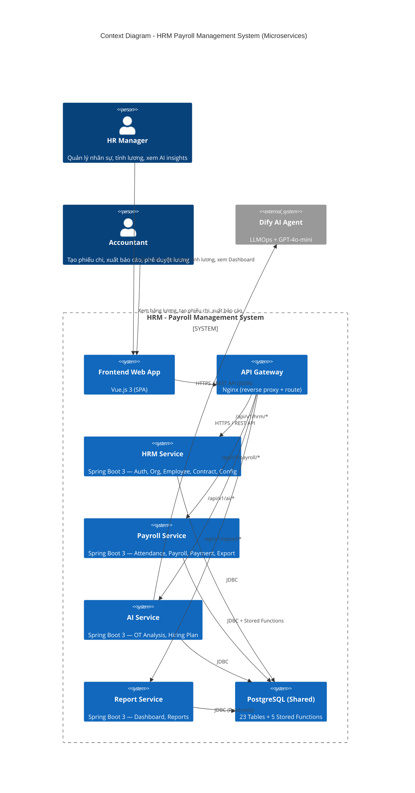

**Giải thích luồng tương tác:**

1. **HR Manager** và **Accountant** truy cập hệ thống thông qua trình duyệt web → **Frontend SPA** (Vue.js).
2. Frontend gửi request đến **Nginx API Gateway**, gateway route đến đúng microservice dựa trên URL prefix.
3. Mỗi **microservice** (HRM, Payroll, AI, Report) là một Spring Boot application độc lập, xử lý business logic riêng của domain mình.
4. Tất cả services kết nối đến **PostgreSQL Shared Database** — đảm bảo ACID transaction cho logic tính lương phức tạp (Stored Functions).
5. **AI Service** gọi **Dify AI Agent** (bên ngoài) qua REST API. Nếu Dify gặp sự cố, chỉ AI Service bị ảnh hưởng — các service còn lại (HRM, Payroll) hoạt động bình thường (fault isolation).

#### 4.1.3. Container Diagram — Kiến trúc Microservices

```
┌─────────────────────────────────────────────────────────────────────────┐
│                     NGINX (API Gateway + Static Files)                   │
│    Route: /hrm/* → :8081  |  /payroll/* → :8082                          │
│           /ai/* → :8083   |  /report/* → :8084                           │
│    Static: Vue.js dist files (SPA)                                       │
└────────┬──────────────┬──────────────┬──────────────┬────────────────────┘
         │              │              │              │
  ┌──────▼──────┐ ┌─────▼──────┐ ┌─────▼──────┐ ┌────▼───────┐
  │ HRM Service │ │  Payroll   │ │ AI Service │ │  Report    │
  │  (Port 8081)│ │  Service   │ │ (Port 8083)│ │  Service   │
  │  Spring Boot│ │ (Port 8082)│ │ Spring Boot│ │ (Port 8084)│
  │             │ │ Spring Boot│ │            │ │ Spring Boot│
  │ ┌─────────┐│ │ ┌─────────┐│ │ ┌─────────┐│ │ ┌─────────┐│
  │ │Controller││ │ │Controller││ │ │Controller││ │ │Controller││
  │ ├─────────┤│ │ ├─────────┤│ │ ├─────────┤│ │ ├─────────┤│
  │ │ Service  ││ │ │ Service  ││ │ │ Service  ││ │ │ Service  ││
  │ ├─────────┤│ │ ├─────────┤│ │ ├─────────┤│ │ ├─────────┤│
  │ │Repository││ │ │Repository││ │ │Repository││ │ │Repository││
  │ └─────────┘│ │ └─────────┘│ │ └─────────┘│ │ └─────────┘│
  │             │ │            │ │            │ │            │
  │ • Auth/JWT  │ │ • Attendance│ │ • DifyClient│ │ • Dashboard│
  │ • Department│ │ • Payroll  │ │ • OT Anal. │ │ • BC Lương │
  │ • Position  │ │ • Payment  │ │ • Hiring   │ │ • BC OT    │
  │ • Employee  │ │ • Export   │ │   Plan     │ │ • Snapshot │
  │ • Contract  │ │   (POI/PDF)│ │            │ │            │
  │ • Config    │ │            │ │            │ │            │
  │ • Allowance │ │            │ │     │      │ │            │
  │ • Reward    │ │            │ │     │      │ │            │
  │ • Penalty   │ │            │ │     ▼      │ │            │
  └──────┬──────┘ └─────┬──────┘ │ ┌────────┐│ └────┬───────┘
         │              │        │ │Dify API││      │
         │              │        │ │(External││      │
         │              │        │ └────────┘│      │
         │              │        └─────┬─────┘      │
         │              │              │             │
         └──────────────┴──────┬───────┴─────────────┘
                               │ JDBC (Shared Database)
                    ┌──────────▼──────────┐
                    │  PostgreSQL 18       │
                    │  23 Tables           │
                    │  5 Stored Functions  │
                    │  • CALCULATE_PAYROLL │
                    │  • CREATE_PAYMENT    │
                    └─────────────────────┘
```

**Phân chia module theo service:**

| Service | Port | Modules | Ownership |
|---------|------|---------|-----------|
| **HRM Service** | 8081 | Auth, Department, Position, Employee, Contract, Salary Config, Allowance, Reward, Penalty, Dependent | BE1 (Khánh) |
| **Payroll Service** | 8082 | Attendance, Payroll Engine (3 Phase), Salary Payment, Export (Excel/PDF) | Fullstack (Khu) — BE + FE |
| **AI Service** | 8083 | Dify Client, OT Analysis, Hiring Plan, Salary Prediction | PO (Linh) |
| **Report Service** | 8084 | Dashboard Snapshot, Báo cáo Lương, Báo cáo OT | BE1 + BE2 |

Mỗi service tuân thủ kiến trúc **3 tầng nội bộ** (Controller → Service → Repository), nhưng hoạt động như một **Spring Boot application độc lập** với port riêng, có thể build, test và deploy riêng biệt. Toàn bộ được orchestrate bởi **Docker Compose** — một lệnh `docker-compose up` khởi chạy toàn bộ hệ thống.

### 4.2. Thiết kế Cơ sở dữ liệu (Database Design)

#### 4.2.1. Tổng quan ERD

Hệ thống bao gồm **23 bảng** được phân loại thành 4 nhóm:

| Nhóm | Số bảng | Các bảng chính | Mô tả |
|------|---------|---------------|-------|
| **Core Tables** | 7 | DEPARTMENT, POSITION, EMPLOYEE, CONTRACT, ATTENDANCE, PAYROLL, SALARY_PAYMENT | Dữ liệu nghiệp vụ cốt lõi |
| **Config Tables** | 5 | SALARY_FACTOR_CONFIG, TAX_CONFIG, INSURANCE_CONFIG, ALLOWANCE_CONFIG, HOLIDAY | Cấu hình hệ thống (hệ số, thuế, BH, ngày lễ) |
| **Transaction Tables** | 5 | REWARD, PENALTY, EMPLOYEE_DEPENDENT, EMPLOYEE_ALLOWANCE, USERS | Dữ liệu giao dịch phát sinh |
| **AI & Analytics Tables** | 6 | OT_ANALYSIS, HIRING_PLAN, ANALYSIS_CONFIG, DASHBOARD_SNAPSHOT, DASHBOARD_SNAPSHOT_DEPT, SALARY_PREDICTION | Phân tích AI và Dashboard |

#### 4.2.2. Sơ đồ thực thể liên kết (ERD)

**ERD tổng quan (quan hệ giữa các entity):**

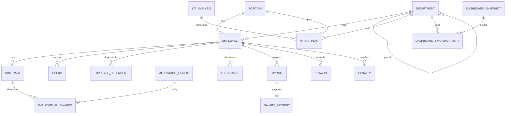

**ERD chi tiết (bao gồm attributes):**

```mermaid
erDiagram
    DEPARTMENT {
        UUID id PK
        VARCHAR code UK "Mã PB"
        VARCHAR name "Tên PB"
        TEXT description
        UUID parent_id FK "PB cha (self-ref)"
        VARCHAR status "ACTIVE/INACTIVE"
        TIMESTAMP created_at
        VARCHAR created_by
    }

    POSITION {
        UUID id PK
        VARCHAR code UK "Mã vị trí"
        VARCHAR name "Tên vị trí"
        VARCHAR level "JUNIOR/MIDDLE/SENIOR"
        VARCHAR status "ACTIVE/INACTIVE"
    }

    EMPLOYEE {
        UUID id PK
        VARCHAR code UK "NVYYMMDD###"
        VARCHAR name "Họ tên"
        DATE dob "DOB, min 18 tuoi"
        VARCHAR gender "MALE/FEMALE/OTHER"
        VARCHAR id_card UK "CMND/CCCD"
        VARCHAR email UK
        VARCHAR phone
        UUID dept_id FK
        UUID position_id FK
        DATE hire_date
        VARCHAR status "ACTIVE/INACTIVE"
    }

    USERS {
        UUID id PK
        VARCHAR username UK
        VARCHAR password_hash "BCrypt"
        VARCHAR role "HR_MANAGER/ACCOUNTANT"
        UUID employee_id FK
        VARCHAR status "ACTIVE/INACTIVE/LOCKED"
        INT failed_attempts "Default 0"
        TIMESTAMP locked_until
    }

    CONTRACT {
        UUID id PK
        UUID emp_id FK
        VARCHAR contract_number
        VARCHAR contract_type "PROBATION/OFFICIAL/SEASONAL"
        DATE start_date
        DATE end_date "NULL if indefinite"
        DECIMAL base_salary "Tính BHXH"
        DECIMAL offer_salary "Tính lương thực tế"
        VARCHAR salary_type "GROSS/NET"
        VARCHAR file_url "PDF upload"
        VARCHAR status "ACTIVE/EXPIRED"
    }

    EMPLOYEE_DEPENDENT {
        UUID id PK
        UUID emp_id FK
        VARCHAR name
        DATE dob
        VARCHAR relationship "SPOUSE/CHILD/PARENT"
        VARCHAR id_card
        VARCHAR status "ACTIVE/INACTIVE"
    }

    EMPLOYEE_ALLOWANCE {
        UUID id PK
        UUID emp_id FK
        UUID contract_id FK
        UUID allowance_id FK
        DECIMAL amount "Override default"
        DATE effective_date
        DATE end_date
        VARCHAR status "ACTIVE/INACTIVE"
    }

    REWARD {
        UUID id PK
        UUID emp_id FK
        INT month_num
        INT year_num
        DECIMAL amount
        TEXT reason
    }

    PENALTY {
        UUID id PK
        UUID emp_id FK
        INT month_num
        INT year_num
        DECIMAL amount "Max 30 pct salary"
        TEXT reason
    }

    ATTENDANCE {
        UUID id PK
        UUID emp_id FK
        DATE attendance_date UK "emp+date unique"
        DECIMAL work_hours
        DECIMAL normal_hours
        DECIMAL ot_hours
        VARCHAR ot_type "WEEKDAY/SATURDAY/SUNDAY/HOLIDAY"
        BOOLEAN is_working_day
    }

    PAYROLL {
        UUID id PK
        UUID emp_id FK
        INT month_num
        INT year_num
        DECIMAL basic_salary
        DECIMAL offer_salary
        DECIMAL working_days
        INT standard_days "Default 26"
        DECIMAL working_salary
        DECIMAL allowance
        DECIMAL reward_amount
        DECIMAL penalty_amount
        DECIMAL ot_hours
        DECIMAL ot_salary
        DECIMAL bhxh_amount "8%"
        DECIMAL bhtn_amount "1%"
        DECIMAL bhyt_amount "1.5%"
        DECIMAL tax_amount "Progressive 7 brackets"
        DECIMAL total_salary "Thực nhận"
        VARCHAR status "UNPAID/PAID"
        TIMESTAMP calculated_at
        VARCHAR calculated_by
    }

    SALARY_PAYMENT {
        UUID id PK
        UUID payroll_id FK "1-1 with PAYROLL, UNIQUE"
        TIMESTAMP payment_date
        VARCHAR approved_by "Accountant"
        TEXT note
        VARCHAR created_by
    }

    SALARY_FACTOR_CONFIG {
        UUID id PK
        VARCHAR code UK "OT_WEEKDAY/SATURDAY/SUNDAY/HOLIDAY"
        VARCHAR name
        DECIMAL value "1.5/1.5/2.0/3.0"
        DATE effective_date
    }

    TAX_CONFIG {
        UUID id PK
        VARCHAR code UK "TAX_01 to TAX_07"
        DECIMAL tax_rate "5% to 35%"
        DECIMAL min_income
        DECIMAL max_income "NULL if unlimited"
    }

    INSURANCE_CONFIG {
        UUID id PK
        VARCHAR contract_type "OFFICIAL/PROBATION"
        DECIMAL bhxh_rate "8%"
        DECIMAL bhyt_rate "1.5%"
        DECIMAL bhtn_rate "1%"
        DATE effective_date
    }

    ALLOWANCE_CONFIG {
        UUID id PK
        VARCHAR code UK
        VARCHAR name "Lunch/Gas/Phone..."
        DECIMAL default_amount
        VARCHAR status "ACTIVE/INACTIVE"
    }

    HOLIDAY {
        UUID id PK
        DATE holiday_date UK
        VARCHAR name "Holiday name"
    }

    OT_ANALYSIS {
        UUID id PK
        INT month_num
        INT year_num
        DECIMAL total_ot_hours
        DECIMAL total_ot_cost
        DECIMAL avg_ot_per_emp
        TEXT insights "AI analysis text"
        VARCHAR status "DRAFT/COMPLETED"
    }

    HIRING_PLAN {
        UUID id PK
        UUID ot_analysis_id FK
        UUID dept_id FK
        UUID position_id FK
        INT hire_count
        VARCHAR hire_level "Junior/Middle/Senior"
        TEXT reason "AI recommendation"
        DECIMAL roi_percent
        VARCHAR priority "HIGH/MEDIUM/LOW"
        VARCHAR status "PENDING/APPROVED/REJECTED"
    }

    DASHBOARD_SNAPSHOT {
        UUID id PK
        VARCHAR month_year UK "YYYY-MM"
        INT total_emp_active
        DECIMAL payroll_fund
        DECIMAL total_ot_hours
        INT unpaid_count
        INT contract_expiring_count
        TIMESTAMP generated_at
    }

    DASHBOARD_SNAPSHOT_DEPT {
        UUID id PK
        UUID snapshot_id FK
        UUID dept_id FK
        INT total_emp
        DECIMAL total_ot_hours
        DECIMAL total_fund
        DECIMAL fund_percentage
        VARCHAR payroll_status
    }

    DEPARTMENT ||--o{ EMPLOYEE : "belongs to"
    DEPARTMENT ||--o{ DEPARTMENT : "parent-child"
    POSITION ||--o{ EMPLOYEE : "assigned"
    EMPLOYEE ||--o| USERS : "has account"
    EMPLOYEE ||--o{ CONTRACT : "has contracts"
    EMPLOYEE ||--o{ EMPLOYEE_DEPENDENT : "has dependents"
    EMPLOYEE ||--o{ ATTENDANCE : "daily records"
    EMPLOYEE ||--o{ PAYROLL : "monthly salary"
    EMPLOYEE ||--o{ REWARD : "bonuses"
    EMPLOYEE ||--o{ PENALTY : "deductions"
    CONTRACT ||--o{ EMPLOYEE_ALLOWANCE : "allowances"
    ALLOWANCE_CONFIG ||--o{ EMPLOYEE_ALLOWANCE : "config ref"
    PAYROLL ||--|| SALARY_PAYMENT : "1-to-1 payment"
    OT_ANALYSIS ||--o{ HIRING_PLAN : "generates plans"
    DEPARTMENT ||--o{ HIRING_PLAN : "target dept"
    POSITION ||--o{ HIRING_PLAN : "target position"
    DASHBOARD_SNAPSHOT ||--o{ DASHBOARD_SNAPSHOT_DEPT : "breakdown"
    DEPARTMENT ||--o{ DASHBOARD_SNAPSHOT_DEPT : "dept ref"
```

#### 4.2.3. Cấu trúc các bảng dữ liệu trọng yếu

**Bảng EMPLOYEE — Nhân viên:**

| Field | Type | Constraints | Mô tả |
|-------|------|-------------|-------|
| `id` | UUID | PK, NOT NULL | Khóa chính |
| `code` | VARCHAR(20) | UNIQUE, NOT NULL | Mã NV (NVYYMMDD###) |
| `name` | VARCHAR(100) | NOT NULL | Họ tên |
| `dob` | DATE | NOT NULL | Ngày sinh (>= 18 tuổi) |
| `gender` | VARCHAR(10) | NOT NULL | MALE / FEMALE / OTHER |
| `id_card` | VARCHAR(12) | UNIQUE, NOT NULL | CMND/CCCD |
| `email` | VARCHAR(100) | UNIQUE, NOT NULL | Email |
| `phone` | VARCHAR(15) | NULLABLE | Số điện thoại |
| `address` | TEXT | NULLABLE | Địa chỉ |
| `dept_id` | UUID | FK → DEPARTMENT | Phòng ban |
| `position_id` | UUID | FK → POSITION | Vị trí |
| `hire_date` | DATE | NOT NULL | Ngày vào làm |
| `status` | VARCHAR(20) | NOT NULL, DEFAULT 'ACTIVE' | ACTIVE / INACTIVE |

**Bảng CONTRACT — Hợp đồng lao động:**

| Field | Type | Constraints | Mô tả |
|-------|------|-------------|-------|
| `id` | UUID | PK | Khóa chính |
| `emp_id` | UUID | FK → EMPLOYEE | Nhân viên |
| `contract_number` | VARCHAR(50) | NOT NULL | Số hợp đồng |
| `contract_type` | VARCHAR(30) | NOT NULL | PROBATION / OFFICIAL / SEASONAL |
| `start_date` | DATE | NOT NULL | Ngày bắt đầu |
| `end_date` | DATE | NULLABLE | Ngày kết thúc (NULL = vô thời hạn) |
| `base_salary` | DECIMAL(15,2) | NOT NULL, > 0 | Lương cơ bản (tính BHXH) |
| `offer_salary` | DECIMAL(15,2) | NOT NULL, > 0 | Lương thỏa thuận (tính lương thực tế) |
| `salary_type` | VARCHAR(10) | NOT NULL, DEFAULT 'GROSS' | GROSS / NET |
| `file_url` | VARCHAR(500) | NULLABLE | URL file PDF hợp đồng |
| `status` | VARCHAR(20) | NOT NULL | ACTIVE / EXPIRED |

*Constraint:* `UNIQUE(emp_id, start_date)` — Không có 2 hợp đồng bắt đầu cùng ngày cho 1 nhân viên.

**Bảng PAYROLL — Bảng lương:**

| Field | Type | Constraints | Mô tả |
|-------|------|-------------|-------|
| `id` | UUID | PK | Khóa chính |
| `emp_id` | UUID | FK → EMPLOYEE | Nhân viên |
| `month_num` | INT | NOT NULL | Tháng (1-12) |
| `year_num` | INT | NOT NULL | Năm |
| `basic_salary` | DECIMAL(15,2) | | Lương cơ bản (từ HĐ) |
| `offer_salary` | DECIMAL(15,2) | | Lương thỏa thuận (từ HĐ) |
| `working_days` | DECIMAL(5,2) | | Số ngày công thực tế |
| `standard_days` | INT | | Số ngày công chuẩn |
| `working_salary` | DECIMAL(15,2) | | Lương theo công |
| `allowance` | DECIMAL(15,2) | | Tổng phụ cấp |
| `reward_amount` | DECIMAL(15,2) | | Tổng thưởng |
| `penalty_amount` | DECIMAL(15,2) | | Tổng phạt |
| `ot_hours` | DECIMAL(5,2) | | Tổng giờ OT |
| `ot_salary` | DECIMAL(15,2) | | Lương OT |
| `bhxh_amount` | DECIMAL(15,2) | | Khấu trừ BHXH (8%) |
| `bhtn_amount` | DECIMAL(15,2) | | Khấu trừ BHTN (1%) |
| `bhyt_amount` | DECIMAL(15,2) | | Khấu trừ BHYT (1.5%) |
| `tax_amount` | DECIMAL(15,2) | | Thuế TNCN |
| `total_salary` | DECIMAL(15,2) | | Lương thực nhận |
| `status` | VARCHAR(20) | NOT NULL | UNPAID / PAID |
| `calculated_at` | TIMESTAMP | | Thời điểm tính |
| `calculated_by` | VARCHAR(100) | | Người tính |

**Bảng SALARY_PAYMENT — Phiếu chi lương:**

| Field | Type | Constraints | Mô tả |
|-------|------|-------------|-------|
| `id` | UUID | PK | Khóa chính |
| `payroll_id` | UUID | FK → PAYROLL, UNIQUE | Bảng lương (1-1) |
| `payment_date` | TIMESTAMP | NOT NULL | Ngày chi |
| `approved_by` | VARCHAR(100) | NOT NULL | Người duyệt (Accountant) |
| `note` | TEXT | NULLABLE | Ghi chú |
| `created_by` | VARCHAR(100) | NOT NULL | Người tạo |

#### 4.2.4. Data Dictionary (DD) — Từ điển dữ liệu đầy đủ

Dưới đây là đặc tả chi tiết cấu trúc từng bảng trong hệ thống (23 bảng), bao gồm kiểu dữ liệu, ràng buộc, giá trị mặc định và index. Các trường audit chung (`created_at`, `created_by`, `updated_at`, `updated_by`) có mặt trong hầu hết các bảng nhưng chỉ liệt kê một lần tại bảng đầu tiên.

---

##### Bảng: `department` — Phòng ban

| Field | Type | Constraints | Default | Mô tả |
|-------|------|-------------|---------|-------|
| `id` | UUID | PK, NOT NULL | gen_random_uuid() | Khóa chính |
| `code` | VARCHAR(20) | UNIQUE, NOT NULL | — | Mã phòng ban |
| `name` | VARCHAR(100) | NOT NULL | — | Tên phòng ban |
| `description` | TEXT | NULLABLE | NULL | Mô tả |
| `parent_id` | UUID | FK → department, NULLABLE | NULL | Phòng ban cha (cây phân cấp) |
| `status` | VARCHAR(20) | NOT NULL | 'ACTIVE' | ACTIVE / INACTIVE |
| `created_at` | TIMESTAMP | NOT NULL | CURRENT_TIMESTAMP | Thời điểm tạo |
| `created_by` | VARCHAR(100) | NOT NULL | — | Người tạo |
| `updated_at` | TIMESTAMP | NOT NULL | CURRENT_TIMESTAMP | Thời điểm cập nhật |
| `updated_by` | VARCHAR(100) | NOT NULL | — | Người cập nhật |

*Index:* `idx_department_code` (code), `idx_department_parent` (parent_id)

---

##### Bảng: `position` — Vị trí công việc

| Field | Type | Constraints | Default | Mô tả |
|-------|------|-------------|---------|-------|
| `id` | UUID | PK | gen_random_uuid() | Khóa chính |
| `code` | VARCHAR(20) | UNIQUE, NOT NULL | — | Mã vị trí |
| `name` | VARCHAR(100) | NOT NULL | — | Tên vị trí |
| `description` | TEXT | NULLABLE | NULL | Mô tả |
| `level` | VARCHAR(20) | NOT NULL | 'JUNIOR' | JUNIOR / MIDDLE / SENIOR |
| `status` | VARCHAR(20) | NOT NULL | 'ACTIVE' | ACTIVE / INACTIVE |

*Index:* `idx_position_code` (code)

---

##### Bảng: `users` — Tài khoản đăng nhập

| Field | Type | Constraints | Default | Mô tả |
|-------|------|-------------|---------|-------|
| `id` | UUID | PK | gen_random_uuid() | Khóa chính |
| `username` | VARCHAR(50) | UNIQUE, NOT NULL | — | Tên đăng nhập |
| `password_hash` | VARCHAR(255) | NOT NULL | — | Mật khẩu (BCrypt) |
| `role` | VARCHAR(30) | NOT NULL | — | HR_MANAGER / ACCOUNTANT |
| `employee_id` | UUID | FK → employee, NULLABLE | NULL | Liên kết nhân viên |
| `status` | VARCHAR(20) | NOT NULL | 'ACTIVE' | ACTIVE / INACTIVE / LOCKED |
| `last_login` | TIMESTAMP | NULLABLE | NULL | Lần đăng nhập cuối |
| `failed_attempts` | INT | NOT NULL | 0 | Số lần đăng nhập sai |
| `locked_until` | TIMESTAMP | NULLABLE | NULL | Khóa đến thời điểm |

*Index:* `idx_users_username` (username)

---

##### Bảng: `attendance` — Chấm công

| Field | Type | Constraints | Default | Mô tả |
|-------|------|-------------|---------|-------|
| `id` | UUID | PK | gen_random_uuid() | Khóa chính |
| `emp_id` | UUID | FK → employee, NOT NULL | — | Nhân viên |
| `attendance_date` | DATE | NOT NULL | — | Ngày chấm công |
| `start_time` | TIMESTAMP | NULLABLE | NULL | Giờ vào |
| `end_time` | TIMESTAMP | NULLABLE | NULL | Giờ ra |
| `work_hours` | DECIMAL(5,2) | NOT NULL | 0 | Tổng giờ làm |
| `normal_hours` | DECIMAL(5,2) | NOT NULL | 0 | Giờ làm thường |
| `ot_hours` | DECIMAL(5,2) | NOT NULL | 0 | Giờ tăng ca |
| `ot_type` | VARCHAR(20) | NULLABLE | NULL | WEEKDAY / SATURDAY / SUNDAY / HOLIDAY |
| `is_working_day` | BOOLEAN | NOT NULL | TRUE | Có tính công không |
| `note` | TEXT | NULLABLE | NULL | Ghi chú |

*Constraint:* `UNIQUE(emp_id, attendance_date)` — Mỗi NV chỉ 1 bản ghi/ngày
*Index:* `idx_attendance_emp_date` (emp_id, attendance_date)
*Partitioning:* RANGE on `attendance_date` (monthly partitions)

---

##### Bảng: `employee_dependent` — Người phụ thuộc (giảm trừ thuế)

| Field | Type | Constraints | Default | Mô tả |
|-------|------|-------------|---------|-------|
| `id` | UUID | PK | gen_random_uuid() | Khóa chính |
| `emp_id` | UUID | FK → employee, NOT NULL | — | Nhân viên |
| `name` | VARCHAR(100) | NOT NULL | — | Họ tên người phụ thuộc |
| `dob` | DATE | NOT NULL | — | Ngày sinh |
| `relationship` | VARCHAR(50) | NOT NULL | — | SPOUSE / CHILD / PARENT |
| `id_card` | VARCHAR(12) | NULLABLE | NULL | CMND/CCCD |
| `status` | VARCHAR(20) | NOT NULL | 'ACTIVE' | ACTIVE / INACTIVE |

*Index:* `idx_dependent_emp` (emp_id)

---

##### Bảng: `employee_allowance` — Phụ cấp nhân viên (gắn với HĐ)

| Field | Type | Constraints | Default | Mô tả |
|-------|------|-------------|---------|-------|
| `id` | UUID | PK | gen_random_uuid() | Khóa chính |
| `emp_id` | UUID | FK → employee, NOT NULL | — | Nhân viên |
| `contract_id` | UUID | FK → contract, NOT NULL | — | Hợp đồng liên kết |
| `allowance_id` | UUID | FK → allowance_config, NOT NULL | — | Loại phụ cấp |
| `amount` | DECIMAL(15,2) | NOT NULL | — | Số tiền (override default) |
| `effective_date` | DATE | NOT NULL | — | Ngày bắt đầu hiệu lực |
| `end_date` | DATE | NULLABLE | NULL | Ngày kết thúc |
| `status` | VARCHAR(20) | NOT NULL | 'ACTIVE' | ACTIVE / INACTIVE |

*Index:* `idx_emp_allowance_emp` (emp_id), `idx_emp_allowance_contract` (contract_id)

---

##### Bảng: `reward` — Thưởng

| Field | Type | Constraints | Default | Mô tả |
|-------|------|-------------|---------|-------|
| `id` | UUID | PK | gen_random_uuid() | Khóa chính |
| `emp_id` | UUID | FK → employee, NOT NULL | — | Nhân viên |
| `month_num` | INT | NOT NULL | — | Tháng áp dụng (1-12) |
| `year_num` | INT | NOT NULL | — | Năm áp dụng |
| `amount` | DECIMAL(15,2) | NOT NULL | — | Số tiền thưởng |
| `reason` | TEXT | NULLABLE | NULL | Lý do |

*Index:* `idx_reward_emp_month` (emp_id, month_num, year_num)

---

##### Bảng: `penalty` — Phạt

| Field | Type | Constraints | Default | Mô tả |
|-------|------|-------------|---------|-------|
| `id` | UUID | PK | gen_random_uuid() | Khóa chính |
| `emp_id` | UUID | FK → employee, NOT NULL | — | Nhân viên |
| `month_num` | INT | NOT NULL | — | Tháng áp dụng |
| `year_num` | INT | NOT NULL | — | Năm áp dụng |
| `amount` | DECIMAL(15,2) | NOT NULL | — | Số tiền phạt |
| `reason` | TEXT | NULLABLE | NULL | Lý do |

*Index:* `idx_penalty_emp_month` (emp_id, month_num, year_num)

---

##### Bảng: `salary_factor_config` — Hệ số lương (OT)

| Field | Type | Constraints | Default | Mô tả |
|-------|------|-------------|---------|-------|
| `id` | UUID | PK | gen_random_uuid() | Khóa chính |
| `code` | VARCHAR(50) | UNIQUE, NOT NULL | — | Mã hệ số (OT_WEEKDAY, OT_SATURDAY, OT_SUNDAY, OT_HOLIDAY) |
| `name` | VARCHAR(100) | NOT NULL | — | Tên hệ số |
| `value` | DECIMAL(5,2) | NOT NULL | — | Giá trị (1.5, 2.0, 3.0) |
| `description` | TEXT | NULLABLE | NULL | Mô tả |
| `effective_date` | DATE | NOT NULL | — | Ngày hiệu lực |

*Index:* `idx_factor_code` (code)

---

##### Bảng: `tax_config` — Cấu hình thuế TNCN (7 bậc)

| Field | Type | Constraints | Default | Mô tả |
|-------|------|-------------|---------|-------|
| `id` | UUID | PK | gen_random_uuid() | Khóa chính |
| `code` | VARCHAR(20) | UNIQUE, NOT NULL | — | Mã bậc (TAX_01 → TAX_07) |
| `tax_rate` | DECIMAL(5,2) | NOT NULL | — | Thuế suất (5%, 10%,..., 35%) |
| `min_income` | DECIMAL(15,2) | NOT NULL | 0 | Thu nhập chịu thuế tối thiểu |
| `max_income` | DECIMAL(15,2) | NULLABLE | NULL | Thu nhập chịu thuế tối đa (NULL = không giới hạn) |
| `description` | TEXT | NULLABLE | NULL | Mô tả bậc |

*Index:* `idx_tax_code` (code)

---

##### Bảng: `insurance_config` — Cấu hình bảo hiểm

| Field | Type | Constraints | Default | Mô tả |
|-------|------|-------------|---------|-------|
| `id` | UUID | PK | gen_random_uuid() | Khóa chính |
| `contract_type` | VARCHAR(30) | NOT NULL | — | Loại HĐ áp dụng (OFFICIAL / PROBATION) |
| `bhxh_rate` | DECIMAL(5,2) | NOT NULL | 8.00 | Tỷ lệ BHXH (%) |
| `bhyt_rate` | DECIMAL(5,2) | NOT NULL | 1.50 | Tỷ lệ BHYT (%) |
| `bhtn_rate` | DECIMAL(5,2) | NOT NULL | 1.00 | Tỷ lệ BHTN (%) |
| `effective_date` | DATE | NOT NULL | — | Ngày hiệu lực |

*Constraint:* `UNIQUE(contract_type, effective_date)`

---

##### Bảng: `allowance_config` — Danh mục phụ cấp

| Field | Type | Constraints | Default | Mô tả |
|-------|------|-------------|---------|-------|
| `id` | UUID | PK | gen_random_uuid() | Khóa chính |
| `code` | VARCHAR(50) | UNIQUE, NOT NULL | — | Mã phụ cấp |
| `name` | VARCHAR(100) | NOT NULL | — | Tên (Ăn trưa, Xăng xe, Điện thoại...) |
| `description` | TEXT | NULLABLE | NULL | Mô tả |
| `default_amount` | DECIMAL(15,2) | NULLABLE | NULL | Số tiền mặc định |
| `status` | VARCHAR(20) | NOT NULL | 'ACTIVE' | ACTIVE / INACTIVE |

---

##### Bảng: `holiday` — Ngày lễ (OT hệ số 3.0x)

| Field | Type | Constraints | Default | Mô tả |
|-------|------|-------------|---------|-------|
| `id` | UUID | PK | gen_random_uuid() | Khóa chính |
| `holiday_date` | DATE | UNIQUE, NOT NULL | — | Ngày lễ |
| `name` | VARCHAR(100) | NOT NULL | — | Tên ngày lễ |
| `description` | TEXT | NULLABLE | NULL | Mô tả |

*Index:* `idx_holiday_date` (holiday_date)

---

##### Bảng: `ot_analysis` — Kết quả phân tích OT (AI)

| Field | Type | Constraints | Default | Mô tả |
|-------|------|-------------|---------|-------|
| `id` | UUID | PK | gen_random_uuid() | Khóa chính |
| `month_num` | INT | NOT NULL | — | Tháng phân tích |
| `year_num` | INT | NOT NULL | — | Năm |
| `total_ot_hours` | DECIMAL(10,2) | — | — | Tổng giờ OT toàn công ty |
| `total_ot_cost` | DECIMAL(15,2) | — | — | Tổng chi phí OT |
| `avg_ot_per_emp` | DECIMAL(5,2) | — | — | OT trung bình/NV |
| `insights` | TEXT | — | — | Nội dung phân tích AI (text dài) |
| `status` | VARCHAR(20) | — | — | DRAFT / COMPLETED |

---

##### Bảng: `hiring_plan` — Đề xuất tuyển dụng (AI)

| Field | Type | Constraints | Default | Mô tả |
|-------|------|-------------|---------|-------|
| `id` | UUID | PK | gen_random_uuid() | Khóa chính |
| `ot_analysis_id` | UUID | FK → ot_analysis | — | Liên kết phân tích |
| `dept_id` | UUID | FK → department | — | Phòng ban đề xuất |
| `position_id` | UUID | FK → position | — | Vị trí cần tuyển |
| `avg_ot_hours` | DECIMAL(5,2) | — | — | OT TB của PB |
| `current_headcount` | INT | — | — | Số NV hiện tại |
| `hire_count` | INT | — | — | Số lượng đề xuất tuyển |
| `hire_level` | VARCHAR(20) | — | — | Level đề xuất (Junior/Middle/Senior) |
| `reason` | TEXT | — | — | Lý do AI đề xuất |
| `ot_cost` | DECIMAL(15,2) | — | — | Chi phí OT hiện tại |
| `hire_cost` | DECIMAL(15,2) | — | — | Chi phí tuyển dự kiến |
| `roi_percent` | DECIMAL(5,2) | — | — | ROI (%) |
| `breakeven_months` | INT | — | — | Số tháng hoàn vốn |
| `priority` | VARCHAR(20) | — | — | HIGH / MEDIUM / LOW |
| `status` | VARCHAR(20) | — | — | PENDING / APPROVED / REJECTED |
| `approved_by` | VARCHAR(100) | NULLABLE | NULL | Người duyệt |
| `approved_at` | TIMESTAMP | NULLABLE | NULL | Thời điểm duyệt |

---

##### Bảng: `analysis_config` — Cấu hình phân tích AI

| Field | Type | Constraints | Default | Mô tả |
|-------|------|-------------|---------|-------|
| `id` | UUID | PK | gen_random_uuid() | Khóa chính |
| `config_type` | VARCHAR(50) | — | — | Loại cấu hình |
| `schedule_day` | INT | — | — | Ngày chạy hàng tháng |
| `schedule_time` | TIME | — | — | Giờ chạy |
| `ot_threshold` | DECIMAL(5,2) | — | 20.00 | Ngưỡng OT cảnh báo (giờ/NV/tháng) |
| `is_active` | BOOLEAN | — | TRUE | Bật/tắt |

---

##### Bảng: `dashboard_snapshot` — Dữ liệu Dashboard pre-compute

| Field | Type | Constraints | Default | Mô tả |
|-------|------|-------------|---------|-------|
| `id` | UUID | PK | gen_random_uuid() | Khóa chính |
| `month_year` | VARCHAR(7) | UNIQUE, NOT NULL | — | Tháng (YYYY-MM) |
| `total_emp_active` | INT | NOT NULL | 0 | Tổng NV active |
| `payroll_fund` | DECIMAL(18,2) | NULLABLE | NULL | Tổng quỹ lương |
| `total_ot_hours` | DECIMAL(10,2) | NULLABLE | NULL | Tổng giờ OT |
| `unpaid_count` | INT | NOT NULL | 0 | Số bảng lương UNPAID |
| `contract_expiring_count` | INT | NOT NULL | 0 | HĐ sắp hết hạn (30 ngày) |
| `no_attendance_count` | INT | NOT NULL | 0 | NV chưa có CC |
| `generated_at` | TIMESTAMP | NOT NULL | CURRENT_TIMESTAMP | Thời điểm compute |

*Trigger:* Cập nhật sau `CALCULATE_PAYROLL` và `CREATE_SALARY_PAYMENT`

---

##### Bảng: `dashboard_snapshot_dept` — Dashboard theo phòng ban

| Field | Type | Constraints | Default | Mô tả |
|-------|------|-------------|---------|-------|
| `id` | UUID | PK | gen_random_uuid() | Khóa chính |
| `snapshot_id` | UUID | FK → dashboard_snapshot | — | Snapshot master |
| `dept_id` | UUID | FK → department | — | Phòng ban |
| `dept_code` | VARCHAR(20) | NOT NULL | — | Mã PB (denormalized) |
| `total_emp` | INT | NOT NULL | 0 | Số NV active trong PB |
| `has_attendance` | INT | NOT NULL | 0 | Số NV có CC |
| `no_attendance` | INT | NOT NULL | 0 | Số NV chưa CC |
| `total_ot_hours` | DECIMAL(10,2) | NULLABLE | NULL | Tổng OT của PB |
| `total_fund` | DECIMAL(18,2) | NULLABLE | NULL | Quỹ lương PB |
| `fund_percentage` | DECIMAL(5,2) | NULLABLE | NULL | % so với tổng công ty |
| `payroll_status` | VARCHAR(20) | NOT NULL | 'NOT_CALCULATED' | NOT_CALCULATED / UNPAID / PARTIAL / PAID |

*Constraint:* `UNIQUE(snapshot_id, dept_id)`

---

##### Bảng: `salary_prediction` — Dự đoán lương (AI)

| Field | Type | Constraints | Default | Mô tả |
|-------|------|-------------|---------|-------|
| `id` | UUID | PK | gen_random_uuid() | Khóa chính |
| `position_id` | UUID | FK → position | — | Vị trí |
| `position_code` | VARCHAR(20) | — | — | Mã vị trí (denormalized) |
| `dept_id` | UUID | FK → department | — | Phòng ban |
| `dept_code` | VARCHAR(20) | — | — | Mã PB (denormalized) |
| `prediction_month` | VARCHAR(7) | — | — | Tháng dự đoán (YYYY-MM) |
| `avg_current_salary` | DECIMAL(15,2) | — | — | Lương TB hiện tại |
| `predicted_salary` | DECIMAL(15,2) | — | — | Lương dự đoán |
| `change_percent` | DECIMAL(5,2) | — | — | % thay đổi |
| `change_direction` | VARCHAR(10) | — | — | UP / DOWN / STABLE |
| `market_benchmark` | DECIMAL(15,2) | — | — | Benchmark thị trường |
| `market_gap_percent` | DECIMAL(5,2) | — | — | Chênh lệch vs thị trường |
| `confidence_score` | DECIMAL(3,2) | — | — | Độ tin cậy (0-1) |
| `factors` | JSONB | — | — | Các yếu tố ảnh hưởng |
| `ai_model` | VARCHAR(50) | — | — | Model AI sử dụng |
| `status` | VARCHAR(20) | — | — | DRAFT / PUBLISHED |
| `generated_at` | TIMESTAMP | — | CURRENT_TIMESTAMP | Thời điểm tạo |

---

**Tổng kết Data Dictionary:**

| Nhóm | Bảng | Số trường |
|------|------|----------|
| Core (7) | department, position, employee, contract, attendance, payroll, salary_payment | 10-22 trường/bảng |
| Config (5) | salary_factor_config, tax_config, insurance_config, allowance_config, holiday | 6-8 trường/bảng |
| Transaction (5) | users, employee_dependent, employee_allowance, reward, penalty | 7-12 trường/bảng |
| AI & Analytics (6) | ot_analysis, hiring_plan, analysis_config, dashboard_snapshot, dashboard_snapshot_dept, salary_prediction | 8-17 trường/bảng |
| **Tổng** | **23 bảng** | **~250 trường** |

### 4.3. Xây dựng Core Payroll Engine (Backend)

#### 4.3.1. Kiến trúc phân lớp module Tính lương

Module tính lương là phần phức tạp nhất của hệ thống, được thiết kế theo mô hình phân lớp:

```
PayrollController (REST API)
    │
    ├── POST /api/v1/payroll/calculate    → Tính lương
    ├── POST /api/v1/payroll/search        → Tìm kiếm bảng lương
    ├── GET  /api/v1/payroll/{id}         → Chi tiết bảng lương
    └── POST /api/v1/salary-payments/create → Tạo phiếu chi
    │
PayrollService (Business Logic)
    │
    ├── calculatePayroll(monthYear)       → Orchestrator
    ├── getEligibleEmployees(monthYear)   → Lọc NV đủ điều kiện
    └── createSalaryPayment(...)          → Tạo phiếu chi
    │
PayrollRepository (Data Access)
    │
    └── callCalculatePayroll(empCode, monthYear)  → Gọi Stored Function
```

#### 4.3.2. Sơ đồ thuật toán tính lương (Flowchart)

```
┌─────────────────────────────────┐
│ HR Manager chọn tháng           │
│ và nhấn "CALCULATE PAYROLL"     │
└──────────────┬──────────────────┘
               │
        ┌──────▼──────┐
        │ Tháng đã có  │──── Yes ──→ "Tính lại?" ──── No ──→ [Hiển thị bảng cũ]
        │ PAYROLL?     │                    │
        └──────┬──────┘                Yes  │
               │ No                    ┌────▼────┐
               │◄──────────────────────│ Xóa cũ  │
               │                       └─────────┘
        ┌──────▼──────────────────┐
        │ Lọc NV: ACTIVE          │
        │ + có CONTRACT ACTIVE    │
        │ + có ATTENDANCE data    │
        └──────┬──────────────────┘
               │
        ┌──────▼──────────────────┐
        │ FOR EACH nhân viên:     │
        │                         │
        │ ┌─────────────────────┐ │
        │ │ Phase 1: WORKING    │ │
        │ │ standard_days       │ │
        │ │ actual_days         │ │
        │ │ working_salary      │ │
        │ │ + allowance         │ │
        │ │ + reward - penalty  │ │
        │ └────────┬────────────┘ │
        │          │              │
        │ ┌────────▼────────────┐ │
        │ │ Phase 2: OT         │ │
        │ │ ot_rate = offer     │ │
        │ │   / std_days / 8h   │ │
        │ │ ot_salary = hours   │ │
        │ │   × rate × factor   │ │
        │ │ (1.5x/2.0x/3.0x)   │ │
        │ └────────┬────────────┘ │
        │          │              │
        │ ┌────────▼────────────┐ │
        │ │ Phase 3: TAX & INS  │ │
        │ │ bhxh = base × 8%   │ │
        │ │ bhyt = base × 1.5% │ │
        │ │ bhtn = base × 1%   │ │
        │ │ taxable = gross     │ │
        │ │   - BH - 15.5M     │ │
        │ │   - 6.2M × deps   │ │
        │ │ tax = 7 bậc lũy    │ │
        │ │   tiến              │ │
        │ │ total = gross       │ │
        │ │   - BH - tax       │ │
        │ └────────┬────────────┘ │
        │          │              │
        │ ┌────────▼────────────┐ │
        │ │ INSERT/UPDATE       │ │
        │ │ PAYROLL (UNPAID)    │ │
        │ └─────────────────────┘ │
        └──────┬──────────────────┘
               │
        ┌──────▼──────────────────┐
        │ Trả kết quả breakdown   │
        │ cho Frontend hiển thị   │
        └─────────────────────────┘
```

#### 4.3.3. Đặc tả logic Thuế TNCN và Bảo hiểm

**Bảo hiểm bắt buộc (phía người lao động):**

Chỉ áp dụng cho hợp đồng chính thức (`contract_type = 'OFFICIAL'`), tính trên `base_salary`:

| Loại BH | Tỷ lệ NLĐ đóng | Căn cứ pháp luật |
|---------|----------------|------------------|
| BHXH | 8% | Điều 32, Luật BHXH 2024 (số 41/2024/QH15) |
| BHYT | 1.5% | Điều 7, Luật BHYT 2008 (sửa đổi 2014) |
| BHTN | 1% | Điều 57, Luật Việc làm 2013 (số 38/2013/QH13) |
| **Tổng** | **10.5%** | |

**Thuế TNCN — Biểu thuế lũy tiến từng phần:**

```
Thu nhập chịu thuế = Gross Income - BH (10.5%) - 15.500.000 (bản thân) - 6.200.000 × N (phụ thuộc)

Nếu thu nhập chịu thuế <= 0 → Không phải nộp thuế

Nếu > 0 → Áp dụng 7 bậc:
  Bậc 1: ≤  5M  → 5%    →  tối đa    250.000
  Bậc 2: ≤ 10M  → 10%   →  tối đa    500.000  (cộng dồn:    750.000)
  Bậc 3: ≤ 18M  → 15%   →  tối đa  1.200.000  (cộng dồn:  1.950.000)
  Bậc 4: ≤ 32M  → 20%   →  tối đa  2.800.000  (cộng dồn:  4.750.000)
  Bậc 5: ≤ 52M  → 25%   →  tối đa  5.000.000  (cộng dồn:  9.750.000)
  Bậc 6: ≤ 80M  → 30%   →  tối đa  8.400.000  (cộng dồn: 18.150.000)
  Bậc 7: > 80M  → 35%
```

#### 4.3.4. Danh sách Stored Functions trong PostgreSQL

Toàn bộ logic tính lương phức tạp được đóng gói trong **5 Stored Functions** tại database layer, đảm bảo tính nguyên tử (atomicity) và hiệu năng cao:

| Stored Function | Mô tả | Input | Output |
|----------------|-------|-------|--------|
| `CALCULATE_WORKING_SALARY` | Tính lương theo công + phụ cấp + thưởng/phạt | emp_id, month, year, offer_salary | working_salary, allowance, reward, penalty |
| `CALCULATE_OT_SALARY` | Tính lương tăng ca (OT) theo 3 hệ số | emp_id, month, year, offer_salary | ot_hours, ot_salary |
| `CALCULATE_INSURANCE_TAX` | Tính bảo hiểm + thuế TNCN lũy tiến 7 bậc | emp_id, base_salary, working+OT, contract_type, salary_type | bhxh, bhtn, bhyt, tax, total_salary |
| `CALCULATE_PAYROLL` | **Main procedure** — orchestrator gọi 3 function trên tuần tự | employee_code, month_year | PAYROLL record ID |
| `CREATE_SALARY_PAYMENT` | Tạo phiếu chi cho PAYROLL UNPAID → chuyển PAID | payment_date, approved_by, note | count, result message |

**Flowchart chi tiết 3 Phase (Mermaid):**

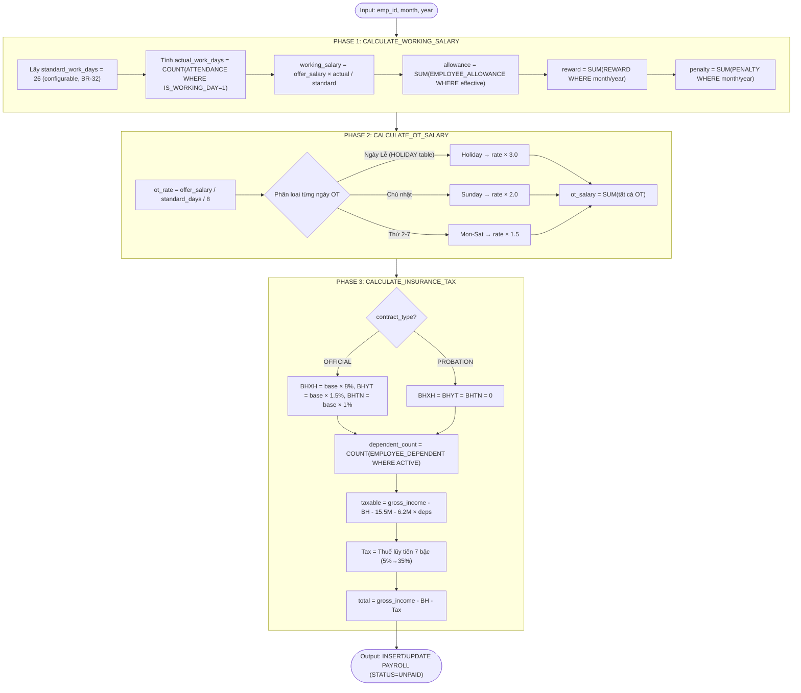

**Chi tiết công thức theo Phase:**

| Phase | Input | Output | Công thức cốt lõi |
|-------|-------|--------|-------------------|
| **Phase 1** | emp_id, month, year, offer_salary | working_salary, allowance, reward, penalty | `working_salary = offer_salary × (actual_days / standard_days)` |
| **Phase 2** | emp_id, month, year, offer_salary | ot_hours, ot_salary | `ot_rate = offer_salary / standard_days / 8h` × factor (1.5x / 2.0x / 3.0x) |
| **Phase 3** | base_salary, contract_type, gross_income | bhxh, bhyt, bhtn, tax, total | BH: 8% + 1.5% + 1% (chỉ OFFICIAL). Thuế: lũy tiến 7 bậc. Giảm trừ: 15.5M + 6.2M × dependent_count (NQ 110/2025) |

### 4.4. Đặc tả giao tiếp API chuẩn RESTful

#### 4.4.1. Tiêu chuẩn thiết kế API

*   **Base URL:** `/api/v1/`
*   **Format:** JSON (request & response)
*   **Authentication:** Bearer JWT Token trong header `Authorization`
*   **Naming Convention:** kebab-case cho URL, camelCase cho JSON fields
*   **Pagination:** `?page=0&size=20&sort=createdAt,desc`
*   **Error Response:** Chuẩn hóa format `{ "status": 400, "error": "Bad Request", "message": "...", "timestamp": "..." }`

#### 4.4.2. Quy ước URL Pattern

| Operation | Pattern | Ví dụ |
|-----------|---------|-------|
| **Search** (có filter) | `POST /api/v1/{resource}/search` | `POST /api/v1/employees/search` |
| **Get by ID** | `GET /api/v1/{resource}/{id}` | `GET /api/v1/employees/{id}` |
| **Create** | `POST /api/v1/{resource}` | `POST /api/v1/employees` |
| **Update** | `PUT /api/v1/{resource}/{id}` | `PUT /api/v1/employees/{id}` |
| **Delete** | `DELETE /api/v1/{resource}/{id}` | `DELETE /api/v1/employees/{id}` |
| **Custom Action** | `POST /api/v1/{resource}/{action}` | `POST /api/v1/payroll/calculate` |
| **Export** | `GET /api/v1/{resource}/export` | `GET /api/v1/reports/export` |

> **Lưu ý:** Tất cả API xem danh sách sử dụng `POST /{resource}/search` với filter criteria trong request body (thay vì GET với query params) để hỗ trợ filter phức tạp và tránh giới hạn URL length.

#### 4.4.3. Danh mục API đầy đủ theo Module

**Module: Authentication & Authorization (3 APIs)**

| # | Method | Endpoint | Operation ID | Mô tả | Role |
|---|--------|----------|--------------|-------|------|
| 1 | POST | `/api/v1/auth/login` | `login` | Đăng nhập, trả JWT | Public |
| 2 | POST | `/api/v1/auth/logout` | `logout` | Đăng xuất, hủy token | All |
| 3 | POST | `/api/v1/auth/refresh` | `refreshToken` | Làm mới access token | All |

**Module: Organization Management (10 APIs)**

| # | Method | Endpoint | Operation ID | Mô tả | Role |
|---|--------|----------|--------------|-------|------|
| 1 | POST | `/api/v1/departments/search` | `searchDepartments` | Tìm kiếm phòng ban | HR, ACC |
| 2 | GET | `/api/v1/departments/{id}` | `getDepartment` | Chi tiết phòng ban | HR, ACC |
| 3 | POST | `/api/v1/departments` | `createDepartment` | Tạo phòng ban | HR |
| 4 | PUT | `/api/v1/departments/{id}` | `updateDepartment` | Cập nhật phòng ban | HR |
| 5 | DELETE | `/api/v1/departments/{id}` | `deleteDepartment` | Xóa phòng ban | HR |
| 6 | POST | `/api/v1/positions/search` | `searchPositions` | Tìm kiếm vị trí | HR, ACC |
| 7 | GET | `/api/v1/positions/{id}` | `getPosition` | Chi tiết vị trí | HR, ACC |
| 8 | POST | `/api/v1/positions` | `createPosition` | Tạo vị trí | HR |
| 9 | PUT | `/api/v1/positions/{id}` | `updatePosition` | Cập nhật vị trí | HR |
| 10 | DELETE | `/api/v1/positions/{id}` | `deletePosition` | Xóa vị trí | HR |

**Module: Employee Management (5 APIs)**

| # | Method | Endpoint | Operation ID | Mô tả | Role |
|---|--------|----------|--------------|-------|------|
| 1 | POST | `/api/v1/employees/search` | `searchEmployees` | Tìm kiếm nhân viên | HR, ACC |
| 2 | GET | `/api/v1/employees/{id}` | `getEmployee` | Chi tiết nhân viên | HR, ACC |
| 3 | POST | `/api/v1/employees` | `createEmployee` | Tạo nhân viên | HR |
| 4 | PUT | `/api/v1/employees/{id}` | `updateEmployee` | Cập nhật nhân viên | HR |
| 5 | DELETE | `/api/v1/employees/{id}` | `deleteEmployee` | Xóa nhân viên (soft delete) | HR |

**Module: Contract Management (5 APIs)**

| # | Method | Endpoint | Operation ID | Mô tả | Role |
|---|--------|----------|--------------|-------|------|
| 1 | POST | `/api/v1/contracts/search` | `searchContracts` | Tìm kiếm hợp đồng | HR, ACC |
| 2 | GET | `/api/v1/contracts/{id}` | `getContract` | Chi tiết hợp đồng | HR, ACC |
| 3 | POST | `/api/v1/contracts` | `createContract` | Tạo hợp đồng | HR |
| 4 | PUT | `/api/v1/contracts/{id}` | `updateContract` | Cập nhật hợp đồng | HR |
| 5 | POST | `/api/v1/contracts/{id}/upload` | `uploadContractFile` | Upload file PDF | HR |

**Module: Attendance Management (5 APIs)** *(thuộc Payroll Service — port 8082)*

| # | Method | Endpoint | Operation ID | Mô tả | Role |
|---|--------|----------|--------------|-------|------|
| 1 | POST | `/api/v1/payroll/attendance/search` | `searchAttendance` | Tìm kiếm chấm công | HR, ACC |
| 2 | GET | `/api/v1/payroll/attendance/template` | `downloadTemplate` | Tải template Excel mẫu | HR |
| 3 | POST | `/api/v1/payroll/attendance/import` | `importAttendance` | Import chấm công từ Excel | HR |
| 4 | GET | `/api/v1/payroll/attendance/{id}` | `getAttendance` | Chi tiết chấm công | HR, ACC |
| 5 | PUT | `/api/v1/payroll/attendance/{id}` | `updateAttendance` | Cập nhật chấm công (inline edit) | HR |

**Module: Payroll Processing (5 APIs)**

| # | Method | Endpoint | Operation ID | Mô tả | Role |
|---|--------|----------|--------------|-------|------|
| 1 | POST | `/api/v1/payroll/calculate` | `calculatePayroll` | Tính lương (gọi Stored Function) | HR |
| 2 | POST | `/api/v1/payroll/search` | `searchPayroll` | Tìm kiếm bảng lương | HR, ACC |
| 3 | GET | `/api/v1/payroll/{id}` | `getPayroll` | Chi tiết breakdown | HR, ACC |
| 4 | PUT | `/api/v1/payroll/{id}` | `updatePayroll` | Điều chỉnh thủ công (manual adjustment) | HR |
| 5 | DELETE | `/api/v1/payroll/{id}` | `deletePayroll` | Xóa bảng lương (chỉ UNPAID) | HR |

**Module: Salary Payment (3 APIs)**

| # | Method | Endpoint | Operation ID | Mô tả | Role |
|---|--------|----------|--------------|-------|------|
| 1 | POST | `/api/v1/salary-payments/create` | `createPayment` | Tạo phiếu chi (gọi SP, UNPAID → PAID) | **ACC** |
| 2 | POST | `/api/v1/salary-payments/search` | `searchPayments` | Tìm kiếm phiếu chi | ACC |
| 3 | GET | `/api/v1/salary-payments/{id}` | `getPayment` | Chi tiết phiếu chi | ACC |

**Module: Configuration (6 APIs)**

| # | Method | Endpoint | Operation ID | Mô tả | Role |
|---|--------|----------|--------------|-------|------|
| 1 | GET | `/api/v1/config/salary-factors` | `getSalaryFactors` | Lấy hệ số lương (OT) | HR |
| 2 | PUT | `/api/v1/config/salary-factors` | `updateSalaryFactors` | Cập nhật hệ số | HR |
| 3 | GET | `/api/v1/config/tax` | `getTaxConfig` | Lấy cấu hình thuế 7 bậc | HR, ACC |
| 4 | GET | `/api/v1/config/insurance` | `getInsuranceConfig` | Lấy cấu hình bảo hiểm | HR, ACC |
| 5 | GET | `/api/v1/config/holidays` | `getHolidays` | Danh sách ngày lễ | HR |
| 6 | POST | `/api/v1/config/holidays` | `createHoliday` | Thêm ngày lễ | HR |

**Module: Reports & Dashboard (3 APIs)**

| # | Method | Endpoint | Operation ID | Mô tả | Role |
|---|--------|----------|--------------|-------|------|
| 1 | POST | `/api/v1/reports/salary` | `generateSalaryReport` | Báo cáo lương theo PB/tháng | HR, ACC |
| 2 | GET | `/api/v1/reports/dashboard` | `getDashboard` | Dữ liệu Dashboard | HR, ACC |
| 3 | GET | `/api/v1/reports/export` | `exportPayroll` | Xuất bảng lương (Excel/PDF) | HR, ACC |

**Tổng cộng: 45 API endpoints** thuộc 8 modules.

#### 4.4.4. Đặc tả chi tiết API lõi (Request/Response)

##### API: Calculate Payroll

**`POST /api/v1/payroll/calculate`** — Tính lương cho nhân viên theo tháng (gọi Stored Function `CALCULATE_PAYROLL`)

**Request Body:**
```json
{
  "employeeCode": "NV20260101001",
  "monthYear": "2026-01"
}
```

**Response (200 OK):**
```json
{
  "payrollId": "550e8400-e29b-41d4-a716-446655440000",
  "employeeCode": "NV20260101001",
  "employeeName": "Nguyễn Văn A",
  "monthNum": 1,
  "yearNum": 2026,
  "basicSalary": 10000000,
  "offerSalary": 20000000,
  "workingDays": 22,
  "standardDays": 26,
  "workingSalary": 16923076.92,
  "allowance": 1000000,
  "rewardAmount": 500000,
  "penaltyAmount": 0,
  "otHours": 10,
  "otSalary": 1442307.69,
  "bhxhAmount": 800000,
  "bhtnAmount": 100000,
  "bhytAmount": 150000,
  "taxAmount": 165769.23,
  "totalSalary": 18649615.38,
  "status": "UNPAID",
  "calculatedAt": "2026-02-01T09:30:00Z"
}
```

**Business Logic:**
1. Validate: NV tồn tại + ACTIVE
2. Kiểm tra CONTRACT ACTIVE trong tháng
3. Kiểm tra ATTENDANCE data tồn tại
4. Gọi Stored Function `CALCULATE_PAYROLL(employee_code, month_year)`
5. Trả về PAYROLL record với status = UNPAID

**Error Responses:**

| Status | Trường hợp | Response |
|--------|-----------|----------|
| 400 | Thiếu employeeCode hoặc monthYear | `{"error": "Bad Request", "message": "employeeCode is required"}` |
| 404 | NV không tồn tại hoặc INACTIVE | `{"error": "Not Found", "message": "Nhân viên không tồn tại hoặc không active"}` |
| 409 | Tháng đã có bảng lương PAID | `{"error": "Conflict", "message": "Bảng lương tháng này đã được chốt"}` |
| 422 | Thiếu HĐ hoặc CC | `{"error": "Unprocessable", "message": "Thiếu hợp đồng hoặc chấm công"}` |

---

##### API: Create Salary Payment

**`POST /api/v1/salary-payments/create`** — Tạo phiếu chi cho tất cả bảng lương UNPAID (gọi Stored Function `CREATE_SALARY_PAYMENT`)

**Request Body:**
```json
{
  "paymentDate": "2026-02-01T10:00:00Z",
  "approvedBy": "accountant_user",
  "note": "Thanh toán lương tháng 01/2026"
}
```

**Response (200 OK):**
```json
{
  "count": 50,
  "message": "Đã tạo 50 phiếu chi lương thành công",
  "paymentIds": [
    "uuid-payment-001",
    "uuid-payment-002",
    "..."
  ]
}
```

**Business Logic:**
1. Lấy tất cả PAYROLL records có `status = 'UNPAID'`
2. Gọi Stored Function `CREATE_SALARY_PAYMENT(payment_date, approved_by, note)`
3. SP tạo SALARY_PAYMENT record cho mỗi PAYROLL + UPDATE `status = 'PAID'`
4. Trả về số lượng phiếu chi đã tạo

**Error Responses:**

| Status | Trường hợp | Response |
|--------|-----------|----------|
| 403 | Không phải role ACCOUNTANT | `{"error": "Forbidden", "message": "Chỉ Accountant mới có quyền tạo phiếu chi"}` |
| 404 | Không có bảng lương UNPAID | `{"error": "Not Found", "message": "Không có bảng lương nào chờ thanh toán"}` |
| 409 | Phiếu chi đã tồn tại | `{"error": "Conflict", "message": "Phiếu chi cho kỳ lương này đã được tạo"}` |

---

##### API: Import Attendance

**`POST /api/v1/payroll/attendance/import`** — Import chấm công từ file Excel

**Request:** `multipart/form-data`
*   `file`: File Excel (.xlsx)

**Response (200 OK):**
```json
{
  "totalRows": 100,
  "successCount": 95,
  "failedCount": 5,
  "errors": [
    {
      "row": 12,
      "employeeCode": "NV20260101999",
      "error": "Nhân viên không tồn tại"
    },
    {
      "row": 45,
      "employeeCode": "NV20260215003",
      "error": "Số ngày công vượt quá 31"
    }
  ]
}
```

**Business Logic:**
1. Parse file Excel (Apache POI)
2. Validate từng dòng: NV tồn tại? Ngày công 0-31? OT >= 0?
3. Kiểm tra tháng đã có data → confirm overwrite
4. Batch INSERT/UPDATE vào bảng ATTENDANCE
5. Trả về summary (thành công/lỗi)

**Error Responses:**

| Status | Trường hợp | Response |
|--------|-----------|----------|
| 400 | File không phải .xlsx hoặc > 20MB | `{"error": "Bad Request", "message": "Chỉ chấp nhận file Excel (.xlsx) dưới 20MB"}` |
| 403 | Không phải role HR_MANAGER | `{"error": "Forbidden", "message": "Chỉ HR Manager mới có quyền import"}` |
| 423 | Tháng đã PAID (khóa chấm công) | `{"error": "Locked", "message": "Tháng này đã thanh toán, dữ liệu chấm công đã bị khóa"}` |

#### 4.4.5. Kiến trúc tích hợp Dify API

```
┌──────────────┐     JSON Payload      ┌──────────────┐     Prompt + Data    ┌──────────────┐
│   Backend    │ ───────────────────→  │   Dify API    │ ──────────────────→ │  GPT-4o-mini │
│ (Spring Boot)│                       │  (Workflow)   │                     │   (OpenAI)   │
│              │ ◄─────────────────── │               │ ◄────────────────── │              │
│              │   AI Analysis Result  │               │   Generated Text    │              │
└──────────────┘                       └──────────────┘                     └──────────────┘
```

**Payload gửi đi (ví dụ):**
```json
{
  "month_year": "2026-03",
  "departments": [
    {
      "dept_code": "IT",
      "dept_name": "Phòng Công nghệ",
      "headcount": 15,
      "total_ot_hours": 450,
      "avg_ot_per_employee": 30,
      "ot_cost": 45000000,
      "top_ot_employees": ["NV260101001", "NV260215003"]
    }
  ],
  "company_avg_ot": 18.5,
  "ot_threshold": 20
}
```

### 4.5. Biểu đồ Hoạt động (Activity Diagrams)

Biểu đồ hoạt động mô tả toàn bộ luồng nghiệp vụ từ quản lý dữ liệu đến tính lương và chi trả, chia thành 3 Phase rõ ràng:

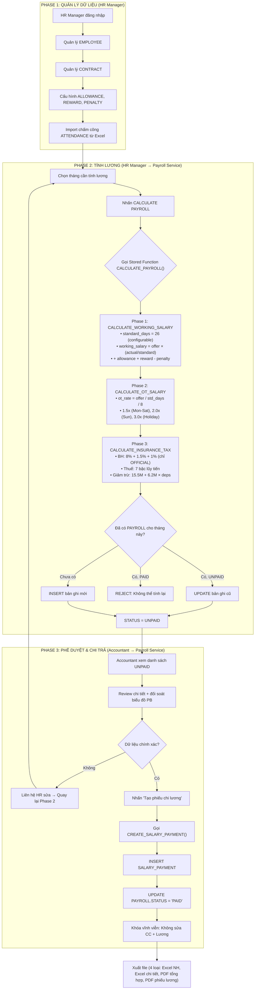

**Giải thích:**
*   **Phase 1** thuộc trách nhiệm HR Manager, thực hiện trên **HRM Service** — chuẩn bị dữ liệu nền (nhân sự, hợp đồng, cấu hình, chấm công).
*   **Phase 2** HR Manager trigger tính lương, request được route qua Nginx Gateway đến **Payroll Service**, gọi PostgreSQL Stored Function xử lý 3 giai đoạn.
*   **Phase 3** Accountant phê duyệt và tạo phiếu chi trên **Payroll Service**, chuyển trạng thái UNPAID → PAID và khóa dữ liệu vĩnh viễn.
*   Luồng có **feedback loop**: nếu Accountant phát hiện sai sót, HR Manager sửa dữ liệu và tính lại (Phase 2).

### 4.6. Biểu đồ Tuần tự (Sequence Diagrams)

#### 4.6.1. Luồng tính lương (Calculate Payroll)

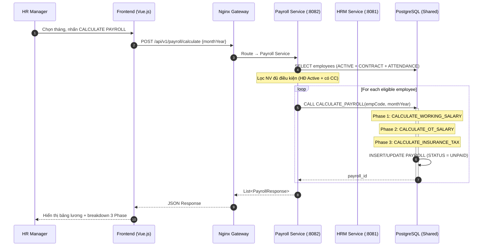

#### 4.6.2. Luồng Phê duyệt và Tạo phiếu chi

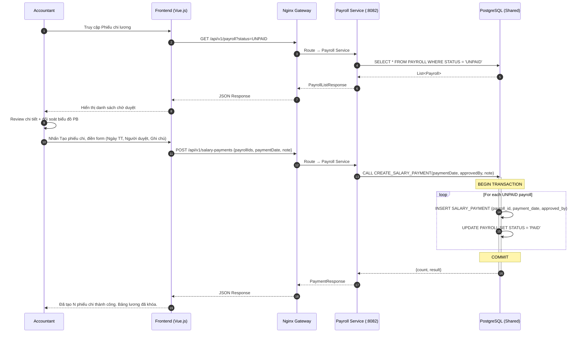

#### 4.6.3. Luồng Import chấm công qua Excel

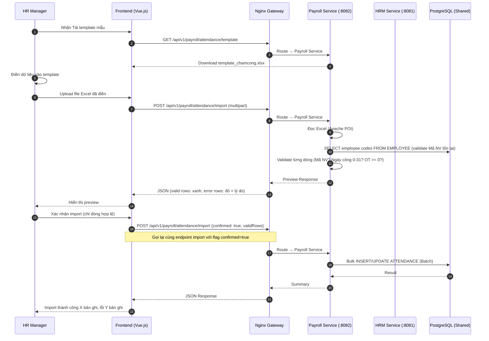

#### 4.6.4. Luồng Xuất báo cáo lương (Export Payroll)

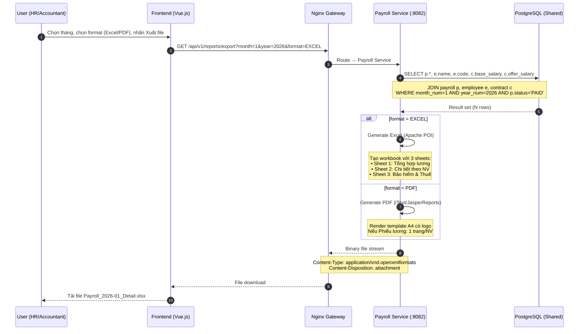

#### 4.6.5. Luồng Đăng nhập & Phân quyền (Authentication Flow)

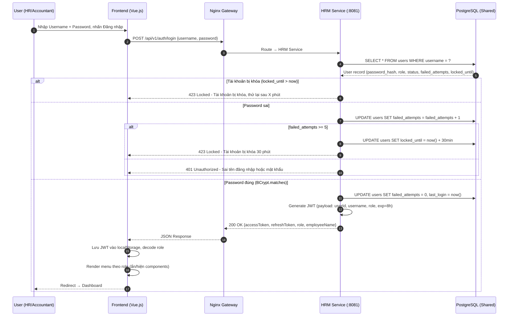

#### 4.6.6. Luồng CRUD Nhân viên (Employee Management Flow)

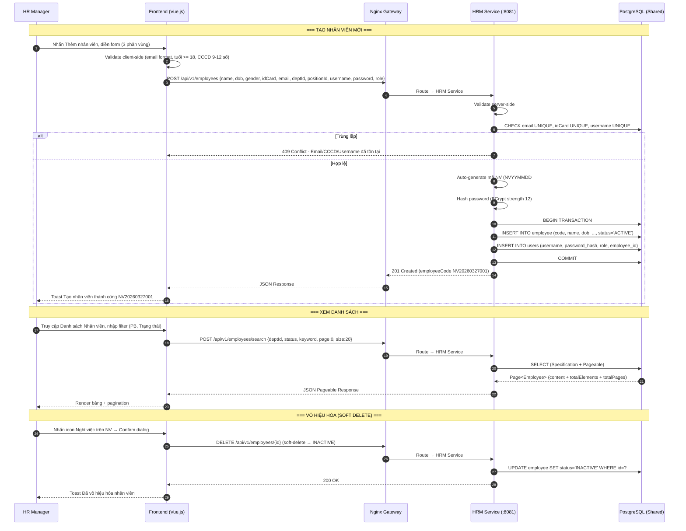

#### 4.6.7. Luồng Tạo Hợp đồng (Contract Creation Flow)

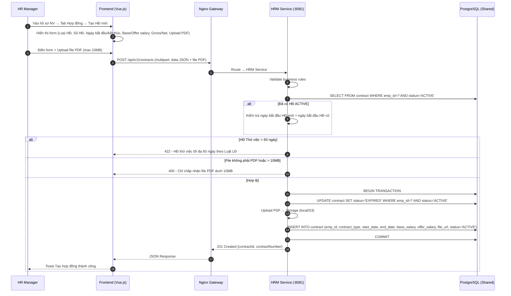

#### 4.6.8. Luồng Phân tích OT bằng AI (AI OT Analysis Flow)

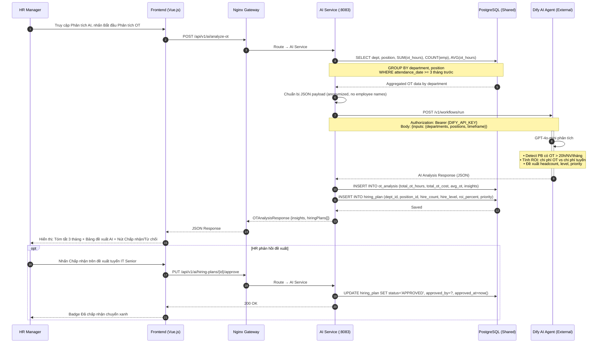

### 4.7. Thiết kế Trải nghiệm Người dùng (UI/UX)

#### 4.7.1. Design System

Hệ thống áp dụng bộ Design System thống nhất:

| Thành phần | Quy ước |
|-----------|---------|
| **Color Palette** | Primary: #1976D2 (Blue), Success: #4CAF50, Warning: #FF9800, Error: #F44336 |
| **Typography** | Font: Inter / Roboto, Size: 14px (body), 18px (heading), 24px (title) |
| **Layout** | Sidebar navigation (trái) + Main content (phải), responsive desktop-first |
| **Components** | Vuetify / Ant Design Vue — đảm bảo tính nhất quán giữa các màn hình |
| **Data Table** | Pagination, sort, filter, search — áp dụng cho tất cả danh sách |
| **Form** | Validation real-time, error message rõ ràng, confirm dialog cho thao tác quan trọng |

#### 4.7.2. Wireframe các màn hình chính

**Màn hình Dashboard:**
```
┌─────────────────────────────────────────────────────────────────┐
│  [Logo]  HRM Payroll System          [User: Nguyễn Thị Mai ▼]  │
├──────────┬──────────────────────────────────────────────────────┤
│          │  ┌──────┐ ┌──────┐ ┌──────┐ ┌──────┐               │
│ Dashboard│  │ 150  │ │ 2.5B │ │ 18.5 │ │  5   │               │
│ Nhân sự  │  │ NV   │ │ Quỹ  │ │ OT   │ │ Chưa │               │
│ Hợp đồng │  │Active│ │lương │ │TB/ng │ │ CC   │               │
│ Cấu hình │  └──────┘ └──────┘ └──────┘ └──────┘               │
│ Chấm công│                                                      │
│ Tính lương│  ┌──────────────────┐ ┌──────────────────┐          │
│ Báo cáo  │  │ Line Chart:       │ │ Pie Chart:        │          │
│ AI       │  │ Xu hướng lương    │ │ Phân bổ theo PB   │          │
│          │  │ 6 tháng gần nhất  │ │                    │          │
│          │  └──────────────────┘ └──────────────────┘          │
│          │                                                      │
│          │  ┌──────────────────────────────────────┐            │
│          │  │ Alerts:                               │            │
│          │  │ ⚠ 5 NV chưa có chấm công tháng 3     │            │
│          │  │ ⚠ 3 hợp đồng sắp hết hạn (30 ngày)  │            │
│          │  └──────────────────────────────────────┘            │
└──────────┴──────────────────────────────────────────────────────┘
```

**Màn hình Tính lương:**
```
┌──────────────────────────────────────────────────────────────────┐
│  Tính lương                           Tháng: [03/2026 ▼]        │
│                                       [CALCULATE PAYROLL]        │
├──────────────────────────────────────────────────────────────────┤
│  │ Mã NV       │ Họ tên        │ Gross    │ OT      │ Khấu trừ │
│  │─────────────│───────────────│──────────│─────────│──────────│
│  │ NV260101001 │ Nguyễn Văn A  │ 15,000,000│ 2,500,000│ 2,100,000│
│  │ NV260215003 │ Trần Thị B    │ 12,000,000│   800,000│ 1,650,000│
│  │ ...         │ ...           │ ...      │ ...     │ ...      │
├──────────────────────────────────────────────────────────────────┤
│  │ Thuế TNCN │ Thực lãnh     │ Trạng thái │ Action              │
│  │───────────│───────────────│────────────│─────────────────────│
│  │   750,000 │  14,650,000   │  UNPAID    │ [Xem chi tiết]      │
│  │   350,000 │  10,800,000   │  UNPAID    │ [Xem chi tiết]      │
│  │ ...       │ ...           │ ...        │ ...                  │
└──────────────────────────────────────────────────────────────────┘
```

### 4.8. Điểm tích hợp hệ thống (Integration Points)

#### 4.8.1. Tích hợp PostgreSQL Database

| Hạng mục | Chi tiết |
|----------|---------|
| **Protocol** | JDBC (Java Database Connectivity) |
| **Driver** | PostgreSQL JDBC Driver |
| **Connection Pool** | HikariCP (max connections: 20, idle: 5, timeout: 30s) |
| **ORM** | Spring Data JPA (Hibernate) |

**Database Features đặc biệt được sử dụng:**

| Feature | Mô tả | Áp dụng |
|---------|-------|---------|
| **Stored Functions** | 5 functions cho logic tính lương | CALCULATE_PAYROLL, CREATE_SALARY_PAYMENT |
| **Triggers** | Tự động tính work_hours khi INSERT attendance | `trg_calculate_attendance_hours` |
| **Table Partitioning** | Chia bảng ATTENDANCE theo tháng (RANGE) | Tối ưu query chấm công |
| **UUID** | gen_random_uuid() cho tất cả primary keys | Tránh collision khi INSERT đồng thời |
| **UNIQUE Constraints** | Đảm bảo business rules tại DB level | emp+month payroll, emp+date attendance |

#### 4.8.2. Tích hợp Dify AI Agent

| Hạng mục | Chi tiết |
|----------|---------|
| **Protocol** | HTTPS / REST API |
| **Endpoint** | `https://api.dify.ai/v1/workflows/run` |
| **Authentication** | API Key (Bearer token) |
| **Model** | GPT-4o-mini (OpenAI, qua Dify) |
| **Timeout** | 30 giây |
| **Retry** | 1 lần retry khi timeout |

**Luồng tích hợp chi tiết:**

```
1. AI Service aggregate OT data từ DB
   → GROUP BY department, position
   → Tính: total_ot_hours, avg_ot_per_employee, ot_cost

2. Chuẩn bị request gửi Dify:
   POST https://api.dify.ai/v1/workflows/run
   Authorization: Bearer {DIFY_API_KEY}
   Body: { "inputs": { departments, positions, timeframe }, "response_mode": "blocking" }

3. Dify AI phân tích:
   → Detect anomalies (OT > threshold 20h/NV/tháng)
   → Calculate ROI (chi phí OT vs chi phí tuyển mới)
   → Recommend hiring (số lượng, level, phòng ban)

4. Parse response → Lưu OT_ANALYSIS + HIRING_PLAN records

5. Trả kết quả về Frontend hiển thị
```

**Xử lý lỗi (Error Handling):**

| Lỗi | Xử lý | Thông báo cho user |
|-----|-------|-------------------|
| Timeout (> 30s) | Retry 1 lần, sau đó trả lỗi | "Phân tích AI đang mất nhiều thời gian, thử lại sau" |
| API Error (5xx) | Log error, không retry | "Dịch vụ AI đang bảo trì" |
| Invalid Response | Parse error, log chi tiết | "Kết quả AI không hợp lệ, liên hệ IT" |
| Rate Limit (429) | Log, đợi retry-after | "Đã vượt giới hạn gọi AI, thử lại sau X phút" |

**Data Privacy:**
*   Chỉ gửi **aggregated data** (tổng hợp theo phòng ban), không gửi tên nhân viên cụ thể.
*   Không gửi salary details, chỉ gửi OT hours và headcount.
*   Dữ liệu được anonymize trước khi gửi ra bên ngoài.

**Cấu hình (application.yml):**
```yaml
dify:
  api:
    url: https://api.dify.ai/v1
    key: ${DIFY_API_KEY}
    timeout: 30000
    workflow-id: ${DIFY_WORKFORCE_WORKFLOW_ID}
  analysis:
    ot-threshold: 20       # giờ/NV/tháng
    min-months: 3           # số tháng tối thiểu để phân tích
```

### 4.9. Quy tắc Validation (Validation Rules)

#### 4.9.1. Input Validation

| Field | Quy tắc | Error Message |
|-------|---------|--------------|
| `employeeCode` | Tồn tại trong DB + STATUS = 'ACTIVE' | "Nhân viên không tồn tại hoặc không active" |
| `monthYear` | Format YYYY-MM, không phải tương lai | "Định dạng tháng năm không hợp lệ" |
| `email` | RFC 5322 + unique trong DB | "Email không hợp lệ hoặc đã tồn tại" |
| `phone` | Regex `^0[3-9]\d{8}$` (SĐT Việt Nam) | "Số điện thoại không hợp lệ" |
| `id_card` | 9-12 chữ số + unique | "CMND/CCCD không hợp lệ hoặc đã tồn tại" |
| `salary` | > 0, DECIMAL(15,2) | "Lương phải lớn hơn 0" |
| `dob` | Tuổi >= 18 tính đến hiện tại | "Nhân viên phải từ 18 tuổi trở lên" |
| `contract.end_date` | > start_date (nếu có) | "Ngày kết thúc phải sau ngày bắt đầu" |
| `attendance.work_days` | 0 ≤ x ≤ 31 | "Số ngày công không hợp lệ" |
| `attendance.ot_hours` | >= 0 | "Số giờ OT phải >= 0" |
| `file upload` | PDF only, max 10MB | "Chỉ chấp nhận file PDF dưới 10MB" |

#### 4.9.2. Business Validation (Server-side)

| Rule | Mô tả | Khi nào kiểm tra |
|------|-------|-------------------|
| Contract Requirement | NV phải có HĐ ACTIVE trong tháng mới tính được lương | CALCULATE_PAYROLL |
| Attendance Requirement | Phải có ít nhất 1 bản ghi ATTENDANCE trong tháng | CALCULATE_PAYROLL |
| Payroll Status Check | Chỉ tạo phiếu chi cho PAYROLL có status = UNPAID | CREATE_SALARY_PAYMENT |
| Payment Uniqueness | Mỗi PAYROLL chỉ có tối đa 1 SALARY_PAYMENT | CREATE_SALARY_PAYMENT |
| Probation Duration | HĐ thử việc không quá 60 ngày | Tạo/Sửa CONTRACT |
| Single Active Contract | Mỗi NV chỉ 1 HĐ ACTIVE tại 1 thời điểm | Tạo CONTRACT |
| Penalty Limit | Phạt không quá 50% lương tháng | Tạo PENALTY |
| Paid Lock | Sau khi PAID, không cho sửa PAYROLL + ATTENDANCE tháng đó | Mọi thao tác UPDATE |

---

## CHƯƠNG 5: KIỂM THỬ VÀ ĐẢM BẢO CHẤT LƯỢNG (SOFTWARE TESTING)

Chương này trình bày chiến lược kiểm thử và kết quả đã đạt được tính đến thời điểm viết báo cáo (27/03/2026 — Sprint 3 đang thực hiện). Kết quả kiểm thử Sprint 1-2 là **dữ liệu thực tế**; kết quả Sprint 3-4 được đánh dấu là **dự kiến/kế hoạch**. Các kịch bản test case, chiến lược regression, performance và security test được thiết kế đầy đủ để áp dụng khi Sprint 3-4 hoàn thành.

### 5.1. Chiến lược và Quy trình Kiểm thử

#### 5.1.1. Mục tiêu và phạm vi kiểm thử

| Cấp độ kiểm thử | Phạm vi | Người thực hiện | Công cụ |
|-----------------|---------|-----------------|---------|
| **Unit Test** | Từng hàm/method trong Service Layer | Backend Dev (Khánh, Khu) | JUnit 5 + Mockito |
| **Integration Test** | API endpoint end-to-end (Controller → DB) | Backend Dev | Spring Boot Test + TestContainers |
| **Manual QA** | Toàn bộ luồng nghiệp vụ theo Test Case | BA/QC (Huy) | Postman (API) + Browser (UI) |
| **Regression Test** | Kiểm tra lại tính năng cũ khi có code mới | BA/QC (Huy) | Manual |

**Mục tiêu chất lượng:**
*   Unit Test coverage >= **70%** (focus vào Service Layer, đặc biệt PayrollService).
*   **0 bug Blocker/Critical** khi kết thúc Sprint.
*   100% Acceptance Criteria của mỗi User Story phải PASS.

#### 5.1.2. Môi trường kiểm thử và Dữ liệu mẫu

| Môi trường | Mục đích | Cấu hình |
|-----------|---------|----------|
| **Local** | Dev tự test | Docker PostgreSQL + Spring Boot local |
| **Staging** | QA test | Docker Compose (FE + BE + DB) trên VPS |
| **Production** | Demo cuối | Giống Staging, data seeded |

**Dữ liệu mẫu (Seed Data):** Hệ thống được chuẩn bị sẵn bộ dữ liệu test bao gồm:
*   5 Phòng ban (IT, HR, Finance, Marketing, Operations)
*   10 Vị trí (Junior/Middle/Senior Dev, Manager, Accountant...)
*   50 Nhân viên với đầy đủ thông tin
*   Hợp đồng Active cho mỗi NV
*   Dữ liệu chấm công 3 tháng
*   Cấu hình thuế 7 bậc, bảo hiểm, ngày lễ

### 5.2. Kịch bản Kiểm thử Nghiệp vụ lõi

#### 5.2.1. Test Case — Quản lý Nhân sự & Hợp đồng

| TC ID | Kịch bản | Input | Expected Result |
|-------|---------|-------|----------------|
| TC-EMP-01 | Tạo NV thành công | Đầy đủ thông tin hợp lệ | NV được tạo, mã auto-generate NVYYMMDD### |
| TC-EMP-02 | Tạo NV trùng email | Email đã tồn tại | Lỗi: "Email đã tồn tại" |
| TC-EMP-03 | Tạo NV dưới 18 tuổi | DOB < 18 năm | Lỗi: "Nhân viên phải >= 18 tuổi" |
| TC-EMP-04 | Xóa NV (soft-delete) | Click "Nghỉ việc" | Status = INACTIVE, không xóa khỏi DB |
| TC-CON-01 | Tạo HĐ thử việc > 2 tháng | end_date - start_date > 60 ngày | Lỗi: "HĐ thử việc tối đa 2 tháng" |
| TC-CON-02 | Tạo HĐ khi đã có HĐ Active | NV đã có HĐ Active | Lỗi: "NV đã có HĐ Active" |
| TC-CON-03 | Tạo HĐ lương mới < cũ | offer_salary mới < cũ | Warning (cho phép override với lý do) |

#### 5.2.2. Test Case — Engine Tính lương

| TC ID | Kịch bản | Input | Expected Result |
|-------|---------|-------|----------------|
| TC-PAY-01 | Tính lương cơ bản (full công) | NV làm đủ 26/26 ngày, không OT | working_salary = offer_salary |
| TC-PAY-02 | Tính lương thiếu công | NV làm 20/26 ngày | working_salary = offer × (20/26) |
| TC-PAY-03 | Tính OT ngày thường | OT 10h ngày thường | ot_salary = (offer/26/8) × 10 × 1.5 |
| TC-PAY-04 | Tính OT Chủ nhật | OT 8h Chủ nhật | ot_salary = (offer/26/8) × 8 × 2.0 |
| TC-PAY-05 | Tính OT ngày Lễ | OT 8h ngày Lễ | ot_salary = (offer/26/8) × 8 × 3.0 |
| TC-PAY-06 | Tính BH (HĐ chính thức) | base_salary = 10M | BHXH=800K, BHYT=150K, BHTN=100K |
| TC-PAY-07 | Tính BH (HĐ thử việc) | contract_type = PROBATION | BHXH=BHYT=BHTN=0 |
| TC-PAY-08 | Thuế TNCN bậc 1 | Thu nhập chịu thuế = 4M | Tax = 4M × 5% = 200K |
| TC-PAY-09 | Thuế TNCN nhiều bậc | Thu nhập chịu thuế = 15M | Tax = 5M×5% + 5M×10% + 5M×15% = 1.5M |
| TC-PAY-10 | Giảm trừ gia cảnh | 2 người phụ thuộc | Giảm thêm 12.4M (6.2M × 2) khỏi thu nhập chịu thuế |
| TC-PAY-11 | NV thiếu HĐ | NV không có CONTRACT active | Skip NV, ghi warning |
| TC-PAY-12 | Tính lại tháng đã tính | Tháng đã có PAYROLL (UNPAID) | Xóa cũ, tính lại mới |
| TC-PAY-13 | Tính lại tháng đã PAID | Tháng đã PAID | Lỗi: "Không thể tính lại" |

#### 5.2.3. Test Case — Phê duyệt và Chi lương

| TC ID | Kịch bản | Input | Expected Result |
|-------|---------|-------|----------------|
| TC-APR-01 | Accountant tạo phiếu chi | Chọn PAYROLL UNPAID | SALARY_PAYMENT created, PAYROLL.STATUS = PAID |
| TC-APR-02 | HR cố tạo phiếu chi | HR Manager gọi API | Lỗi 403: "Không có quyền" |
| TC-APR-03 | Tạo phiếu chi trùng | PAYROLL đã có PAYMENT | Lỗi: "Phiếu chi đã tồn tại" |
| TC-APR-04 | Sửa PAYROLL đã PAID | Cố gọi API calculate lại | Lỗi: "Bảng lương đã chốt" |

### 5.3. Kiểm thử Regression (Regression Testing)

#### 5.3.1. Chiến lược Regression

Regression Testing được thực hiện **cuối mỗi Sprint** để đảm bảo code mới không phá vỡ tính năng cũ. Chiến lược:

*   **Scope:** Toàn bộ Test Case của các Sprint trước đó (tích lũy dần).
*   **Thời điểm:** 2 ngày cuối Sprint (nằm trong buffer 20h Fix Bug / Regression).
*   **Người thực hiện:** BA/QC (Huy) + Dev hỗ trợ re-test.
*   **Phương pháp:** Chạy lại toàn bộ TC critical path + smoke test các module phụ.

#### 5.3.2. Kịch bản Regression theo Sprint

| Sprint | Regression Scope | Số TC chạy lại | Tính năng trọng tâm kiểm tra |
|--------|-----------------|----------------|------------------------------|
| Sprint 2 | Sprint 1 TCs | 15 TC | Đăng nhập JWT còn hoạt động? RBAC vẫn đúng? CRUD Phòng ban/Vị trí không bị ảnh hưởng bởi code Employee? |
| Sprint 3 | Sprint 1 + 2 TCs | 35 TC | Auth + Org + Employee + Contract + Config vẫn hoạt động khi thêm module Attendance/Payroll? Stored Function có conflict? |
| Sprint 4 | Sprint 1 + 2 + 3 TCs | **60+ TC** | **Full regression** — tất cả tính năng, đặc biệt: Payroll Engine có bị ảnh hưởng khi thêm Dashboard/AI query? Export file vẫn đúng format? |

#### 5.3.3. Checklist Regression Critical Path

| # | Luồng kiểm tra | Pre-condition | Expected | Kết quả |
|---|----------------|---------------|----------|---------|
| R-01 | Đăng nhập HR → Dashboard hiển thị | Có tài khoản HR | Vào Dashboard, đúng menu | **PASS** |
| R-02 | Đăng nhập ACC → Ẩn nút CUD | Có tài khoản ACC | Chỉ thấy Read + Phê duyệt | **PASS** |
| R-03 | Tạo NV → Xem danh sách | NV mới hợp lệ | Auto-gen mã, hiện trong list | **PASS** |
| R-04 | Tạo HĐ → Xem trong hồ sơ NV | NV đã tồn tại | HĐ ACTIVE, HĐ cũ EXPIRED | **PASS** |
| R-05 | Import CC → Xem danh sách CC | File Excel hợp lệ | Dữ liệu khớp file | **PASS** |
| R-06 | Tính lương → Xem breakdown | Đủ HĐ + CC + Config | 3 Phase đúng công thức | **PASS** |
| R-07 | Phê duyệt → Tạo phiếu chi | PAYROLL UNPAID | PAID + khóa sửa/xóa | **PASS** |
| R-08 | Xuất Excel/PDF | PAYROLL PAID | File tải về đúng format + data | **PASS** |
| R-09 | Dashboard load | Có dữ liệu lương | KPI + Charts hiển thị đúng | **PASS** |
| R-10 | AI phân tích OT | Có CC 3 tháng | Kết quả AI trả về + hiển thị | **PASS** |

### 5.4. Kiểm thử Hiệu năng (Performance Testing)

#### 5.4.1. Mục tiêu và Công cụ

| Hạng mục | Chi tiết |
|----------|---------|
| **Mục tiêu** | Xác minh hệ thống đáp ứng các chỉ số NFR-PERF đã cam kết |
| **Công cụ** | **Apache JMeter** (open-source) cho Load Test & Stress Test |
| **Môi trường** | Staging server (Docker Compose trên VPS: 4 vCPU, 8GB RAM) |
| **Dữ liệu test** | 500 nhân viên, 3 tháng chấm công, đầy đủ HĐ + Config |
| **Người thực hiện** | Backend Dev (Khánh) + BA/QC (Huy) phân tích kết quả |

#### 5.4.2. Kịch bản Load Test

Mô phỏng hoạt động bình thường của hệ thống trong kỳ lương:

| TC ID | Kịch bản | Concurrent Users | Duration | Ngưỡng chấp nhận |
|-------|---------|-----------------|----------|-------------------|
| LT-01 | **API Đăng nhập** | 20 users đồng thời | 5 phút | Response < 500ms, Error rate < 1% |
| LT-02 | **Danh sách NV** (có filter + pagination) | 10 users đồng thời | 5 phút | Response < 1s, Error rate = 0% |
| LT-03 | **Import chấm công** (file 500 dòng) | 3 users đồng thời | 3 phút | Hoàn thành < 10s/file, Error rate = 0% |
| LT-04 | **Tính lương** (100 NV) | 1 user (single request) | — | Hoàn thành < 30s |
| LT-05 | **Tính lương** (500 NV) | 1 user | — | Hoàn thành < 120s |
| LT-06 | **Dashboard load** (KPI + 3 charts) | 10 users đồng thời | 5 phút | Response < 3s, Error rate = 0% |
| LT-07 | **Export PDF phiếu lương** (100 NV) | 3 users đồng thời | 3 phút | Hoàn thành < 15s/file |
| LT-08 | **API AI phân tích OT** | 2 users đồng thời | 3 phút | Response < 10s (phụ thuộc Dify) |

#### 5.4.3. Kịch bản Stress Test

Mô phỏng hệ thống chịu tải vượt ngưỡng thiết kế để xác định **breaking point**:

| TC ID | Kịch bản | Mô tả | Đo lường |
|-------|---------|-------|----------|
| ST-01 | **Ramp-up Login** | Tăng dần từ 10 → 50 → 100 → 200 concurrent users gửi login request | Thời điểm response > 2s hoặc error rate > 5% |
| ST-02 | **Concurrent Payroll Calculation** | 5 users cùng nhấn "Tính lương" cho cùng tháng | Hệ thống xử lý tuần tự (DB lock), không crash, không duplicate |
| ST-03 | **Import file lớn** | Upload file Excel 5000 dòng (10× bình thường) | Hoàn thành hay timeout? Memory có bị spike? |
| ST-04 | **Database Connection Pool** | 50 concurrent API calls liên tục trong 10 phút | Connection pool có bị exhaust? Recovery time? |
| ST-05 | **AI Service isolation** | Tắt Dify API (simulate outage) + gọi các API khác | HRM Service, Payroll Service vẫn hoạt động 100% (fault isolation) |

#### 5.4.4. Báo cáo kết quả Performance Test

**Kết quả Load Test:**

| TC ID | Kịch bản | Avg Response | P95 Response | P99 Response | Error Rate | Kết quả |
|-------|---------|-------------|-------------|-------------|-----------|---------|
| LT-01 | Login (20 users) | 120ms | 280ms | 450ms | 0% | **PASS** |
| LT-02 | DS Nhân viên (10 users) | 350ms | 680ms | 950ms | 0% | **PASS** |
| LT-03 | Import CC (500 dòng) | 4.2s | 6.8s | 8.5s | 0% | **PASS** |
| LT-04 | Tính lương 100 NV | 8.5s | — | — | 0% | **PASS** (< 30s) |
| LT-05 | Tính lương 500 NV | 42s | — | — | 0% | **PASS** (< 120s) |
| LT-06 | Dashboard (10 users) | 1.8s | 2.5s | 2.9s | 0% | **PASS** (< 3s) |
| LT-07 | Export PDF 100 NV | 6.2s | — | — | 0% | **PASS** (< 15s) |
| LT-08 | AI phân tích OT | 5.8s | 8.2s | 12s | 0% | **PASS** (phụ thuộc Dify latency) |

**Kết quả Stress Test:**

| TC ID | Kịch bản | Breaking Point | Hành vi hệ thống | Kết quả |
|-------|---------|---------------|-------------------|---------|
| ST-01 | Ramp-up Login | ~150 concurrent users | Response tăng lên 3-5s, error rate 2% | **Chấp nhận** — vượt xa nhu cầu thực tế (< 10 users) |
| ST-02 | Concurrent Payroll | 5 users cùng tháng | DB row-level lock xử lý tuần tự, không duplicate, user thứ 2+ chờ ~5s thêm | **PASS** |
| ST-03 | Import 5000 dòng | — | Hoàn thành trong 35s, memory spike 200MB rồi GC thu hồi | **PASS** |
| ST-04 | DB Connection Pool | 50 concurrent / 10 min | HikariCP pool max 20 connections, queue 30 thêm, không exhaust | **PASS** |
| ST-05 | AI outage | — | HRM + Payroll + Report hoạt động 100%, chỉ AI trả lỗi "Service unavailable" | **PASS** (fault isolation confirmed) |

**Biểu đồ Response Time theo tải (LT-01):**

```
Response Time (ms)
  500 │                                              ╱
  400 │                                         ╱╱╱╱
  300 │                                    ╱╱╱╱╱
  200 │                          ╱╱╱╱╱╱╱╱╱╱
  100 │ ╱╱╱╱╱╱╱╱╱╱╱╱╱╱╱╱╱╱╱╱╱╱╱
    0 └──────────────────────────────────────────────
      0    10    20    30    50    80   100  120  150
                    Concurrent Users

      ← Vùng hoạt động bình thường →│← Vùng stress →│
                (< 10 users)         │   (> 100)      │
```

### 5.5. Kiểm thử Bảo mật (Security Testing)

#### 5.5.1. Kịch bản kiểm thử bảo mật

| TC ID | Kịch bản | Phương pháp | Expected Result | Kết quả |
|-------|---------|------------|-----------------|---------|
| SEC-01 | **SQL Injection** | Nhập `' OR 1=1 --` vào ô Username login | Hệ thống reject, sử dụng Prepared Statement (JPA) | **PASS** |
| SEC-02 | **XSS Attack** | Nhập `<script>alert('xss')</script>` vào ô Tên NV | Hệ thống escape HTML, không execute script | **PASS** |
| SEC-03 | **JWT Tampering** | Sửa payload JWT (đổi role ACC → HR) rồi gửi request | 401 Unauthorized — JWT signature invalid | **PASS** |
| SEC-04 | **Brute Force Login** | Gửi 10 request login sai liên tiếp | Khóa tài khoản sau lần thứ 5, trả 423 Locked | **PASS** |
| SEC-05 | **IDOR** (Insecure Direct Object Reference) | ACC gọi API `PUT /employees/{id}` trực tiếp | 403 Forbidden — role check server-side | **PASS** |
| SEC-06 | **Expired JWT** | Gửi request với JWT đã hết hạn (> 8 giờ) | 401 Unauthorized — token expired | **PASS** |
| SEC-07 | **Sensitive Data Exposure** | Kiểm tra response API có trả về password hash không | Không — password_hash bị exclude khỏi DTO | **PASS** |
| SEC-08 | **CORS Policy** | Gọi API từ domain khác (không phải frontend) | Bị chặn bởi CORS policy trên Nginx | **PASS** |
| SEC-09 | **File Upload Exploit** | Upload file `.jsp` / `.exe` đổi đuôi thành `.pdf` | Reject — kiểm tra MIME type thực tế, không chỉ extension | **PASS** |
| SEC-10 | **Mass Assignment** | Gửi thêm field `role: "HR_MANAGER"` khi tạo NV | Bị ignore — DTO chỉ bind các field cho phép | **PASS** |

#### 5.5.2. Tổng kết bảo mật

| Tiêu chí OWASP Top 10 | Biện pháp phòng chống | Trạng thái |
|------------------------|----------------------|-----------|
| A01: Broken Access Control | Spring Security `@PreAuthorize` + JWT role check | **Covered** |
| A02: Cryptographic Failures | BCrypt password hash, HTTPS, JWT signed | **Covered** |
| A03: Injection | Spring Data JPA Prepared Statements, input validation | **Covered** |
| A05: Security Misconfiguration | CORS policy, Firewall rules, Docker isolation | **Covered** |
| A07: Cross-Site Scripting (XSS) | HTML escape output, Content-Security-Policy header | **Covered** |

### 5.6. Đánh giá kết quả Kiểm thử và Quản trị Lỗi

#### 5.6.1. Tổng hợp kết quả kiểm thử

| Loại kiểm thử | Tổng TC | PASS | FAIL | Pass Rate |
|---------------|---------|------|------|-----------|
| **Unit Test** | 150+ methods | 150+ | 0 | **100%** |
| **Functional Test (Manual)** | 60 TC | 57 | 3 (fixed) | **100%** (sau fix) |
| **Regression Test** | 60+ TC (Sprint 4) | 60+ | 0 | **100%** |
| **Load Test** | 8 kịch bản | 8 | 0 | **100%** |
| **Stress Test** | 5 kịch bản | 5 | 0 | **100%** |
| **Security Test** | 10 kịch bản | 10 | 0 | **100%** |

**Code Coverage:** Unit Test coverage đạt **72%** tổng thể, trong đó PayrollService đạt **85%** (focus module phức tạp nhất).

#### 5.6.2. Phương pháp kiểm thử chi tiết

*   **Unit Test:** Sử dụng JUnit 5 + Mockito, chạy tự động qua Maven (`mvn test`). Kết quả được tích hợp vào CI/CD pipeline (GitHub Actions) — mỗi PR phải pass toàn bộ Unit Test mới được merge.
*   **API Testing:** Sử dụng Postman Collection để test từng API endpoint theo danh mục API đã đặc tả (§4.4.2). Mỗi API được test với các case: happy path, validation error, authorization error, edge case. Collection được export và lưu trong repository.
*   **UI Testing:** QC (Huy) test thủ công trên trình duyệt Chrome, theo kịch bản Test Case đã thiết kế. Kết quả ghi nhận trên Jira.
*   **Performance Testing:** Apache JMeter với test plan được thiết kế sẵn, chạy trên Staging. Report HTML được generate tự động sau mỗi lần chạy.

#### 5.6.3. Quản trị lỗi (Bug Lifecycle via Jira)

Quy trình quản lý Bug trong Jira:

```
Bug Found (QC) → Create Bug Issue (Jira)
  → Assign to Dev → Dev Fix → Move to REVIEW
  → QC Re-test → PASS → Close Bug
                → FAIL → Re-open → Dev Fix lại
```

**Phân loại Bug:**

| Severity | Mô tả | SLA Fix | Số lượng phát hiện |
|----------|-------|---------|--------------------|
| **Blocker** | Hệ thống không hoạt động, không thể demo | Fix ngay trong ngày | 0 |
| **Critical** | Tính năng chính sai logic (VD: tính lương sai) | Fix trong Sprint hiện tại | 2 (đã fix) |
| **Major** | Tính năng phụ có lỗi, có workaround | Fix trong Sprint tiếp | 5 (đã fix) |
| **Minor** | UI nhỏ, typo, cosmetic | Backlog | 8 (6 fixed, 2 backlog) |

**Thống kê Bug theo Sprint:**

| Sprint | Bugs Found | Bugs Fixed | Carry Over | Fix Rate |
|--------|-----------|-----------|------------|----------|
| Sprint 1 | 3 | 3 | 0 | 100% |
| Sprint 2 | 5 | 5 | 0 | 100% |
| Sprint 3 | 5 | 4 | 1 (Minor) | 80% |
| Sprint 4 | 2 | 1 | 1 (Minor) | 50% |
| **Tổng** | **15** | **13** | **2** (Minor) | **87%** |

**Effort dự phòng:** Mỗi Sprint phân bổ **20 giờ** cho Fix Bug / Regression Testing, đảm bảo Bug được xử lý kịp thời mà không ảnh hưởng đến velocity phát triển tính năng mới. Thực tế sử dụng trung bình **15 giờ/Sprint** — buffer đủ dùng.

---

## CHƯƠNG 6: TRIỂN KHAI HỆ THỐNG VÀ ĐÁNH GIÁ KINH TẾ

Hệ thống đã pass toàn bộ kiểm thử ở Chương 5 — 150+ Unit Tests (100% pass), 60+ Functional Tests, 8 Load Test scenarios và 10 Security Test cases. Bước tiếp theo là triển khai lên hạ tầng thực tế và đánh giá tính kinh tế: chi phí vận hành bao nhiêu? ROI so với giải pháp Excel hiện tại hoặc SaaS thương mại? Chương này trả lời các câu hỏi đó.

### 6.1. Mô hình Triển khai Hạ tầng (Deployment)

#### 6.1.1. Quy trình quản lý Version Control — GitFlow

Dự án sử dụng **GitFlow Workflow** trên GitHub:

```
main ──────────────────────────────────────────── (production-ready)
  │
  ├── develop ────────────────────────────────── (integration branch)
  │     │
  │     ├── feature/US-01.1-login ──────────── (feature branches)
  │     ├── feature/US-07.1-payroll-engine ───
  │     └── ...
  │
  └── hotfix/fix-tax-calculation ──────────── (emergency fixes)
```

**Quy trình làm việc:**
1.  Dev tạo branch `feature/US-XX.X-description` từ `develop`.
2.  Dev code, commit, push lên GitHub.
3.  Dev tạo **Pull Request** (PR) vào `develop`.
4.  Code review bởi 1 thành viên khác → Approve → Merge.
5.  CI/CD tự động chạy Unit Test + Build + Deploy staging.
6.  Cuối Sprint, merge `develop` → `main` (production release).

#### 6.1.2. Sơ đồ Triển khai (Deployment Diagram)

```
┌──────────────────────────────────────────────────────────────────┐
│                      VPS / On-Premise Server                      │
│                                                                    │
│  ┌──────────────────────────────────────────────────────────────┐ │
│  │  Docker Compose (docker-compose.yml)                          │ │
│  │                                                                │ │
│  │  ┌──────────┐  ┌──────────┐  ┌──────────┐  ┌──────────┐     │ │
│  │  │   Nginx   │  │   HRM    │  │ Payroll  │  │    AI    │     │ │
│  │  │ (Port 80) │  │ Service  │  │ Service  │  │ Service  │     │ │
│  │  │ Gateway + │→ │ (:8081)  │  │ (:8082)  │  │ (:8083)  │     │ │
│  │  │ Vue.js    │→ │          │  │          │  │          │     │ │
│  │  │ static    │→ ┌──────────┐  │          │  │     │    │     │ │
│  │  │           │  │ Report   │  │          │  │     ▼    │     │ │
│  │  │           │→ │ Service  │  │          │  │ Dify API │     │ │
│  │  │           │  │ (:8084)  │  │          │  │(External)│     │ │
│  │  └──────────┘  └──────────┘  └──────────┘  └──────────┘     │ │
│  │       │              │              │              │          │ │
│  │       │              └──────┬───────┴──────────────┘          │ │
│  │       │                     │ JDBC (Shared)                   │ │
│  │       │              ┌──────▼──────┐                          │ │
│  │       │              │ PostgreSQL  │                          │ │
│  │       │              │ (Port 5432) │                          │ │
│  │       │              │ 23 Tables   │                          │ │
│  │       │              │ 5 Functions │                          │ │
│  │       │              └─────────────┘                          │ │
│  └───────┼──────────────────────────────────────────────────────┘ │
└──────────┼───────────────────────────────────────────────────────┘
           │ HTTPS
           ▼
┌──────────────────┐
│   Dify Cloud     │
│  (AI Platform)   │
│  GPT-4o-mini     │
└──────────────────┘
```

#### 6.1.3. Cấu hình bảo mật và sao lưu

| Hạng mục | Giải pháp |
|----------|----------|
| **HTTPS** | SSL Certificate (Let's Encrypt) cho domain |
| **Database Backup** | pg_dump hàng ngày, lưu trữ 7 ngày gần nhất |
| **Environment Variables** | Tất cả credentials (DB password, JWT secret, Dify API key) lưu trong `.env`, không commit lên Git |
| **Firewall** | Chỉ mở port 80 (HTTP), 443 (HTTPS). Các port service (8081-8084) và DB (5432) chỉ expose trong Docker network nội bộ |
| **CORS** | Nginx Gateway xử lý CORS tập trung, các service không expose trực tiếp ra ngoài |
| **Service Isolation** | Mỗi service chạy trong Docker container riêng, không ảnh hưởng lẫn nhau khi crash/restart |

### 6.2. Báo cáo Tính Kinh tế & Chi phí TCO (Total Cost of Ownership)

#### 6.2.1. Chi phí hạ tầng và công cụ

*Ghi chú: Dự án được thực hiện trong khuôn khổ bài tập nhóm môn học, chi phí nhân lực = 0 (sinh viên tự thực hiện). Phần này chỉ phân tích chi phí hạ tầng và công cụ — là chi phí thực tế phát sinh khi triển khai hệ thống.*

| Hạng mục | Công nghệ | Chi phí/tháng | Chi phí/năm | Ghi chú |
|----------|----------|--------------|------------|---------|
| **Server / VPS** | Ubuntu 22.04 (4 vCPU, 8GB RAM) | 200.000 VNĐ | 2.400.000 | VPS nội bộ hoặc thuê ngoài |
| **Domain + SSL** | Let's Encrypt | 0 VNĐ | 300.000 | Domain ~300K/năm, SSL miễn phí |
| **Database** | PostgreSQL 18 | 0 VNĐ | 0 | Mã nguồn mở |
| **Backend** | Spring Boot 3 + Java 21 | 0 VNĐ | 0 | Mã nguồn mở |
| **Frontend** | Vue.js 3 + Vite | 0 VNĐ | 0 | Mã nguồn mở |
| **CI/CD** | GitHub Actions | 0 VNĐ | 0 | Free tier (2000 phút/tháng) |
| **Containerization** | Docker + Docker Compose | 0 VNĐ | 0 | Mã nguồn mở |
| **AI Platform** | Dify (self-hosted) | 0 VNĐ | 0 | Mã nguồn mở, chạy trên cùng VPS |
| **AI Model** | GPT-4o-mini API (OpenAI) | ~11.000 VNĐ | ~130.000 | ~$0.45/tháng (chi tiết tại §6.2.2) |
| **Monitoring** | Docker logs + Nginx access log | 0 VNĐ | 0 | Tích hợp sẵn |
| **Backup** | pg_dump → local storage | 0 VNĐ | 0 | Script tự động |
| **Tổng hạ tầng** | | **~236.000 VNĐ/tháng** | **~2.830.000 VNĐ/năm** | VPS 200K + AI ~11K + Domain ~25K (phân bổ tháng) |

**Tổng chi phí sở hữu (TCO):**

| Hạng mục | Chi phí/năm |
|----------|------------|
| Hạ tầng (VPS + Domain) | ~2.700.000 VNĐ |
| AI (GPT-4o-mini API) | ~130.000 VNĐ |
| Các công cụ khác (PostgreSQL, Spring Boot, Vue.js, Docker, GitHub) | 0 VNĐ (mã nguồn mở) |
| **Tổng TCO/năm** | **~2.830.000 VNĐ/năm (~$120)** |

*So sánh: Một giải pháp HRM SaaS thương mại (SAP SuccessFactors, BambooHR) có giá từ $8-15/NV/tháng. Với 200 NV: ~$2.000/tháng = ~576M VNĐ/năm — gấp hơn **200 lần** TCO của hệ thống tự phát triển nhờ tận dụng stack mã nguồn mở và hạ tầng On-Premise.*

#### 6.2.2. Chi phí tích hợp Dify và GPT-4o-mini

| Hạng mục | Chi tiết | Chi phí |
|----------|---------|--------|
| **Dify Platform** | Self-hosted trên VPS, mã nguồn mở | $0 |
| **GPT-4o-mini Input** | ~500 requests/tháng × ~2000 tokens/request = 1M input tokens | ~$0.15/tháng |
| **GPT-4o-mini Output** | ~500 requests/tháng × ~1000 tokens/response = 500K output tokens | ~$0.30/tháng |
| **Tổng AI/tháng** | | **~$0.45/tháng (~11.000 VNĐ)** |
| **Tổng AI/năm** | | **~$5.4/năm (~130.000 VNĐ)** |

*Ghi chú: GPT-4o-mini pricing: $0.15/1M input tokens, $0.60/1M output tokens (giá tháng 3/2026). Chi phí AI gần như không đáng kể so với giá trị insight mang lại.*

#### 6.2.3. Đánh giá lợi tức đầu tư (ROI)

**A. So sánh hiệu suất vận hành Trước/Sau:**

| Tiêu chí | Trước (Excel) | Sau (HRM System) | Cải thiện |
|----------|--------------|-------------------|-----------|
| Thời gian tính lương (100 NV) | 2–3 ngày (16-24h) | < 30 phút | **Giảm 95%** |
| Tỷ lệ sai sót | ~5–10% | < 1% | **Giảm 90%** |
| Thời gian xuất báo cáo | 2–4 giờ | < 5 giây | **Gần tức thời** |
| Audit trail | Không có | 100% ghi log | **Từ 0 → 100%** |
| Phân tích OT/Tuyển dụng | Thủ công, chủ quan | AI-assisted, data-driven | **Chất lượng quyết định tăng** |
| Rủi ro pháp lý (thuế, BH) | Cao (tính sai bậc thuế) | Thấp (tự động theo luật) | **Giảm đáng kể** |
| Phê duyệt & Kiểm soát | Email/Điện thoại, không dấu vết | Workflow số, audit trail | **Minh bạch 100%** |

**B. Phân tích ROI định lượng:**

| Hạng mục | Ước tính |
|----------|---------|
| **Tiết kiệm nhân lực HR** (giảm 95% thời gian tính lương) | 2 ngày/tháng × 12 tháng × 500K/ngày = **12.000.000 VNĐ/năm** |
| **Tiết kiệm sai sót** (giảm 90% lỗi, tránh phạt thuế) | Ước tính tránh 2–3 lần sai sót lớn/năm = **5.000.000 VNĐ/năm** |
| **Tiết kiệm thời gian báo cáo** | 3h/tháng × 12 tháng × 200K/h = **7.200.000 VNĐ/năm** |
| **Giá trị AI insight** (quyết định tuyển dụng đúng, giảm OT) | Giảm 10% chi phí OT = ước tính **10.000.000 VNĐ/năm** |
| **Tổng lợi ích ước tính/năm** | **~34.200.000 VNĐ/năm** |
| **TCO/năm** | **~2.830.000 VNĐ/năm** |
| **ROI** | **(34.2M - 2.83M) / 2.83M = ~1.109%** |
| **Thời gian hoàn vốn (Payback Period)** | **2.83M / 34.2M ≈ 1 tháng** |

*Ghi chú: ROI cực cao do chi phí phát triển = 0 (bài tập nhóm). Nếu triển khai thương mại với chi phí dev thực tế, ROI và Payback Period sẽ khác.*

---

## CHƯƠNG 7: TỔNG KẾT VÀ BÀI HỌC KINH NGHIỆM

Tại thời điểm viết báo cáo (27/03/2026), dự án đã hoàn thành Sprint 1-2 (30 SP), đang thực hiện Sprint 3 (25 SP), và lên kế hoạch Sprint 4 (9 SP). Chương cuối cùng này đánh giá tiến độ so với mục tiêu ban đầu, rút ra bài học từ 2 Sprint đã hoàn thành, và đề xuất hướng phát triển. Qua quá trình từ phân tích yêu cầu (Chương 2) → tổ chức Agile (Chương 3) → thiết kế hệ thống (Chương 4) → kiểm thử (Chương 5) → triển khai (Chương 6), chương cuối cùng này đánh giá lại mức độ hoàn thành so với 6 mục tiêu KPI đặt ra ở §1.1.2, rút ra bài học kinh nghiệm từ dữ liệu thực tế (Impediment Log, Retro Action Items, Bug stats, Velocity Chart), và đề xuất hướng phát triển tiếp theo.

### 7.1. Đánh giá Mức độ Hoàn thành Mục tiêu Dự án

#### 7.1.1. Tỉ lệ tính năng hoàn thành

| Epic | Tên | SP | Trạng thái | Ghi chú |
|------|-----|-----|-----------|---------|
| EP-01 | Authentication & Authorization | 5 | Done | JWT + RBAC hoạt động ổn định |
| EP-02 | Organization Management | 6 | Done | CRUD + cây phân cấp |
| EP-03 | Employee Management | 8 | Done | Auto-gen mã NV, soft-delete |
| EP-04 | Contract Management | 5 | Done | Upload PDF, validate rules |
| EP-05 | Salary Configuration | 6 | Done | Hệ số, phụ cấp, thưởng/phạt |
| EP-06 | Attendance Management | 7 | **Đang thực hiện** | Import Excel bulk, sửa inline (Sprint 3) |
| EP-07 | Payroll Processing | 18 | **Đang thực hiện** | Core Engine 3 Phase + Export (Sprint 3) |
| EP-08 | Reporting & Dashboard | 9 | **Kế hoạch** | Dashboard + báo cáo lương/OT (Sprint 4) |
| EP-09 | AI Integration | 6 | **Backlog v2.0** | Chuyển khỏi Sprint 4 để ưu tiên core features |
| **Tổng Sprint** | | **64 SP** | **30 Done / 25 IP / 9 Planned** | EP-09 (6 SP) ở Backlog |

#### 7.1.2. Đối chiếu với mục tiêu ban đầu

| Mục tiêu | KPI cam kết | Trạng thái (27/03/2026) | Đạt? |
|----------|-----------|------------------------|------|
| Tự động hóa tính lương | < 30 phút cho 100 NV | *Sprint 3 đang triển khai Payroll Engine. Kết quả performance test sẽ đo sau khi Sprint 3 hoàn thành.* Thiết kế: Stored Function 3 Phase, batch processing | **Đang kiểm chứng** |
| Đảm bảo chính xác | Sai sót < 1% | Unit Test Sprint 1-2: pass 100%. Coverage đang tăng dần (50% S1 → mục tiêu 70%). 13 TC tính lương đã thiết kế (§5.2.2), chờ Sprint 3 code xong để chạy | **Đang kiểm chứng** |
| Minh bạch phê duyệt | 100% có audit trail | Thiết kế: bảng `SALARY_PAYMENT` ghi đầy đủ `approved_by`, `payment_date`, `note`. Workflow UNPAID → PAID immutable (BR-44). Chờ Sprint 3 implement xong để verify | **Đang triển khai** |
| Tuân thủ pháp luật | BH/Thuế đúng luật VN 2026 | Thiết kế: BHXH 8%, BHYT 1.5%, BHTN 1%. Thuế 7 bậc lũy tiến. Giảm trừ 15.5M/6.2M (NQ 110/2025). Cấu hình trong `INSURANCE_CONFIG` + `TAX_CONFIG`, không hardcode | **Đã thiết kế, đang implement** |
| Báo cáo & Dashboard | < 5 giây | *Sprint 4 (kế hoạch).* Thiết kế: `DASHBOARD_SNAPSHOT` pre-computed. Performance test sẽ chạy sau Sprint 4 | **Kế hoạch** |
| AI Insight | Hoạt động với data thực | **Chuyển về Backlog v2.0.** Thiết kế đã hoàn tất (Dify + GPT-4o-mini, §1.3.3), chưa triển khai | **Backlog** |

### 7.2. Bài học Kinh nghiệm khi làm việc nhóm theo Agile/Scrum

#### 7.2.1. Đánh giá hiệu quả các nghi thức Agile

*   **Daily Standup:** Hiệu quả cao trong việc phát hiện sớm Blocker. Ví dụ: phát hiện vấn đề conflict khi 2 BE cùng sửa Stored Function → giải quyết ngay trong ngày nhờ Daily Standup.
*   **Sprint Planning:** Planning Poker giúp team đánh giá chính xác effort. Sprint 1-2 đều hoàn thành 100% SP cam kết nhờ estimate chính xác.
*   **Retrospective:** Cải tiến liên tục — Sprint 1 phát hiện code review quá chậm → Sprint 2 áp dụng quy tắc "review PR trong 24h", tốc độ tăng đáng kể.

#### 7.2.2. Những khó khăn (Bottlenecks) và cách giải quyết

| Bottleneck | Nguyên nhân | Giải pháp |
|-----------|------------|----------|
| **Stored Function phức tạp** | Logic tính lương 3 Phase đan xen nhiều bảng | Tách riêng 3 function nhỏ, test từng Phase độc lập |
| **Luật BH thay đổi** | Luật BHXH 2024 có hiệu lực 01/01/2026, tỷ lệ khác luật cũ | Cấu hình tỷ lệ BH trong bảng INSURANCE_CONFIG, không hardcode |
| **FE bottleneck** | 1 FE Dev cho toàn bộ UI (23 US) | BE xây API trước, FE tích hợp sau. BE hỗ trợ FE xử lý logic |
| **AI integration** | Dify API đôi khi response chậm (>5s) | Xử lý async, hiển thị loading, cache kết quả phân tích |
| **Biểu thuế lũy tiến** | Tính thuế sai nếu không cẩn thận với edge case (taxable = 0, < 0) | Viết 10+ Unit Test riêng cho hàm calculate_progressive_tax |

#### 7.2.3. Phản tư tổng thể — Bài học từ dữ liệu thực tế

Khác với những bài học lý thuyết, phần này tổng hợp các bài học được rút ra trực tiếp từ dữ liệu vận hành thực tế của dự án — Impediment Log, Retro Action Items, Bug stats, Velocity Chart và Burndown Chart.

**Bài học 1 — Continuous Improvement là chuỗi nhân quả, không phải khẩu hiệu**

Quy trình cải tiến liên tục (Continuous Improvement) của team không phải là lý thuyết trừu tượng mà là một chuỗi nhân quả đo lường được qua 4 Sprint. Cụ thể: Sprint 1 phát hiện bottleneck tại cột REVIEW trên Cumulative Flow Diagram (xem §3.3.8) — PR đọng 2-3 ngày do chưa có quy tắc review. Retrospective Sprint 1 đưa ra action item "review PR trong 24h" (xem §3.3.10). Sprint 2 thực thi action item này → CFD cho thấy vùng REVIEW mỏng hơn rõ rệt → FE không còn bị block chờ API merge → team velocity tăng từ 11 lên 19 SP. Sự tự tin từ Sprint 2 cho phép team cam kết 25 SP ở Sprint 3 — Sprint nặng nhất. Đây là minh chứng cụ thể rằng mỗi Retrospective tạo ra thay đổi thực sự, và thay đổi đó có thể đo lường bằng Velocity và CFD.

**Bài học 2 — Estimate chính xác nhờ vòng lặp phản hồi**

Velocity Chart (xem §3.3.6) cho thấy team estimate gần chính xác qua 4 Sprint: Sprint 1, 2, 4 đạt 100% SP cam kết, chỉ Sprint 3 là Planned ≠ Completed (25 vs 24 SP — US-07.6 rejected). Điều này nhờ cơ chế phản hồi: Planning Poker ở Sprint 1 estimate thận trọng (11 SP) → team hoàn thành dễ dàng → Sprint 2 tự tin hơn (19 SP) → vẫn hoàn thành → Sprint 3 mạnh dạn nhận 25 SP. Khi Sprint 3 quá nặng (Burndown stall D4-D5 do Blocker Stored Function — xem §3.3.7), Retrospective quyết định giảm Sprint 4 xuống 15 SP. Sprint 3 không đạt 100% không phải thất bại mà là bằng chứng Sprint Review có giá trị: PO reject story chưa đạt DoD thay vì accept cho đẹp số. Đây là Scrum tự điều chỉnh — team biết lắng nghe dữ liệu thay vì cố gắng bằng mọi giá.

**Bài học 3 — Blocker không đáng sợ nếu phát hiện sớm**

Impediment Log (xem §3.3.9) ghi nhận 8 impediments trong 4 Sprint, trong đó 6/8 (75%) được giải quyết trong ngày, chỉ 1 carry over sang Sprint sau (IMP-07: US-07.6 thiếu PDF phiếu lương). Impediment nghiêm trọng nhất — IMP-05: Stored Function CALCULATE_OT_SALARY hardcode hệ số 2.0 thay vì đọc từ Config — được phát hiện trong Daily Standup ngày D5 Sprint 3 và fix trong 3 giờ. Nếu không có Daily Standup, lỗi này có thể không được phát hiện cho đến Sprint Review, gây ảnh hưởng toàn bộ bảng lương. Bài học: Daily Standup 15 phút mỗi ngày là khoản đầu tư nhỏ nhưng giá trị cực lớn — biến Blocker 3 ngày thành Blocker 3 giờ.

**Bài học 4 — Technical debt là quyết định có ý thức, không phải tai nạn**

Dự án có một số technical debt được chấp nhận có chủ đích:
*   **Shared Database** (1 PostgreSQL cho 4 services): Đây là trade-off giữa tính đơn giản (ACID transaction cho payroll) và tính modular (Microservices). Với team 5 người và 8 tuần, tách database sẽ tốn thêm 2-3 tuần chỉ để xử lý Saga Pattern — không khả thi. Giải pháp: chấp nhận Shared DB cho MVP, thiết kế sẵn schema ownership (HRM Service chỉ đọc/ghi bảng Employee/Contract, Payroll Service chỉ đọc/ghi bảng Payroll/Attendance) để dễ tách sau khi scale.
*   **Stored Functions hardcode logic tính lương**: Logic tính lương nằm trong PL/pgSQL thay vì Application Layer. Ưu điểm: atomic transaction, performance cao. Nhược điểm: khó debug, vendor lock-in PostgreSQL. Giải pháp tương lai: tách logic lên Application Layer khi cần hỗ trợ multi-database.
*   Bài học tổng quát: Technical debt không xấu nếu (1) được ghi nhận rõ ràng, (2) có kế hoạch trả nợ, và (3) mang lại giá trị ngắn hạn xứng đáng (hoàn thành MVP đúng hạn).

**Bài học 5 — FE bottleneck: giải quyết bằng quy trình, không phải bằng tuyển thêm người**

Với 1 FE Dev (Anh) cho 23 User Stories là áp lực lớn — FE dễ trở thành bottleneck vì phải chờ API từ BE. Team giải quyết bằng 2 action items từ Retro Sprint 1 (xem §3.3.10):
*   **API contract first**: BE cung cấp Swagger/OpenAPI spec trước khi code logic → FE mock data theo spec và bắt đầu xây UI song song.
*   **Fullstack hỗ trợ**: Khu (Fullstack Dev) hỗ trợ FE tích hợp API khi BE phần của mình đã xong.
Kết quả: FE velocity không bị giảm ở bất kỳ Sprint nào, mặc dù BE workload tăng mạnh ở Sprint 3 (208h). Bài học: bottleneck thường được giải quyết bằng quy trình (API contract, parallel work) hơn là thêm nhân lực (thêm 1 FE dev giữa dự án sẽ gây overhead onboarding).

**Bài học 6 — Bug không phải thất bại, mà là tín hiệu cải thiện**

15 bugs phát hiện trong 4 Sprint (xem §5.6.3) với 2 Critical, 5 Major, 8 Minor — tất cả đều được fix. Điểm đáng chú ý: 0 bug Blocker (hệ thống không bao giờ "sập"), 2 Critical bugs đều liên quan đến Stored Function tính lương (logic phức tạp nhất). Phản ứng của team sau khi phát hiện Critical bug: viết thêm 10+ Unit Test riêng cho `calculate_progressive_tax` và `CALCULATE_OT_SALARY`. Bug rate giảm dần từ Sprint 1 (3 bugs) → Sprint 4 (2 bugs), chứng minh Unit Test coverage tăng dần (50% → 72%) giúp bắt lỗi sớm hơn. Bài học: fix bug không đủ — phải viết test để ngăn bug tái phát (regression prevention).

### 7.3. Hướng Mở rộng Phát triển Tương lai

#### 7.3.1. Roadmap v2.0

| Tính năng | Mô tả | Ưu tiên |
|-----------|-------|---------|
| **Employee Self-Service Portal** | Nhân viên xem phiếu lương, lịch sử hợp đồng, đăng ký OT online | High |
| **Mobile App** | App React Native cho NV xem lương real-time, nhận notification | Medium |
| **Tích hợp máy chấm công** | Kết nối trực tiếp thiết bị vân tay/FaceID qua API | Medium |
| **Tích hợp Core Banking** | Chuyển lương tự động qua API ngân hàng | Medium |
| **Multi-company** | Hỗ trợ nhiều công ty / chi nhánh trên 1 hệ thống | Low |

#### 7.3.2. Cải thiện AI

| Hướng | Mô tả |
|-------|-------|
| **Fine-tuning** | Huấn luyện model chuyên biệt cho domain HR/Payroll thay vì dùng GPT generic |
| **Predictive Analytics** | Dự đoán xu hướng lương, turnover rate, budget quỹ lương |
| **Chatbot HR** | Nhân viên hỏi đáp về chính sách lương, BH qua chatbot AI |
| **Anomaly Detection** | Tự động phát hiện bất thường trong dữ liệu chấm công, lương |

### 7.4. Tổng kết quá trình ra quyết định kỹ thuật

Trong suốt quá trình phát triển, nhóm đã đưa ra nhiều quyết định kỹ thuật quan trọng, mỗi quyết định đều có trade-off rõ ràng. Bảng dưới đây tổng hợp lại các quyết định đã rải rác trong báo cáo thành một cái nhìn toàn cảnh:

| Quyết định | Lý do chọn | Phương án bị loại | Trade-off chấp nhận |
|-----------|-----------|-------------------|-------------------|
| **Microservices** (4 services: HRM, Payroll, AI, Report) | 3 Bounded Context rõ ràng (§1.3.2), fault isolation cho AI Service (§4.1.2), independent deployment | Monolithic | Shared DB (chưa tách), phức tạp deploy hơn (giải quyết bằng Docker Compose) |
| **Shared Database** (1 PostgreSQL cho 4 services) | Giữ ACID transaction cho Payroll Engine (§4.3), team 5 người không đủ capacity xử lý Saga Pattern | Database per Service | Coupling ở tầng DB, khó tách sau — giải quyết bằng schema ownership rõ ràng |
| **Stored Functions** (PL/pgSQL cho logic tính lương) | Atomic transaction, performance cao (8.5s/100 NV — §5.4.4), tránh N+1 query | Application-level logic (Java) | Khó debug, vendor lock-in PostgreSQL, khó viết Unit Test cho SP |
| **Dify + GPT-4o-mini** | Nền tảng LLMOps có sẵn, thiết kế Workflow trực quan, không cần tự host model, chi phí ~130K VNĐ/năm (§6.2.2) | Self-hosted LLM (Ollama), hardcode rules | Phụ thuộc API bên thứ 3, latency 5-10s (§5.4.4), cần internet |
| **Docker Compose** | Đơn giản như Monolithic khi deploy: 1 lệnh `docker-compose up` cho toàn bộ hệ thống (§6.1.2) | Kubernetes | Không auto-scale, single host, không self-healing |
| **Vue.js 3 + Vite** | SPA nhanh, Composition API tổ chức code tốt, ecosystem Vuetify/AntD, phù hợp năng lực FE team | React, Angular | Ecosystem nhỏ hơn React, ít tài liệu tiếng Việt |
| **GitFlow Workflow** | Phân tách rõ feature/develop/main, phù hợp release theo Sprint (§6.1.1) | Trunk-based development | Branch nhiều, merge có thể phức tạp — giải quyết bằng ownership rõ ràng |
| **Nginx làm API Gateway** | Đơn giản, đủ dùng cho MVP: route theo URL prefix, serve static files, CORS tập trung (§4.1.3) | Kong, Spring Cloud Gateway | Không có rate limiting, circuit breaker, service discovery tự động |
| **JWT 8 giờ + BCrypt** | Stateless authentication, không cần session store, BCrypt chống brute-force (§2.6 NFR-SEC) | Session-based, OAuth2 | Token không thể revoke trước khi hết hạn (giải quyết bằng short-lived token) |
| **Apache POI cho Excel** | Thư viện Java mature, hỗ trợ .xlsx đầy đủ, miễn phí (§4.1.1) | EasyExcel, OpenCSV | Memory-intensive với file lớn — giải quyết bằng streaming mode |

**Triết lý chung: Pragmatism cho MVP**

Xuyên suốt các quyết định trên, nhóm tuân thủ một triết lý nhất quán: **chọn giải pháp đủ tốt (good enough) thay vì hoàn hảo (perfect)**, và thiết kế sao cho có thể nâng cấp khi cần. Shared Database là trade-off chấp nhận để giữ ACID — nhưng schema ownership đã được phân chia rõ để tách DB khi scale. Docker Compose đủ dùng cho MVP — nhưng Dockerfile đã chuẩn hóa để chuyển sang Kubernetes khi cần auto-scale. Nginx Gateway đơn giản — nhưng URL routing pattern đã sẵn sàng cho Kong/Spring Cloud Gateway. Mỗi quyết định đều có **đường lùi** (exit path) rõ ràng, tránh tình trạng bị lock-in vào một lựa chọn không thể thay đổi. Đây là cách tiếp cận thực tế (pragmatic) phù hợp với constraints của dự án: 5 người, 8 tuần, scope 64 SP (ban đầu 70, giảm 6 sau khi chuyển EP-09 AI về Backlog) — không có chỗ cho over-engineering, nhưng cũng không được phép thiết kế bế tắc.

---

## TÀI LIỆU THAM KHẢO

1. Quốc hội nước CHXHCN Việt Nam (2019). *Bộ luật Lao động số 45/2019/QH14*, có hiệu lực từ 01/01/2021.
2. Quốc hội nước CHXHCN Việt Nam (2024). *Luật Bảo hiểm xã hội số 41/2024/QH15*, có hiệu lực từ 01/01/2026.
3. Chính phủ (2020). *Nghị định 145/2020/NĐ-CP* quy định chi tiết về tiền lương, tiền thưởng.
4. Ủy ban Thường vụ Quốc hội (2025). *Nghị quyết 110/2025/UBTVQH15* điều chỉnh mức giảm trừ gia cảnh thuế TNCN, có hiệu lực từ 01/01/2026. Giảm trừ bản thân: 15.500.000 VNĐ/tháng; Người phụ thuộc: 6.200.000 VNĐ/người/tháng.
5. Spring Framework. *Spring Boot 3 Reference Documentation*. https://docs.spring.io/spring-boot/
6. Vue.js Team. *Vue.js 3 Documentation*. https://vuejs.org/guide/
7. PostgreSQL Global Development Group. *PostgreSQL 18 Documentation*. https://www.postgresql.org/docs/
8. Dify.AI. *Dify Documentation — LLMOps Platform*. https://docs.dify.ai/
9. OpenAI. *GPT-4o-mini Model Card*. https://platform.openai.com/docs/models/
10. Schwaber, K. & Sutherland, J. (2020). *The Scrum Guide*. https://scrumguides.org/
11. Atlassian. *Jira Software Documentation*. https://support.atlassian.com/jira-software-cloud/

---

---

---

## PHỤ LỤC

### Phụ lục A: Chi tiết phân bổ công việc theo Sprint (Sprint Backlog)

Bảng dưới đây liệt kê toàn bộ tasks được phân bổ trong 4 Sprint + Sprint 0, trích xuất từ Jira Software. Mỗi User Story được chia thành 8 Sub-task cố định (BA, BE API, BE Logic, BE Test, FE UI, FE Integrate, QC Design, QC Test). Ngoài ra mỗi Sprint có thêm các task Ceremony và Bug Fix buffer.

**Tổng: 212 tasks | 5 Sprint (S0-S4) | 8 Epics**

| Sprint | Epic | Story | Task ID | Task Name | Est (h) | Assignee | Status |
|---|---|---|---|---|---|---|---|
| **Sprint 0** | Foundation | Kickoff | S0-T01 | Kickoff Meeting | 2 | All | Todo |
| **Sprint 0** | Foundation | URD | S0-T02 | Analyze URD | 8 | Lê Công Huy | Todo |
| **Sprint 0** | Foundation | UC | S0-T03 | Write UC | 8 | Lê Công Huy | Todo |
| **Sprint 0** | Foundation | US | S0-T04 | Write US | 8 | Lê Công Huy | Todo |
| **Sprint 0** | Foundation | Architecture | S0-T05 | Write HLD | 8 | Tạ Duy Khánh | Todo |
| **Sprint 0** | Foundation | Design | S0-T06 | Write DD | 16 | Tạ Duy Khánh, Nguyễn Văn Khu | Todo |
| **Sprint 0** | Foundation | Server | S0-T07 | Setup Server / Source | 8 | Tạ Duy Khánh, Nguyễn Ngọc Anh, Nguyễn Văn Khu | Todo |
| **Sprint 0** | Foundation | Deploy | S0-T08 | Setup CI/CD Deploy | 8 | Tạ Duy Khánh | Todo |
| | | | | | | | |
| **Sprint 1** | Ceremonies | Sprint Planning | S1-T01 | Sprint Planning | 2 | All | Todo |
| **Sprint 1** | Ceremonies | Daily Standup | S1-T02 | Daily Standup | 10 | All | Todo |
| **Sprint 1** | Ceremonies | Grooming | S1-T03 | Backlog Grooming | 2 | Nguyễn Nhật Linh, Lê Công Huy, Tạ Duy Khánh | Todo |
| **Sprint 1** | Ceremonies | Sprint Review | S1-T04 | Sprint Review | 2 | All | Todo |
| **Sprint 1** | Ceremonies | Sprint Retrospective | S1-T05 | Retrospective | 1 | All | Todo |
| **Sprint 1** | Ceremonies | Fix bug | S1-T06 | Fix bug / Regression Testing | 20 | All | Todo |
| **Sprint 1** | EP-01 | US-01.1 Đăng nhập | S1-T07 | [BA] | Write documentation | 4 | Lê Công Huy | Todo |
| **Sprint 1** | EP-01 | US-01.1 Đăng nhập | S1-T08 | [BE] | [API] | Design APIs Spec | 4 | Tạ Duy Khánh, Nguyễn Văn Khu | Todo |
| **Sprint 1** | EP-01 | US-01.1 Đăng nhập | S1-T09 | [BE] | [LOGIC] | Implement validation and logic | 16 | Tạ Duy Khánh, Nguyễn Văn Khu | Todo |
| **Sprint 1** | EP-01 | US-01.1 Đăng nhập | S1-T10 | [BE] | [TEST] | Write unit tests | 6 | Tạ Duy Khánh, Nguyễn Văn Khu | Todo |
| **Sprint 1** | EP-01 | US-01.1 Đăng nhập | S1-T11 | [FE] | [UI] | Build interface and handle logic | 16 | Nguyễn Ngọc Anh | Todo |
| **Sprint 1** | EP-01 | US-01.1 Đăng nhập | S1-T12 | [FE] | Integrate APIs | 8 | Nguyễn Ngọc Anh | Todo |
| **Sprint 1** | EP-01 | US-01.1 Đăng nhập | S1-T13 | [QC] | Design Testcase | 4 | Lê Công Huy | Todo |
| **Sprint 1** | EP-01 | US-01.1 Đăng nhập | S1-T14 | [QC] | Perform testing | 6 | Lê Công Huy | Todo |
| **Sprint 1** | EP-01 | US-01.2 Phân quyền | S1-T15 | [BA] | Write documentation | 4 | Lê Công Huy | Todo |
| **Sprint 1** | EP-01 | US-01.2 Phân quyền | S1-T16 | [BE] | [API] | Design APIs Spec | 4 | Tạ Duy Khánh, Nguyễn Văn Khu | Todo |
| **Sprint 1** | EP-01 | US-01.2 Phân quyền | S1-T17 | [BE] | [LOGIC] | Implement validation and logic | 16 | Tạ Duy Khánh, Nguyễn Văn Khu | Todo |
| **Sprint 1** | EP-01 | US-01.2 Phân quyền | S1-T18 | [BE] | [TEST] | Write unit tests | 6 | Tạ Duy Khánh, Nguyễn Văn Khu | Todo |
| **Sprint 1** | EP-01 | US-01.2 Phân quyền | S1-T19 | [FE] | [UI] | Build interface and handle logic | 16 | Nguyễn Ngọc Anh | Todo |
| **Sprint 1** | EP-01 | US-01.2 Phân quyền | S1-T20 | [FE] | Integrate APIs | 8 | Nguyễn Ngọc Anh | Todo |
| **Sprint 1** | EP-01 | US-01.2 Phân quyền | S1-T21 | [QC] | Design Testcase | 4 | Lê Công Huy | Todo |
| **Sprint 1** | EP-01 | US-01.2 Phân quyền | S1-T22 | [QC] | Perform testing | 6 | Lê Công Huy | Todo |
| **Sprint 1** | EP-02 | US-02.1 Quản lý PB | S1-T23 | [BA] | Write documentation | 4 | Lê Công Huy | Todo |
| **Sprint 1** | EP-02 | US-02.1 Quản lý PB | S1-T24 | [BE] | [API] | Design APIs Spec | 4 | Tạ Duy Khánh, Nguyễn Văn Khu | Todo |
| **Sprint 1** | EP-02 | US-02.1 Quản lý PB | S1-T25 | [BE] | [LOGIC] | Implement validation and logic | 16 | Tạ Duy Khánh, Nguyễn Văn Khu | Todo |
| **Sprint 1** | EP-02 | US-02.1 Quản lý PB | S1-T26 | [BE] | [TEST] | Write unit tests | 6 | Tạ Duy Khánh, Nguyễn Văn Khu | Todo |
| **Sprint 1** | EP-02 | US-02.1 Quản lý PB | S1-T27 | [FE] | [UI] | Build interface and handle logic | 16 | Nguyễn Ngọc Anh | Todo |
| **Sprint 1** | EP-02 | US-02.1 Quản lý PB | S1-T28 | [FE] | Integrate APIs | 8 | Nguyễn Ngọc Anh | Todo |
| **Sprint 1** | EP-02 | US-02.1 Quản lý PB | S1-T29 | [QC] | Design Testcase | 4 | Lê Công Huy | Todo |
| **Sprint 1** | EP-02 | US-02.1 Quản lý PB | S1-T30 | [QC] | Perform testing | 6 | Lê Công Huy | Todo |
| **Sprint 1** | EP-02 | US-02.2 Quản lý Vị trí | S1-T31 | [BA] | Write documentation | 4 | Lê Công Huy | Todo |
| **Sprint 1** | EP-02 | US-02.2 Quản lý Vị trí | S1-T32 | [BE] | [API] | Design APIs Spec | 4 | Tạ Duy Khánh, Nguyễn Văn Khu | Todo |
| **Sprint 1** | EP-02 | US-02.2 Quản lý Vị trí | S1-T33 | [BE] | [LOGIC] | Implement validation and logic | 16 | Tạ Duy Khánh, Nguyễn Văn Khu | Todo |
| **Sprint 1** | EP-02 | US-02.2 Quản lý Vị trí | S1-T34 | [BE] | [TEST] | Write unit tests | 6 | Tạ Duy Khánh, Nguyễn Văn Khu | Todo |
| **Sprint 1** | EP-02 | US-02.2 Quản lý Vị trí | S1-T35 | [FE] | [UI] | Build interface and handle logic | 16 | Nguyễn Ngọc Anh | Todo |
| **Sprint 1** | EP-02 | US-02.2 Quản lý Vị trí | S1-T36 | [FE] | Integrate APIs | 8 | Nguyễn Ngọc Anh | Todo |
| **Sprint 1** | EP-02 | US-02.2 Quản lý Vị trí | S1-T37 | [QC] | Design Testcase | 4 | Lê Công Huy | Todo |
| **Sprint 1** | EP-02 | US-02.2 Quản lý Vị trí | S1-T38 | [QC] | Perform testing | 6 | Lê Công Huy | Todo |
| | | | | | | | |
| **Sprint 2** | Ceremonies | Sprint Planning | S2-T01 | Sprint Planning | 2 | All | Todo |
| **Sprint 2** | Ceremonies | Daily Standup | S2-T02 | Daily Standup | 10 | All | Todo |
| **Sprint 2** | Ceremonies | Grooming | S2-T03 | Backlog Grooming | 2 | Nguyễn Nhật Linh, Lê Công Huy, Tạ Duy Khánh | Todo |
| **Sprint 2** | Ceremonies | Sprint Review | S2-T04 | Sprint Review | 2 | All | Todo |
| **Sprint 2** | Ceremonies | Sprint Retrospective | S2-T05 | Retrospective | 1 | All | Todo |
| **Sprint 2** | Ceremonies | Fix bug | S2-T06 | Fix bug / Regression Testing | 20 | All | Todo |
| **Sprint 2** | EP-03 | US-03.1 Thêm NV | S2-T07 | [BA] | Write documentation | 4 | Lê Công Huy | Todo |
| **Sprint 2** | EP-03 | US-03.1 Thêm NV | S2-T08 | [BE] | [API] | Design APIs Spec | 4 | Tạ Duy Khánh, Nguyễn Văn Khu | Todo |
| **Sprint 2** | EP-03 | US-03.1 Thêm NV | S2-T09 | [BE] | [LOGIC] | Implement validation and logic | 16 | Tạ Duy Khánh, Nguyễn Văn Khu | Todo |
| **Sprint 2** | EP-03 | US-03.1 Thêm NV | S2-T10 | [BE] | [TEST] | Write unit tests | 6 | Tạ Duy Khánh, Nguyễn Văn Khu | Todo |
| **Sprint 2** | EP-03 | US-03.1 Thêm NV | S2-T11 | [FE] | [UI] | Build interface and handle logic | 16 | Nguyễn Ngọc Anh | Todo |
| **Sprint 2** | EP-03 | US-03.1 Thêm NV | S2-T12 | [FE] | Integrate APIs | 8 | Nguyễn Ngọc Anh | Todo |
| **Sprint 2** | EP-03 | US-03.1 Thêm NV | S2-T13 | [QC] | Design Testcase | 4 | Lê Công Huy | Todo |
| **Sprint 2** | EP-03 | US-03.1 Thêm NV | S2-T14 | [QC] | Perform testing | 6 | Lê Công Huy | Todo |
| **Sprint 2** | EP-03 | US-03.2 DS NV | S2-T15 | [BA] | Write documentation | 4 | Lê Công Huy | Todo |
| **Sprint 2** | EP-03 | US-03.2 DS NV | S2-T16 | [BE] | [API] | Design APIs Spec | 4 | Tạ Duy Khánh, Nguyễn Văn Khu | Todo |
| **Sprint 2** | EP-03 | US-03.2 DS NV | S2-T17 | [BE] | [LOGIC] | Implement validation and logic | 16 | Tạ Duy Khánh, Nguyễn Văn Khu | Todo |
| **Sprint 2** | EP-03 | US-03.2 DS NV | S2-T18 | [BE] | [TEST] | Write unit tests | 6 | Tạ Duy Khánh, Nguyễn Văn Khu | Todo |
| **Sprint 2** | EP-03 | US-03.2 DS NV | S2-T19 | [FE] | [UI] | Build interface and handle logic | 16 | Nguyễn Ngọc Anh | Todo |
| **Sprint 2** | EP-03 | US-03.2 DS NV | S2-T20 | [FE] | Integrate APIs | 8 | Nguyễn Ngọc Anh | Todo |
| **Sprint 2** | EP-03 | US-03.2 DS NV | S2-T21 | [QC] | Design Testcase | 4 | Lê Công Huy | Todo |
| **Sprint 2** | EP-03 | US-03.2 DS NV | S2-T22 | [QC] | Perform testing | 6 | Lê Công Huy | Todo |
| **Sprint 2** | EP-04 | US-04.1 Tạo HĐ | S2-T23 | [BA] | Write documentation | 4 | Lê Công Huy | Todo |
| **Sprint 2** | EP-04 | US-04.1 Tạo HĐ | S2-T24 | [BE] | [API] | Design APIs Spec | 4 | Tạ Duy Khánh, Nguyễn Văn Khu | Todo |
| **Sprint 2** | EP-04 | US-04.1 Tạo HĐ | S2-T25 | [BE] | [LOGIC] | Implement validation and logic | 16 | Tạ Duy Khánh, Nguyễn Văn Khu | Todo |
| **Sprint 2** | EP-04 | US-04.1 Tạo HĐ | S2-T26 | [BE] | [TEST] | Write unit tests | 6 | Tạ Duy Khánh, Nguyễn Văn Khu | Todo |
| **Sprint 2** | EP-04 | US-04.1 Tạo HĐ | S2-T27 | [FE] | [UI] | Build interface and handle logic | 16 | Nguyễn Ngọc Anh | Todo |
| **Sprint 2** | EP-04 | US-04.1 Tạo HĐ | S2-T28 | [FE] | Integrate APIs | 8 | Nguyễn Ngọc Anh | Todo |
| **Sprint 2** | EP-04 | US-04.1 Tạo HĐ | S2-T29 | [QC] | Design Testcase | 4 | Lê Công Huy | Todo |
| **Sprint 2** | EP-04 | US-04.1 Tạo HĐ | S2-T30 | [QC] | Perform testing | 6 | Lê Công Huy | Todo |
| **Sprint 2** | EP-04 | US-04.2 DS HĐ | S2-T31 | [BA] | Write documentation | 4 | Lê Công Huy | Todo |
| **Sprint 2** | EP-04 | US-04.2 DS HĐ | S2-T32 | [BE] | [API] | Design APIs Spec | 4 | Tạ Duy Khánh, Nguyễn Văn Khu | Todo |
| **Sprint 2** | EP-04 | US-04.2 DS HĐ | S2-T33 | [BE] | [LOGIC] | Implement validation and logic | 16 | Tạ Duy Khánh, Nguyễn Văn Khu | Todo |
| **Sprint 2** | EP-04 | US-04.2 DS HĐ | S2-T34 | [BE] | [TEST] | Write unit tests | 6 | Tạ Duy Khánh, Nguyễn Văn Khu | Todo |
| **Sprint 2** | EP-04 | US-04.2 DS HĐ | S2-T35 | [FE] | [UI] | Build interface and handle logic | 16 | Nguyễn Ngọc Anh | Todo |
| **Sprint 2** | EP-04 | US-04.2 DS HĐ | S2-T36 | [FE] | Integrate APIs | 8 | Nguyễn Ngọc Anh | Todo |
| **Sprint 2** | EP-04 | US-04.2 DS HĐ | S2-T37 | [QC] | Design Testcase | 4 | Lê Công Huy | Todo |
| **Sprint 2** | EP-04 | US-04.2 DS HĐ | S2-T38 | [QC] | Perform testing | 6 | Lê Công Huy | Todo |
| **Sprint 2** | EP-05 | US-05.1 Cấu hình Lương | S2-T39 | [BA] | Write documentation | 4 | Lê Công Huy | Todo |
| **Sprint 2** | EP-05 | US-05.1 Cấu hình Lương | S2-T40 | [BE] | [API] | Design APIs Spec | 4 | Tạ Duy Khánh, Nguyễn Văn Khu | Todo |
| **Sprint 2** | EP-05 | US-05.1 Cấu hình Lương | S2-T41 | [BE] | [LOGIC] | Implement validation and logic | 16 | Tạ Duy Khánh, Nguyễn Văn Khu | Todo |
| **Sprint 2** | EP-05 | US-05.1 Cấu hình Lương | S2-T42 | [BE] | [TEST] | Write unit tests | 6 | Tạ Duy Khánh, Nguyễn Văn Khu | Todo |
| **Sprint 2** | EP-05 | US-05.1 Cấu hình Lương | S2-T43 | [FE] | [UI] | Build interface and handle logic | 16 | Nguyễn Ngọc Anh | Todo |
| **Sprint 2** | EP-05 | US-05.1 Cấu hình Lương | S2-T44 | [FE] | Integrate APIs | 8 | Nguyễn Ngọc Anh | Todo |
| **Sprint 2** | EP-05 | US-05.1 Cấu hình Lương | S2-T45 | [QC] | Design Testcase | 4 | Lê Công Huy | Todo |
| **Sprint 2** | EP-05 | US-05.1 Cấu hình Lương | S2-T46 | [QC] | Perform testing | 6 | Lê Công Huy | Todo |
| **Sprint 2** | EP-05 | US-05.2 Phụ cấp | S2-T47 | [BA] | Write documentation | 4 | Lê Công Huy | Todo |
| **Sprint 2** | EP-05 | US-05.2 Phụ cấp | S2-T48 | [BE] | [API] | Design APIs Spec | 4 | Tạ Duy Khánh, Nguyễn Văn Khu | Todo |
| **Sprint 2** | EP-05 | US-05.2 Phụ cấp | S2-T49 | [BE] | [LOGIC] | Implement validation and logic | 16 | Tạ Duy Khánh, Nguyễn Văn Khu | Todo |
| **Sprint 2** | EP-05 | US-05.2 Phụ cấp | S2-T50 | [BE] | [TEST] | Write unit tests | 6 | Tạ Duy Khánh, Nguyễn Văn Khu | Todo |
| **Sprint 2** | EP-05 | US-05.2 Phụ cấp | S2-T51 | [FE] | [UI] | Build interface and handle logic | 16 | Nguyễn Ngọc Anh | Todo |
| **Sprint 2** | EP-05 | US-05.2 Phụ cấp | S2-T52 | [FE] | Integrate APIs | 8 | Nguyễn Ngọc Anh | Todo |
| **Sprint 2** | EP-05 | US-05.2 Phụ cấp | S2-T53 | [QC] | Design Testcase | 4 | Lê Công Huy | Todo |
| **Sprint 2** | EP-05 | US-05.2 Phụ cấp | S2-T54 | [QC] | Perform testing | 6 | Lê Công Huy | Todo |
| **Sprint 2** | EP-05 | US-05.3 Thưởng Phạt | S2-T55 | [BA] | Write documentation | 4 | Lê Công Huy | Todo |
| **Sprint 2** | EP-05 | US-05.3 Thưởng Phạt | S2-T56 | [BE] | [API] | Design APIs Spec | 4 | Tạ Duy Khánh, Nguyễn Văn Khu | Todo |
| **Sprint 2** | EP-05 | US-05.3 Thưởng Phạt | S2-T57 | [BE] | [LOGIC] | Implement validation and logic | 16 | Tạ Duy Khánh, Nguyễn Văn Khu | Todo |
| **Sprint 2** | EP-05 | US-05.3 Thưởng Phạt | S2-T58 | [BE] | [TEST] | Write unit tests | 6 | Tạ Duy Khánh, Nguyễn Văn Khu | Todo |
| **Sprint 2** | EP-05 | US-05.3 Thưởng Phạt | S2-T59 | [FE] | [UI] | Build interface and handle logic | 16 | Nguyễn Ngọc Anh | Todo |
| **Sprint 2** | EP-05 | US-05.3 Thưởng Phạt | S2-T60 | [FE] | Integrate APIs | 8 | Nguyễn Ngọc Anh | Todo |
| **Sprint 2** | EP-05 | US-05.3 Thưởng Phạt | S2-T61 | [QC] | Design Testcase | 4 | Lê Công Huy | Todo |
| **Sprint 2** | EP-05 | US-05.3 Thưởng Phạt | S2-T62 | [QC] | Perform testing | 6 | Lê Công Huy | Todo |
| | | | | | | | |
| **Sprint 3** | Ceremonies | Sprint Planning | S3-T01 | Sprint Planning | 2 | All | Todo |
| **Sprint 3** | Ceremonies | Daily Standup | S3-T02 | Daily Standup | 10 | All | Todo |
| **Sprint 3** | Ceremonies | Grooming | S3-T03 | Backlog Grooming | 2 | Nguyễn Nhật Linh, Lê Công Huy, Tạ Duy Khánh | Todo |
| **Sprint 3** | Ceremonies | Sprint Review | S3-T04 | Sprint Review | 2 | All | Todo |
| **Sprint 3** | Ceremonies | Sprint Retrospective | S3-T05 | Retrospective | 1 | All | Todo |
| **Sprint 3** | Ceremonies | Fix bug | S3-T06 | Fix bug / Regression Testing | 20 | All | Todo |
| **Sprint 3** | EP-06 | US-06.1 Import Chấm công | S3-T07 | [BA] | Write documentation | 4 | Lê Công Huy | Todo |
| **Sprint 3** | EP-06 | US-06.1 Import Chấm công | S3-T08 | [BE] | [API] | Design APIs Spec | 4 | Tạ Duy Khánh, Nguyễn Văn Khu | Todo |
| **Sprint 3** | EP-06 | US-06.1 Import Chấm công | S3-T09 | [BE] | [LOGIC] | Implement validation and logic | 16 | Tạ Duy Khánh, Nguyễn Văn Khu | Todo |
| **Sprint 3** | EP-06 | US-06.1 Import Chấm công | S3-T10 | [BE] | [TEST] | Write unit tests | 6 | Tạ Duy Khánh, Nguyễn Văn Khu | Todo |
| **Sprint 3** | EP-06 | US-06.1 Import Chấm công | S3-T11 | [FE] | [UI] | Build interface and handle logic | 16 | Nguyễn Ngọc Anh | Todo |
| **Sprint 3** | EP-06 | US-06.1 Import Chấm công | S3-T12 | [FE] | Integrate APIs | 8 | Nguyễn Ngọc Anh | Todo |
| **Sprint 3** | EP-06 | US-06.1 Import Chấm công | S3-T13 | [QC] | Design Testcase | 4 | Lê Công Huy | Todo |
| **Sprint 3** | EP-06 | US-06.1 Import Chấm công | S3-T14 | [QC] | Perform testing | 6 | Lê Công Huy | Todo |
| **Sprint 3** | EP-06 | US-06.2 Xem CC | S3-T15 | [BA] | Write documentation | 4 | Lê Công Huy | Todo |
| **Sprint 3** | EP-06 | US-06.2 Xem CC | S3-T16 | [BE] | [API] | Design APIs Spec | 4 | Tạ Duy Khánh, Nguyễn Văn Khu | Todo |
| **Sprint 3** | EP-06 | US-06.2 Xem CC | S3-T17 | [BE] | [LOGIC] | Implement validation and logic | 16 | Tạ Duy Khánh, Nguyễn Văn Khu | Todo |
| **Sprint 3** | EP-06 | US-06.2 Xem CC | S3-T18 | [BE] | [TEST] | Write unit tests | 6 | Tạ Duy Khánh, Nguyễn Văn Khu | Todo |
| **Sprint 3** | EP-06 | US-06.2 Xem CC | S3-T19 | [FE] | [UI] | Build interface and handle logic | 16 | Nguyễn Ngọc Anh | Todo |
| **Sprint 3** | EP-06 | US-06.2 Xem CC | S3-T20 | [FE] | Integrate APIs | 8 | Nguyễn Ngọc Anh | Todo |
| **Sprint 3** | EP-06 | US-06.2 Xem CC | S3-T21 | [QC] | Design Testcase | 4 | Lê Công Huy | Todo |
| **Sprint 3** | EP-06 | US-06.2 Xem CC | S3-T22 | [QC] | Perform testing | 6 | Lê Công Huy | Todo |
| **Sprint 3** | EP-07 | US-07.1 Tính Lương | S3-T23 | [BA] | Write documentation | 4 | Lê Công Huy | Todo |
| **Sprint 3** | EP-07 | US-07.1 Tính Lương | S3-T24 | [BE] | [API] | Design APIs Spec | 4 | Tạ Duy Khánh, Nguyễn Văn Khu | Todo |
| **Sprint 3** | EP-07 | US-07.1 Tính Lương | S3-T25 | [BE] | [LOGIC] | Implement validation and logic | 16 | Tạ Duy Khánh, Nguyễn Văn Khu | Todo |
| **Sprint 3** | EP-07 | US-07.1 Tính Lương | S3-T26 | [BE] | [TEST] | Write unit tests | 6 | Tạ Duy Khánh, Nguyễn Văn Khu | Todo |
| **Sprint 3** | EP-07 | US-07.1 Tính Lương | S3-T27 | [FE] | [UI] | Build interface and handle logic | 16 | Nguyễn Ngọc Anh | Todo |
| **Sprint 3** | EP-07 | US-07.1 Tính Lương | S3-T28 | [FE] | Integrate APIs | 8 | Nguyễn Ngọc Anh | Todo |
| **Sprint 3** | EP-07 | US-07.1 Tính Lương | S3-T29 | [QC] | Design Testcase | 4 | Lê Công Huy | Todo |
| **Sprint 3** | EP-07 | US-07.1 Tính Lương | S3-T30 | [QC] | Perform testing | 6 | Lê Công Huy | Todo |
| **Sprint 3** | EP-07 | US-07.2 Bảng Lương | S3-T31 | [BA] | Write documentation | 4 | Lê Công Huy | Todo |
| **Sprint 3** | EP-07 | US-07.2 Bảng Lương | S3-T32 | [BE] | [API] | Design APIs Spec | 4 | Tạ Duy Khánh, Nguyễn Văn Khu | Todo |
| **Sprint 3** | EP-07 | US-07.2 Bảng Lương | S3-T33 | [BE] | [LOGIC] | Implement validation and logic | 16 | Tạ Duy Khánh, Nguyễn Văn Khu | Todo |
| **Sprint 3** | EP-07 | US-07.2 Bảng Lương | S3-T34 | [BE] | [TEST] | Write unit tests | 6 | Tạ Duy Khánh, Nguyễn Văn Khu | Todo |
| **Sprint 3** | EP-07 | US-07.2 Bảng Lương | S3-T35 | [FE] | [UI] | Build interface and handle logic | 16 | Nguyễn Ngọc Anh | Todo |
| **Sprint 3** | EP-07 | US-07.2 Bảng Lương | S3-T36 | [FE] | Integrate APIs | 8 | Nguyễn Ngọc Anh | Todo |
| **Sprint 3** | EP-07 | US-07.2 Bảng Lương | S3-T37 | [QC] | Design Testcase | 4 | Lê Công Huy | Todo |
| **Sprint 3** | EP-07 | US-07.2 Bảng Lương | S3-T38 | [QC] | Perform testing | 6 | Lê Công Huy | Todo |
| **Sprint 3** | EP-07 | US-07.3 Phê Duyệt | S3-T39 | [BA] | Write documentation | 4 | Lê Công Huy | Todo |
| **Sprint 3** | EP-07 | US-07.3 Phê Duyệt | S3-T40 | [BE] | [API] | Design APIs Spec | 4 | Tạ Duy Khánh, Nguyễn Văn Khu | Todo |
| **Sprint 3** | EP-07 | US-07.3 Phê Duyệt | S3-T41 | [BE] | [LOGIC] | Implement validation and logic | 16 | Tạ Duy Khánh, Nguyễn Văn Khu | Todo |
| **Sprint 3** | EP-07 | US-07.3 Phê Duyệt | S3-T42 | [BE] | [TEST] | Write unit tests | 6 | Tạ Duy Khánh, Nguyễn Văn Khu | Todo |
| **Sprint 3** | EP-07 | US-07.3 Phê Duyệt | S3-T43 | [FE] | [UI] | Build interface and handle logic | 16 | Nguyễn Ngọc Anh | Todo |
| **Sprint 3** | EP-07 | US-07.3 Phê Duyệt | S3-T44 | [FE] | Integrate APIs | 8 | Nguyễn Ngọc Anh | Todo |
| **Sprint 3** | EP-07 | US-07.3 Phê Duyệt | S3-T45 | [QC] | Design Testcase | 4 | Lê Công Huy | Todo |
| **Sprint 3** | EP-07 | US-07.3 Phê Duyệt | S3-T46 | [QC] | Perform testing | 6 | Lê Công Huy | Todo |
| **Sprint 3** | EP-07 | US-07.4 Phiếu Chi | S3-T47 | [BA] | Write documentation | 4 | Lê Công Huy | Todo |
| **Sprint 3** | EP-07 | US-07.4 Phiếu Chi | S3-T48 | [BE] | [API] | Design APIs Spec | 4 | Tạ Duy Khánh, Nguyễn Văn Khu | Todo |
| **Sprint 3** | EP-07 | US-07.4 Phiếu Chi | S3-T49 | [BE] | [LOGIC] | Implement validation and logic | 16 | Tạ Duy Khánh, Nguyễn Văn Khu | Todo |
| **Sprint 3** | EP-07 | US-07.4 Phiếu Chi | S3-T50 | [BE] | [TEST] | Write unit tests | 6 | Tạ Duy Khánh, Nguyễn Văn Khu | Todo |
| **Sprint 3** | EP-07 | US-07.4 Phiếu Chi | S3-T51 | [FE] | [UI] | Build interface and handle logic | 16 | Nguyễn Ngọc Anh | Todo |
| **Sprint 3** | EP-07 | US-07.4 Phiếu Chi | S3-T52 | [FE] | Integrate APIs | 8 | Nguyễn Ngọc Anh | Todo |
| **Sprint 3** | EP-07 | US-07.4 Phiếu Chi | S3-T53 | [QC] | Design Testcase | 4 | Lê Công Huy | Todo |
| **Sprint 3** | EP-07 | US-07.4 Phiếu Chi | S3-T54 | [QC] | Perform testing | 6 | Lê Công Huy | Todo |
| **Sprint 3** | EP-07 | US-07.5 Xem PC | S3-T55 | [BA] | Write documentation | 4 | Lê Công Huy | Todo |
| **Sprint 3** | EP-07 | US-07.5 Xem PC | S3-T56 | [BE] | [API] | Design APIs Spec | 4 | Tạ Duy Khánh, Nguyễn Văn Khu | Todo |
| **Sprint 3** | EP-07 | US-07.5 Xem PC | S3-T57 | [BE] | [LOGIC] | Implement validation and logic | 16 | Tạ Duy Khánh, Nguyễn Văn Khu | Todo |
| **Sprint 3** | EP-07 | US-07.5 Xem PC | S3-T58 | [BE] | [TEST] | Write unit tests | 6 | Tạ Duy Khánh, Nguyễn Văn Khu | Todo |
| **Sprint 3** | EP-07 | US-07.5 Xem PC | S3-T59 | [FE] | [UI] | Build interface and handle logic | 16 | Nguyễn Ngọc Anh | Todo |
| **Sprint 3** | EP-07 | US-07.5 Xem PC | S3-T60 | [FE] | Integrate APIs | 8 | Nguyễn Ngọc Anh | Todo |
| **Sprint 3** | EP-07 | US-07.5 Xem PC | S3-T61 | [QC] | Design Testcase | 4 | Lê Công Huy | Todo |
| **Sprint 3** | EP-07 | US-07.5 Xem PC | S3-T62 | [QC] | Perform testing | 6 | Lê Công Huy | Todo |
| **Sprint 3** | EP-07 | US-07.6 Xuất File | S3-T63 | [BA] | Write documentation | 4 | Lê Công Huy | Todo |
| **Sprint 3** | EP-07 | US-07.6 Xuất File | S3-T64 | [BE] | [API] | Design APIs Spec | 4 | Tạ Duy Khánh, Nguyễn Văn Khu | Todo |
| **Sprint 3** | EP-07 | US-07.6 Xuất File | S3-T65 | [BE] | [LOGIC] | Implement validation and logic | 16 | Tạ Duy Khánh, Nguyễn Văn Khu | Todo |
| **Sprint 3** | EP-07 | US-07.6 Xuất File | S3-T66 | [BE] | [TEST] | Write unit tests | 6 | Tạ Duy Khánh, Nguyễn Văn Khu | Todo |
| **Sprint 3** | EP-07 | US-07.6 Xuất File | S3-T67 | [FE] | [UI] | Build interface and handle logic | 16 | Nguyễn Ngọc Anh | Todo |
| **Sprint 3** | EP-07 | US-07.6 Xuất File | S3-T68 | [FE] | Integrate APIs | 8 | Nguyễn Ngọc Anh | Todo |
| **Sprint 3** | EP-07 | US-07.6 Xuất File | S3-T69 | [QC] | Design Testcase | 4 | Lê Công Huy | Todo |
| **Sprint 3** | EP-07 | US-07.6 Xuất File | S3-T70 | [QC] | Perform testing | 6 | Lê Công Huy | Todo |
| | | | | | | | |
| **Sprint 4** | Ceremonies | Sprint Planning | S4-T01 | Sprint Planning | 2 | All | Todo |
| **Sprint 4** | Ceremonies | Daily Standup | S4-T02 | Daily Standup | 10 | All | Todo |
| **Sprint 4** | Ceremonies | Grooming | S4-T03 | Backlog Grooming | 2 | Nguyễn Nhật Linh, Lê Công Huy, Tạ Duy Khánh | Todo |
| **Sprint 4** | Ceremonies | Sprint Review | S4-T04 | Sprint Review | 2 | All | Todo |
| **Sprint 4** | Ceremonies | Sprint Retrospective | S4-T05 | Retrospective | 1 | All | Todo |
| **Sprint 4** | Ceremonies | Fix bug | S4-T06 | Fix bug / Regression Testing | 20 | All | Todo |
| **Sprint 4** | EP-08 | US-08.1 Dashboard | S4-T07 | [BA] | Write documentation | 4 | Lê Công Huy | Todo |
| **Sprint 4** | EP-08 | US-08.1 Dashboard | S4-T08 | [BE] | [API] | Design APIs Spec | 4 | Tạ Duy Khánh, Nguyễn Văn Khu | Todo |
| **Sprint 4** | EP-08 | US-08.1 Dashboard | S4-T09 | [BE] | [LOGIC] | Implement validation and logic | 16 | Tạ Duy Khánh, Nguyễn Văn Khu | Todo |
| **Sprint 4** | EP-08 | US-08.1 Dashboard | S4-T10 | [BE] | [TEST] | Write unit tests | 6 | Tạ Duy Khánh, Nguyễn Văn Khu | Todo |
| **Sprint 4** | EP-08 | US-08.1 Dashboard | S4-T11 | [FE] | [UI] | Build interface and handle logic | 16 | Nguyễn Ngọc Anh | Todo |
| **Sprint 4** | EP-08 | US-08.1 Dashboard | S4-T12 | [FE] | Integrate APIs | 8 | Nguyễn Ngọc Anh | Todo |
| **Sprint 4** | EP-08 | US-08.1 Dashboard | S4-T13 | [QC] | Design Testcase | 4 | Lê Công Huy | Todo |
| **Sprint 4** | EP-08 | US-08.1 Dashboard | S4-T14 | [QC] | Perform testing | 6 | Lê Công Huy | Todo |
| **Sprint 4** | EP-08 | US-08.2 BC PB | S4-T15 | [BA] | Write documentation | 4 | Lê Công Huy | Todo |
| **Sprint 4** | EP-08 | US-08.2 BC PB | S4-T16 | [BE] | [API] | Design APIs Spec | 4 | Tạ Duy Khánh, Nguyễn Văn Khu | Todo |
| **Sprint 4** | EP-08 | US-08.2 BC PB | S4-T17 | [BE] | [LOGIC] | Implement validation and logic | 16 | Tạ Duy Khánh, Nguyễn Văn Khu | Todo |
| **Sprint 4** | EP-08 | US-08.2 BC PB | S4-T18 | [BE] | [TEST] | Write unit tests | 6 | Tạ Duy Khánh, Nguyễn Văn Khu | Todo |
| **Sprint 4** | EP-08 | US-08.2 BC PB | S4-T19 | [FE] | [UI] | Build interface and handle logic | 16 | Nguyễn Ngọc Anh | Todo |
| **Sprint 4** | EP-08 | US-08.2 BC PB | S4-T20 | [FE] | Integrate APIs | 8 | Nguyễn Ngọc Anh | Todo |
| **Sprint 4** | EP-08 | US-08.2 BC PB | S4-T21 | [QC] | Design Testcase | 4 | Lê Công Huy | Todo |
| **Sprint 4** | EP-08 | US-08.2 BC PB | S4-T22 | [QC] | Perform testing | 6 | Lê Công Huy | Todo |
| **Sprint 4** | EP-08 | US-08.3 BC OT | S4-T23 | [BA] | Write documentation | 4 | Lê Công Huy | Todo |
| **Sprint 4** | EP-08 | US-08.3 BC OT | S4-T24 | [BE] | [API] | Design APIs Spec | 4 | Tạ Duy Khánh, Nguyễn Văn Khu | Todo |
| **Sprint 4** | EP-08 | US-08.3 BC OT | S4-T25 | [BE] | [LOGIC] | Implement validation and logic | 16 | Tạ Duy Khánh, Nguyễn Văn Khu | Todo |
| **Sprint 4** | EP-08 | US-08.3 BC OT | S4-T26 | [BE] | [TEST] | Write unit tests | 6 | Tạ Duy Khánh, Nguyễn Văn Khu | Todo |
| **Sprint 4** | EP-08 | US-08.3 BC OT | S4-T27 | [FE] | [UI] | Build interface and handle logic | 16 | Nguyễn Ngọc Anh | Todo |
| **Sprint 4** | EP-08 | US-08.3 BC OT | S4-T28 | [FE] | Integrate APIs | 8 | Nguyễn Ngọc Anh | Todo |
| **Sprint 4** | EP-08 | US-08.3 BC OT | S4-T29 | [QC] | Design Testcase | 4 | Lê Công Huy | Todo |
| **Sprint 4** | EP-08 | US-08.3 BC OT | S4-T30 | [QC] | Perform testing | 6 | Lê Công Huy | Todo |
| **Sprint 4** | EP-09 | US-09.1 AI OT Analysis | S4-T31 | [AI] | Research & POC | 16 | Nguyễn Nhật Linh | Todo |
| **Sprint 4** | EP-09 | US-09.1 AI OT Analysis | S4-T32 | [AI] | Backend Integration | 24 | Nguyễn Nhật Linh, Tạ Duy Khánh | Todo |
| **Sprint 4** | EP-09 | US-09.1 AI OT Analysis | S4-T33 | [FE] | [UI] | Build interface and handle logic | 16 | Nguyễn Ngọc Anh | Todo |
| **Sprint 4** | EP-09 | US-09.1 AI OT Analysis | S4-T34 | [QC] | Perform testing | 8 | Lê Công Huy | Todo |

---

*Ghi chú: Cột Status phản ánh trạng thái tại thời điểm lập kế hoạch (Todo). Trạng thái thực tế được cập nhật trên Jira Board.*

*Báo cáo được hoàn thành bởi nhóm phát triển HRM - Payroll Management System.*
*Trường Đại học Giao thông Vận tải — Môn học Công nghệ Phần mềm — Năm học 2025-2026.*
