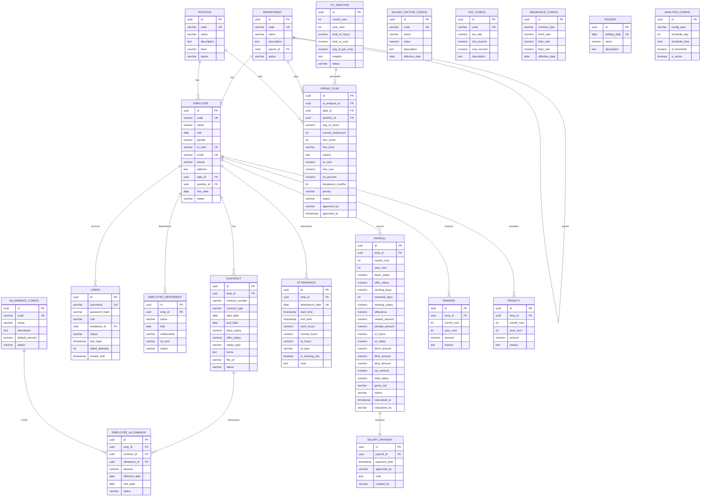

# HLD - HRM Payroll Management System

**Document Information**

| Attribute | Details |
|-----------|---------|
| **Project Name** | HRM - Payroll Management System |
| **Document Version** | 2.0 |
| **Date** | 2026-02-01 |
| **Author** | Project Manager + Backend Lead |
| **Status** | Draft |

---

## 1. Bối cảnh (Context)

### 1.1 Bối cảnh về kinh doanh (Business Context)

Hệ thống HRM - Payroll Management System là giải pháp quản lý nhân sự và tính lương tự động cho các doanh nghiệp vừa và nhỏ tại Việt Nam.

**Vấn đề hiện tại:**
- Tính lương thủ công tốn thời gian và dễ sai sót
- Khó theo dõi chấm công và tính lương tăng ca chính xác
- Thiếu công cụ quản lý bảo hiểm và thuế TNCN theo luật Việt Nam
- Không có hệ thống lưu trữ phiếu lương điện tử

**Giải pháp:**

Hệ thống cung cấp các tính năng chính:

| Tính năng | Mô tả | Vai trò thực hiện |
|-----------|-------|-------------------|
| **Quản lý nhân viên** | Quản lý thông tin cá nhân, hợp đồng, chức vụ | HR Manager |
| **Chấm công** | Ghi nhận giờ làm, giờ tăng ca tự động | HR Manager |
| **Tính lương** | Tính toán lương tự động theo công thức 3 giai đoạn | HR Manager |
| **Bảo hiểm & Thuế** | Tính BHXH, BHTN, BHYT, thuế TNCN theo luật VN | Accountant |
| **Phiếu chi lương** | Tạo và quản lý phiếu chi lương điện tử | Accountant |
| **Báo cáo** | Xuất báo cáo lương, bảo hiểm, thuế | HR Manager, Accountant |

**Quy trình nghiệp vụ chính:**

```
┌─────────────────────────────────────────────────────────────────────┐
│                    PAYROLL WORKFLOW TỔNG QUAN                       │
├─────────────────────────────────────────────────────────────────────┤
│                                                                      │
│  [HR Manager]                                                        │
│       │                                                              │
│  1. Quản lý nhân viên (EMPLOYEE, CONTRACT, POSITION, DEPARTMENT)    │
│       │                                                              │
│  2. Chấm công hàng ngày (ATTENDANCE)                                │
│       │  • Giờ làm thực tế                                          │
│       │  • Giờ tăng ca (phân loại: Ngày thường, Thứ 7, CN, Lễ)     │
│       │                                                              │
│  3. Tính lương (PAYROLL) - Gọi stored procedure                     │
│       │                                                              │
│       │  ┌──────────────────────────────────────────────┐           │
│       │  │  GIAI ĐOẠN 1: CALCULATE_WORKING_SALARY       │           │
│       │  │  • Lương theo công                           │           │
│       │  │  • Phụ cấp (ALLOWANCE)                       │           │
│       │  │  • Thưởng/Phạt (REWARD, PENALTY)             │           │
│       │  └──────────────────────────────────────────────┘           │
│       │                                                              │
│       │  ┌──────────────────────────────────────────────┐           │
│       │  │  GIAI ĐOẠN 2: CALCULATE_OT_SALARY            │           │
│       │  │  • Tính lương tăng ca                        │           │
│       │  │  • Hệ số: 1.5x, 2.0x, 3.0x                   │           │
│       │  └──────────────────────────────────────────────┘           │
│       │                                                              │
│       │  ┌──────────────────────────────────────────────┐           │
│       │  │  GIAI ĐOẠN 3: CALCULATE_INSURANCE_TAX        │           │
│       │  │  • BHXH, BHTN, BHYT (10%, 5%, 5%)            │           │
│       │  │  • Thuế TNCN (7 bậc lũy tiến)                │           │
│       │  │  • Lương thực nhận (NET)                     │           │
│       │  └──────────────────────────────────────────────┘           │
│       │                                                              │
│       │  → Kết quả: PAYROLL record (status = UNPAID)                │
│       │                                                              │
│  ═══════════════════════════════════════════════════════════════    │
│                                                                      │
│  [Accountant]                                                        │
│       │                                                              │
│  4. Tạo phiếu chi lương (SALARY_PAYMENT)                            │
│       │  • Chọn các PAYROLL records (status = UNPAID)               │
│       │  • Nhấn "CREATE PAYMENT"                                    │
│       │  • Cập nhật PAYROLL.STATUS = PAID                           │
│       │                                                              │
│  5. Xuất báo cáo                                                    │
│       │  • Báo cáo lương tháng                                      │
│       │  • Báo cáo bảo hiểm, thuế                                   │
│       │                                                              │
└─────────────────────────────────────────────────────────────────────┘
```

**Trạng thái phiếu lương:**

| Status | Mô tả | Transition |
|--------|-------|------------|
| **UNPAID** | Đã tính lương, chờ tạo phiếu chi | → PAID |
| **PAID** | Đã tạo phiếu chi, hoàn tất | - |

### 1.2 Bối cảnh về hệ thống (System Context)

#### Các thành phần Web/Mobile Applications:

| Layer | Component | Technology | Mô tả |
|-------|-----------|------------|-------|
| **WEB** | Frontend Web App | Vue.js 3 + Node.js 22 + Vite | Single Page Application (SPA) - giao diện quản lý HRM |
| **BACKEND** | Backend API | Spring Boot 3 + Java 21 | REST API xử lý business logic |
| **DATABASE** | Database | PostgreSQL 18 | Lưu trữ dữ liệu và stored functions |
| **AI AGENT** | AI Analysis Service | Dify + LLM (GPT-4) | Phân tích OT, đề xuất tuyển dụng thông minh |

#### Deployment:

| Service | Container | Mô tả |
|---------|-----------|-------|
| Frontend | Nginx (production) | Serve static files Vue.js đã build |
| Backend | Spring Boot JAR | REST API service |
| Database | PostgreSQL Docker/Standalone | Database với stored procedures |

### 1.3 Phạm vi ngoài (Out Of Scope)

| STT | Nội dung Out Of Scope | Lý do |
|-----|----------------------|-------|
| 1 | Quản lý công thức lương động | Hardcode formula theo yêu cầu khách hàng |
| 2 | Multi-company/Multi-branch | Scope MVP cho một công ty |
| 3 | Tích hợp máy chấm công sinh trắc học | Chấm công thủ công qua web |
| 4 | Tích hợp ngân hàng (chuyển lương tự động) | Xuất file, chuyển thủ công |
| 5 | Mobile app | Chỉ Web application |
| 6 | Tính lương theo dự án/task | Chỉ tính theo công và OT |
| 7 | Workflow phê duyệt phức tạp | Simple 2-state: UNPAID → PAID |

### 1.4 Các chân dung (Actors)

| Actor | Mô tả | Hành động chính |
|-------|-------|-----------------|
| **HR Manager** | Quản lý nhân sự | Quản lý nhân viên, chấm công, tính lương, xem báo cáo |
| **Accountant** | Kế toán | Tạo phiếu chi lương, quản lý bảo hiểm/thuế, xuất báo cáo |

---

## 2. Context Diagram (Mermaid)


### Giải thích các thành phần:

| Thành phần | Loại | Mô tả chi tiết |
|------------|------|----------------|
| **Frontend Web Application** | SPA (Single Page Application) | Vue.js 3 + Node.js 22 - Giao diện người dùng, chạy hoàn toàn trên browser |
| **Backend API** | REST Service | Spring Boot 3 - Xử lý business logic, gọi stored functions và AI agent |
| **PostgreSQL Database** | Relational Database | Lưu 20 tables + 5 stored functions tính lương |
| **Dify AI Agent** | External AI Service | Phân tích OT, đề xuất tuyển dụng dựa trên LLM (GPT-4) |

> **Chú thích**: SPA (Single Page Application) là ứng dụng web chạy trên một trang duy nhất, không reload page khi điều hướng, mang lại trải nghiệm mượt mà như ứng dụng desktop.

---

## 3. Core Business Workflow

### 3.1 Sequence Diagram (Mermaid)

#### 3.1.1 Luồng tính lương (Calculate Payroll)


#### 3.1.2 Luồng tạo phiếu chi lương (Create Salary Payment)


### 3.2 Activity Diagram


---

## 4. Data Model

### 4.1 ERD Overview

### 4.1 ERD Overview



> **Lưu ý**:
> - ERD hiển thị các bảng chính và relationships quan trọng với cấu trúc trường đầy đủ
> - Một số bảng phụ (REWARD, PENALTY, EMPLOYEE_DEPENDENT, etc.) không hiển thị để giữ diagram gọn gàng
> - Chi tiết đầy đủ 20 tables xem Section 4.2
> - `SALARY_PAYMENT.payroll_id` là FK và cũng là UNIQUE (mỗi payroll chỉ có 1 payment)
> - Các trường audit (created_by, updated_by, created_at, updated_at) có trong hầu hết các bảng nhưng không hiển thị hết để tránh rối
> - Bảng `OT_ANALYSIS`, `HIRING_PLAN`, `ANALYSIS_CONFIG`: Hỗ trợ AI phân tích OT và đề xuất tuyển dụng

### 4.2 Định nghĩa chi tiết theo từng bảng

#### Core Tables (7 tables):

| Bảng | Mô tả | Key Fields |
|------|-------|------------|
| **DEPARTMENT** | Phòng ban | CODE (UK), NAME, STATUS |
| **POSITION** | Chức vụ | CODE (UK), NAME, STATUS |
| **EMPLOYEE** | Nhân viên | CODE (UK), EMAIL (UK), DEPT_ID, POSITION_ID, STATUS |
| **CONTRACT** | Hợp đồng | EMP_ID (FK), START_DATE, BASE_SALARY, OFFER_SALARY, SALARY_TYPE (GROSS/NET), STATUS |
| **ATTENDANCE** | Chấm công | EMP_ID (FK), ATTENDANCE_DATE (UK), WORK_HOURS, OT_HOURS, IS_WORKING_DAY |
| **PAYROLL** | Bảng lương | EMP_ID (FK), MONTH_NUM, YEAR_NUM, TOTAL_SALARY, STATUS (UNPAID/PAID) |
| **SALARY_PAYMENT** | Phiếu chi lương | PAYROLL_ID (FK, UK), PAYMENT_DATE, APPROVED_BY |

#### Config Tables (5 tables):

| Bảng | Mô tả | Key Fields |
|------|-------|------------|
| **SALARY_FACTOR_CONFIG** | Hệ số lương (OT, OT_SUN, OT_HOL) | CODE (UK), VALUE |
| **TAX_CONFIG** | Cấu hình thuế TNCN (7 bậc) | CODE (UK), TAX_RATE, MIN_INCOME, MAX_INCOME |
| **INSURANCE_CONFIG** | Cấu hình bảo hiểm | CONTRACT_TYPE, BHXH_RATE, BHTN_RATE, BHYT_RATE |
| **ALLOWANCE_CONFIG** | Danh mục phụ cấp | CODE (UK), NAME, DESCRIPTION |
| **HOLIDAY** | Ngày lễ | HOLIDAY_DATE (UK), NAME |

#### Transaction Tables (5 tables):

| Bảng | Mô tả | Key Fields |
|------|-------|------------|
| **REWARD** | Thưởng | EMP_ID (FK), MONTH_NUM, YEAR_NUM, AMOUNT |
| **PENALTY** | Phạt | EMP_ID (FK), MONTH_NUM, YEAR_NUM, AMOUNT |
| **EMPLOYEE_DEPENDENT** | Người phụ thuộc | EMP_ID (FK), NAME, RELATIONSHIP |
| **EMPLOYEE_ALLOWANCE** | Phụ cấp nhân viên | EMP_ID (FK), CONTRACT_ID (FK), ALLOWANCE_ID (FK), AMOUNT |
| **USERS** | Users đăng nhập | USERNAME (UK), PASSWORD_HASH, ROLE (HR_MANAGER/ACCOUNTANT), EMPLOYEE_ID (FK) |

#### AI & Analytics Tables (3 tables):

| Bảng | Mô tả | Key Fields |
|------|-------|------------|
| **OT_ANALYSIS** | Kết quả phân tích OT hàng tháng | MONTH_NUM, YEAR_NUM (UK), TOTAL_OT_HOURS, INSIGHTS |
| **HIRING_PLAN** | Kế hoạch tuyển dụng đề xuất từ AI | OT_ANALYSIS_ID (FK), DEPT_ID (FK), POSITION_ID (FK), HIRE_COUNT, HIRE_LEVEL, STATUS |
| **ANALYSIS_CONFIG** | Cấu hình lịch phân tích tự động | CONFIG_TYPE, SCHEDULE_DAY, SCHEDULE_TIME, IS_ACTIVE |

### 4.3 Thông tin chi tiết từng bảng

##### Bảng: `department`

**Mô tả**: Phòng ban trong tổ chức

| Field | Type | Description | Constraints | Default |
|-------|------|-------------|-------------|---------|
| `id` | UUID | Primary key | PK, NOT NULL | gen_random_uuid() |
| `code` | VARCHAR(20) | Mã phòng ban | UNIQUE, NOT NULL | - |
| `name` | VARCHAR(100) | Tên phòng ban | NOT NULL | - |
| `description` | TEXT | Mô tả | NULLABLE | NULL |
| `parent_id` | UUID | FK đến department cha | FK, NULLABLE | NULL |
| `status` | VARCHAR(20) | Trạng thái | NOT NULL | 'ACTIVE' |
| `created_at` | TIMESTAMP | Thời điểm tạo | NOT NULL | CURRENT_TIMESTAMP |
| `created_by` | VARCHAR(100) | Username người tạo | NOT NULL | - |
| `updated_at` | TIMESTAMP | Thời điểm cập nhật | NOT NULL | CURRENT_TIMESTAMP |
| `updated_by` | VARCHAR(100) | Username người cập nhật | NOT NULL | - |

**Enum Values**:
- `status`: `ACTIVE`, `INACTIVE`

**Indexes**:
- `idx_department_code`: (code)
- `idx_department_parent`: (parent_id) WHERE parent_id IS NOT NULL

---

##### Bảng: `position`

**Mô tả**: Chức vụ/vị trí công việc

| Field | Type | Description | Constraints | Default |
|-------|------|-------------|-------------|---------|
| `id` | UUID | Primary key | PK, NOT NULL | gen_random_uuid() |
| `code` | VARCHAR(20) | Mã chức vụ | UNIQUE, NOT NULL | - |
| `name` | VARCHAR(100) | Tên chức vụ | NOT NULL | - |
| `description` | TEXT | Mô tả | NULLABLE | NULL |
| `level` | VARCHAR(20) | Cấp bậc | NOT NULL | 'JUNIOR' |
| `status` | VARCHAR(20) | Trạng thái | NOT NULL | 'ACTIVE' |
| `created_at` | TIMESTAMP | Thời điểm tạo | NOT NULL | CURRENT_TIMESTAMP |
| `created_by` | VARCHAR(100) | Username người tạo | NOT NULL | - |
| `updated_at` | TIMESTAMP | Thời điểm cập nhật | NOT NULL | CURRENT_TIMESTAMP |
| `updated_by` | VARCHAR(100) | Username người cập nhật | NOT NULL | - |

**Enum Values**:
- `level`: `JUNIOR`, `MIDDLE`, `SENIOR`
- `status`: `ACTIVE`, `INACTIVE`

**Indexes**:
- `idx_position_code`: (code)

---

#### Bảng: `employee`

**Mô tả**: Nhân viên

| Field | Type | Description | Constraints | Default |
|-------|------|-------------|-------------|---------|
| `id` | UUID | Primary key | PK, NOT NULL | gen_random_uuid() |
| `code` | VARCHAR(20) | Mã nhân viên (NVYYMMDD###) | UNIQUE, NOT NULL | - |
| `name` | VARCHAR(100) | Họ tên | NOT NULL | - |
| `dob` | DATE | Ngày sinh | NOT NULL | - |
| `gender` | VARCHAR(10) | Giới tính | NOT NULL | - |
| `id_card` | VARCHAR(12) | CMND/CCCD | UNIQUE, NOT NULL | - |
| `email` | VARCHAR(100) | Email | UNIQUE, NOT NULL | - |
| `phone` | VARCHAR(15) | Số điện thoại | NULLABLE | NULL |
| `address` | TEXT | Địa chỉ | NULLABLE | NULL |
| `dept_id` | UUID | FK đến department | FK, NOT NULL | - |
| `position_id` | UUID | FK đến position | FK, NOT NULL | - |
| `hire_date` | DATE | Ngày vào làm | NOT NULL | - |
| `status` | VARCHAR(20) | Trạng thái | NOT NULL | 'ACTIVE' |
| `created_at` | TIMESTAMP | Thời điểm tạo | NOT NULL | CURRENT_TIMESTAMP |
| `created_by` | VARCHAR(100) | Username người tạo | NOT NULL | - |
| `updated_at` | TIMESTAMP | Thời điểm cập nhật | NOT NULL | CURRENT_TIMESTAMP |
| `updated_by` | VARCHAR(100) | Username người cập nhật | NOT NULL | - |

**Enum Values**:
- `gender`: `MALE`, `FEMALE`, `OTHER`
- `status`: `ACTIVE`, `INACTIVE`

**Indexes**:
- `idx_employee_code`: (code)
- `idx_employee_email`: (email)
- `idx_employee_dept`: (dept_id)
- `idx_employee_status`: (status)

---

#### Bảng: `contract`

**Mô tả**: Hợp đồng lao động

| Field | Type | Description | Constraints | Default |
|-------|------|-------------|-------------|---------|
| `id` | UUID | Primary key | PK, NOT NULL | gen_random_uuid() |
| `emp_id` | UUID | FK đến employee | FK, NOT NULL | - |
| `contract_number` | VARCHAR(50) | Số hợp đồng | NOT NULL | - |
| `contract_type` | VARCHAR(30) | Loại hợp đồng | NOT NULL | - |
| `start_date` | DATE | Ngày bắt đầu | NOT NULL | - |
| `end_date` | DATE | Ngày kết thúc | NULLABLE | NULL |
| `base_salary` | DECIMAL(15,2) | Lương cơ bản (tính BHXH) | NOT NULL | - |
| `offer_salary` | DECIMAL(15,2) | Lương thỏa thuận (thực tế) | NOT NULL | - |
| `salary_type` | VARCHAR(10) | Loại lương | NOT NULL | 'GROSS' |
| `terms` | TEXT | Các điều khoản | NULLABLE | NULL |
| `file_url` | VARCHAR(500) | URL file PDF | NULLABLE | NULL |
| `status` | VARCHAR(20) | Trạng thái | NOT NULL | 'ACTIVE' |
| `created_at` | TIMESTAMP | Thời điểm tạo | NOT NULL | CURRENT_TIMESTAMP |
| `created_by` | VARCHAR(100) | Username người tạo | NOT NULL | - |
| `updated_at` | TIMESTAMP | Thời điểm cập nhật | NOT NULL | CURRENT_TIMESTAMP |
| `updated_by` | VARCHAR(100) | Username người cập nhật | NOT NULL | - |

**Enum Values**:
- `contract_type`: `PROBATION`, `OFFICIAL`, `SEASONAL`
- `salary_type`: `GROSS`, `NET`
- `status`: `ACTIVE`, `EXPIRED`

**Constraints**:
- `UNIQUE(emp_id, start_date)` - Không có 2 hợp đồng bắt đầu cùng ngày
- `CHECK(end_date IS NULL OR end_date >= start_date)`
- `CHECK(base_salary > 0 AND offer_salary > 0)`

**Indexes**:
- `idx_contract_emp`: (emp_id)
- `idx_contract_status`: (status)

---

#### Bảng: `attendance`

**Mô tả**: Chấm công (Partitioned by month)

| Field | Type | Description | Constraints | Default |
|-------|------|-------------|-------------|---------|
| `id` | UUID | Primary key | PK, NOT NULL | gen_random_uuid() |
| `emp_id` | UUID | FK đến employee | FK, NOT NULL | - |
| `attendance_date` | DATE | Ngày chấm công | NOT NULL | - |
| `start_time` | TIMESTAMP | Giờ vào | NULLABLE | NULL |
| `end_time` | TIMESTAMP | Giờ ra | NULLABLE | NULL |
| `work_hours` | DECIMAL(5,2) | Tổng giờ làm | NOT NULL | 0 |
| `normal_hours` | DECIMAL(5,2) | Giờ làm thường | NOT NULL | 0 |
| `ot_hours` | DECIMAL(5,2) | Giờ tăng ca | NOT NULL | 0 |
| `ot_type` | VARCHAR(20) | Loại tăng ca | NULLABLE | NULL |
| `is_working_day` | BOOLEAN | Có tính công không | NOT NULL | TRUE |
| `note` | TEXT | Ghi chú | NULLABLE | NULL |
| `created_at` | TIMESTAMP | Thời điểm tạo | NOT NULL | CURRENT_TIMESTAMP |
| `created_by` | VARCHAR(100) | Username người tạo | NOT NULL | - |
| `updated_at` | TIMESTAMP | Thời điểm cập nhật | NOT NULL | CURRENT_TIMESTAMP |
| `updated_by` | VARCHAR(100) | Username người cập nhật | NOT NULL | - |

**Enum Values**:
- `ot_type`: `WEEKDAY`, `SATURDAY`, `SUNDAY`, `HOLIDAY`

**Constraints**:
- `UNIQUE(emp_id, attendance_date)`

**Partitioning**:
- Partitioned by RANGE on `attendance_date` (monthly partitions)

**Indexes**:
- `idx_attendance_emp_date`: (emp_id, attendance_date)
- `idx_attendance_date`: (attendance_date)

**Trigger**: `trg_calculate_attendance_hours` - Tự động tính work_hours, normal_hours, ot_hours

---

#### Bảng: `payroll`

**Mô tả**: Bảng lương tháng

| Field | Type | Description | Constraints | Default |
|-------|------|-------------|-------------|---------|
| `id` | UUID | Primary key | PK, NOT NULL | gen_random_uuid() |
| `emp_id` | UUID | FK đến employee | FK, NOT NULL | - |
| `month_num` | INT | Tháng (1-12) | NOT NULL | - |
| `year_num` | INT | Năm | NOT NULL | - |
| `basic_salary` | DECIMAL(15,2) | Lương cơ bản (tính BHXH) | NOT NULL | - |
| `offer_salary` | DECIMAL(15,2) | Lương thỏa thuận | NOT NULL | - |
| `working_days` | DECIMAL(5,2) | Số ngày làm thực tế | NOT NULL | 0 |
| `standard_days` | INT | Số công chuẩn | NOT NULL | 26 |
| `working_salary` | DECIMAL(15,2) | Lương theo công | NOT NULL | 0 |
| `allowance` | DECIMAL(15,2) | Tổng phụ cấp | NOT NULL | 0 |
| `reward_amount` | DECIMAL(15,2) | Tổng thưởng | NOT NULL | 0 |
| `penalty_amount` | DECIMAL(15,2) | Tổng phạt | NOT NULL | 0 |
| `ot_hours` | DECIMAL(7,2) | Tổng giờ tăng ca | NOT NULL | 0 |
| `ot_salary` | DECIMAL(15,2) | Lương tăng ca | NOT NULL | 0 |
| `bhxh_amount` | DECIMAL(15,2) | Bảo hiểm xã hội (10%) | NOT NULL | 0 |
| `bhtn_amount` | DECIMAL(15,2) | Bảo hiểm thất nghiệp (5%) | NOT NULL | 0 |
| `bhyt_amount` | DECIMAL(15,2) | Bảo hiểm y tế (5%) | NOT NULL | 0 |
| `tax_amount` | DECIMAL(15,2) | Thuế TNCN | NOT NULL | 0 |
| `total_salary` | DECIMAL(15,2) | Lương thực nhận | NOT NULL | 0 |
| `gross_net` | VARCHAR(10) | Loại lương | NOT NULL | 'GROSS' |
| `status` | VARCHAR(20) | Trạng thái | NOT NULL | 'UNPAID' |
| `calculated_at` | TIMESTAMP | Thời điểm tính | NOT NULL | CURRENT_TIMESTAMP |
| `calculated_by` | VARCHAR(100) | Người tính | NOT NULL | - |
| `created_at` | TIMESTAMP | Thời điểm tạo | NOT NULL | CURRENT_TIMESTAMP |
| `updated_at` | TIMESTAMP | Thời điểm cập nhật | NOT NULL | CURRENT_TIMESTAMP |

**Enum Values**:
- `gross_net`: `GROSS`, `NET`
- `status`: `UNPAID`, `PAID`

**Constraints**:
- `UNIQUE(emp_id, month_num, year_num)`

**Indexes**:
- `idx_payroll_emp_month_year`: (emp_id, month_num, year_num)
- `idx_payroll_status`: (status)

---

#### Bảng: `salary_payment`

**Mô tả**: Phiếu chi lương

| Field | Type | Description | Constraints | Default |
|-------|------|-------------|-------------|---------|
| `id` | UUID | Primary key | PK, NOT NULL | gen_random_uuid() |
| `payroll_id` | UUID | FK đến payroll | FK, UNIQUE, NOT NULL | - |
| `payment_date` | TIMESTAMP | Ngày thanh toán | NOT NULL | - |
| `approved_by` | VARCHAR(100) | Người phê duyệt | NOT NULL | - |
| `note` | TEXT | Ghi chú | NULLABLE | NULL |
| `created_by` | VARCHAR(100) | Username người tạo | NOT NULL | - |
| `created_at` | TIMESTAMP | Thời điểm tạo | NOT NULL | CURRENT_TIMESTAMP |

**Constraints**:
- `UNIQUE(payroll_id)` - Mỗi payroll chỉ có 1 payment

**Indexes**:
- `idx_payment_payroll`: (payroll_id)

---

#### Bảng: `salary_factor_config`

**Mô tả**: Hệ số lương (OT, OT_SUN, OT_HOL)

| Field | Type | Description | Constraints | Default |
|-------|------|-------------|-------------|---------|
| `id` | UUID | Primary key | PK, NOT NULL | gen_random_uuid() |
| `code` | VARCHAR(50) | Mã hệ số | UNIQUE, NOT NULL | - |
| `name` | VARCHAR(100) | Tên hệ số | NOT NULL | - |
| `value` | DECIMAL(5,2) | Giá trị | NOT NULL | - |
| `description` | TEXT | Mô tả | NULLABLE | NULL |
| `effective_date` | DATE | Ngày hiệu lực | NOT NULL | - |
| `created_at` | TIMESTAMP | Thời điểm tạo | NOT NULL | CURRENT_TIMESTAMP |
| `updated_at` | TIMESTAMP | Thời điểm cập nhật | NOT NULL | CURRENT_TIMESTAMP |

**Indexes**:
- `idx_factor_code`: (code)

---

#### Bảng: `tax_config`

**Mô tả**: Cấu hình thuế TNCN (7 bậc lũy tiến)

| Field | Type | Description | Constraints | Default |
|-------|------|-------------|-------------|---------|
| `id` | UUID | Primary key | PK, NOT NULL | gen_random_uuid() |
| `code` | VARCHAR(20) | Mã bậc thuế | UNIQUE, NOT NULL | - |
| `tax_rate` | DECIMAL(5,2) | Thuế suất (%) | NOT NULL | - |
| `min_income` | DECIMAL(15,2) | Thu nhập tối thiểu | NOT NULL | 0 |
| `max_income` | DECIMAL(15,2) | Thu nhập tối đa | NULLABLE | NULL |
| `description` | TEXT | Mô tả | NULLABLE | NULL |
| `created_at` | TIMESTAMP | Thời điểm tạo | NOT NULL | CURRENT_TIMESTAMP |
| `updated_at` | TIMESTAMP | Thời điểm cập nhật | NOT NULL | CURRENT_TIMESTAMP |

**Indexes**:
- `idx_tax_code`: (code)

---

#### Bảng: `insurance_config`

**Mô tả**: Cấu hình bảo hiểm (BHXH, BHTN, BHYT)

| Field | Type | Description | Constraints | Default |
|-------|------|-------------|-------------|---------|
| `id` | UUID | Primary key | PK, NOT NULL | gen_random_uuid() |
| `contract_type` | VARCHAR(30) | Loại hợp đồng áp dụng | NOT NULL | - |
| `bhxh_rate` | DECIMAL(5,2) | Tỷ lệ BHXH (%) | NOT NULL | 10.00 |
| `bhtn_rate` | DECIMAL(5,2) | Tỷ lệ BHTN (%) | NOT NULL | 5.00 |
| `bhyt_rate` | DECIMAL(5,2) | Tỷ lệ BHYT (%) | NOT NULL | 5.00 |
| `effective_date` | DATE | Ngày hiệu lực | NOT NULL | - |
| `created_at` | TIMESTAMP | Thời điểm tạo | NOT NULL | CURRENT_TIMESTAMP |
| `updated_at` | TIMESTAMP | Thời điểm cập nhật | NOT NULL | CURRENT_TIMESTAMP |

**Constraints**:
- `UNIQUE(contract_type, effective_date)`

---

#### Bảng: `allowance_config`

**Mô tả**: Danh mục phụ cấp

| Field | Type | Description | Constraints | Default |
|-------|------|-------------|-------------|---------|
| `id` | UUID | Primary key | PK, NOT NULL | gen_random_uuid() |
| `code` | VARCHAR(50) | Mã phụ cấp | UNIQUE, NOT NULL | - |
| `name` | VARCHAR(100) | Tên phụ cấp | NOT NULL | - |
| `description` | TEXT | Mô tả | NULLABLE | NULL |
| `default_amount` | DECIMAL(15,2) | Số tiền mặc định | NULLABLE | NULL |
| `status` | VARCHAR(20) | Trạng thái | NOT NULL | 'ACTIVE' |
| `created_at` | TIMESTAMP | Thời điểm tạo | NOT NULL | CURRENT_TIMESTAMP |
| `updated_at` | TIMESTAMP | Thời điểm cập nhật | NOT NULL | CURRENT_TIMESTAMP |

---

#### Bảng: `holiday`

**Mô tả**: Ngày lễ (để tính OT hệ số 3.0)

| Field | Type | Description | Constraints | Default |
|-------|------|-------------|-------------|---------|
| `id` | UUID | Primary key | PK, NOT NULL | gen_random_uuid() |
| `holiday_date` | DATE | Ngày lễ | UNIQUE, NOT NULL | - |
| `name` | VARCHAR(100) | Tên ngày lễ | NOT NULL | - |
| `description` | TEXT | Mô tả | NULLABLE | NULL |
| `created_at` | TIMESTAMP | Thời điểm tạo | NOT NULL | CURRENT_TIMESTAMP |

**Indexes**:
- `idx_holiday_date`: (holiday_date)

---

#### Bảng: `reward`

**Mô tả**: Thưởng

| Field | Type | Description | Constraints | Default |
|-------|------|-------------|-------------|---------|
| `id` | UUID | Primary key | PK, NOT NULL | gen_random_uuid() |
| `emp_id` | UUID | FK đến employee | FK, NOT NULL | - |
| `month_num` | INT | Tháng | NOT NULL | - |
| `year_num` | INT | Năm | NOT NULL | - |
| `amount` | DECIMAL(15,2) | Số tiền | NOT NULL | - |
| `reason` | TEXT | Lý do | NULLABLE | NULL |
| `created_at` | TIMESTAMP | Thời điểm tạo | NOT NULL | CURRENT_TIMESTAMP |
| `created_by` | VARCHAR(100) | Người tạo | NOT NULL | - |

**Indexes**:
- `idx_reward_emp_month`: (emp_id, month_num, year_num)

---

#### Bảng: `penalty`

**Mô tả**: Phạt

| Field | Type | Description | Constraints | Default |
|-------|------|-------------|-------------|---------|
| `id` | UUID | Primary key | PK, NOT NULL | gen_random_uuid() |
| `emp_id` | UUID | FK đến employee | FK, NOT NULL | - |
| `month_num` | INT | Tháng | NOT NULL | - |
| `year_num` | INT | Năm | NOT NULL | - |
| `amount` | DECIMAL(15,2) | Số tiền | NOT NULL | - |
| `reason` | TEXT | Lý do | NULLABLE | NULL |
| `created_at` | TIMESTAMP | Thời điểm tạo | NOT NULL | CURRENT_TIMESTAMP |
| `created_by` | VARCHAR(100) | Người tạo | NOT NULL | - |

**Indexes**:
- `idx_penalty_emp_month`: (emp_id, month_num, year_num)

---

#### Bảng: `employee_dependent`

**Mô tả**: Người phụ thuộc (giảm trừ thuế)

| Field | Type | Description | Constraints | Default |
|-------|------|-------------|-------------|---------|
| `id` | UUID | Primary key | PK, NOT NULL | gen_random_uuid() |
| `emp_id` | UUID | FK đến employee | FK, NOT NULL | - |
| `name` | VARCHAR(100) | Họ tên | NOT NULL | - |
| `dob` | DATE | Ngày sinh | NOT NULL | - |
| `relationship` | VARCHAR(50) | Quan hệ | NOT NULL | - |
| `id_card` | VARCHAR(12) | CMND/CCCD | NULLABLE | NULL |
| `status` | VARCHAR(20) | Trạng thái | NOT NULL | 'ACTIVE' |
| `created_at` | TIMESTAMP | Thời điểm tạo | NOT NULL | CURRENT_TIMESTAMP |
| `updated_at` | TIMESTAMP | Thời điểm cập nhật | NOT NULL | CURRENT_TIMESTAMP |

**Enum Values**:
- `relationship`: `SPOUSE`, `CHILD`, `PARENT`
- `status`: `ACTIVE`, `INACTIVE`

**Indexes**:
- `idx_dependent_emp`: (emp_id)

---

#### Bảng: `employee_allowance`

**Mô tả**: Phụ cấp của nhân viên

| Field | Type | Description | Constraints | Default |
|-------|------|-------------|-------------|---------|
| `id` | UUID | Primary key | PK, NOT NULL | gen_random_uuid() |
| `emp_id` | UUID | FK đến employee | FK, NOT NULL | - |
| `contract_id` | UUID | FK đến contract | FK, NOT NULL | - |
| `allowance_id` | UUID | FK đến allowance_config | FK, NOT NULL | - |
| `amount` | DECIMAL(15,2) | Số tiền | NOT NULL | - |
| `effective_date` | DATE | Ngày hiệu lực | NOT NULL | - |
| `end_date` | DATE | Ngày hết hiệu lực | NULLABLE | NULL |
| `status` | VARCHAR(20) | Trạng thái | NOT NULL | 'ACTIVE' |
| `created_at` | TIMESTAMP | Thời điểm tạo | NOT NULL | CURRENT_TIMESTAMP |
| `updated_at` | TIMESTAMP | Thời điểm cập nhật | NOT NULL | CURRENT_TIMESTAMP |

**Indexes**:
- `idx_emp_allowance_emp`: (emp_id)
- `idx_emp_allowance_contract`: (contract_id)

---

#### Bảng: `users`

**Mô tả**: Users đăng nhập

| Field | Type | Description | Constraints | Default |
|-------|------|-------------|-------------|---------|
| `id` | UUID | Primary key | PK, NOT NULL | gen_random_uuid() |
| `username` | VARCHAR(50) | Tên đăng nhập | UNIQUE, NOT NULL | - |
| `password_hash` | VARCHAR(255) | Mật khẩu (BCrypt) | NOT NULL | - |
| `role` | VARCHAR(30) | Vai trò | NOT NULL | - |
| `employee_id` | UUID | FK đến employee | FK, NULLABLE | NULL |
| `status` | VARCHAR(20) | Trạng thái | NOT NULL | 'ACTIVE' |
| `last_login` | TIMESTAMP | Lần đăng nhập cuối | NULLABLE | NULL |
| `failed_attempts` | INT | Số lần đăng nhập sai | NOT NULL | 0 |
| `locked_until` | TIMESTAMP | Khóa đến | NULLABLE | NULL |
| `created_at` | TIMESTAMP | Thời điểm tạo | NOT NULL | CURRENT_TIMESTAMP |
| `updated_at` | TIMESTAMP | Thời điểm cập nhật | NOT NULL | CURRENT_TIMESTAMP |

**Enum Values**:
- `role`: `HR_MANAGER`, `ACCOUNTANT`
- `status`: `ACTIVE`, `INACTIVE`, `LOCKED`

**Indexes**:
- `idx_users_username`: (username)

---

**Đặc điểm Database:**
- **Primary Keys**: UUID sử dụng `gen_random_uuid()`
- **Partitioning**: ATTENDANCE table partitioned by month (INTERVAL partitioning)
- **Triggers**: Auto-calculate WORK_HOURS, NORMAL_HOURS, OT_HOURS trong ATTENDANCE
- **Stored Functions**: 5 procedures cho tính lương (xem Section 5)

---

## 5. Stored Functions

### 5.1 Danh sách Stored Functions

| Procedure | Mô tả | Input | Output |
|-----------|-------|-------|--------|
| **CALCULATE_WORKING_SALARY** | Tính lương theo công + phụ cấp + thưởng/phạt | emp_id, month, year, offer_salary | working_salary, allowance, reward, penalty |
| **CALCULATE_OT_SALARY** | Tính lương tăng ca (OT) | emp_id, month, year, offer_salary | ot_hours, ot_salary |
| **CALCULATE_INSURANCE_TAX** | Tính bảo hiểm + thuế TNCN | emp_id, base_salary, working+OT | bhxh, bhtn, bhyt, tax, total |
| **CALCULATE_PAYROLL** | Main procedure tính lương (gọi 3 procedures trên) | employee_code, month_year | PAYROLL record ID |
| **CREATE_SALARY_PAYMENT** | Tạo phiếu chi cho các PAYROLL UNPAID | payment_date, approved_by, note | count, result message |

### 5.2 Logic tính lương (3 phases)


**Chi tiết công thức:**

| Phase | Input | Output | Key Logic |
|-------|-------|--------|-----------|
| **Phase 1** | emp_id, month, year, offer_salary | working_salary, allowance, reward, penalty | `working_salary = offer_salary × (actual_days / standard_days)` |
| **Phase 2** | emp_id, month, year, offer_salary | ot_hours, ot_salary | `ot_rate = offer_salary / standard_days / 8`<br/>Factor: 1.5x (weekday), 2.0x (Sunday), 3.0x (Holiday) |
| **Phase 3** | emp_id, base_salary, contract_type, salary_type, working, OT, allowance, reward, penalty | bhxh, bhtn, bhyt, tax, total_salary | BHXH 10%, BHTN 5%, BHYT 5% (chỉ hợp đồng chính thức)<br/>Thuế lũy tiến 7 bậc (5%-35%)<br/>Giảm trừ: 11M + 4.4M×dependent |

---

## 6. API Specification

### 6.1 API Resource Groups

| Resource | Base URL | Mô tả | Search Endpoint |
|----------|----------|-------|-----------------|
| Authentication | `/api/v1/auth` | Đăng nhập, đăng xuất | - |
| Departments | `/api/v1/departments` | CRUD phòng ban | `POST /departments/search` |
| Positions | `/api/v1/positions` | CRUD chức vụ | `POST /positions/search` |
| Employees | `/api/v1/employees` | CRUD nhân viên | `POST /employees/search` |
| Contracts | `/api/v1/contracts` | CRUD hợp đồng | `POST /contracts/search` |
| Attendance | `/api/v1/attendance` | Chấm công | `POST /attendance/search` |
| Payroll | `/api/v1/payroll` | Tính lương, xem bảng lương | `POST /payroll/search` |
| Salary Payments | `/api/v1/salary-payments` | Tạo phiếu chi | `POST /salary-payments/search` |
| Reports | `/api/v1/reports` | Xuất báo cáo | - |
| Config | `/api/v1/config` | Quản lý cấu hình | `POST /config/search` |

> **Lưu ý**: Tất cả APIs xem danh sách sử dụng `POST /{resource}/search` với filter criteria trong request body thay vì GET với query params.

### 6.2 Key Endpoints

> **Lưu ý**: Chi tiết đầy đủ về request/response schemas, validation rules, error codes sẽ được mô tả trong DD (Detailed Design) và API Specification Document.

#### 6.2.1 Payroll Endpoints

| Method | Endpoint | Description | Request Body | Response | Roles |
|--------|----------|-------------|--------------|----------|-------|
| POST | `/api/v1/payroll/calculate` | Tính lương (gọi stored function) | employeeCode, monthYear | Payroll object | HR_MANAGER |
| POST | `/api/v1/payroll/search` | Tìm kiếm payroll | status, month, year, employeeCode, page, size | Page<Payroll> | HR_MANAGER, ACCOUNTANT |
| GET | `/api/v1/payroll/{id}` | Chi tiết payroll | - | Payroll object | HR_MANAGER, ACCOUNTANT |
| PUT | `/api/v1/payroll/{id}` | Cập nhật payroll | Payroll fields | Payroll object | HR_MANAGER |
| DELETE | `/api/v1/payroll/{id}` | Xóa payroll | - | 204 No Content | HR_MANAGER |

**Business Logic**:
- `POST /calculate`: Gọi stored function `CALCULATE_PAYROLL()` trong PostgreSQL
- `POST /search`: Filter theo status (UNPAID/PAID), month, year, employeeCode với pagination
- `PUT /payroll/{id}`: Manual adjustment cho trường hợp đặc biệt

#### 6.2.2 Salary Payment Endpoints

| Method | Endpoint | Description | Request Body | Response | Roles |
|--------|----------|-------------|--------------|----------|-------|
| POST | `/api/v1/salary-payments/create` | Tạo phiếu chi cho UNPAID payrolls | paymentDate, approvedBy, note | count, result message | ACCOUNTANT |
| POST | `/api/v1/salary-payments/search` | Tìm kiếm phiếu chi | month, year, approvedBy, page, size | Page<SalaryPayment> | ACCOUNTANT |
| GET | `/api/v1/salary-payments/{id}` | Chi tiết phiếu chi | - | SalaryPayment object | ACCOUNTANT |

**Business Logic**:
- `POST /create`: Gọi stored function `CREATE_SALARY_PAYMENT()` để tạo phiếu chi cho TẤT CẢ payroll có `status = UNPAID`, sau đó update status thành `PAID`
- `POST /search`: Filter theo month, year, approvedBy với pagination

#### 6.2.3 AI Workforce Planning Endpoints

| Method | Endpoint | Description | Request Body | Response | Roles |
|--------|----------|-------------|--------------|----------|-------|
| POST | `/api/v1/workforce/analyze` | Trigger AI phân tích OT | month, year | OTAnalysis object | HR_MANAGER |
| GET | `/api/v1/workforce/analysis/{month}/{year}` | Lấy kết quả phân tích | - | OTAnalysis object | HR_MANAGER |
| GET | `/api/v1/workforce/hiring-plans` | Lấy danh sách đề xuất tuyển dụng | status, page, size | Page<HiringPlan> | HR_MANAGER |
| PUT | `/api/v1/workforce/hiring-plans/{id}/approve` | Phê duyệt đề xuất | - | HiringPlan object | HR_MANAGER |
| PUT | `/api/v1/workforce/hiring-plans/{id}/reject` | Từ chối đề xuất | reason | HiringPlan object | HR_MANAGER |
| GET | `/api/v1/workforce/config` | Lấy cấu hình phân tích | - | AnalysisConfig object | HR_MANAGER |
| PUT | `/api/v1/workforce/config` | Cập nhật cấu hình | scheduleDay, scheduleTime, otThreshold | AnalysisConfig object | HR_MANAGER |

**Business Logic**:
- `POST /analyze`:
  1. Aggregate OT data từ ATTENDANCE và PAYROLL
  2. Call Dify AI API với OT data
  3. Parse AI response và lưu vào OT_ANALYSIS + HIRING_PLAN
  4. Return kết quả phân tích
- `GET /hiring-plans`: Filter theo status (PENDING, APPROVED, REJECTED, IMPLEMENTED)
- `PUT /approve`: Update status = APPROVED, lưu approved_by và approved_at

### 6.3 Authentication & Authorization

**Authentication**: JWT-based

**Authorization**: Role-Based Access Control (RBAC)

| Role | Permissions |
|------|-------------|
| **HR_MANAGER** | Quản lý nhân viên, chấm công, tính lương, xem báo cáo |
| **ACCOUNTANT** | Tạo phiếu chi, xem báo cáo, quản lý cấu hình bảo hiểm/thuế |

---

## 7. Integration Points

### 7.1 PostgreSQL Database

**Purpose**: Lưu trữ dữ liệu và thực thi business logic qua stored procedures

**Connection**:
- **Protocol**: JDBC
- **Driver**: PostgreSQL JDBC Driver
- **Connection Pool**: HikariCP (max 10, idle 5)

**Database Features Used**:
- **Stored Functions**: 5 procedures cho tính lương
- **Triggers**: Auto-calculate attendance hours
- **Partitioning**: ATTENDANCE table by month
- **UUID**: gen_random_uuid() cho primary keys

### 7.2 Dify AI Agent

**Purpose**: Phân tích OT và đề xuất tuyển dụng thông minh dựa trên AI/LLM

**Connection**:
- **Protocol**: HTTPS/REST API
- **Endpoint**: `https://api.dify.ai/v1`
- **Authentication**: API Key (Bearer token)
- **Model**: GPT-4 hoặc Claude 3.5 Sonnet
- **Timeout**: 30 seconds

**Integration Flow**:
```
1. Backend aggregate OT data từ ATTENDANCE + PAYROLL
   - Group by DEPARTMENT, POSITION
   - Calculate: total_ot_hours, avg_ot_per_employee, ot_cost

2. Prepare Dify request:
   {
     "inputs": {
       "departments": [...],
       "positions": [...],
       "timeframe": "last_3_months"
     },
     "response_mode": "blocking",
     "user": "hr_manager"
   }

3. Call Dify API:
   POST https://api.dify.ai/v1/workflows/run
   Authorization: Bearer {DIFY_API_KEY}

4. Dify AI analyzes:
   - Detect anomalies (OT > threshold)
   - Calculate ROI (OT cost vs hire cost)
   - Recommend hiring (count, level, department)

5. Parse response và lưu vào DB:
   - INSERT OT_ANALYSIS
   - INSERT multiple HIRING_PLAN records

6. Return insights to Frontend
```

**Use Cases**:
1. **Monthly OT Analysis**: Tự động phân tích OT đầu mỗi tháng (scheduled job)
2. **On-Demand Analysis**: HR Manager trigger phân tích bất kỳ lúc nào
3. **Hiring Recommendations**: AI đề xuất số lượng, level (Junior/Mid/Senior) cần tuyển
4. **Cost-Benefit Analysis**: Tính ROI giữa chi phí OT hiện tại vs chi phí tuyển mới

**Configuration** (application.yml):
```yaml
dify:
  api:
    url: https://api.dify.ai/v1
    key: ${DIFY_API_KEY}
    timeout: 30000
    workflow-id: ${DIFY_WORKFORCE_WORKFLOW_ID}
  model:
    name: gpt-4
    temperature: 0.3
```

**Error Handling**:
- **Timeout**: Retry 1 lần, sau đó return error "AI analysis timed out"
- **API Error**: Log error, return "AI service unavailable"
- **Invalid Response**: Parse error, return "AI response invalid format"

**Data Privacy**:
- Chỉ gửi aggregated data (không gửi tên nhân viên cụ thể)
- Không gửi salary details, chỉ gửi OT hours
- Tuân thủ GDPR (nếu áp dụng)

---

## 8. Validation Rules

### 8.1 Input Validation

| Field | Rule | Error Message |
|-------|------|---------------|
| employeeCode | Tồn tại trong DB + STATUS = 'ACTIVE' | Nhân viên không tồn tại hoặc không active |
| monthYear | Format YYYY-MM | Định dạng tháng năm không hợp lệ |
| month | 1-12 | Tháng không hợp lệ |
| salary | > 0 | Lương phải lớn hơn 0 |
| email | RFC 5322 + unique | Email không hợp lệ hoặc đã tồn tại |
| phone | Regex Vietnam phone | Số điện thoại không hợp lệ |

### 8.2 Business Rules

| Rule | Description |
|------|-------------|
| Contract Requirement | Nhân viên phải có hợp đồng ACTIVE trong tháng mới tính được lương |
| Attendance Requirement | Phải có ít nhất 1 bản ghi ATTENDANCE trong tháng |
| Payroll Status | Chỉ tạo phiếu chi cho PAYROLL có status = UNPAID |
| Payment Uniqueness | Mỗi PAYROLL chỉ có tối đa 1 SALARY_PAYMENT |

---

## 9. Non-Functional Requirements

### 9.1 Performance

| Metric | Target | Measurement |
|--------|--------|-------------|
| API Response Time (p95) | < 500ms | Load testing |
| Payroll Calculation (1 employee) | < 2s | Stored procedure execution time |
| Batch Payment Creation (100 payrolls) | < 10s | Stored procedure execution time |
| Concurrent Users | 50 users | Load testing |

### 9.2 Scalability

| Component | Scaling Strategy |
|-----------|------------------|
| Backend | Horizontal (Docker replicas) |
| Database | Vertical (PostgreSQL instance upgrade) |
| Frontend | CDN + Static file caching |

### 9.3 Security

| Aspect | Implementation |
|--------|----------------|
| Authentication | JWT with 1 hour expiration |
| Password Storage | BCrypt (cost factor 12) |
| HTTPS | TLS 1.3 enforced in production |
| Role-Based Access | Spring Security @PreAuthorize |
| SQL Injection Prevention | JPA + Stored Functions (no dynamic SQL) |
| XSS Prevention | Input sanitization, CSP headers |

### 9.4 Availability

| Metric | Target |
|--------|--------|
| Uptime | 99% (monthly) |
| Planned Maintenance Window | 2-6 AM Sunday |
| Backup Frequency | Daily (2 AM) |
| Recovery Time Objective (RTO) | < 4 hours |
| Recovery Point Objective (RPO) | < 6 hours |

### 9.5 Reliability

| Aspect | Strategy |
|--------|----------|
| Error Handling | Global exception handler với proper HTTP status codes |
| Transaction Management | @Transactional với ROLLBACK on error |
| Database Connection Resilience | HikariCP auto-reconnect |
| Logging | Structured logging (JSON format) với correlation ID |

---
## 10. Hướng mở rộng (Expansion & Roadmap)

### 10.1 Product Backlog

Các tính năng được xác định nhưng **không nằm trong phạm vi MVP** (được chuyển sang phase 2 hoặc sau):

| Tính năng | Mô tả | Lý do hoãn lại |
|-----------|-------|----------------|
| **Dynamic Payroll Formula** | Cho phép cấu hình công thức tính lương linh hoạt qua UI (không hardcode trong stored functions) | Phức tạp, cần thời gian thiết kế rule engine |
| **Multi-company/Multi-branch** | Hỗ trợ nhiều công ty, nhiều chi nhánh trong 1 hệ thống | Ngoài scope doanh nghiệp nhỏ |
| **Biometric Integration** | Tích hợp máy chấm công vân tay, nhận diện khuôn mặt | Cần hardware, phức tạp về integration |
| **Bank API Integration** | Tự động chuyển lương qua API ngân hàng (Vietcombank, BIDV, etc.) | Cần ký hợp đồng với ngân hàng, security phức tạp |
| **Mobile App** | Ứng dụng di động cho nhân viên xem phiếu lương | Cần team mobile, tốn thời gian |
| **Complex Approval Workflow** | Quy trình phê duyệt đa cấp (Line Manager → HR → Accountant) | MVP chỉ cần HR Manager tự tính và Accountant duyệt |
| **Advanced Analytics** | Dashboard BI với chart phân tích chi phí nhân sự, xu hướng | Cần thêm BI tools (Power BI, Tableau) |
| **Multi-language Support** | Hỗ trợ tiếng Anh, tiếng Việt | MVP chỉ cần tiếng Việt |

### 10.2 Future Enhancements (Phase 2)

**Các cải tiến kỹ thuật dự kiến:**

#### A. Performance Optimization
- **Redis Caching Layer**:
  - Cache employee data, contract data (reduce DB queries)
  - Cache payroll calculation results (TTL = 1 day)
  - Cache session tokens
- **Database Read Replicas**:
  - Master-Slave replication for read-heavy operations
  - Separate report queries to read replicas
- **CDN for Static Assets**:
  - Deploy frontend static files (JS, CSS, images) to CDN (Cloudflare, AWS CloudFront)

#### B. Security Enhancements
- **Two-Factor Authentication (2FA)**:
  - OTP via email/SMS cho HR Manager và Accountant
- **Audit Logging**:
  - Ghi log mọi thao tác CRUD trên bảng nhạy cảm (PAYROLL, SALARY_PAYMENT)
  - Lưu trữ log riêng biệt (không xóa được)
- **Field-Level Encryption**:
  - Mã hóa các trường nhạy cảm (salary, CCCD, bank account)

#### C. User Experience
- **Employee Self-Service Portal**:
  - Nhân viên login để xem phiếu lương, download PDF
  - Nhân viên submit đơn xin nghỉ phép, tăng ca
- **Manager Approval Workflow**:
  - Line Manager phê duyệt attendance trước khi HR tính lương
  - Notification via email/Slack

#### D. Reporting & Analytics
- **Advanced Reports**:
  - Báo cáo chi phí nhân sự theo phòng ban, theo tháng/quý/năm
  - Báo cáo so sánh lương giữa các phòng ban
  - Export sang Excel với template tùy chỉnh
- **Dashboard Visualization**:
  - Chart xu hướng tăng lương theo thời gian
  - Phân tích tỷ lệ bảo hiểm/thuế trong tổng chi phí

### 10.3 Scalability Roadmap

**Chiến lược mở rộng khi hệ thống tăng trưởng:**

#### Phase 1: MVP (Hiện tại)
- **Scale**: 1-100 employees
- **Architecture**: Single instance cho mỗi service (Frontend + Backend)
- **Database**: Single PostgreSQL instance
- **Deployment**: Docker Compose trên 1 server

#### Phase 2: Growth (101-500 employees)
- **Horizontal Scaling**:
  - Deploy multiple Spring Boot instances behind Nginx load balancer
  - Session management qua Redis (thay vì in-memory)
- **Database Optimization**:
  - Connection pooling tăng lên (HikariCP max pool size = 50)
  - Index optimization cho các truy vấn thường xuyên
- **Caching**:
  - Redis cache cho employee, contract, position data

#### Phase 3: Enterprise (500+ employees)
- **Microservices Decomposition**:
  - Tách thành các service độc lập:
    - Employee Service
    - Attendance Service
    - Payroll Service
    - Reporting Service
  - API Gateway (Spring Cloud Gateway)
- **Database Sharding**:
  - Shard theo company_id (nếu hỗ trợ multi-company)
- **Message Queue**:
  - RabbitMQ/Kafka cho asynchronous payroll calculation
  - Event-driven architecture

#### Phase 4: Cloud-Native (1000+ employees)
- **Containerization**:
  - Kubernetes (K8s) deployment
  - Auto-scaling based on CPU/Memory
- **Cloud Services**:
  - Managed PostgreSQL (AWS RDS, Azure Database)
  - Managed Redis (AWS ElastiCache)
  - Object Storage (AWS S3) cho lưu trữ PDF phiếu lương
- **Observability**:
  - Distributed tracing (Jaeger, Zipkin)
  - Centralized logging (ELK Stack)
  - Monitoring (Prometheus + Grafana)

### 10.4 Technical Debt & Improvement Areas

**Các vấn đề kỹ thuật cần cải thiện trong tương lai:**

#### A. Code Quality
- **Hardcoded Payroll Formulas**:
  - Hiện tại các công thức tính lương được hardcode trong stored functions
  - **Cải thiện**: Chuyển sang rule engine có thể cấu hình (Drools, Easy Rules)

- **Limited Test Coverage**:
  - MVP chỉ có unit tests cơ bản
  - **Cải thiện**: Bổ sung integration tests, end-to-end tests (Playwright, Cypress)

#### B. API Design
- **API Versioning**:
  - Hiện tại chưa có chiến lược versioning rõ ràng
  - **Cải thiện**: Implement `/api/v1`, `/api/v2` cho backward compatibility

- **Pagination Standardization**:
  - Hiện tại dùng Spring Data Pageable
  - **Cải thiện**: Chuẩn hóa response format (meta, data, links) theo JSON:API spec

#### C. Security
- **Password Policy**:
  - MVP chưa enforce password complexity
  - **Cải thiện**: Password phải có ít nhất 8 ký tự, chữ hoa, chữ thường, số, ký tự đặc biệt

- **Rate Limiting**:
  - Chưa có rate limiting cho API endpoints
  - **Cải thiện**: Implement rate limiting (Spring Cloud Gateway, Bucket4j)

#### D. Documentation
- **API Documentation**:
  - Hiện tại chưa có Swagger/OpenAPI spec
  - **Cải thiện**: Generate Swagger UI tự động từ Spring Boot annotations

- **Database Schema Documentation**:
  - Chưa có ERD chi tiết với mô tả từng field
  - **Cải thiện**: Sử dụng SchemaSpy hoặc DbDocs để generate schema documentation

---

**Lưu ý**: Roadmap này là **hướng dẫn tham khảo**, thứ tự ưu tiên sẽ được điều chỉnh dựa trên phản hồi từ user và business requirements thực tế.

---

## Appendix

### A. Technology Stack Summary

| Layer | Technology | Version |
|-------|------------|---------|
| Frontend | Vue.js | 3.x |
| Frontend Build | Vite | Latest |
| Frontend Styling | Tailwind CSS | Latest |
| Backend Framework | Spring Boot | 3.5.3 |
| Backend Language | Java | 21 |
| Build Tool | Gradle | 9 |
| Database | PostgreSQL | 18 |
| Database Migration | Liquibase | Latest |
| ORM | JPA/Hibernate | Included in Spring Boot |
| Security | Spring Security | 6.x |
| Deployment | Docker + Docker Compose | Latest |
| Web Server (Production) | Nginx | Alpine |

### B. Glossary

| Term | Definition |
|------|------------|
| **GROSS Salary** | Lương gộp (chưa trừ bảo hiểm, thuế) |
| **NET Salary** | Lương thực nhận (GROSS - bảo hiểm - thuế) |
| **BHXH** | Bảo hiểm xã hội (10% của base salary) |
| **BHTN** | Bảo hiểm thất nghiệp (5% của base salary) |
| **BHYT** | Bảo hiểm y tế (5% của base salary) |
| **TNCN** | Thuế thu nhập cá nhân (progressive tax 7 brackets) |
| **OT** | Overtime - Tăng ca |
| **Standard Work Days** | Số ngày làm việc chuẩn trong tháng (Mon-Fri) |

### C. References

- **URD**: User Requirements Document
- **UC**: Use Case Document
- **MasterPlan**: Project Implementation Plan
- **Deployment-Guide.md**: Chi tiết cấu hình deployment (Docker Compose, Nginx, CI/CD)
- **DD**: Detailed Design (sẽ có class diagrams, sequence diagrams chi tiết)

---

**END OF HIGH-LEVEL DESIGN DOCUMENT**
